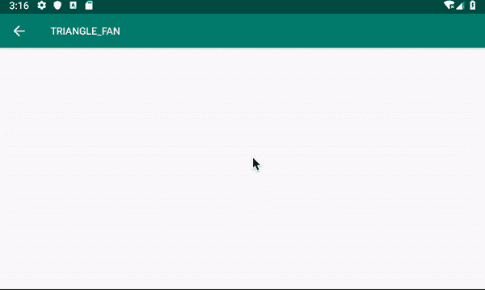

# 使用 Android 开发制作艺术品

> 原文：<https://levelup.gitconnected.com/make-art-with-android-development-598fe21afaae>

## 学习 Android 开发

## 编程是有趣的，艺术的，赏心悦目的

由 [Pixarbay](https://pixabay.com/photos/beaded-colour-pencils-underwater-2137080/) 上的 [Myriams-Fotos](https://pixabay.com/users/Myriams-Fotos-1627417/) 拍摄的图片

谁说在 Android 开发中，我们只编码完成[材质设计](https://material.io/design)？除此之外，我们还可以做更多与艺术相关的工作。让我们来看看各种有趣的艺术相关的博客，你可以学到大量关于如何在 Android 开发中制作艺术的技术。

> 以下所有都是使用 Android 原生提供的功能完成的(没有第三方库)。链接到他们有实际项目代码的相关博客。

# 图像处理

## 增亮和变暗图像

给定一幅图像，我们可以在不改变图像质量的情况下调整光线。看看灯泡是怎么照亮下图的！

 [## Android 图像照明控制和颜色过滤

### 使用 Android 的 LightingColorFilter 轻松调整图像亮度和颜色过滤

medium.com](https://medium.com/better-programming/android-image-lighting-control-and-color-filtering-89f51a139a79) 

## 变换图像颜色

如果让图像变亮还不够刺激，我们还可以改变图像的颜色，或者灰度化等等。

 [## 使用 ColorMatrix 改变 Android 图像颜色

### 用 ColorMatrix 轻松改变图像的颜色，并举例说明

medium.com](https://medium.com/better-programming/android-image-color-change-with-colormatrix-e927d7fb6eb4) 

## 混合两幅图像

如果你有一个以上的图像，你可以使用 PorterDuff 模式将它们混合在一起，产生更有趣的效果。看看下面这个简单的动画，它只是使用了不同的端口模式。

 [## Android 中实际图像端口缓冲模式的使用

### 使用 PorterDuff 混合两个图像以产生所需的图像输出

medium.com](https://medium.com/better-programming/practical-image-porterduff-mode-usage-in-android-3b4b5d2e8f5f) 

# 帆布绘画

## 制作 3D 艺术

看看下面的例子，这只是一个聪明的方法，用渐变颜色绘制顶点来制作 3D 玫瑰花。

 [## 玩 Android 画布绘制顶点

### 如果你喜欢在 Android Canvas 上画一些简单的图形，drawVertices 是一个非常好用的 API。它可以被用来…

proandroiddev.com](https://proandroiddev.com/playing-with-android-canvas-drawvertices-32266c480ab6) 

## 漫画画一幅画

给定一张图片，我们可以使用本机提供的 bitmapMesh 功能来漫画化该图像，该功能可以在提供的位图上使用。

 [## 使用 Android Canvas 的 DrawBitmapMesh 转换图片

### 有很多应用程序可以帮助你修改图片，让眼睛变大，嘴巴变小等等。曾经…

proandroiddev.com](https://proandroiddev.com/transforming-picture-with-android-canvas-drawbitmapmesh-35f359235774) 

canvas 提供了更多的绘图功能。你可以在下面的博客里学到所有的方法。

 [## 了解所有 Android 画布绘制功能

### 使用 Android Canvas 绘图的 23 个函数

medium.com](https://medium.com/better-programming/learn-all-android-canvas-draw-functions-dd5d6595884a) 

# 高级手动位图操作

如果以上内容对您来说还不够强大，而您想处理图像和绘图，下面的文章将向您展示如何处理逐像素转换。

模糊图像算法只是使学习更有趣的一种手段。当你学会了如何一个像素一个像素地处理位图时，你可以在任何图像上应用你喜欢的任何变换。

> 不过，当你尝试做数学复习时，要做好大量准备。

 [## 如何在 Android 上模糊图像

### 建立一个图像模糊算法

medium.com](https://medium.com/better-programming/blurring-image-algorithm-example-in-android-cec81911cd5e) 

# 动画的核心基础

也许静态成像不够有趣。你喜欢一些你能控制的核心动画，一帧一帧地改变屏幕。看看下面疫情的简单模拟。所有这些都是通过一个简单的单元来制作一个小圆圈的动画，如下所示。

 [## Android 上的模拟疫情

### 随着新冠肺炎的爆发，我在 Youtube 上看到了这个有趣的疫情模拟视频。所以在安卓上做了一个…

medium.com](https://medium.com/@elye.project/simulation-pandemic-in-android-447928f4920) 

## 控制处理。

一旦你知道了动画的基础，你可能想使用触摸来添加控制。有了这些，你就可以做下面的动画了。它会对你的触摸做出反应

 [## Kotlin 中的自定义可触摸动画视图

### 如果你想画出自己的观点，并有一些动画，在科特林…希望这将有所帮助。

medium.com](https://medium.com/@elye.project/custom-touchable-animated-view-in-kotlin-3ad599f85dbc) 

如果你想更好地理解 Android 的触摸控制，看看下面的文章。

 [## 了解 Android 触摸流量控制

### 管理 Android 触摸流量控制虽然听起来很基本，但当一个人需要它的时候，很多人会感到困惑。查看一下，了解一下…

medium.com](https://medium.com/@elye.project/understanding-android-touch-flow-control-bcc413e6a57e) 

以上都是使用原生 Android 开发的图像操纵、画布绘制、原生动画的核心(在 Kotlin 中完全可以完成)，并且不需要使用[原生开发套件](https://developer.android.com/ndk)(在 C++中)。

通过它，我们可以定制视图、简单的动画以及简单的游戏应用程序。跟我分享一下，如果你在学习了上面的内容之后，做了一些有趣的事情。干杯！

感谢阅读。你可以在这里查看我的其他话题。

关注我的**[*Twitter*](https://twitter.com/elye_project)*[*脸书*](https://www.facebook.com/elye.project/) 或 [*Reddit*](https://www.reddit.com/user/elyeproj/) 获取关于移动开发等相关话题的小技巧和学习。~Elye~***