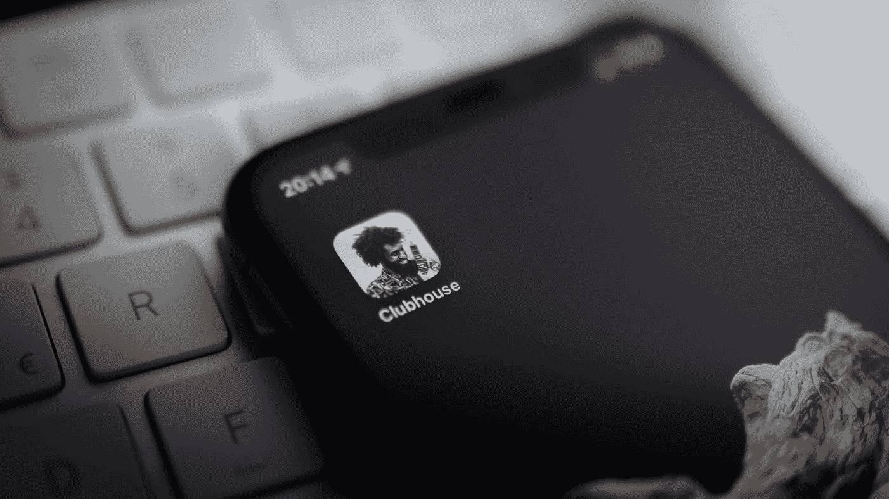
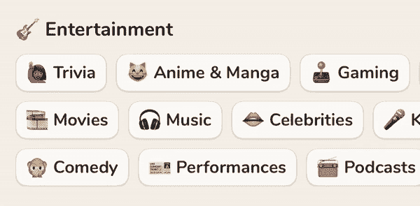
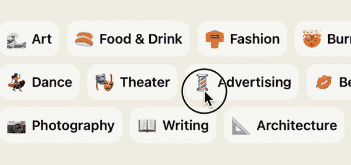
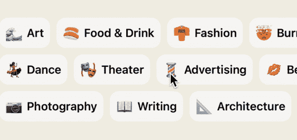

# 在 Swift 中制作俱乐部会所滚动动画

> 原文：<https://levelup.gitconnected.com/make-clubhouse-scroll-animation-in-swift-a58832790669>

本指南讲述了兴趣屏幕的水平滚动效果

照片由[威廉·克劳斯](https://unsplash.com/@williamk?utm_source=medium&utm_medium=referral)在 [Unsplash](https://unsplash.com?utm_source=medium&utm_medium=referral) 拍摄

如果您登录 Clubhouse，在`profile->settings->interests`中您会发现不同的兴趣，您可以选择并横向滚动。在本文中，我们将重点介绍这种水平滚动动画。

## 源代码

源代码可以在我的 github 上找到。

 [## shayimpagne/俱乐部兴趣

### 在 GitHub 上创建一个帐户，为 Shayimpagne/ClubhouseInterests 的发展做出贡献。

github.com](https://github.com/Shayimpagne/ClubhouseInterests) 

## 少说多做！👨🏻‍💻

首先，让我们考虑一个模型结构。我们有一组数组，每个数组包含一定数量的兴趣(有兴趣的行)。

数组中项的结构:

然后，让我们继续讨论一组数组的结构，其中包含一个由`Interest`项组成的数组:

当然，你可以将标题和表情符号组合在一个字符串中，但我想将它们分开。你想怎么做就怎么做，由你决定。

此外，我使用 autolayout 创建了一个帮助器函数，用于将视图边缘绑定到它的 superview:

代表兴趣的视图:

我将两个标签(表情符号和标题)放置在水平的`UIStackView`中，间距为 8，并将表情符号标签的宽度和高度设置为 24。将视角的角部四舍五入至 12°。

然后定义包含一组兴趣的视图:

`transparentView`是我们用来检测`UIScrollView` `contentOffset`和`groupStackView`包含兴趣视图的技巧。

然后添加功能`setup(with: InterestGroup)`。在这个函数中，每个兴趣数组都嵌入在`UIScrollView`中。用户交互被禁用，并以编程方式控制。每个`UIScrollView`存储在`rows`数组中，`minRowWidth`包含最小`UIScrollView`内容宽度的宽度，`minRowOffset`是其`UIScrollView`的最大偏移量。

然后在`layoutSubviews()`中我们可以找到内容宽度最小的`UIScrollView`。我们需要忽略宽度小于视图宽度的行，并用最小行宽度的值设置`transparentView`的宽度约束。

最后，最后一部分是为每一行计算 scroll `velocity`。例如，内容宽度最小的行的速度等于 1，它以固定的速度滚动，而内容宽度较大的行的速度大于 1，以便同时完成。我们忽略内容宽度小于视图宽度的行，并将其速度设置为 1。

在你的`UIViewController`中合成具有不同兴趣的`InterestGroup`对象，创建`InterestGroupView`

运行应用程序并尝试水平滚动组:

在排到达末端之后，我们需要在拉动时将它们放置在一个位置。添加下一个代码，在从左边缘或右边缘拉动时将所有行吸引成一行:

运行它:

谢谢你的阅读，好好编码🙂。

资源:

 [## shayimpagne/俱乐部兴趣

### 在 GitHub 上创建一个帐户，为 Shayimpagne/ClubhouseInterests 的发展做出贡献。

github.com](https://github.com/Shayimpagne/ClubhouseInterests)