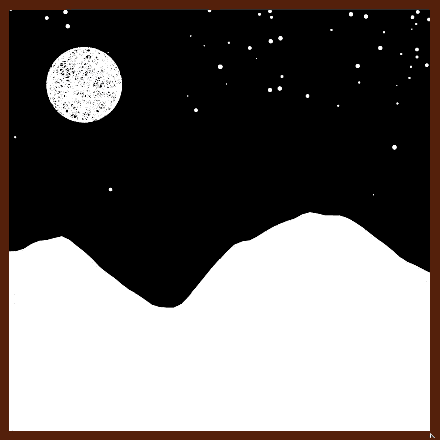
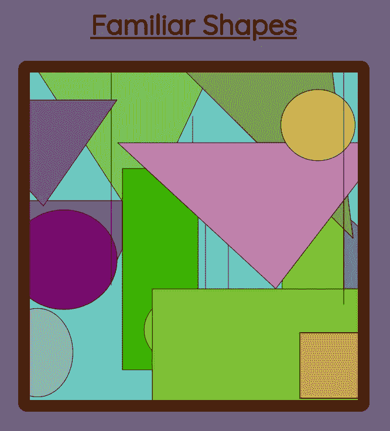

# 用 JavaScript 制作数字艺术

> 原文：<https://levelup.gitconnected.com/make-digital-art-with-javascript-643315bfef0d>

## 学习 p5.js 的基础知识

用 p5.js 创建

完全披露——到本文结束时，你不会成为创作数字艺术的专家。然而，你将学习它的基础知识，并有一个开始从事更大项目的起点。

我们将致力于创造一个充满随机几何形状的画布。有没有可能用 p5 做出更刺激的东西？绝对的。查看文档中的示例项目[。](https://p5js.org/examples/)

然而，在本文中，我们将坚持简单的几何图形。这是为了确保项目的复杂性不会阻止我们学习要点。让我们把激动人心的部分留到将来，现在就开始研究这个吧。

# 设置 HTML

我们将为网页设置一个主干，然后不再接触 HTML。我们的 HTML 需要做两件事。首先，它需要链接我们项目所需的所有文件 p5.js 库、我们的 js 脚本和样式表。然后，它还需要设置一个分区，我们稍后将在其上安装画布(记住稍后的“形状”id)。

> 注意:我已经决定使用 CDN 导入 p5.js，但是请随意将其下载到您的机器上，并在本地使用它。

# 设计网页样式(可选)

如果你想让你的页面看起来更好一点，并且不希望你的最终画布位于屏幕的左上角，你需要给它添加一些样式。我在这里嵌入了我的风格，但是当然，你可以根据自己的喜好自由调整。

# 创建画布

现在我们准备将画布安装到我们之前创建的 HTML 部门。为此，我们需要设置一个新的 sketch 对象，并将该对象传递给 p5 构造函数来创建一个新的 p5 实例。

> 注意:使用“全局模式”创建画布有一种更简单的方法，但是这样做不允许您在同一个网页上创建多个草图——如果您以后决定这样做的话。详细谈论这些差异不在本文的范围之内，但是如果你想了解更多，请参考[文档](https://p5js.org/reference/#/p5/p5)。

我知道这听起来有点复杂，但是让我们看一些代码，然后分析发生了什么。

首先，我们得到想要安装画布的 div 的高度。然后，我们创建一个接受 p5 实例(这里称为 p)作为参数的函数，并为其附加一个*设置*方法。在这个*设置*中，我们将编写我们希望在网页加载后立即运行的所有代码。现在，我们所做的就是创建一个与 HTML div 尺寸完全相同的画布。

> 注意:这里我们假设 div 是一个正方形。如果我们希望允许矩形块，我们需要获得分割的高度和宽度，并相应地将它们传递给 *createCanvas()* 方法。

最后，我们创建一个新的 p5 实例，并传入*草图*函数作为回调，传入 div 的 **id** 作为挂载点。我们的页面上还没有显示任何内容，因为我们还没有在画布上添加任何内容。我们现在就开始努力吧。

# 将形状添加到画布

我们将从简单开始，在制作更疯狂的形状之前，在画布中央添加一个无聊的小椭圆。

注意在创建椭圆之前如何使用*填充*来指定椭圆的颜色。在上面的例子中，我使用了一个映射到 0–255 颜色方案的整数，但是 *fill* 也接受 RGB 或六化学颜色字符串，我们将在后面看到。

为了将椭圆定位在中心，我们将画布大小的一半作为椭圆中心的 x 和 y 坐标。画布的坐标轴位于左上角的中心，x 向右侧增加，y 向底部增加。

# 随机位置和大小

如果我们想要显示的所有形状都是相同的大小，并且位于相同的位置，那么最终的图像就不会太令人兴奋。所以让我们把这些参数随机化。

我们现在为位置生成随机的 x，y 坐标，为大小生成随机的宽度和高度，而不是将预设值传递给 *ellipse()* 方法。这将使图形在画布上看起来更有趣。

# 重构形状创建

目前我们正在用*设置*方法创建我们的形状，如果我们只想显示一个椭圆，这是完全可以接受的。然而，我们正在努力渲染许多不同大小的不同形状，所以让我们做一些重构，当需要向画布添加更多形状时，这将使我们的生活变得更容易。

注意 *p.ellipse* 现在是从 *drawEllipse* 函数调用，而不是从 *p.setup* 调用。 *drawEllipse* 也负责随机化椭圆的大小。在*设置*中，我们创建了一个绘制形状的函数数组，对于每个函数，我们生成一个随机颜色来填充形状。我们还在画布中选取了一个随机位置，然后调用辅助函数来实际呈现形状。

# 添加更多形状

现在没有什么可以限制我们创建更多的帮助函数来添加不同类型的对象到我们的绘图中。有许多不同的形状，它们都有自己的一套参数。仔细研究这些参数的细微差别会形成一篇很长的文章，所以如果你想完全理解下面代码中发生的事情，我要求你参考文档。

我们添加了三个新的辅助函数来绘制三角形、直线和矩形，并在设置过程中调用了所有这些函数。我们还嵌套了我们的 *forEach* 循环，这样我们在最终的画布中每种形状有五个。结果是这样的:

你完全可以决定你想要这件作品有多少种形状。我建议调整所有的参数，比如 *roughSize* 和 *numRepeats* ，这样画布看起来对你来说才是最佳的。

绘制这些形状的另一种方法是使用 *p.random* (在[文档](https://p5js.org/reference/#/p5/random)中的信息)在每次迭代中选择一个随机绘制函数。然后，我们在画布上有不同数量的每个形状。我把它留给读者做练习。请分享你的最终结果！

# 你成功了！

恭喜你，现在你有了一个可以使用 JavaScript 创建漂亮图形的神奇工具。我希望这篇文章让您对 p5 库有了基本的了解。感谢您一直以来的关注。

我有一个[收集的片段](https://bezier-gallery.netlify.app/)是我在学习这个主题时制作的，当然所有的代码都可以在[我的 github](https://github.com/Schapagain/bezier-gallery) 中找到。请让我知道你是否想看到我浏览其中的任何一个，或者你可能尝试进入的任何其他新话题。

再次感谢阅读！