# 用演示猴让每一次演示都有价值

> 原文：<https://levelup.gitconnected.com/make-every-demo-count-with-demo-monkey-f376a339f9fd>

## 为您的受众定制通用演示应用程序


[图片来源:Unsplash](https://unsplash.com/photos/Z05GiksmqYU)

# 什么是 Demo Monkey？

Demo Monkey 允许您根据您的客户将您的 web 应用程序定制成一个完美定制的演示。您可以根据需要提供替换值，Demo Monkey 将采用您的通用演示应用程序，并为您的受众提供个性化体验。

例如，你可以创建一个非常普通的电子商务网站，在 Demo Monkey 的帮助下，你可以将这个普通的电子商务网站转换成一个基于你要演示的目标受众的不错的电子商务网站。

这有助于节省大量时间，因为现在您不必在每次需要新的演示时重新创建和部署站点。相反，您所要做的就是定制所需的变量，并对相同的站点进行细微的改动。

# 安装和设置

从 [Chrome 网上商店](https://chrome.google.com/webstore/detail/demomonkey/jgbhioialphpgjgofopnplfibkeehgjd?hl=en)安装演示猴子。右键单击扩展的图标，然后单击**选项**打开演示 Monkey 门户。

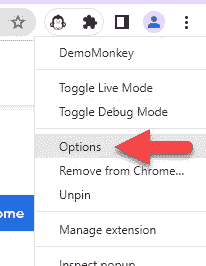

您可能需要启用对所有站点的访问，以便 Demo Monkey 的扩展能够工作。在此页面中，单击横幅上的**单击此处**以启用。然后，从弹出窗口中点击**允许**。

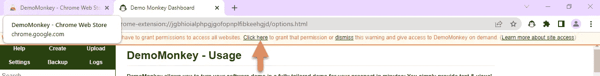

从门户中找到并点击**示例**脚本(1)。您可以重命名该文件，并从**配置**选项卡中清除其内容，以满足您的需求和/或遵循本文。默认情况下，这个脚本是禁用的，要让它工作，您需要打开它(2)。每次进行更改时，您都需要点击保存按钮(3)以使更改生效。

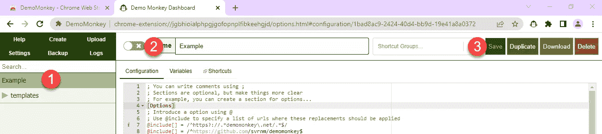

# 结构

一个文件可以选择性地包含 section 标签，这有助于使你的脚本更具可读性。您可以根据需要命名这些部分标签。这种用法的一个例子可能类似于下面的代码片段。这里，我们使用`[Options]`来表示这个部分将包含选项，使用`[Application]`来表示这个部分将包含更新应用程序所需的脚本，在整篇文章中，我们将使用这个约定。

```
[Options]
...[Application]
...
```

完整的使用指南[可在此处](https://github.com/svrnm/DemoMonkey/blob/main/USAGE.md)获得。然而，本文的目的是简化本用法文档中的一些常用项目。

# 站点配置

首先，您可能希望在 include 数组中包含您的网站 URL，以便可以在上面启用 Demo Monkey。如果您不在此处包含您的网站 URL，您的演示猴子脚本将无法工作。

```
[Options]
@include[] = /^https?://clydedz.github.io/demomonkey-demosite.*$/
```

# 文本更新

要简单地更新你的站点上显示的文本，在左边写下原始文本，后跟一个等号，然后在右边输入你想显示的文本。您也可以使用相同的格式来替换电子邮件地址。

```
[Application]
demo@example.com=noreply@example.com
Welcome to animal photos=Welcome to animal site
```

下面的屏幕截图显示了该网站的前后版本。

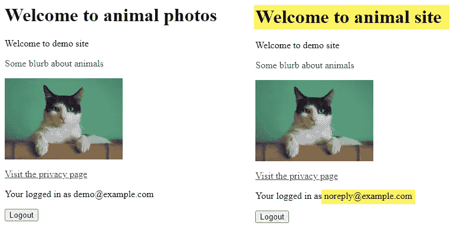

前(左)后(右)

虽然上面的代码片段是一个总括性的解决方案，但是如果您想更具体一些，您可以使用`replace`函数。该函数中的第一个值是显示在网站上的原始文本，第二个值是网站 URL，第三个值是包装原始文本的元素的类名。函数的右边是您希望在站点上显示的新内容。

```
[Application]
!replace(Developer content, api.html, .developers) = Monkey content
```

你会注意到每个函数都有一个感叹号作为前缀。

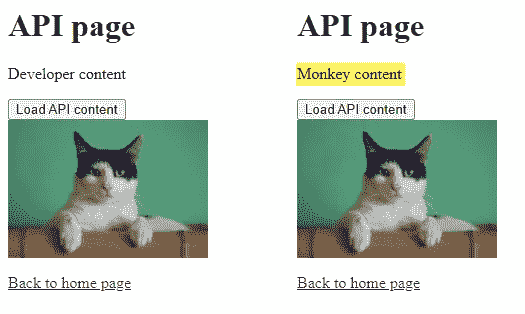

前(左)后(右)

我们可以更进一步，不是用一个简单的文本替换另一个纯文本，而是用一些定制的 HTML 替换它。为此，我们将使用`overwriteHTML`函数，其中我们将站点页面指定为第一个值，后跟包含我们之前内容的类名。在等号的右边，您可以指定要呈现的新 HTML 内容。

```
[Application]
$html=<b><u>Most welcome</u></b>
!overwriteHTML(index.html, .welcome) = $html
```

我们没有直接输入数值，而是使用了一个名为`$html`的变量。如果您需要用相同的值替换多个位置，这是非常方便的，在这种情况下，您可以在顶部定义变量，然后在整个脚本中使用该变量。上面的片段也可以这样写。

```
[Application]
!overwriteHTML(index.html, .welcome) = <b><u>Most welcome</u></b>
```

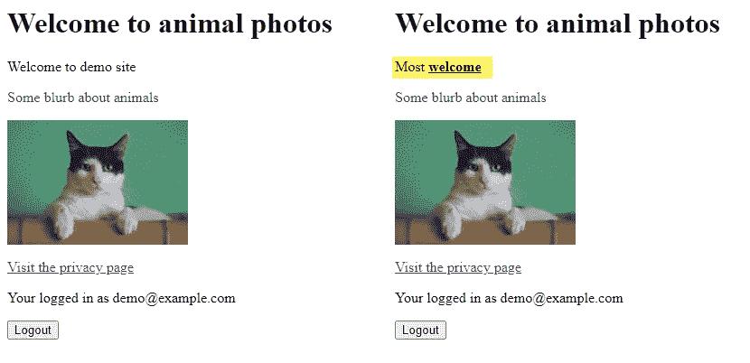

前(左)后(右)

我们还可以更新文本块的样式。为此，我们将使用 style 函数。对于第一个值，我们将指定需要样式化的文本，对于第二个值，我们将指定需要更新的样式。等号的右边是新的样式值。在下面的代码片段中，我们将文本“隐私页面”涂成红色。

```
[Application]
!style(Privacy page, color) = red
```

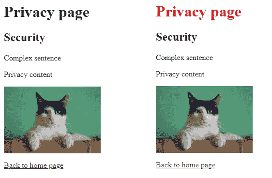

前(左)后(右)

# 形象

我们可以使用`replaceImage`功能将一幅图像替换为另一幅图像。该函数的第一个值是您想要替换的现有图像的源 URL，在等号的右侧，指定新图像的源 URL。

```
[Application]
!replaceImage([https://clydedz.github.io/demomonkey-demosite/img/cat.jpg](https://clydedz.github.io/demomonkey-demosite/img/cat.jpg)) = [https://clydedz.github.io/demomonkey-demosite/img/dog.jpg](https://clydedz.github.io/demomonkey-demosite/img/dog.jpg)
```

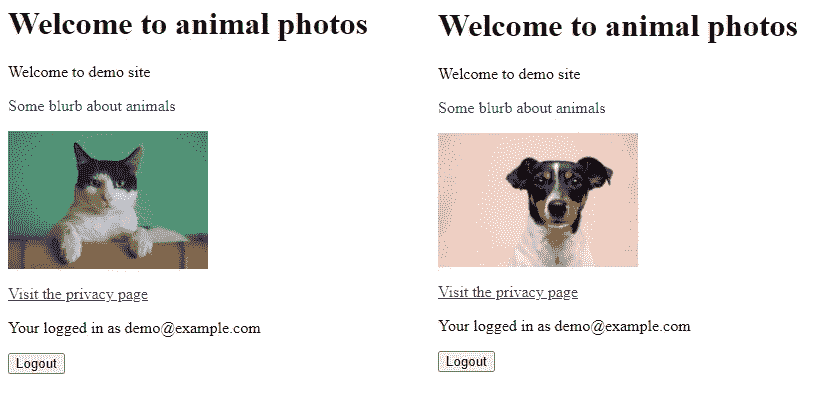

前(左)后(右)

您也可以使用`recolorImage`功能对现有图像重新着色。第一个值是现有图像的源 URL，等号右侧是您想要应用的 RGB 值。

```
[Application]
!recolorImage([https://clydedz.github.io/demomonkey-demosite/img/dog.jpg](https://clydedz.github.io/demomonkey-demosite/img/dog.jpg)) = rgb(255,0,0)
```

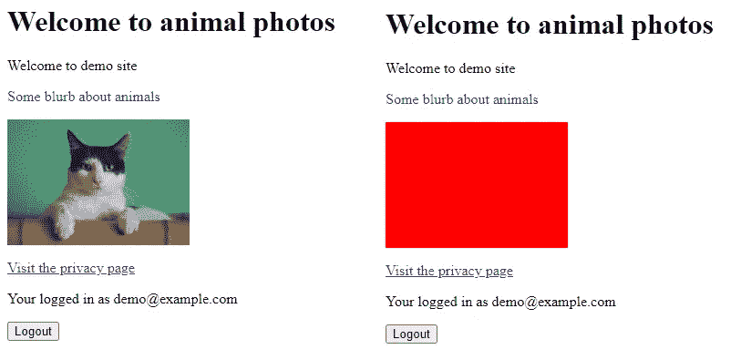

前(左)后(右)

# 链接

我们还可以使用`replaceAttribute` 函数替换 HTML 标签的属性。该函数的第一个值是您需要应用此更改的网页。第二个值是您想要更新的属性。等号的右边是要分配给属性的新值。

```
[Application]
!replaceAttribute(index.html, href) = api.html
```

如果下面的截图不清楚，我很抱歉，但是在左边，我突出显示了 URL 中最初有`index.html`的位，然后在右边，应用脚本后，我可以看到 URL 中的位已经更新为`api.html`。

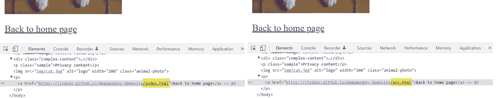

前(左)后(右)

# 完整内容更新

## 覆盖现有页面

您也可以用另一个网页的内容替换该网页的全部内容。我们将使用`overwritePage`函数来实现。我们将网页指定为函数的第一个值，我们可以将 CSS 选择器指定为函数的第二个值，类似于`overwriteHTML`函数，但是对于这个函数，我们将把它留空，在等号的右边，我们将指定我们想要在这里显示的网页的 URL。

```
[Application]
!overwritePage(index.html, '') = api.html
```

在下面的截图中，你可以看到我们已经用 API 页面的内容替换了`index.html`页面的原始内容(左)。

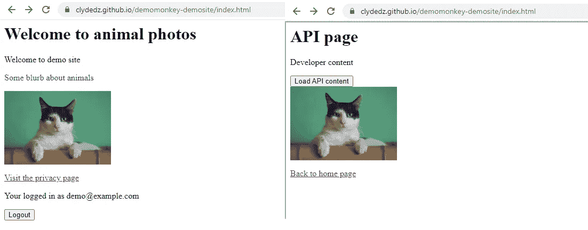

前(左)后(右)

## 重定向到另一页

我们可以使用`redirectUrl`功能自动将一个网页重定向到另一个网页。我们需要传递给函数的值是我们需要应用重定向的网页。等号的右边是我们需要将用户重定向到的目标 URL。

```
!redirectUrl([https://clydedz.github.io/demomonkey-demosite/privacy.html](https://clydedz.github.io/demomonkey-demosite/privacy.html)) = [https://www.bing.com](https://www.bing.com)
```

下面的 GIF 展示了它在工作时的样子。

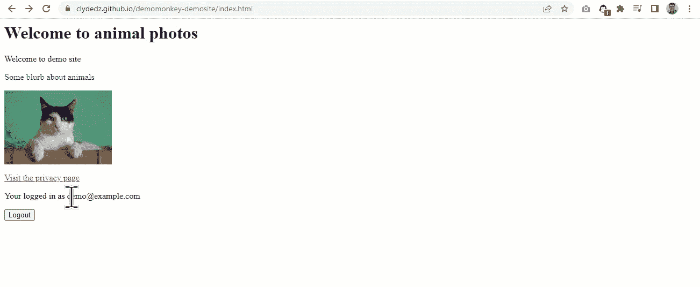

展示这一变化的 GIF 图片

# 操作 URL

如果有必要，我们可以阻止特定的 URL 或请求(如 API 调用)发生。这意味着当应用程序试图发出这个请求时，它将会失败，希望应用程序能够优雅地处理它。

那么，这在我们的脚本中是什么样子的呢？在我的演示应用程序中，点击[页面](https://clydedz.github.io/demomonkey-demosite/api.html)上的 **Load API content** 按钮，调用一个外部 API 端点，并在屏幕上加载一个笑话。我们将操纵对这个 API 端点的请求。

首先，我们需要在`[Options]`部分包含这个 API URL。接下来，在`[Application]`部分，我们将使用`blockUrl`函数，其中该函数的值是您想要阻止的 API URL。

```
[Options]
[@include](http://twitter.com/include)[] = /^https?://clydedz.github.io/demomonkey-demosite.*$/
[@include](http://twitter.com/include)[] = /^https?://api.icndb.com/jokes/random.*$/[Application]
!blockUrl([https://api.icndb.com/jokes/random](https://api.icndb.com/jokes/random))
```

第一次尝试在脚本中使用它时，应该会看到旁边有一个警告符号。这意味着您需要在演示猴子设置中启用一个标志。

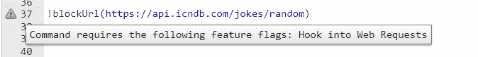

在演示 Monkey 门户中，点击**设置**并将**挂钩变成 Web 请求**标志。

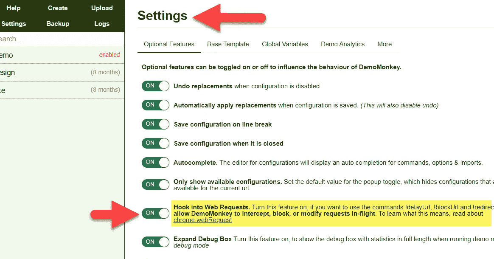

现在，您可以返回到您的脚本，进行所需的更新，并点击保存。然后当你访问网页时，你应该会看到这一点。

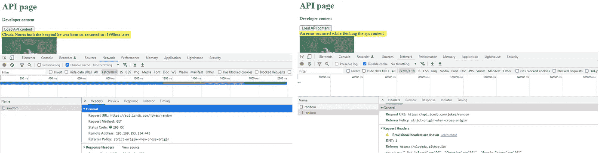

前(左)后(右)

类似于 block URL，我们可以使用`delayUrl`函数给 API 的响应增加一些延迟。该函数的值是您想要添加一些延迟的 API 的 URL，等号的右边是以秒为单位的延迟量。

```
!delayUrl([https://api.icndb.com/jokes/random](https://api.icndb.com/jokes/random)) = 10
```

如果您重新加载页面并查看网络流量，您应该看到请求正在排队等待该延迟量。

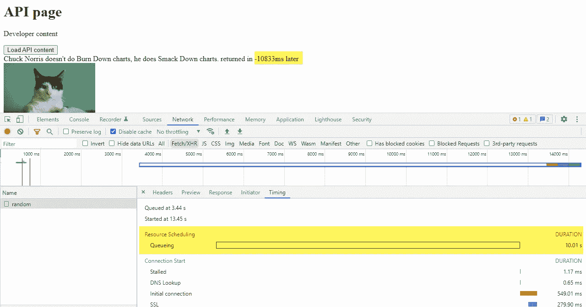

# 多方面的

## 隐藏元素

您还可以在屏幕上隐藏元素。在这个例子中，我们将使用`hide`函数删除 logout 按钮。第一个值是屏幕上的文本，第二个值是 DOM 中父元素的数量，第三个值是 CSS 类名，最后一个值是网页。

```
[Application]
!hide(Logout, 0, logout-button, index.html)
```

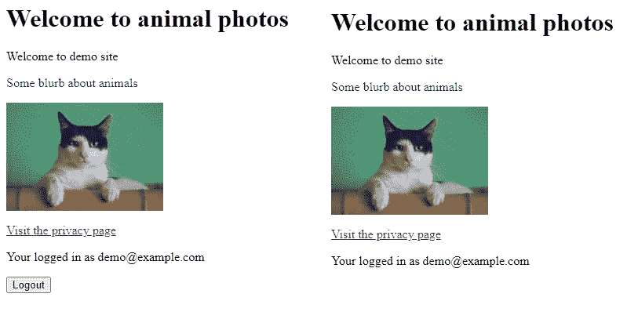

前(左)后(右)

## 添加 JavaScript

我们也可以使用`addScript`功能将 JavaScript 注入你的网页。在等号的右边，我们可以提供一些 JavaScript。在下面的例子中，我们插入了代码来显示一个弹出警告。

```
!addScript() = alert('hello')
```

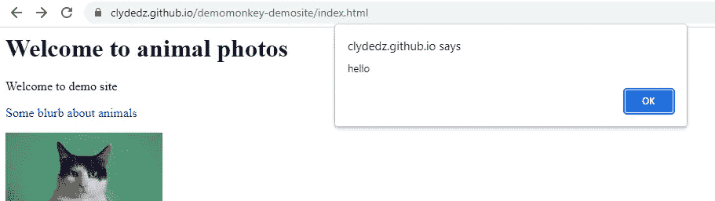

## 评论

您可以使用散列符号`#`或分号`;`添加行内注释。

```
# This is a comment.
; This is also a comment.
```

# 源代码

本文中使用的演示网站和完整的演示 Monkey 脚本可以在 [this GitHub repository](https://github.com/ClydeDz/demomonkey-demosite) 中找到。如果你用过 Monkey 演示版，我很乐意在评论中听到你的意见。如果你觉得这篇文章有帮助，也留下评论。

就是这样！感谢阅读。