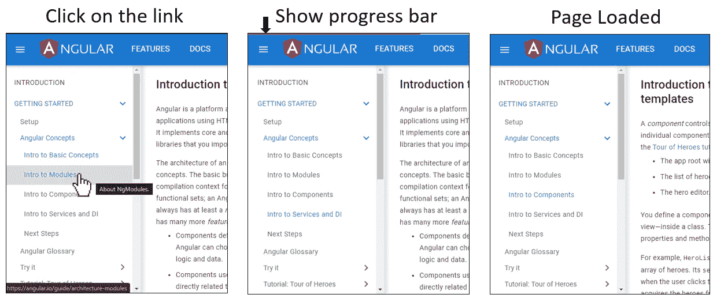

# 使加载占位符与内容预取一起工作

> 原文：<https://levelup.gitconnected.com/make-loading-placeholder-work-with-content-pre-fetching-d70385f4aaeb>

**TL；【T2 博士】在一个单页面的 web 应用程序中，我们使用以下技术来使布局稳定:**

1.  如果有上一页，在重定向之前使用“预取”技术加载数据。加载数据后，重定向到下一个完全呈现内容的页面。
2.  如果页面是第一个登录页面，不要预取数据。请改为显示加载占位符。

下面是我的工作实例:[https://8maple.us/category/movies](https://8maple.us/category/movies)

本文将向您展示如何在 Angular 中做到这一点。

# 加载占位符


典型的装载占位符

“加载占位符”是许多 SPA 网站使用的一种常用技术，通过在将要显示内容的地方显示占位符，使页面加载看起来一致且更快。它减少了使用户不舒服的布局不稳定性。

> 谷歌最近提供了一个名为 CLS ( [累积布局移动](https://web.dev/cls/))分数的指标，这使得这个想法量化了。

# 内容预取

许多其他 SPA 网站(例如 [angular.io](https://angular.io/) )使用内容预取技术来制作好的 UX。当用户点击一个链接时，它会在页面上显示加载进度条，并在后台加载数据。加载数据后，它将显示下一个页面，其中包含完整的呈现内容。



可以用[路线解析器](https://angular.io/api/router/Resolve)在角度上完成。在路由器设置中:

```
[
  { path: 'mypath', component: MyPageComponent, resolve: { **myData**: MyResolverService}},
...
]
```

在解析器中:

```
export class MyResolverService implements Resolve<any> { **resolve(route: ActivatedRouteSnapshot): Observable<any> {
    return this.myService.getData();
  }** constructor(private myService: MyService) { }}
```

在页面组件中，我们可以获取数据并直接写入`this.items$`:

```
ngOnInit(): void { this.items$ = this.route.data.pipe(map( data => data.**myData** );}
```

# 让他们一起工作

您可能认为内容预取已经消除了对加载占位符的需要，因为数据在出现的那一刻就被完全呈现了。

如果用户直接登陆页面，除了进度条什么也不显示。我们仍然需要显示一个占位符来减少 CLS。我们要做的是:

1.  如果有上一页，请在传送前加载数据。
2.  如果页面是第一个登陆的，就不要取数据。请改为显示加载占位符。

下面是我的工作实例:[https://8maple.us/category/movies](https://8maple.us/category/movies)
点击顶部菜单中的左右，你会看到预取技术；刷新页面，您将看到第一个平台的装载占位符。

为此，让我们在路由解析器中做一些修改。

```
export class MyResolverService implements Resolve<any> {resolve(route: ActivatedRouteSnapshot): Observable<any> {
  if(**this.router.getCurrentNavigation().previousNavigation**) {
    // there was a previous route, load data before routing
    **return this.myService.getData();** } else {
    // the page is the first landing one, resolve directly 
    **return of({isNeedLoad: true});**
  }
}constructor(
  private router: Router,
  private myService: MyService,
) { }}
```

我们可以通过获取`router.getCurrentNavigation().previousNavigation`来判断它是否是登录页面，如果是，我们只返回一个带有`{isNeedLoad: true}`的解析后的可观察值。它使路由解析并重定向到下一页。

所以在下一页，我们改变`this.items$`是如何衍生的。

```
this.items$ = this.route.data.pipe(switchMap( data =>
  iif( () => data.myData.isNeedLoad === true,
    this.route.paramMap.pipe(switchMap(params =>
      **this.myService.getData()**)),
    of(data.myData)
)), startWith([{isLoading: true}]));
```

我们使用条件操作符`iff`来检查`isNeedLoad`。如果是真的，我们调用服务来加载数据。否则，我们就使用路由器解析器中预取的`myData`。