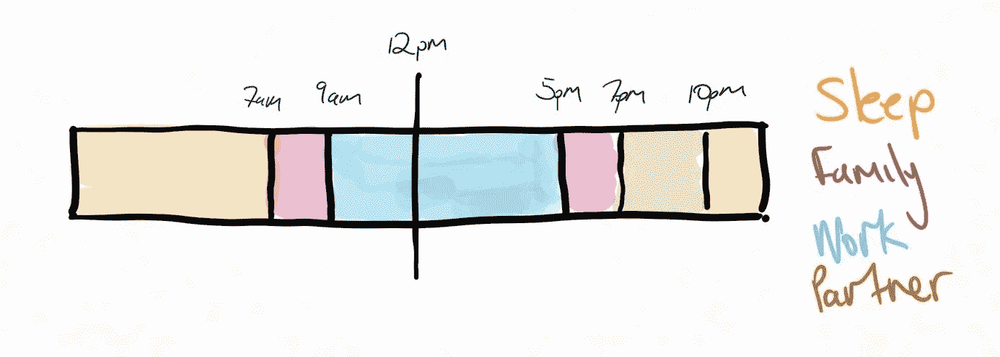

# 在你的一天中腾出更多的时间。

> 原文：<https://levelup.gitconnected.com/make-more-time-in-your-day-a9a8c6a5102b>

## 玩零和游戏

丹尼尔·麦金尼斯在 [Unsplash](https://unsplash.com?utm_source=medium&utm_medium=referral) 上的照片

我们都希望每天有更多的时间去*完成工作。*我觉得我很少有独处的时间，下班后我可以真正专注于自己。在工作、家庭和网飞之间，我觉得有时候没有太多时间留给自己。

即使在新冠肺炎的条件下，我的时间表看起来也很满(我不再通勤)，通常是这样的:

*   醒来~**7am**；喂我的女儿，遛狗，和家人在一起，准备工作
*   工作**9–5**；做工作——我在 WFH 的时候似乎更忙
*   家族**5–7**；为孩子准备晚餐，洗澡时间，和家人一起出去玩
*   **7pm-10/11**ish；成年人的晚餐，和我的搭档网飞的休息时间

现在，不要误会我的意思；我喜欢我的日常生活。我和家人在一起的时间多得令人难以置信，我乐此不疲！变得陈旧的是停机时间的一部分；在那里，我们会花更多的时间浏览四家流媒体提供商，寻找可以观看的内容，而不是实际观看。

所以我决定改变我的时间，牺牲网飞，在一天开始的时候获得一些额外的时间——我的一天现在看起来是这样的:

现在每天早上 5 点到 7 点之间有一点“额外”时间。通常，这是房子里没有其他人醒着的时候，我可以专注于我喜欢的任何事情。

# 在两个星期的早上 5 点之后，我开始学习。

想要成功地变成一个早起的人，你必须有一个起床的理由。我过去有过早起的经历——早上 6 点起床去健身，如果没有纪律，这是不可持续的。目标会提供动力，但动力最终会耗尽(尤其是在墨尔本的冬天)——常规和纪律才是动力所在。

> 纪律是目标和成就之间的桥梁。

现在，在我的家人醒来之前，我有两个小时不受打扰的时间，以下是我如何受益的:

## 自我完善

**学习** —我花时间学习 AWS 认证(我在早上 5 点之前就开始了)，并设法在一天上班前参加了考试——并通过了！

**打字**——作为 IT 界的专业人士，我花很多时间在键盘上。我相当快，但容易出错(我责怪 vim 键绑定)，这使我变慢。我加入了[打字俱乐部](http://typingclub.com)(免费)来加强这一点，到目前为止我*认为*这是一笔不错的投资。

阅读——有一堆书我想看完，我可能会花一些时间来看完，我们会看看事情的轻重缓急。

## 工作

早起让我在工作中更有效率。现在，我是工作/生活平衡的大力提倡者，所以我仍然在研究这到底是怎么回事。

我的最终计划是在上午 9 点之前做一些工作，这样我就可以在中午有一个长时间的休息。午餐时间的锻炼是我想去的地方(或者午睡？).我仍然能够在通常的 5 点钟打卡下班，享受家庭时光，这对我非常重要。

## 项目

写博客——我已经设法发表了一篇文章，并开始写这篇文章。这是一个在工作开始前发挥一点创造力的好机会。

**编码** —我有一些关于应用程序的想法，我想进一步探索，我需要大量的技术来满足我自己(和专业)的兴趣。我还没有完成这件事，但肯定会在我的未来看到它。

# 外卖食品

我实际上是在新时间表的第三周完成这篇文章，我只有一次真正的狂欢(伏特加和俄罗斯朋友)没有起床。我必须说，我很享受这段额外时间的“创造”,可以随心所欲地做自己想做的事情，而且我认为我能够保持这种前进的步伐。

是给大家的吗？大概不会。随着时间的推移，优先事项会发生变化，生活方式也会发生变化，但是如果你觉得一天中需要一点额外的时间，我建议至少在几周内尝试一下！

祝你好运！