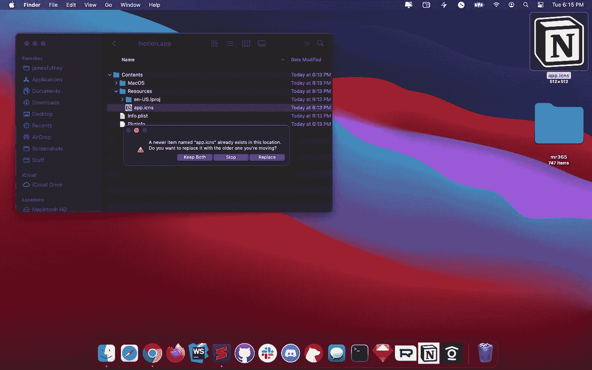

# 通过安装 Progressive Web 应用程序，让观念、懈怠、不和谐和团队在 macOS 和 Windows 上运行得更快

> 原文：<https://levelup.gitconnected.com/make-notion-run-faster-on-macos-or-windows-by-installing-the-progressive-web-app-c1155c26918a>

## 桌面上的性能可能不是很好，但你可以通过使用 Chrome 内置的渐进式网络应用程序来解决这个问题


> 这篇文章最初是为**概念**而写的，并扩展到包括其他流行的电子应用，如 **Slack，Discord，&微软团队**。说明是一样的。

# 观念是什么？

[**概念**](https://www.notion.so/) 是一个为网络构建的协作应用程序，它将自己描述为一个**一体化的工作空间**，在这里你可以写作、计划、协作和组织——它允许你做笔记、添加任务、管理项目等。


想象一个乐高结构。**概念**提供了完成工作的构件和模板。

我们的团队(和我交谈过的大多数团队)喜欢它！但是，在 macOS 和 Windows 系统上，性能太差了，许多团队只能转而使用 web 应用。


形象经由观念。所以

## 那么性能到底有多差呢？

糟糕到定期挂起我的**四核英特尔 i7** ，仅仅使用 10 秒后就触发 macOS 上的电池耗尽警告**。在下面的截图中，它大约占了我总 CPU 资源的 33%。**

## 哎哟！


这款应用不仅占用大量资源，还会在 macOS 上触发电池耗尽警告

## 为什么性能这么差？

性能下降并不是因为应用程序做错了什么。只是不是原生的 macOS app，运行在一个叫 [**电子**](https://www.electronjs.org/) 的开发平台上。

让你像运行本地桌面应用程序一样运行网络应用程序。

这有助于开发者和小型创业公司在几天(或几周)内添加对 macOS 和 Windows 的支持，而无需对他们现有的应用程序做任何改变。

然而，这种方法的缺点在于性能。具体来说，每个电子驱动的应用程序都必须加载自己的 **Chrome** 实例和一个名为 [**Node.js**](https://nodejs.org/en/) 的后端 Javascript 环境。总存储开销超过了 182 兆字节！

## 但是，如果你能“拥有一切”呢？

如果你可以使用**概念**，就像任何其他**桌面应用**一样，而没有使用电子、Chrome 和其他任何东西的性能损失，会怎么样？ ***如果你能拥有一切会怎样？***

如果你能拥有一切呢？

# 好消息。

**您可以安装 Progressive Web 应用程序，而不是使用 concept 提供的普通桌面应用程序。下面是方法:**

## 1.Chrome 中的开放概念

目前，只有 Chrome 支持桌面渐进式网络应用程序。


2.导航到您的**菜单**，选择**更多工具、**，然后选择**创建快捷方式。**


3.命名你的快捷方式**概念，**并勾选**作为窗口**打开


## 就是这样！

你的渐进式 Web 应用实例现在将表现得像一个简洁高效的桌面应用。


# 下一步:把它放在你的船坞里！

要将**的观念**保留在你的 **dock** 中(类似桌面 app)，在**上右击**，选择**选项**，然后**保留在 Dock** 中。


# 可选:修复图标！

你可以通过替换 Chrome 默认创建的图标来修复应用程序图标。

1.  点击 下载**观念图标**[](https://filestore.b-cdn.net/notion-icon/app.icns)
2.  **打开应用程序包**
3.  **替换自动生成的图标**

1.  ****在你的**概念 Chrome 应用**上右击****

****

**2.导航到**资源**，用你下载的资源替换 **app.icns****

****

**3.选择**更换**。就是这样！**

****

****注意:**您可能需要等到下次应用程序启动，或者下次登录 macOS 时才能看到更新的图标。在应用程序启动之间，它们会被缓存一段时间。**

**您可以通过运行以下命令来强制刷新您的应用程序图标:**

```
sudo rm -rfv /Library/Caches/com.apple.iconservices.store; sudo find /private/var/folders/ \( -name com.apple.dock.iconcache -or -name com.apple.iconservices \) -exec rm -rfv {} \; ; sleep 3;sudo touch /Applications/* ; killall Dock; killall Finder
```

****来源:**[https://gist.github.com/fabiofl/5873100](https://gist.github.com/fabiofl/5873100)**

# **你知道的越多**

****渐进式网络应用**可用于你可能已经经常使用的大量网站，并提供与我们上面的例子相同的性能改进。其中许多你可以通过在你的 **Chrome 地址栏中寻找**安装按钮**来安装。****

**一个流行的例子是 Twitter 应用程序。只需导航到您的订阅源，然后单击安装按钮:**

****

## **瞧，你已经安装了 Twitter 桌面应用程序！**

********

**[Meetingroom365.com](https://www.meetingroom365.com/)|[@ kidgdzilla](https://twitter.com/kidgdzilla)(推特)|[@ futhey](https://indiehackers.com/futhey)(indie hackers)|[@ kidgozilla](https://github.com/kidgodzilla)(GitHub)**