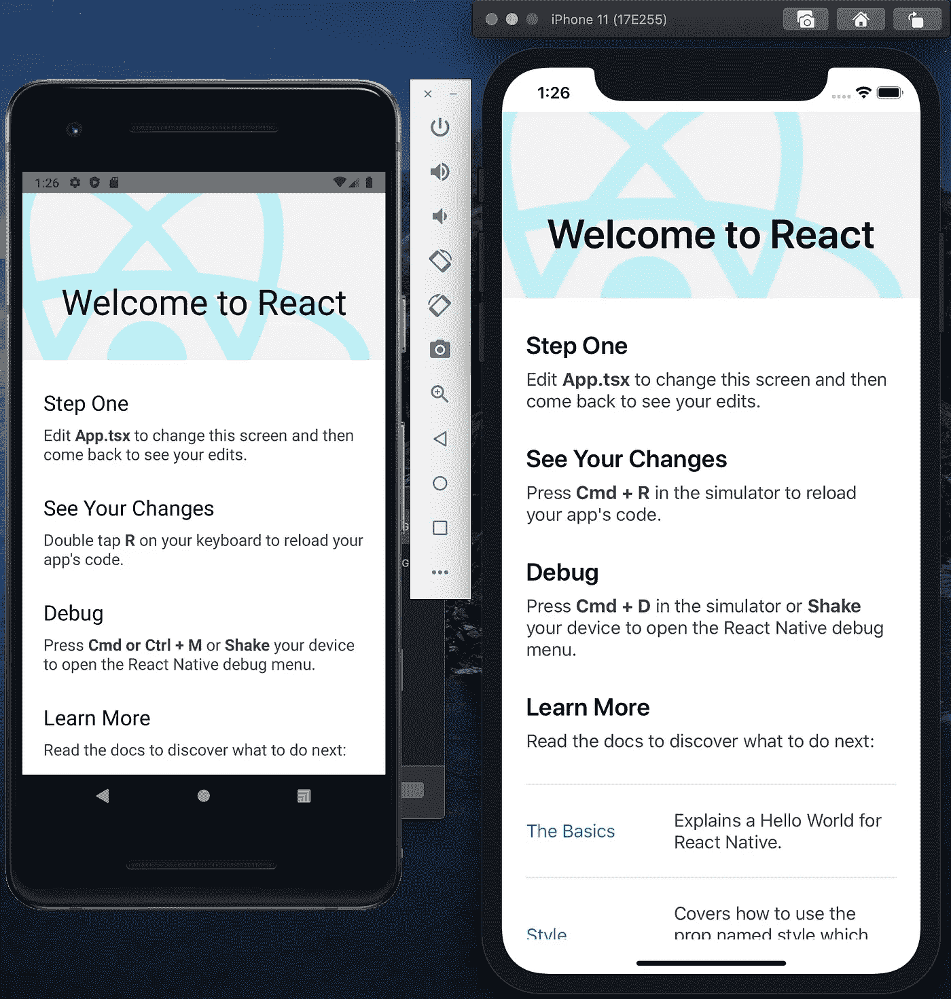
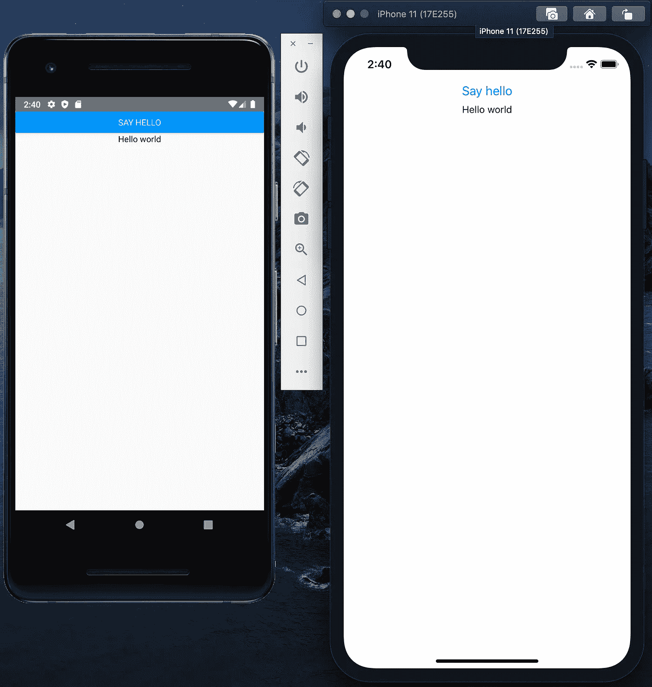

# 使用 React Native 和 Typescript 制作专业的移动应用程序—制作 hello world 应用程序(第 1 章，第 1 部分)

> 原文：<https://levelup.gitconnected.com/make-professional-mobile-apps-with-react-native-and-typescript-make-hello-world-app-chapter-1-dd39e4dc79e>

使用 React Native 和 TypeScript 安装开发工具和构建您的第一个 Hello world 应用程序的说明。

> **先决条件**:虽然你可以在 Windows、Linux、macOS 中开发和构建 Android 应用，但构建 iOS 应用需要 macOS。本教程是用 macOS 编写的，我假设你也在 macOS 上工作(用 Macbook、Mac Pro、Hackintosh 机器或 VMWare/Virtual box 上的 macOS)

# 安装开发工具

现在让我们把你的手弄脏。

重要的事情先来。您必须安装开发所需的工具。使用[自制软件](https://brew.sh/)安装`node`和`watchman`(脸书开发的一种用于观察文件系统变化的工具):

```
brew install nodebrew install watchman
```

**iOS 版**:从 iOS 版 [Mac App Store](https://apps.apple.com/us/app/xcode/id497799835?mt=12) 安装最新的 **Xcode** 。然后安装 cocoa pods(Xcode 项目的依赖管理器):

```
sudo gem install cocoapods
```

**对于 Android:** 安装 **Java 开发包**。

```
brew cask install adoptopenjdk/openjdk/adoptopenjdk8
```

然后从[这里](https://developer.android.com/studio/index.html)安装 **Android studio** 。当提示选择安装类型时，选择“自定义”安装。确保选中以下所有选项旁边的框:

*   *安卓 SDK*
*   *Android SDK 平台*
*   *性能(Intel HAXM)(*[*AMD*](https://android-developers.googleblog.com/2018/07/android-emulator-amd-processor-hyper-v.html)*)*见此
*   *安卓虚拟设备*

打开 Android studio。进入**首选项** → ***外观&行为→系统设置→ Android SDK。*** 从 SDK 管理器中选择“SDK 平台”选项卡，然后选中右下角“显示软件包详细信息”旁边的框。查找并展开 *Android 9 (Pie)* 条目，然后确保检查以下项目:

*   *Android SDK 平台 28*
*   *英特尔 x86 Atom_64 系统映像*或*谷歌 API 英特尔 x86 Atom 系统映像*

接下来，选择“SDK Tools”选项卡，并选中“Show Package Details”旁边的框。查找并展开“Android SDK 构建工具”条目，然后确保选择了`28.0.3`。

将以下几行添加到您的`$HOME/.bash_profile`或`$HOME/.bashrc`配置文件中。这是构建您的 Android 应用程序所必需的。

```
export ANDROID_HOME=$HOME/Library/Android/sdkexport PATH=$PATH:$ANDROID_HOME/emulatorexport PATH=$PATH:$ANDROID_HOME/toolsexport PATH=$PATH:$ANDROID_HOME/tools/binexport PATH=$PATH:$ANDROID_HOME/platform-tools
```

之后，键入`source $HOME/.bash_profile`将配置加载到当前的 shell 中。通过运行`echo $PATH`验证 ANDROID_HOME 已经添加到您的路径中。**您必须完成这一步，以确保脚本可以正常运行并构建 Android 应用程序。**

> 对于 Windows 和 Linux 用户，你应该遵循脸书的这个指令。

我们现在最不应该安装的是**纱。**

`brew install yarn`

> **专业提示**:我个人更喜欢 Yarn 而不是 npm，因为它提供了更好的缓存，更好的性能，并且使用 yarn.lock 来安装我们已经使用过的确切的包。因此，我们在本地机器和 CI 系统中有相同的包。

安装所有这些可能需要很长时间，所以你现在应该喝杯咖啡，等待安装完成。

# 初始化项目

现在，通过运行以下命令初始化您的第一个项目:

```
npx react-native init **mobile** --template react-native-template-typescript
```

它会创建一个新的文件夹 **mobile** ，其中包含您的源代码，并自动安装节点模块和 cocoa pods。

React 原生版本: **0.62.0** 。

> **Pro 提示**:您的项目名称( **mobile** )用于命名 **android** 和 **ios** 文件夹中的包、文件夹、文件。通过将您的项目命名为通用名称，我们可以在以后将它用作其他移动项目的模板。

然后运行这两个命令:

```
yarn android
yarn ios
```

该系统将构建您的代码，启动 iOS 和 Android 模拟器，安装您的应用程序并为您打开它。您应该会看到以下屏幕:



Android & iOS 截图

如屏幕所示，您可以编辑 App.tsx，然后保存它。您的更改将自动反映在模拟器上。或者，你可以按 **R** (安卓)或者 **Cmd + R** (iOS)来重新加载你的 app。要打开调试菜单，请按下 **Cmd + M** (Android)或 **Cmd + D** (iOS)或**摇动**您的设备。

您还应该花时间阅读第*部分的文章，了解更多信息*。

> **Pro 提示:**将此脚本`*“postinstall”: “cd ios && pod install && cd ..”*`添加到 **package.json.** 中的 **scripts** 部分，稍后在本教程中添加新库时，cocoa pods 会自动安装。

# 制作 Hello world 应用程序

现在让我们制作 Hello world 应用程序。

移除根文件夹中的 ***App.tsx*** 。在根文件夹中创建 ***src*** 文件夹。然后添加 2 个文件 ***app.tsx*** 和 ***app.style.ts* 。**

app.tsx

> **专业提示:**将你所有的源代码和资产(图片、json 文件等)保存在 **src** 文件夹中。这有助于您更轻松地维护它。在本系列的后面，我将指导您如何构建代码库。

然后打开 ***index.js*** ，将`import App from ‘./App’;`改为`import { App } from ‘./App’;`

将 **__tests__/App-test.tsx** 更改为**_ _ tests _ _/App . test . tsx .**然后打开它并将`import {App} from '../App';`更改为`import {App} from ‘../src/App’;`

现在重新加载你的应用程序(它可能会自动重新加载)。您应该会在屏幕上看到一个按钮。点击它，将出现消息`Hello world`。



我们来看看 ***app.tsx.*** 它使用 JSX(请阅读关于 [it](https://reactjs.org/docs/introducing-jsx.html) )来定义 **App** 组件，所以它不得不使用 ***tsx*** 扩展。 **App** 组件包含一个按钮，一个由 SafeAreaView 组件包装的文本，因此它们被呈现在“安全区域”(不重叠圆角或相机凹口)。

**App** 组件有一个名为`showMessage`的状态，默认为*假*。只有当它的值为 true 时，才会显示消息。当按钮被按下时，事件 ***onPress*** 被触发，调用 ***sayHello*** 。该函数调用***setShowMessage***并将 showMessagevalue 更改为 *true* 。然后屏幕上显示消息。我们在***app . style . ts****中定义样式，然后让 text 使用它。*

> 专业提示:永远避免使用内嵌样式。相反，在单独的文件中定义它们。它有助于你的代码清理。
> 
> **专业提示**:使用 snake_case 命名你的文件夹和文件。就我个人而言，我认为它比骆驼案、帕斯卡案和烤肉串案更容易阅读。

**祝贺你！**你已经制作了第一个 Hello world 应用程序。

您也可以在此处克隆示例:

```
git clone -b make_hello_world_app [https://github.com/thinhtran3588/react-native-starter-kit.git](https://github.com/thinhtran3588/react-native-starter-kit.git)
```

[接下来:了解 **React Native** 架构。](https://medium.com/@thinhtran3588/make-professional-mobile-apps-with-react-native-and-typescript-understand-react-natives-13a2c2577ab7)

[回到简介](https://medium.com/@thinhtran3588/make-professional-mobile-apps-with-react-native-and-typescript-introduction-777ba2423c35)。