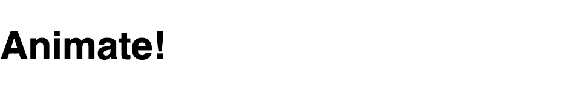

# 用 CSS 动画制作文本摆动

> 原文：<https://levelup.gitconnected.com/make-text-wiggle-with-css-animate-a38cc0856a15>

虽然 JavaScript 可以在我们的网页上制作动画，但 CSS 为我们提供了一种简单的方法来制作简单的小动画。

使用 CSS 动画不仅减少了浏览器必须执行的工作量，而且只需要几行 CSS 代码，而不是用 Javascript 来处理。最重要的是，它更容易阅读和理解。

首先，你需要做的就是在 DOM 上选择你想要制作动画的元素。出于测试的目的，我用 Animate！的内部文本创建了一个简单的

# 元素。在一个[在线网站游乐场](https://jsfiddle.net/)。

让我们通过选择

# 标签来准备编写一些 CSS。

毫无疑问，它会呈现出这种效果。

对于 CSS 动画，我们需要调用 animation 属性。动画有许多子属性，可以处理从方向到迭代、定时、延迟等任何事情。不要在这里列出它们，要知道你可以随时间改变 CSS 属性的位置、大小、颜色和大多数值(或者只要页面被加载)。完整的清单可以在[这里](https://developer.mozilla.org/en-US/docs/Web/CSS/CSS_animated_properties)找到。

对于本帖中的例子，我们希望我们的文本快速地来回“摆动”,使它看起来在摆动。

让我们继续将动画属性放入 CSS 中，并将其与页面中心对齐。

就像其他形式的计算机动画一样，我们必须创建关键帧来告诉 CSS 我们希望元素移动到哪里以及移动多长时间。要在 CSS 中做到这一点，我们首先需要为动画属性将调用的关键帧引用创建一个变量。对于我们的例子，让我们把它命名为“wiggle ”,它包含了我们希望动画运行的总时间。我们放 2 秒钟。

接下来，是时候创建我们的关键帧引用了。我们通过创建一条名为“@keyframes”的线和我们的“wiggle”变量来做到这一点。

现在是时候设置我们的关键帧了。我们想改变我们的文本在页面上的位置和它的旋转。我发现最简单的方法就是把它们都设置成百分比。浏览器会为我们计算出时间。

动画开始时会有点慢，因为我们在 0%和 40%之间有一个对数跳跃。然后它会迅速加速，因为我们每 10%改变一次。“平移”属性让我们改变它在 X 和 Y 轴上的方向并“旋转”它。

瞧，下面是我们完成的动画！

除了简单的“翻译”和“旋转”，还有更多方法来转换我们的文本例如，我们可以“扭曲”(使其看起来扭曲或拉伸)我们的文本，甚至改变其颜色。有无数种可能性。要获得可用内容的完整列表，请查看 MDN 的参考页面。