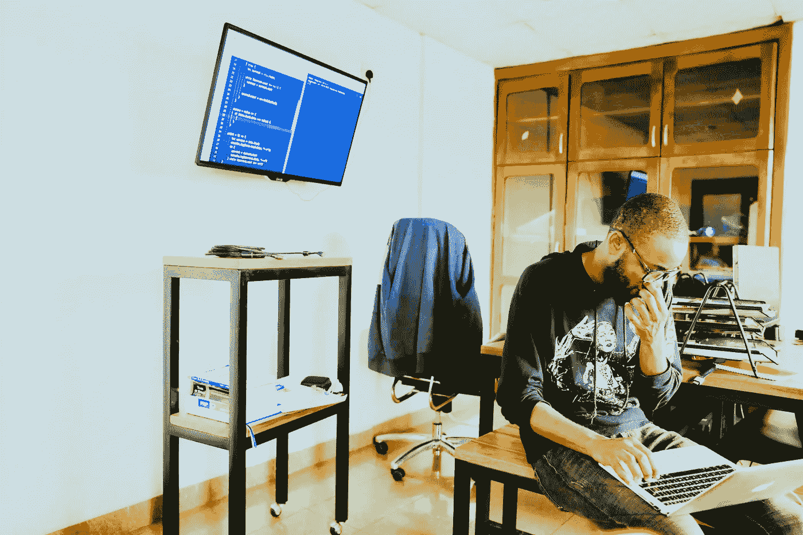

# 从编程课程跳到工作机会

> 原文：<https://levelup.gitconnected.com/make-the-jump-from-coding-course-to-job-offer-d8ef8109e04b>

## 如何确定你在完成编程课程后会找到工作

制造者在 [Unsplash](https://unsplash.com/s/photos/code?utm_source=unsplash&utm_medium=referral&utm_content=creditCopyText) 上 [NESA 的照片](https://unsplash.com/@nesabymakers?utm_source=unsplash&utm_medium=referral&utm_content=creditCopyText)

L 如果你不确定自己的方向是否正确，那么通过编程赚钱可能会令人沮丧。你怎么知道你正在取得真正的、合法的进步呢？是在你获得认证的时候吗？完成了在线课程？

很有可能，你已经参加了 Codecademy、Data Camp 或 FreeCodeCamp 的课程。你可能已经完成了一个。在线课程很棒，因为有明确的目标。他们告诉你，“如果你完成了一个中级课程，你现在是一个中级程序员”。完成每个课程模块后，你应该有成就感。

我记得我完成编码 Dojo 的中级 Python 课程的时候。我感到高兴和成就感，因为编码 Dojo 告诉我我“了解”Python。然而，有些事情感觉不对劲。我会在 GitHub 上看别人的 Python 脚本，感觉完全迷失了。我会看着中级水平的面试问题，不知道如何解决它们。最糟糕的是，我会通过复制和粘贴代码来“完成”不同的教程。当我意识到我没有学到任何东西时，我感到不确定和茫然。我不确定我是否在朝着正确的方向前进，或者在原地打转完成在线课程和教程。

> 尽管这些课程简单易懂，但它们并没有清晰地描述学习一门语言需要什么。

几乎每个人都在学习过程的这一部分苦苦挣扎。如何走出复制粘贴的窠臼？你如何应用你所学的知识，从而获得面试和工作机会？以下是你可以克服所有这些障碍的方法:

## 找到你最感兴趣的话题

照片由 [Unsplash](https://unsplash.com/s/photos/tech-passion?utm_source=unsplash&utm_medium=referral&utm_content=creditCopyText) 上的[剂量介质](https://unsplash.com/@dose?utm_source=unsplash&utm_medium=referral&utm_content=creditCopyText)拍摄

如果你想应用你的编码知识，我鼓励你去寻找你感兴趣的编码领域。你可能不知道从哪里开始或者寻找什么。这里有一个问题可以帮助你开始:

> 当你决定要编码时，你梦想完成什么类型的项目？

我希望你注意你发现自己在考虑的项目类型。你想编写一个移动应用程序吗？一个花哨的预测算法？你想写一个脚本来自动化你所有的报告吗？当我开始学习 Python 的时候，我喜欢数据挖掘的想法，喜欢寻找快速提取数据的方法。我认为成为一名数据极客的想法很酷，至少在就业市场上很有价值。

我开始用谷歌搜索像“数据挖掘”和“最佳初学者数据项目”这样的短语。这些搜索让我找到了关于 API、web 抓取和 Selenium 的文章。大多数信息我都不知道，但我不在乎。我玩得很开心。几次搜索之后，我选择了网络搜集。我找到了一个简单的教程，刮出了一个纳斯达克股票名称和价格。我喜欢这个教程，因为我明白它在说什么——我不是在复制和粘贴！这个教程花了我三个小时才完成。我在研究代码、调试和在各种股票价格上运行脚本时获得了极大的乐趣。你可以在这里查看我的简单网络刮刀。

## 使用真实世界的数据练习您的技能

照片由[马库斯·斯皮斯克](https://unsplash.com/@markusspiske?utm_source=unsplash&utm_medium=referral&utm_content=creditCopyText)在 [Unsplash](https://unsplash.com/s/photos/data?utm_source=unsplash&utm_medium=referral&utm_content=creditCopyText) 拍摄

我记得有一次我参加了一个面向初学者的在线 SQL 课程。该课程带我学习了选择语句、连接和聚合函数。这门课在教授句法方面很有帮助，也很全面。但有一个问题:我只是在学习语法，但无法将我的知识转化为找工作。我很快发现公司对我过时的 SQL 经验不感兴趣。我考察的每家公司都希望应聘者熟悉自己特定领域的数据，也就是说，不是过时的电影数据。

如果你处于类似的位置，我建议你去看看 [Kaggle](https://www.kaggle.com/datasets) 。我的一个好朋友向我推荐了这个网站，我发现它很有帮助。我立刻想到，“我希望我在用过时的电影数据学习 SQL 课程时知道这些”。Kaggle 很棒，因为它提供了使用引人入胜的数据的 Python、SQL 和 ML 课程。你还可以下载真实世界的数据集，这样你就可以练习解决任何领域的问题。如果你想进入金融科技行业，他们有金融数据集。如果你想在人工智能领域工作，他们有 Twitter、Youtube 和亚马逊的评论数据来支持你的模型。无论您的数据需求是什么，他们都能满足。

## 寻找可以帮助你的导师(奖励:以及如何做到这一点！)

约书亚·内斯在 [Unsplash](https://unsplash.com/s/photos/mentor?utm_source=unsplash&utm_medium=referral&utm_content=creditCopyText) 上的照片

找一个有经验的程序员，请他们指导你。如果你不认识有经验的程序员，没关系。这里有一些方法可以让你找到一个有经验的程序员来帮你:

*   如果你在一家公司，看看你能否找到你的工程部门在哪里。找到一个软件工程师，问问你是否可以请他们喝杯咖啡，吃顿午餐，或者两者都请。如果你友好地请求他们的帮助，他们可能会愿意告诉你诀窍。
*   如果你在学校，花些时间了解计算机科学专业。问问你能否请他们吃午饭，看看他们是否愿意帮助你。
*   查看你在 LinkedIn 上的第一、第二甚至第三个联系人。最近有人转行做软件工程师了吗？如果你愿意，就去问吧。愿意提供帮助的程序员的数量可能会让你吃惊。
*   如果你上过学，你有一个校友网络供你支配。浏览 LinkedIn，从你有联系的校友开始。有些学校有内部校友数据库，所以你也可以去那里看看。你可能有一个教授可以给你介绍一个有经验的程序员。想办法联系他们，说你们上了同一所学校，问他们是否考虑指导你。

有经验的程序员很重要，原因有两个。首先，他们将向您展示真正的程序员是如何操作的。在一次会议上，我的编码导师向我挑战，要我在使用堆栈溢出时解决一个问题。一开始，我很抗拒。这家伙没经验吗？我选错人了吗？事实证明，大多数程序员，甚至是专家级的程序员，都使用堆栈溢出。事实上，最好的程序员总是花时间梳理堆栈溢出。花时间观察你的导师做什么，他们如何解决问题。很快你就会了解他们的行为。语法会更容易读懂，问题会更容易解决，你的自信也会增长。

一个有经验的程序员也会给你指出有用的资源。他们可能会给你一个他们写的解决实际问题的脚本。他们可能会给你发一个有用的网站，上面有你需要自己解决的问题。与我的编码导师见面几周后，他建议我找几本关于数据结构的书来读。一天后我去了公共图书馆，读了几本。到那时为止，我所知道的唯一的数据结构是列表。在阅读了其他数据结构之后，我开始理解更高级的问题。像“散列”或“矩阵”这样的术语对我来说更容易识别。

## 去参加编码聚会，问问题，倾听

在 [Unsplash](https://unsplash.com/s/photos/meetup?utm_source=unsplash&utm_medium=referral&utm_content=creditCopyText) 上 [NeONBRAND](https://unsplash.com/@neonbrand?utm_source=unsplash&utm_medium=referral&utm_content=creditCopyText) 拍摄的照片

有数百万人想学习如何编码，还有数百万人愿意提供帮助。鉴于这种需求，人们在世界各地成立了编码聚会。这些聚会的唯一目的是互相学习和帮助。每个人都在那里互相鼓励继续学习。

由于许多原因，编码聚会是有价值的。你将有机会与有经验的程序员面对面交流，并获得编码导师的所有好处。你也将有机会问一大堆问题。最精彩的部分？人们不会生你的气。最后，你将有机会倾听。试着不接触一行代码就参加一个聚会。听听程序员如何互动，如何处理问题，如何想出解决方案。

在新冠肺炎期间，面对面的聚会可能很难参加。如果你不能参加面对面的聚会，虚拟聚会是一个很好的第二选择。如果你对虚拟编码聚会感兴趣，请访问[这个网站](https://codebuddies.org/)。

## 最终，这都是关于骗局

学习编码和应用你所学到的东西可能很难。不确定性和缺乏方向可能很难管理。但是如果旅程很容易，每个人都会这样做。那不是你。你不会因为不想走捷径而放弃。你想要一份高薪的工作，给你机会发挥你的技能。坚持学习语法，并应用你所知道的。找到愿意帮助你的人，并确保你感谢他们！你离得到那份工作又近了一步。

继续努力。

附:如果你仍然不确定从这里该何去何从，我推出了一个[网站](http://coursetohire.com/)来帮助你。我将发送从免费编程课程到工作机会的技巧和策略。有任何问题，我都会回答！