# 今天就改用打字稿吧

> 原文：<https://levelup.gitconnected.com/make-the-switch-to-typescript-today-b22c1b8d8f84>


在隔离期间，我花了很多时间研究类型理论和写博客。然后我想我可以通过写一个指导来帮助社区。所以，我们到了。

即使您是 Javascript 新手，也可以在几分钟内切换到 Typescript。

# 为什么打字稿？

当您添加类型时，Javascript 得到了改进，负面影响最小。它的伸缩性更好，更容易调试，更容易阅读，等等。我再怎么强调类型的重要性也不为过。

如果你已经了解 Javascript，那么学习 Typescript 的曲线可以忽略不计。

此外，Typescript 可以集成到任何有 Javascript 的地方。我一会儿会解释它是如何工作的。

# 我们开始吧

您需要做的第一件事是安装 typescript:

https://www.typescriptlang.org/#download-links

然后，导航到您选择的空目录。

在你的命令行中，写下这个。

```
tsc --init
```

这将使用该目录的 tsconfig(选项)文件初始化 typescript 编译器。

我们根本不打算更改 tsconfig 文件。它的默认设置很适合这个教学，但是有很多设置你可以改变。

然后，创建一个扩展名为. ts 的新文件，并随意命名。您的目录现在应该如下所示:

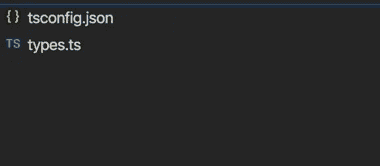

就这样，我们准备写一些打字稿。

# 什么是 Typescript？

Typescript 是 Javascript 的超集。这就是为什么很多人认为 Typescript 甚至不是它自己的语言。您在 Typescript 中编写的每一段代码要么编译成 Javascript，要么在编译时进行检查，以使 Javascript 代码运行得更好。

这只是做出改变如此容易的一个原因。如果我们利用类型推断，我们可以编写在各方面都等同于 Javascript 代码的类型脚本代码，因为最终它实际上是 Javascript 代码。

这也是为什么任何现有的 Javascript 代码都可以迁移到 Typescript。类似地，您可以使用 Typescript 在任何 Javascript 代码基础上构建。甚至有可能有一个混合的代码库，一部分是 Javascript，一部分是 Typescript。这仍然只是 Javascript。

它们不能完全互换，但它们非常相似，足以模糊一些界限。

所有内置的方法，如。地图，。减少，。Javascript 中内置的长度和其他语法也内置于 Typescript 中。

例如，我可以将它写在我的 Typescript 文件中。它是有效的类型脚本和 Javascript。

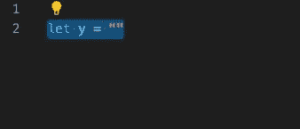

然后，当我用以下命令编译这个文件时:

```
tsc [file name].ts
```

注意，Typescript 编译器会将我的 Typescript 文件编译成 JS 文件:

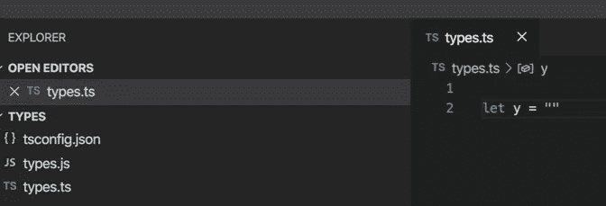

js 文件不是我做的。编译器给我做的。

当我们查看 js 文件内部时，我们可以看到 Typescript 编译器是如何解释我的 Typescript 代码的。

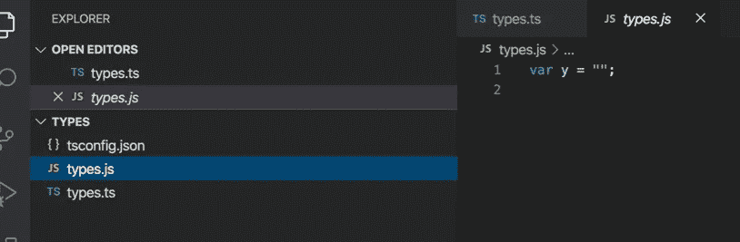

好了，我的 typescript 编译器决定使用关键字 var，并在末尾添加了一个分号。

但是为什么呢？为什么所有这些步骤？

很难理解为什么我们要在一个小项目中这样做。

当我们与多个团队一起处理大型代码库时，Typescript 显示了它的真正优势。在您决定编译之前，编译器会自动捕捉所有形式的名称空间和类型检查错误。

在像微软这样的大公司，可能有 5 个 7 人的团队都在同一代码库上工作。因此，如果有 35 名编码人员在一个环境中编写代码，只需要两个编码人员编写相同的变量名“formInfo”或类似的东西，整个系统就会突然停止工作。Javascript 不会有任何线索显示它哪里出错了。

因此，编码人员将不得不通读代码库，这可能是数千行代码，试图找出导致失败的原因。

另一方面，Typescript 会自动捕捉错误并给出警告。

例如，如果我们用 Javascript 写这个:

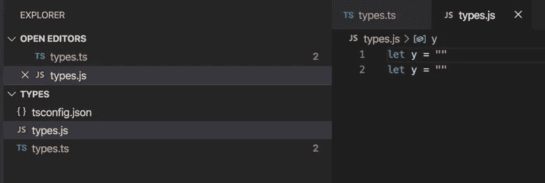

Javascript 对此毫不在意。它假设我们只是用一个新的 y 变量替换旧的 y 变量。然而，如果旧的 y 正在做一些事情，那么它所有的附属系统将会突然失效。

如果我们有一个包含数千行代码的代码库，那么搞乱一些现有系统的可能性将呈指数级增长。

然而，如果我们在 Typescript 中写同样的东西，它会自动读取代码并警告我们这些冲突正在发生。

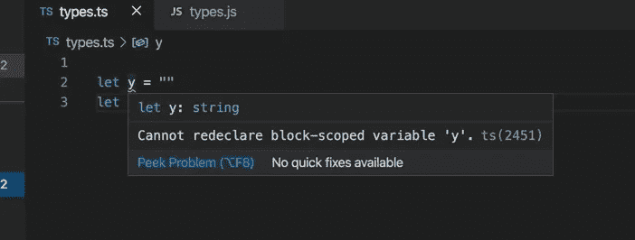

现在它看起来很小，但是我不能告诉你这多少次在工作中救了我的命。

我发现，在很长一段时间里，我的 typescript 代码运行得更快，构建得更好，我也可以写得更快。比较好讲道理。

当越来越多的编码人员在同一个项目上工作时，这些错误消息的价值会呈指数级增长。

Typescript 还带来了一大堆其他错误。

好吧，我们相信了。让我们来了解一下这种语言的一些特性。

# 类型

描述如何编写 Typescript 的简单明了的方法是在编写 Javascript 时为所有值添加类型定义。

例如，如果我们想要一个字符串变量，只要告诉编译器它是一个字符串。

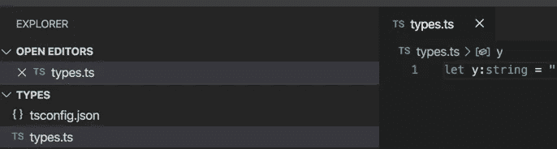

类型语法总是用冒号和标记附加到变量声明中。

你不需要总是明确你的类型，事实上 Typescript 的创建者鼓励我们尽可能地利用类型推断。(特别是对于初学者)

然而，如果你想充分利用类型安全，建议尽可能的具体。

就像 Javascript 一样，Typescript 函数是一级对象，这意味着函数可以在我们使用任何其他值的任何地方使用。类似地，它们也可以被键入。

函数由它的返回类型来确定类型。例如，如果一个函数返回一个 boolean，我们应该用 boolean 标记来键入它，但是我一会儿会更深入地讨论这个问题。

# 这是最基本的。理论上，您可以就此打住，开始使用 Typescript。维奥拉。如果你卡住了，就用:any。你可以很容易地做出改变，并随着时间的推移不断改进。

然而，如果你想更好地掌握整个语言，请继续读下去。

# 一些稍微复杂一些，但是非常强大的类型定义和工具。

我们还可以定义更复杂项目的形状和值类型，如对象、数组和元组。不管嵌套有多深，我们都可以这样做。

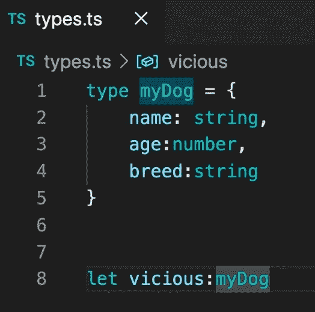

在这种情况下，我们说将会有 myDog 对象，它们的形状总是类似于 myDog 类型。任何 myDog 类型的变量，如果被赋予了与我的类型化对象不具有相同属性和类型值的对象，就会抛出错误。

当您在处理抛出 HTTP 请求的 web 应用程序时，这变得特别有用。

它对于跟踪组件状态也很有用。

每一个被赋予 myDog 类型的对象看起来都像是我的 myDog 类型。

在同一步中，我们可以涵盖各种各样的好奇和复杂的需求。我们可以对元组进行类型化，这些元组基本上只是具有有限长度和类型的数组。我们可以创建只接受特定类型的泛型数组，对于类型化的匿名函数，我们可以变得更加复杂。

这个要点简要地涵盖了许多例子，但我不会对其中的大部分进行详细的描述，因为我担心这个博客会写得太长。

尽量不要在这里不知所措。从本质上来说，大多数这些东西只是简单部分的组合。此外，你不需要知道这些东西的一半就可以开始制作很酷的应用程序。

然而，了解这些事情将有助于您编写可维护的、更快的代码和有教养的代码。对你的事业有帮助。

# 类型推理

Typescript 会试图为我们找出我们的类型，即使我们做了奇怪的事情。

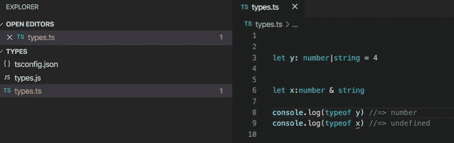

在这个片段中，我已经说明了 y 可以是一个字符串或一个数字，而 x 只能是一个数字和一个字符串。我也把数字 4 赋给了 y，没有把 x 赋给任何东西。

我意识到这可能听起来令人困惑，但是只要不产生灾难性的错误，Typescript 仍然会让我们这样做。

x 被输入为一个数字和一个字符串，但是它的类型被标记为未定义。y 被输入为数字或字符串，但它自动将类型缩小为数字。

这是因为当我们编写和执行类型时，编译器试图确定我们的类型。

默认情况下，每个变量都自动与未定义的类型联合。此外，任何不可能的类型都会自动缩小到 never 类型。

这些评论一步一步地解释它

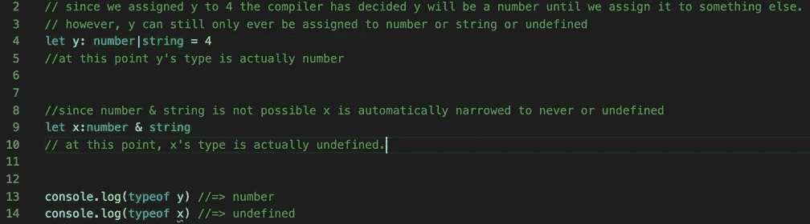

在默认的 tsc 设置中，undefined 自动与每个变量联合，但是可以更改 tsc 设置来改变这一点。其中一个内置的设置叫做“strictNullChecks ”,它使得未定义的类型不会被自动分配给每一个类型(除了别的以外)。我推荐你在感觉舒服的时候使用这个。

大多数时候，Typescript 的推理逻辑是有意地试图防止我们的代码崩溃，即使我们做了奇怪的事情。它还试图在我们编写代码时减少障碍。它仍然会编译这个奇怪的例子，因为它已经确定这个例子不会崩溃，但是如果我们做一些真正矛盾的事情，比如:

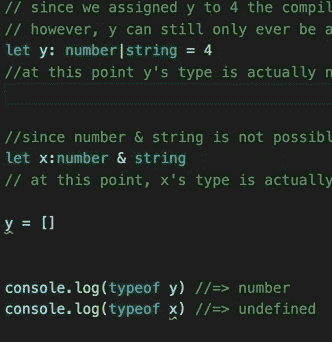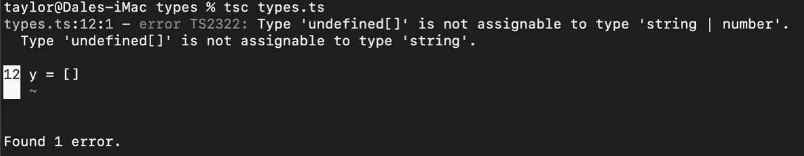

在这一点上，Typescript 说我们已经走得太远了，我们处于非常不安全的类型领域，所以它标记了我们的数组赋值，并告诉我们这没有意义。

简而言之，我们应该将 Typescript 编译器视为一个强大的工具，它同时试图原谅我们的错误，并在我们正在做将使程序崩溃的事情时警告我们。

随着时间和实践，Typescript 将教会我们成为更好的编码员，就像《人鬼情未了》中的陶器场景一样。

# 类型运算符

Typescript 中的类型可以像值一样被操作。

这意味着我们可以给类型取别名，我们可以将它们联合起来，我们可以将它们相交。

# 别名

我们可以用“type”关键字直接定义新的类型，并给它指定我们想要的任何类型标签。这些新类型可以充当现有类型的别名。

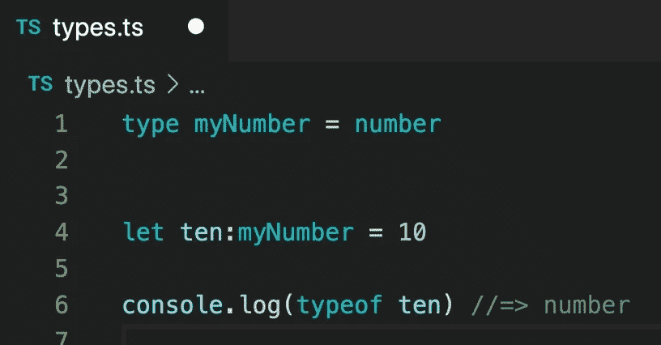

在这里，我们说有一些新的类型叫做“我的号码”，但它仍然只是一个数字类型。

# 并集和交集。

对于联合类型，我们说项目可以是任何一个唯一的类型或者所有类型的组合。

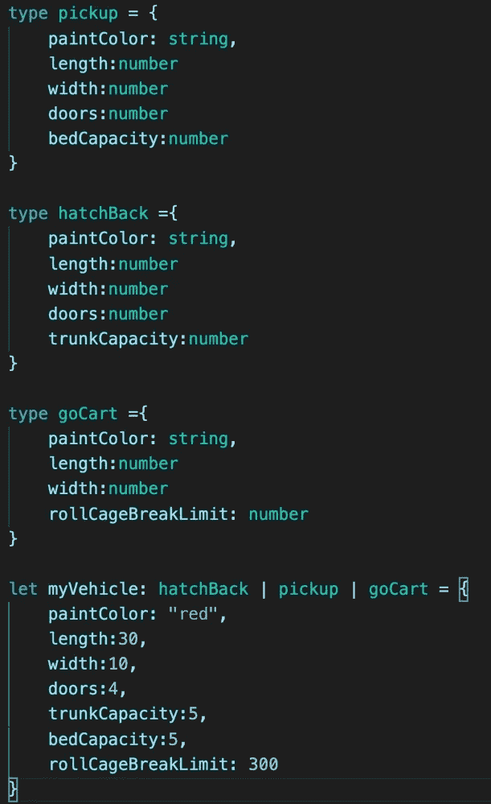

请注意，myVehicle 具有我们创建的类型的所有共享属性和所有独特属性。如果我的变量只有一个唯一的属性，它也会接受这段代码。

另一方面，交集类型将只接受包含所有共享和唯一属性的赋值。

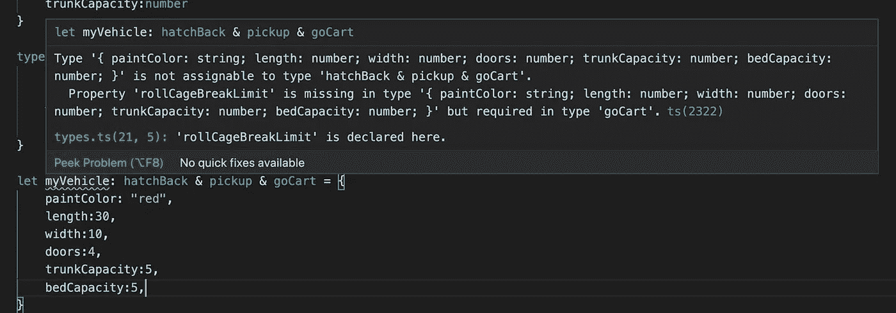

例如，我刚刚试图声明一个交集类型，但未能从 goCArt 类型添加 rollCageBreakLimit，因此 Typescript 给出了一条错误消息，告诉我这一点。

类型联合远比交集更常见，但两者都非常有用，尤其是当我们处理大量数据而只想查看特定字段时。

# 文字类型

类型字面量允许我们做非常狭窄的类型定义。如果我们正确使用这些，我们可以保护自己免受各种潜在的攻击或错误。

它们可以因为任何原因在任何时候使用，但是当我们想要将一个特定的项目列表引入到一个特定的变量中时，它们是最好的。

这种情况的一个常见用例是当我们试图标记在我们的应用程序中传递的对象时，以便所述对象的接收者知道当接收到该对象时该做什么。只有有限数量的标签，我们不希望有任何有趣的业务，人们通过奇怪的标签。

例如，当我们向 restful API 发出 HTTP 请求时，我们知道我们的请求总是 post、get、put、patch 或 delete。您可能在 redux 或 AJAX 之类的东西中见过这种约定。

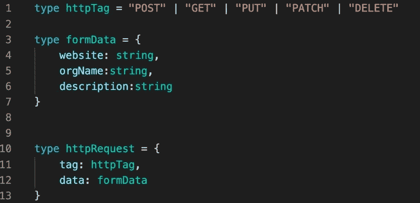

在这里，我们说 httpTag 不是一个通用的字符串。它只能是这些字符串中的一个，我们不希望我们的应用程序的任何部分尝试其他的东西。这就是我们所说的类型文字的联合。“POST”标记是一种文字类型。

# 无商标消费品

有时我们希望函数接受一些未知类型，并返回一些其他未知类型。在这些场景中，我们不必求助于使用:any。即使在难以预测的情况下，我们仍然可以使我们的类型尽可能具体。

这就是类型泛型发挥作用的地方。

当我们想要创建可以以多种方式使用的通用函数时，泛型是最常用的。

例如。地图功能。如果你从 Javascript 来到这里，你知道。map 函数将遍历一个数组，并对数组中的每一项执行匿名函数。

我们还知道，Typescript 函数是由它们的返回值类型化的。所以，一个映射函数接受某种类型，在对第一种类型做了一些事情后，返回另一种类型。

这就是我们如何使自己的 map 函数类型安全的方法:

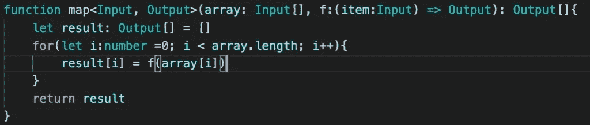

使用箭头括号，我们说有两种通用类型(输入和输出。)在函数被调用之前，我们不会知道它们是什么。然而，一旦函数被调用，我们就知道数组的类型都是相同的，我们也知道匿名函数将接受一个与每一项类型相同的参数。然后，匿名函数将返回不同于第一种类型的其他未知类型。最后，我们的 map 函数的结果将是一个与匿名函数的返回类型相匹配的数组。

我知道这有点难以启齿，但别担心！只要练习一下，做几个一般类型的函数，你就会比你原来想的更快地掌握它。

我们已经到了可以创建自己的通用库的时候了。

# 我们如何对待班级

我们按照我已经介绍过的基础知识键入我们的类和值。然而，Typescript 为我们的普通类结构增加了一些新特性，使它们更具表现力和安全性。

Typescript 借鉴了 C#的特性，这是一件很棒的事情，因为 C#是最优秀的面向对象语言之一。有了 Typescript，我们真的得到了好几个世界的好处。

无需深入细节，Typescript 为我们提供了许多类似于 C#中的关键字，允许我们操作我们的类

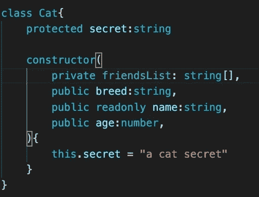

Private 使得只有 Cat 实例可以访问它们自己的 friendsList。

Public 使它可以读取或更改属性。

Readonly 使该属性只能被读取，而不能被更改。

Protected 使 Cat 的实例和 Cat 的子类型可以访问该属性。

类上的 abstract 关键字使该类成为抽象类，这意味着它不能被实例化。(适用于高阶或实用组件。)

# 接口

Typescript 中的接口是一种定义类型的方式，类似于我们的 type 关键字。我们可以用这两种特性实现同样的事情。

当 type 关键字期望一个唯一的赋值时，接口正在设置一个域类型，这将允许我们重复地进行赋值，将属性附加到那个特定的类型域。

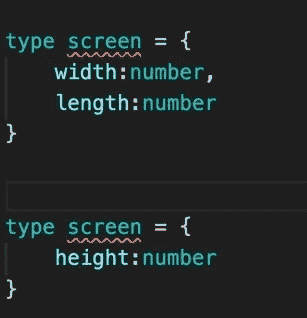

在这个例子中，Typescript 将抛出一个错误，抱怨 screen 已经被分配了。

如果我们用 interface 关键字做同样的事情，它只会将新的属性添加到类型中。

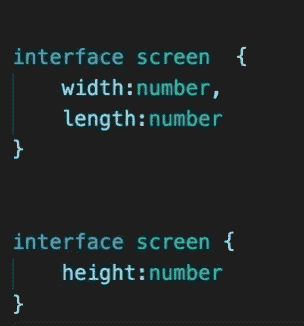

在这个例子中，我们说 screen 已经扩大到包括所有三个属性。

# 类型继承

Typescript 中的类型可以像类一样相互继承。这可以用 interface 或 type 关键字来完成。它允许我们在类型定义中获得面向对象编程的所有优点。

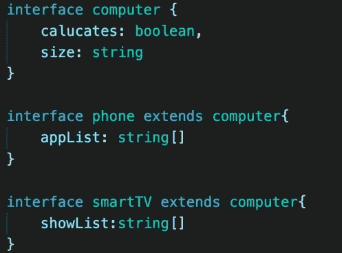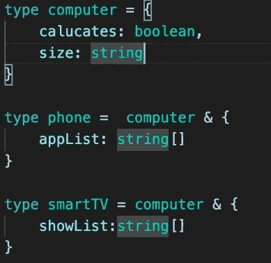

这两个例子做了同样的事情。

# 结论

使用 Typescript，我们还可以做更多的事情

还有许多我没有列出的特性，但是如果你掌握了这里列出的所有特性，你将处于一个非常有利的位置，成为任何 Typescript 或 Javascript 团队中有价值的一员。

Typescript 为我们提供了许多来自其他语言的有利特性，它将 Javascript 变成了一种值得尊敬的工具。

这就是我今天所有的时间。快乐编码。