# 通过在 iOS 中使用 Codable 和 Generics 来利用 Firebase 实时数据库

> 原文：<https://levelup.gitconnected.com/make-use-of-firebase-database-by-using-codable-and-generics-in-ios-214ffe5e916f>

重火力点

在这篇文章中，我将教你如何围绕 [Firebase 实时数据库](https://firebase.google.com/docs/database/ios/start)创建一个包装器。我将试着告诉你我们如何让 Firebase 实时数据库 API 对开发者来说简单易用。如果你不熟悉 Firebase，我强烈建议你在阅读这篇文章之前阅读和研究一下。

# 现在的 API 有什么问题？

API 可以工作，但是不容易使用。我可以告诉你的最大问题是，检索我们需要的数据需要太多的努力。在下面的例子中，我们的主要目标是从远程数据库中检索“用户”，对吗？但是如果我们在应用程序的其他地方也需要这个“用户”呢？我们需要一遍又一遍地写这些样板代码吗？不要！这是不对的。因此，我们需要构建一个无需编写样板代码就能工作的系统，并且符合我们的应用程序流、模块等等。

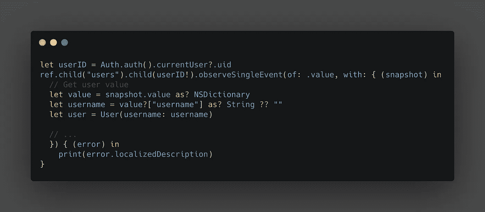

来自官方 Firebase 文档的示例代码

# 解决办法

我们需要围绕 Firebase 实时数据库 API 构建一个包装器。

## 包装要求

*   这个包装应该很容易使用。
*   它会给我们所需要的。
*   它应该消费和生产可编码产品。
*   它应该支持 Firebase 实时数据库的所有功能

# 概念

假设我们正在构建一个列出我们附近餐馆的应用程序。用户可以获得关于特定餐馆的信息。用户可以删除餐馆。并且用户可以添加新的餐馆。

# 密码

## 应用委托

就像我们在所有 Firebase 项目中所做的一样，我们在 AppDelegate 中初始化它。

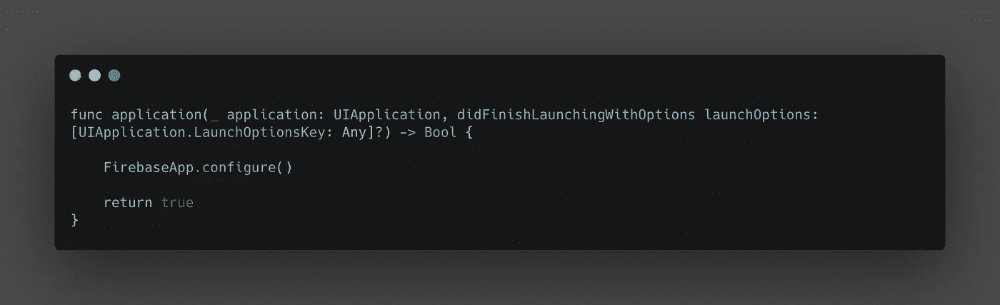

AppDelegate.swift

## FirebaseDatabaseManager

这个类是一个单例类，它保存 FirebaseDatabase 引用。它管理 Firebase CRUD 操作。这是我们 API 的第一层。

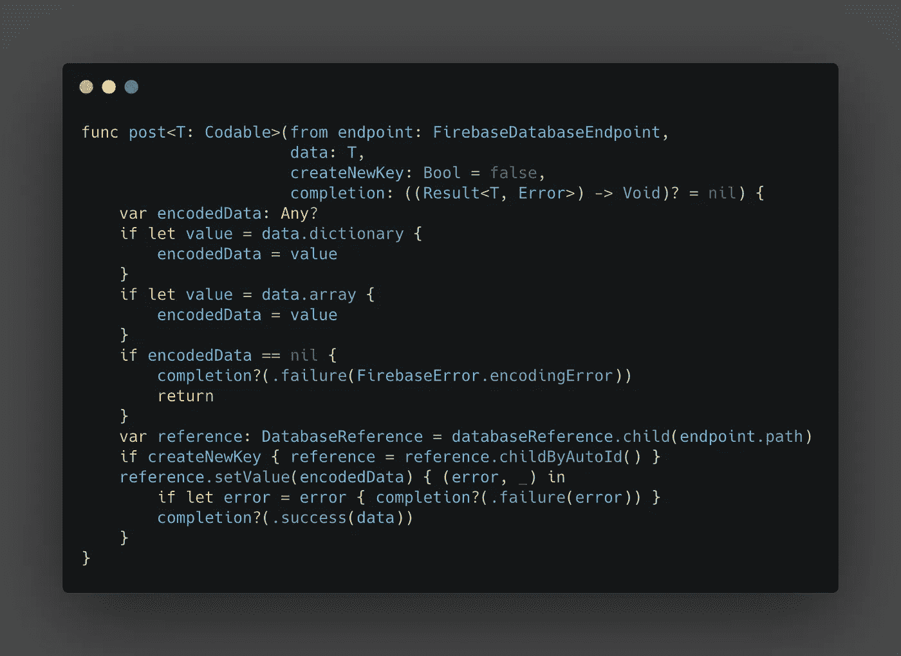

FirebaseDatabaseManager:post(端点:数据:createNewKey:完成:)

`post`函数的主要职责是将数据推送到 Firebase 实时数据库。基本上，它消耗了 Firebase API 中的`setValue`方法。

## FirebaseDatabaseEndpoint

FirebaseDatabaseEndpoint 是一个与 FirebaseDatabaseManager 通信的协议。当我们需要与数据库交互时，我们不直接与 FirebaseDatabaseManager 交互。相反，我们与 FirebaseDatabaseEndpoint 通信。它包含两个参数:“路径”和“同步”。“路径”是指数据库路径，比如:“/restaurants”或者“/restaurants/12345”。“同步”是指 Firebase 术语“保持同步”。

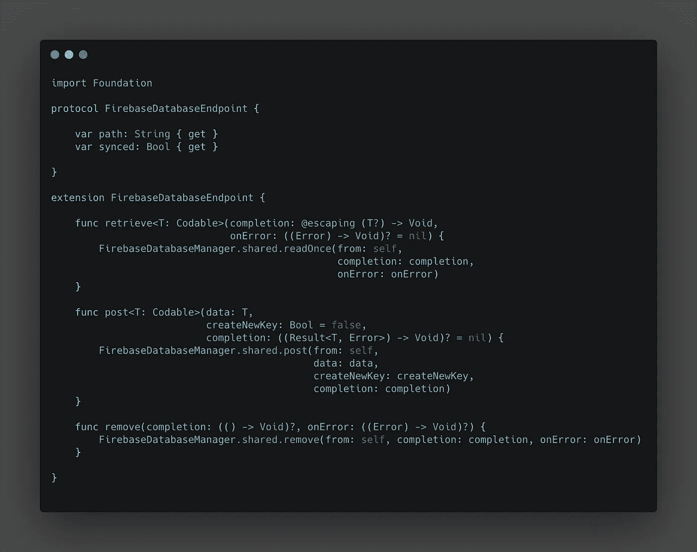

FirebaseDatabaseEndpoint.swift

## 数据模型

在这个应用程序中，我们需要代表餐馆。我们可以用这样的东西来描述一家餐馆。

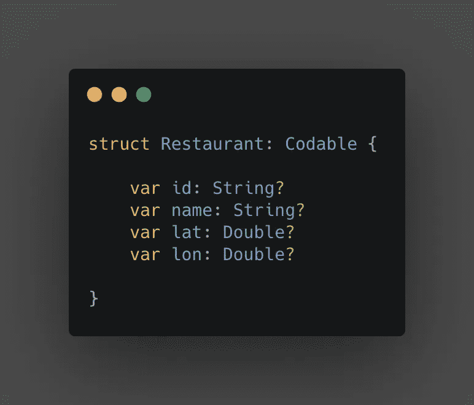

## 餐馆和酒吧

这是我们存储餐馆相关服务的端点的地方。在这个例子中，我更喜欢创建一个“域相关”端点。您也可以构建与“场景相关”的端点。

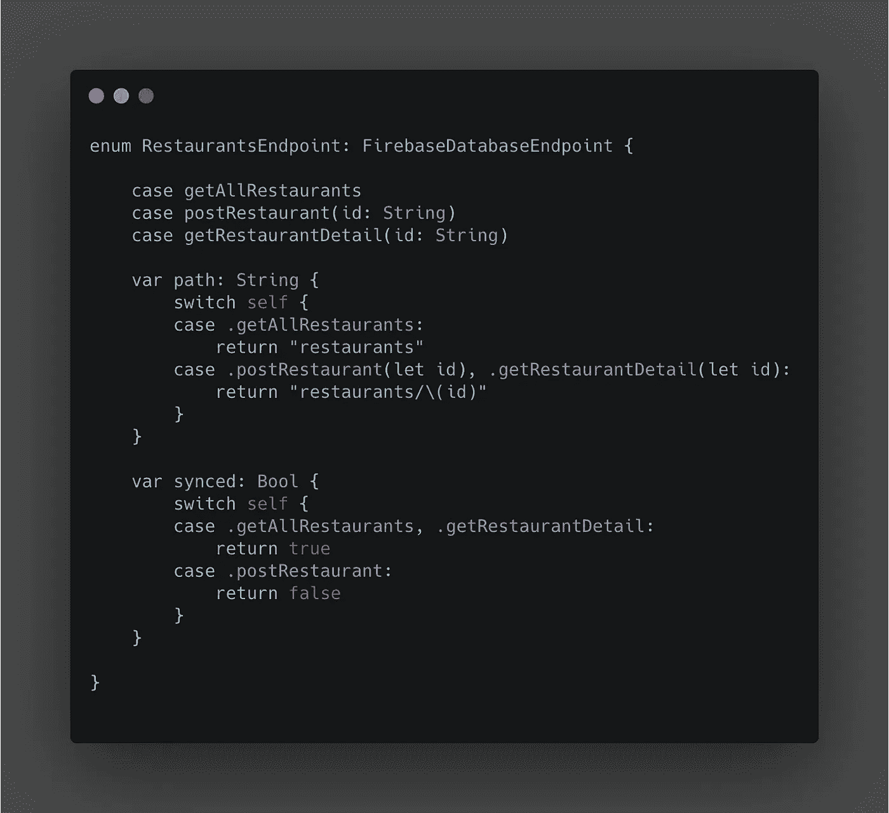

RestaurantEndpoint.swift

# 使用包装

## RestaurantInteractorDelegate

无论您是使用 VIPER 架构还是 VIP 或 MVVM，您都需要完成处理程序或委托来在层之间传送数据。所以我创建了一个委托来在层间传递数据。

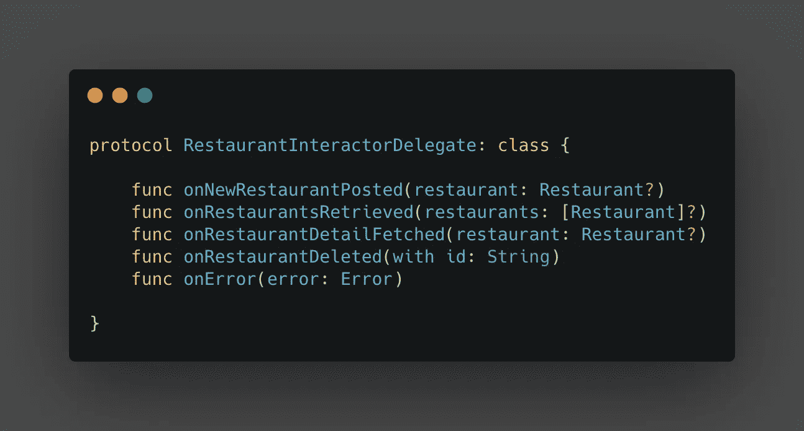

restaurantinteractordelegate . swift

## 后样本

我们试着贴一个新餐厅吧。我为此编写了一个名为“postRestaurant”的函数。它需要一个“餐馆”对象。事情是这样的:

*   该功能与“RestaurantEndpoint”通信。
*   “RestaurantEndpoint”要求“FirebaseDatabaseManager”发布指定的数据。
*   “FirebaseDatabaseManager”与 FirebaseDatabaseAPI 通信以发布数据。
*   最后，它用一个委托报告结果。

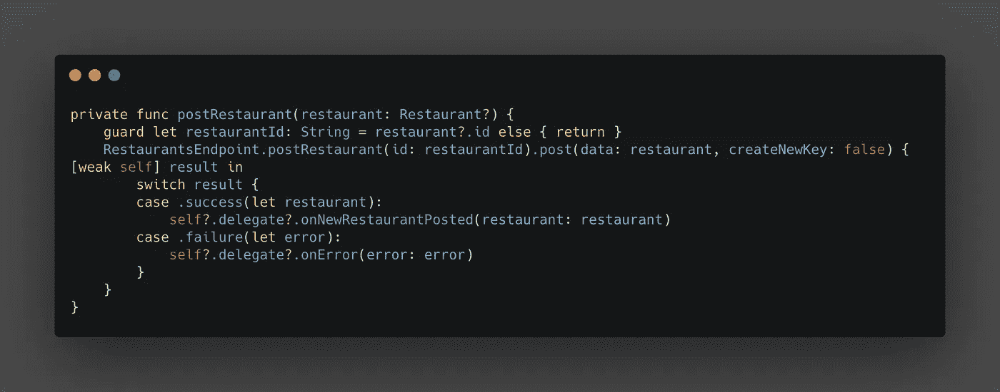

后餐厅

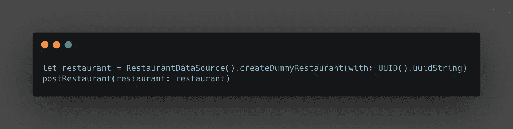

后餐厅的使用

发布结果

## 检索样本

为了检索餐馆，我们需要创建一个使用“restaurantendpoint . get all restaurants”的函数。

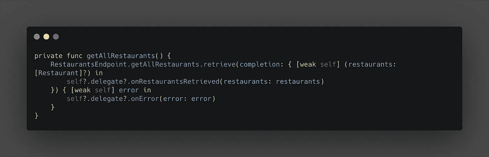

获取所有餐馆

## 餐馆详细样本

为了检索餐馆的详细信息，我们需要创建一个使用“Restaurant point . getrestaurantdetail”的函数。

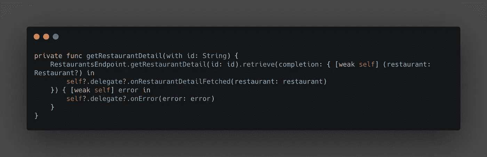

getRestaurantDetail

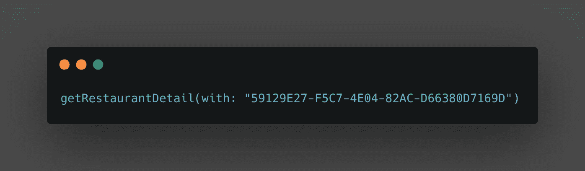

getRestaurantDetail 用法

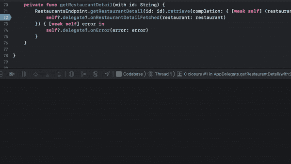

getRestaurantDetail 的结果

## 删除样本

为了检索餐馆的详细信息，我们需要创建一个使用“restaurantendpoint . delete Restaurant”的函数。

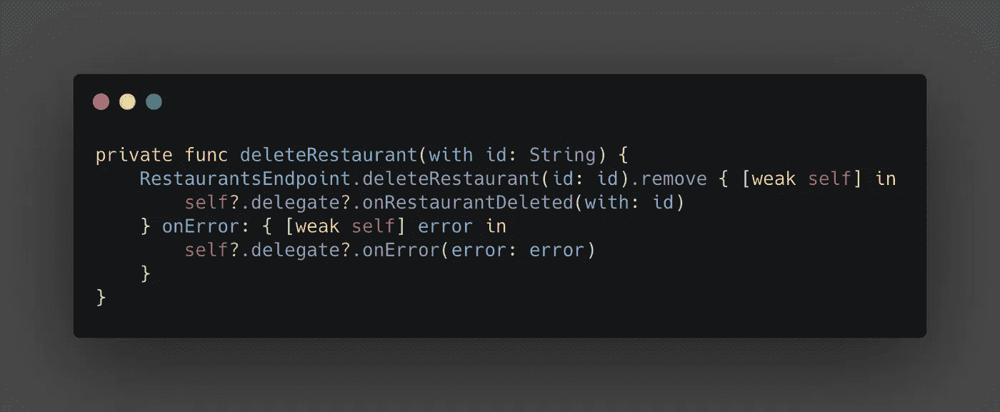

删除餐馆

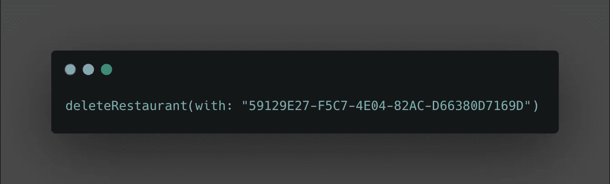

删除餐馆的用法

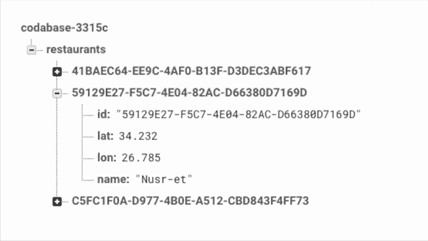

删除的结果

# 结论

我们几乎满足了包装的所有要求。从现在开始，我们可以创建端点并使用**可编码的**而不使用样板代码。

# 丰富

尽管这种包装看起来很完美，但它仍然需要改进，因为它太新鲜了。我们不能满足的唯一要求是这个包装器不支持原始 Firebase 数据库 API 的所有功能。我们应该扩展它，以获得官方 API 的全部功能。我在下面放下了 Git 存储库。所以你可以克隆它，随心所欲地改进它。

# 链接

 [## oguzparlak/FirebaseWrapper

### 此时您不能执行该操作。您已使用另一个标签页或窗口登录。您已在另一个选项卡中注销，或者…

github.com](https://github.com/oguzparlak/FirebaseWrapper/tree/main/Firebase)