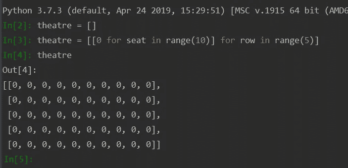
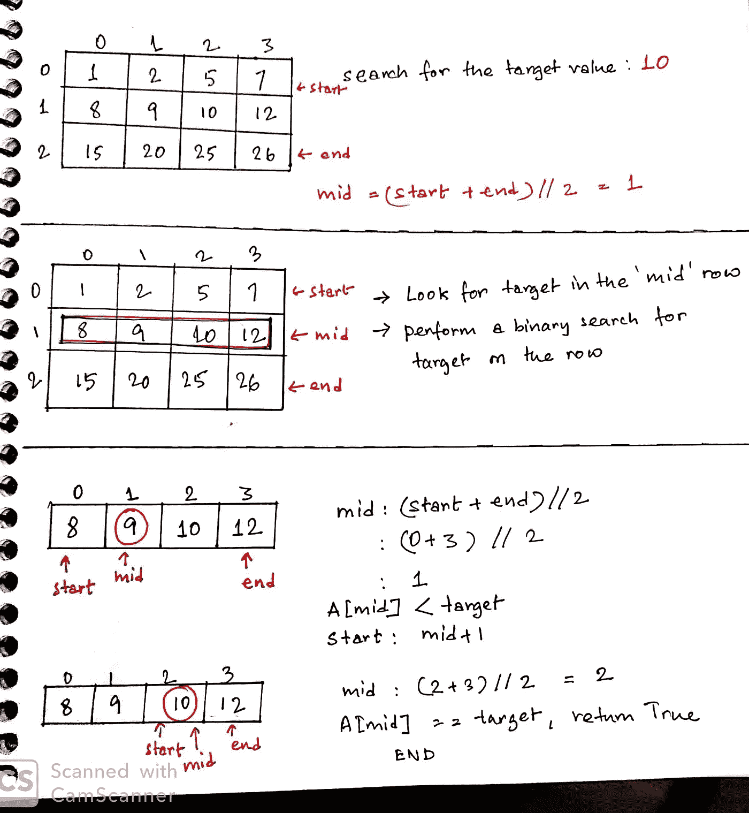

# 为矩阵让路——解决 2D 阵列编码问题的完整指南

> 原文：<https://levelup.gitconnected.com/make-way-for-the-matrix-a-complete-guide-to-solving-2d-array-coding-problems-725096d122d9>


乔希·里默尔在 [Unsplash](https://unsplash.com?utm_source=medium&utm_medium=referral) 上的照片

大多数矩阵问题乍一看可能令人生畏。然而，它们根本没有那么难解决！在本文中，我将分解解决这些问题的步骤，首先概述矩阵及其使用方法。

重要的事情先来！让我们大致了解一下什么是矩阵。

> 什么是矩阵？

来自维基百科的定义:“在数学中，一个**矩阵**(复数**矩阵**)是一个由数字、符号或表达式构成的矩形*数组*，排列在*行*和*列中。”*

在大多数地方，术语矩阵和二维数组可以互换使用。二维数组可以完全像矩阵一样工作。二维数组可以被视为由行和列组成的表格。

# 矩阵的例子


# 现实生活中我们在哪里看到矩阵

*   主要是在数据库系统中，表中的数据存储在特定行和列的交叉点上。
*   在图形中矩阵代表像素。
*   在电影售票系统(row-seat-number)或任何使用行列识别座位的订票系统(公共汽车/火车/航空公司)中。

# 初始化和遍历

2D 数组表示为列表的列表。每个列表通常代表一行，列表的每个元素代表一列。在本例中，我们将设置一个 5 排座位的剧院，每排 10 个座位。


初始化 2D 数组

以上也可以通过嵌套列表理解来实现:



用列表理解初始化 2D 数组

假设，现在我们需要通过设置值 1 来更新最后 2 行已预订。这是怎么做的:


更新 2D 数组

# 热身问题

既然我们已经介绍了基础知识，让我们从一个简单的问题开始。

## 转置矩阵

转置矩阵就是用矩阵的列值交换矩阵的行值。

```
For every cell result[i][j] we need to replace the value with  input[j][i] 
where input is the matrix to be transposed and 
result is the placeholder for the transposed matrix
```

以下是演练:


矩阵转置

代码如下:


matrixTranspose.py

继续——至*搜索和更新*矩阵。

[**74。搜索 2D 矩阵**](https://leetcode.com/problems/search-a-2d-matrix/)

在这个问题中，我们需要在一个排序的矩阵中搜索一个值。排序矩阵本质上意味着单元格 A[i][j]的值将总是大于它前面所有单元格的值。


投入和预期产出

**解决方案 1** :解决这个问题的强力方法是遍历每一行和每一列，直到我们找到目标元素或者到达矩阵的末尾。

搜索矩阵—暴力

然而，这是 O(M*N)并且不利用问题描述中提供的矩阵的任何结构信息。

我们怎样才能做得更好？在矩阵中，一行中的每个元素都被排序，并且所有行都按升序排序。我们用什么来搜索排序数组中的值呢？进入**二分搜索法**！

**Solution2** :初始化 start 为 0，end 为 M-1，其中 M=行数。找到中间的行，然后应用二分搜索法在该行中搜索目标元素。如果找到了目标元素，则返回 True，否则根据需要修改中间行，并继续搜索，直到 start ≤ end。因此，外部二分搜索法搜索行，而内部二分搜索法搜索行内的元素。以下是演练:



二分搜索法解决方案演练

这是代码:

搜索矩阵—二分搜索法

**解决方案 3** :如果我们仔细观察矩阵，有一个更简单的解决方案。注意，当我们在行中向左移动时，*元素变小，当我们向下移动一列时，*元素变大。利用这些信息，我们可以遍历矩阵，根据某个单元的值改变方向。以下是演练:


搜索矩阵—使用方向

代码如下:

使用方向搜索矩阵

**注意**:我们不是从矩阵的左上*开始，而是从右上*开始。为什么？因为，如果我们从左上角开始遍历，我们可以向右移动或向下移动，在这两种情况下，值只会增加。

[**240。搜索 2D 矩阵二**](https://leetcode.com/problems/search-a-2d-matrix-ii/)

这与前一个问题非常相似。不像前面的问题，所有的元素都被排序，这里前面的一行*可以比后面的行*有更高的值。因此，我们不能使用二分搜索法来确定搜索目标的特定行。

让我们把重点放在元素的生长方向上。值向下增加，当我们向左移动时值减小。利用这些信息，我们可以使用与上述问题相同的算法来解决这个问题。以下是演练:


搜索矩阵 II 演练

代码如下:

搜索矩阵十二

[**73。设置矩阵零点**和](https://leetcode.com/problems/set-matrix-zeroes/)

我最初解决这个问题的尝试是遍历数组，如果找到 0，那么将整行更新为 0。*坏*主意！这将丢失哪些列的值为 0 的信息。因此，在我们实际更新数组之前，我们需要维护哪些行和列包含 0 的记录。

以下是演练:


setZeroMatrix 演练

代码如下:

setZeros.py

现在让我们看看以不同的方式遍历一个矩阵:*螺旋*和*对角*。

[**54。螺旋矩阵**](https://leetcode.com/problems/spiral-matrix/)


问题输入和预期输出

**注意**:解决这个问题可以有几种方法。然而，我在这里分享的似乎是最直观的解决方案。所以我们一步一步来看。

**步骤 1** :想象我们正在手动解决这个问题，在这种情况下我们只能向 4 个方向移动:我们从**向右**开始，然后向下移动**，然后向左**移动**，最后向上**移动**(然后再次向右)。**


我们能搬到哪里去？

第二步:我们要这样做多久？看下图。


我们什么时候停止穿越

将矩阵视为在中移动的*边界之间的*收缩空间*。我们知道当这些边界相遇时，我们已经遍历了整个矩阵。*

现在我们已经讨论了前进的方向。让我们看看当我们在方向上移动时，边界是如何变化的。


螺旋运动时边界发生变化

最后，我们如何避免遍历一个我们之前已经遍历过的元素？为此，我们维护了另一个矩阵，其中存储了已经用布尔值遍历了哪些位置的信息。

这是代码

spiralMatrix1

[**59。螺旋矩阵二**](https://leetcode.com/problems/spiral-matrix-ii/)

这个问题和第一个非常相似。这里我们不需要遍历矩阵，而是需要构建一个‘n’矩阵的正方形。为此，我们首先构建一个 n*n 布尔值的矩阵来存储我们的结果矩阵，并在我们螺旋移动时不断填充它——右→下→左→上→右…直到我们填充了 n*n 的值。

以下是演练:


生成矩阵演练

代码如下:

spiralMatrix2

[498**。对角导线**和](https://leetcode.com/problems/diagonal-traverse/)


投入和预期产出

**解决方案 1** :手动解决这个问题我们可以看到我们可以在 4 个方向移动:斜向上( **DU** )、斜向下( **DD** )、向右( **R** )移动 1 步、向下( **D** )移动 1 步。

现在让我们来看看行和列的 id 是如何随着我们向这些方向移动而变化的:


对角矩阵演练

代码如下:

对角线矩阵 1

**解决方案 2** :存在一个更简单的解决方案，它依赖于这样一个事实，即对角线上每个元素的坐标之和是相同的。

下面是实现过程:

diagonalMatrix.py

谢谢你的阅读，我希望这有所帮助。以《黑客帝国》中的这句话作为结束，在解决《黑客帝国》问题或任何问题时，请记住这句话:)。

[**Neo**](https://matrix.fandom.com/wiki/Neo) :什么是母体？
[**三位一体**](https://matrix.fandom.com/wiki/Trinity) :答案就在那里，尼奥。它在找你，只要你愿意，它就会找到你。

# 资源

1.  [https://www . ICT . social/python/basics/dimensional-lists-in-python](https://www.ict.social/python/basics/multidimensional-lists-in-python)
2.  [https://www . hackere earth . com/practice/data-structures/arrays/multi-dimensional/tutorial/](https://www.hackerearth.com/practice/data-structures/arrays/multi-dimensional/tutorial/)
3.  [https://www . hackere earth . com/practice/data-structures/arrays/multi-dimensional/tutorial/](https://www.hackerearth.com/practice/data-structures/arrays/multi-dimensional/tutorial/)
4.  [https://en . Wikipedia . org/wiki/Matrix _(数学)](https://en.wikipedia.org/wiki/Matrix_(mathematics))
5.  【https://leetcode.com/】