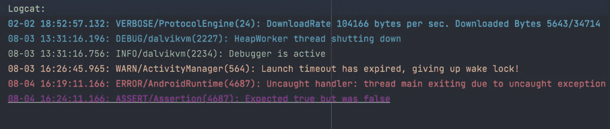

# 让你的 Android 工作室看起来棒极了🤩

> 原文：<https://levelup.gitconnected.com/make-your-android-studio-look-awesome-ec982d1e0dfe>

开发者痴迷于黑暗模式。我们有目的地将 ide 和代码编辑器的默认配色方案从标准白色更改为反色主题。

有时，我们为了好玩而玩 IDE 设置，并根据需要改变函数、类和代码的不同部分的突出显示方式。这不仅仅是为了一个令人敬畏的外观，而且我们可以快速扫描并寻找代码中的异常。

嘿大家好👋,

在本文中，我们将探索如何通过添加不同的插件、酷主题和字体来使 android studio 看起来很棒。所以事不宜迟，让我们开始吧。

**主题**

主题定义了窗口、对话框和 UI 的可视元素的外观。正确的颜色主题会让你在编码时有更好的体验。

> 要添加主题，进入**设置- >插件**。
> 
> 安装你选择的主题，然后进入**外观和行为- >外观- >选择你安装的主题**。

以下是给你的一些主题…

**Atom OneDark 主题**

**原子一号主题**

**暗码主题**

**戏剧主题**

探索**插件**中的**市场**部分，获得更多酷主题😀

**字体**

我们选择编码的字体在眼睛疲劳问题上扮演着重要的角色🙁。有时很难区分字符和标点符号。因此，我们应该选择一个好的字体来编码。

> 要更改字体，请进入**设置- >编辑器- >字体- >选择您喜欢的字体**。

我使用 **JetBrains Mono** 。

JetBrains Mono

Fira 代码

我们经常使用像(->，==，！=)在代码中。我有一个很棒的技巧给你，让**连字**有类似(- >，==，！=)代码看起来很棒，很干净。

> 要启用**连字**，请进入**设置** **- >** **编辑器- >字体- >启用连字**。

**图标**

您可以使用 [**Atom 材质图标**](https://plugins.jetbrains.com/plugin/10044-atom-material-icons) **自定义您的 IDE 和文件图标以获得更好的视觉效果。**它会根据文件类型改变图标。

**日志猫**

作为 Android 开发人员，我们使用 logcat 窗口来查看系统消息、错误或自定义消息的日志。真的很难跟进 Android logcat 输出都是相同的颜色。

> 为了让你的 logcat 更有用更棒，进入**设置- >编辑器- >配色- > Android Logcat - >更改断言、错误、详细、调试、信息、警告的前景色**

**断言** : 9C27B0

**调试** : 2196F3 或 2BBAC5

**错误** : F44336 或 EF596F

**信息** : 4CAF50 或 89CA78

**详细** : 61AFEF

**警告** : FFC107 或 E5C07B

**括号**

括号用于对许多代码语句进行分组。当你找不到你想要的代码块时，这就变得很困难。不是吗？ [**彩虹括号**](https://plugins.jetbrains.com/plugin/10080-rainbow-brackets) 为括号提供彩虹颜色，最终帮助你更好的跟踪代码块。

> 要在代码中使用彩色括号，请进入**设置- >插件- >安装彩虹** **括号**。

**Git 支持**

如果你想看到内联责备和更多 git 相关的东西，你应该试试[**git toolbox**](https://plugins.jetbrains.com/plugin/7499-gittoolbox)**插件。只需一瞥，您就可以看到您的分支提前或落后了多少次提交，跟踪未提交的更改。Git 责备显示将显示当前行的作者、日期、时间和提交主题。**

****

****GitToolBox** 会让你受益于内联责备注释。是不是很神奇？**

**你好。！！你做到了。**

**你用一些很棒很有用的 Android 插件让你的 IDE 变得很漂亮。**

**本文到此为止。如果你喜欢就给它鼓掌。**

**快乐学习，快乐发展！！！**

**注意:我不能要求 100%的内容版权。写这篇文章的灵感来自[https://blog . protein . tech/how-to-make-Android-studio-look-awesome-ee19e 3719 a 59](https://blog.protein.tech/how-to-make-android-studio-look-awesome-ee19e3719a59)**