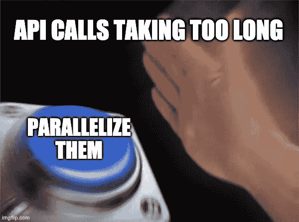
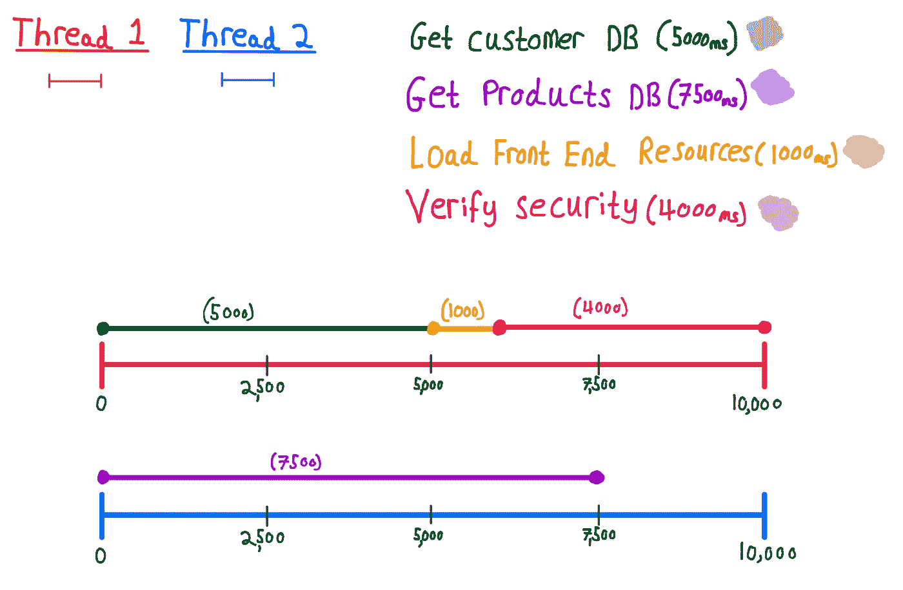

# 通过并行执行调用，让您的代码快如闪电

> 原文：<https://levelup.gitconnected.com/make-your-code-lightning-quick-by-executing-calls-in-parallel-5ddde9965d50>

## 学习创建并行异步任务



# 为什么并行工作？

在大💪，快🏃‍♂️和复杂的⁉️代码库，有大量的处理工作需要完成。同步(一个接一个)进行所有这些处理会增加时间🕐代码需要执行。

解决这个问题的一个好方法是，当这些过程彼此不依赖时，异步地执行其中的一些过程。

最佳实践包括使用线程池，并将任务包装在 Runnable(不返回任何内容)或 Callable(返回某些内容)中。

在本教程中，我们将看到如何通过创建几个虚拟服务调用并并行运行它们来加速我们的程序，使我们的代码像火箭一样飞行。


比尔·杰伦在 [unsplash](https://unsplash.com/) 上的照片

# 实现 Runnable

下面，我们将实现我所说的 Runnable 接口，在这个例子中我们不需要返回任何东西，所以我们不需要使用 Callable。

在我们的 **run()** 中，我们将打印任务的**开始时间**以及**任务名称**和**线程名称**。

然后，我们将等待适当的时间，并打印出我们的“完成”✅消息。

我们需要将这段代码包装在一个 try catch 中，因为它将在一个并行线程上执行。每当我们有运行在并行线程上的代码时，我们都有机会抛出 InterruptedException，所以我们只需添加一个快速捕捉。

# 我们的模拟应用

想象一下，我们有一个网站，需要加载一些资产才能正常工作

*   获取客户数据库，5000 毫秒
*   获取产品数据库，7500 毫秒
*   加载前端资源 1000 毫秒
*   验证安全性 4000 毫秒

按顺序执行此操作需要 17500 毫秒🙀。然而，我们可以使用并行化来加速这个过程🤓。

下图显示了如何使用 2 个线程执行这些任务。



并行完成(2 个线程)的时间是 10000 毫秒😃这几乎比同步时间快两倍。

下面是预期的输出。

```
Task started: Get Products DB on thread pool-1-thread-2
Task started: Get Customer DB on thread pool-1-thread-1
Task done: Get Customer DB after 5004ms on thread pool-1-thread-1
Task started: Load Front End Resources on thread pool-1-thread-1
Task done: Load Front End Resources after 1002ms on thread pool-1-thread-1
Task started: Verify Security on thread pool-1-thread-1
Task done: Get Products DB after 7504ms on thread pool-1-thread-2
Task done: Verify Security after 4004ms on thread pool-1-thread-1
```

# ⚠️Amdahl's Law⚠️

现在有一个极限，这个极限可以加速你的代码，这个原理叫做阿姆达尔定律。公式是

```
(Total work)/(Largest work that must be done in sequence)
```

在我们的示例中，这将是(17，500)/(7，500) = 2.333。

因此，我们可以通过使用并行化实现 2.333 倍的加速比。(为了达到这个速度，我们需要增加更多的线程)。