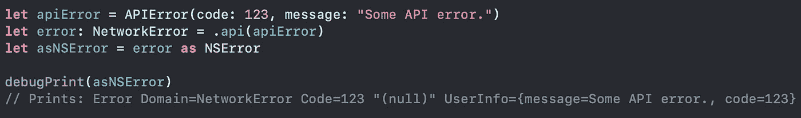

# 使您的自定义错误 NSError 可转换

> 原文：<https://levelup.gitconnected.com/make-your-custom-errors-nserror-convertible-86ebafa306ef>

最近我在写一个网络层，结果像往常一样创建了 **NetworkError** :使用 enum 来指定可能的错误类型。

大概是这样的:

这没有问题，但是由于我必须通过我的 logger 模块发送一些错误日志，我想要一个简单的方法来获得我需要的所有信息，而不必向它发送特定的类型。

我想:“当我需要更多关于系统错误的信息时，我通常会尝试将它转换成 **NSError** …如果我也能处理我的错误呢？”

然后我找到了 [CustomNSError 协议](https://developer.apple.com/documentation/foundation/customnserror)。

使用 **CustomNSError** 协议，可以简单地将对象类型转换为 **NSError** 。为了做到这一点，我们必须符合它并实现所需的逻辑，以返回协议中指定的与 **NSError** 相关的属性。

使用这种方法，我们的示例错误将如下所示。

然后有可能这样做:

# **结论**

从现在开始，您可以像 Swift APIs 一样在上层处理您的错误，以您已经习惯的方式更容易地从它们那里获得更多信息。