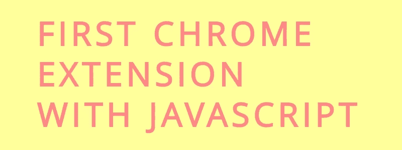
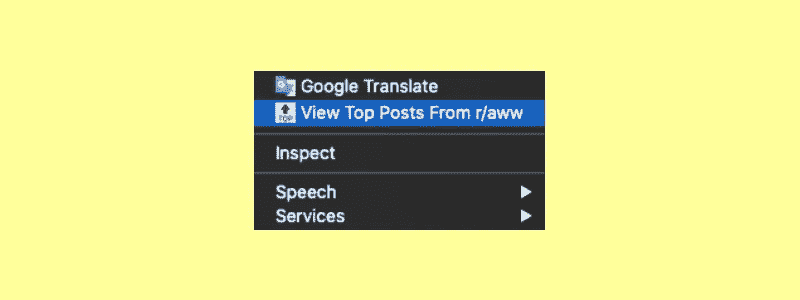
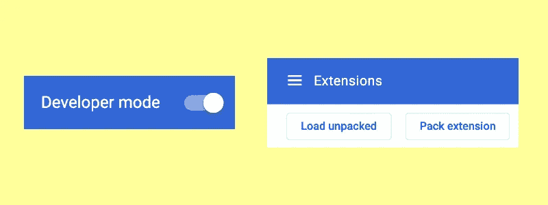
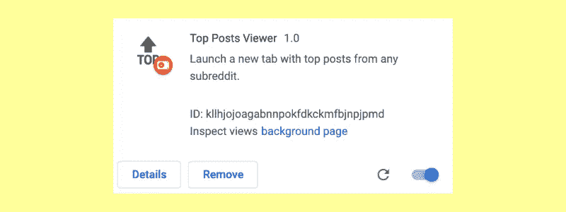
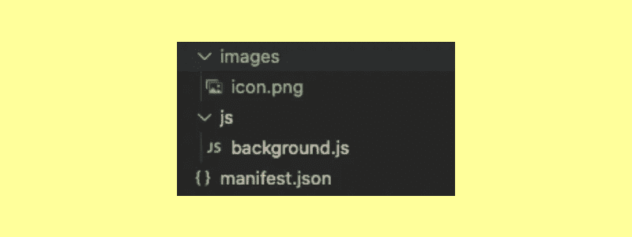
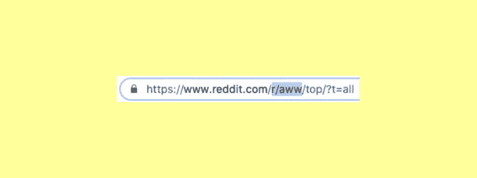

# 用 JavaScript 制作你的第一个 Chrome 扩展

> 原文：<https://levelup.gitconnected.com/make-your-first-chrome-extension-with-javascript-7aa383db2b03>



Chrome 扩展是个性化你的浏览器体验的一种有用的方式，对于初学者和有经验的程序员来说，制作自己的浏览器是一个很好的周末项目。

## 基础知识

在本教程中，我们将通过一个简单的扩展来帮助 Reddit 上的一个简单任务实现自动化。在选择任何子编辑后，我们的扩展将提供一个选项，直接启动一个新标签到那个子编辑的**有史以来最热门的帖子**。



当用户右键单击时，他们会得到这个选项。革命性的？不完全是，但是这个扩展演示了一些基本的特性，可以用许多不同的、更强大的方式进行修改和构建。

**你可以在这里** **查看整个项目的 GitHub，并随意复制和修改它。**

让我们开始吧。

# 第一部分|为 Chrome 添加扩展

首先，转到 **chrome://extensions** ，你可以直接在 chrome 搜索栏中输入或粘贴。在右上角，将会有一个打开**开发者模式**的选项。去吧。



将会出现一些新的特性，包括一个选项 **Load unpacked** ，你可以用它来导入一个包含新扩展名的文件夹。在本教程结束时，我们的项目将如下所示:



然而，你不必等到你完成“解包”你的扩展到 Chrome。事实上，一旦你把一些文件放到你的项目文件夹中，你就可以测试一下，看看它们是如何运行的。

也就是说，让我们开始进行扩展。

# 第二部分|编写程序

一个基本的 chrome 扩展有三个部分；一个**图标图片**，一个 **background.js** 文件，一个 **manifest.json** 。除了清单之外，它通常是独立的，我们可以将另外两个组织成如下这样的目录:



从技术上讲，我们根本不需要使用目录。但是，实践良好的组织并不是一个坏主意，尤其是如果您计划以后开发自己的更复杂的扩展。

现在，让我们看一下 manifest.json。

## 正在添加清单。

文件告诉 Chrome 关于我们的扩展的关键信息，它的不同部分，以及如何处理每一部分。让我们来看看。

```
"manifest_version": 2,"name": "Top Posts Viewer","version": "1.0","description": "Launch a new tab with top posts from any subreddit.",
```

除了记得使用`“manifest_version”: 2`(第一个版本不再被接受)，其他的都是不言自明的。我们的扩展需要一个`name`、一个`version`(以防我们决定在 Chrome 网络商店中提交和更新)，以及一个关于它做什么的简短`description`。

之后，我们需要告诉 Chrome 我们的项目需要访问的任何特殊信息。对于这个项目，有两件事:

```
"permissions": [ "contextMenus", "tabs"],
```

一个**上下文菜单**是当你在浏览器中右击某个东西时出现的菜单。为了给那里的用户添加一个选项，我们需要请求修改它的权限。此外，由于我们想在浏览器中启动一个新标签，我们需要访问**标签的权限。**

从那里，我们现在必须告诉 Chrome 我们项目的脚本。我们只有一个，位于 **js** 目录，所以看起来是这样的:

```
"background": { "scripts": ["js/background.js"]},
```

现在，我们要做的就是解释如何处理我们的图标图像。

```
"browser_action" : { "default_icon" : "images/icon.png"},"icons": { "16": "images/icon.png", "32": "images/icon.png", "48": "images/icon.png", "128":"images/icon.png" }}
```

`default_icon`出现在扩展工具栏中，其他图标出现在 Chrome 网络商店的不同部分。对于一个更专业的项目，你应该包括不同大小的图标以获得更好的分辨率，但对于这个项目，我只是用了同一个。

以上介绍了清单，所以让我们来看看主 JavaScript 文件。

## 添加背景脚本

一个**后台脚本**监听浏览器中的关键事件或动作，并对特定代码做出反应。这是我们的程序实际运行的地方，我们需要它做一些关键的事情。

首先，我们想在**右键单击**上下文菜单中添加一个可选元素。在 **background.js** 的最顶端，我们可以添加:

```
chrome.contextMenus.create ({ "title": "View Top Posts From This Subreddit", "contexts": ["selection"], "onclick": openTab()});
```

属性将出现在菜单中，还有来自我们的 **manifest.json** 文件的图标。接下来，`contexts`解释了我们希望捕获选定的文本(对我们来说是 subreddit name)。最后，`onclick`告诉 Chrome 当有人选择我们的上下文菜单元素时该做什么。

在这种情况下，我们想要调用函数`openTab()`，我们将需要在下面编写这个函数。该功能将实际打开链接到所选子编辑的**前几篇文章**的新标签。它看起来会像这样:

```
function openTab(){ return function(info, tab){ let text = info.selectionText; let redditLink = "https://www.reddit.com/" + format(text) +     
        "/top/?t=all" chrome.tabs.create ({index: tab.index + 1, url: redditLink, 
        selected: true}); }};
```

如果您想知道为什么我们的函数会立即调用另一个函数，这是一个[巧妙的技巧](https://www.tutorialfor.com/questions-52879.htm)，可以避开通常允许后台脚本使用的有限信息。这样，我们不需要任何额外的 JS 文件。

这样一来，我们要做的第一件事就是将选定的 subreddit 名称存储在一个名为`text`的变量中。



然后，我们可以将变量放入上面的 URL，这将把我们带到任何子编辑的**有史以来最热门的帖子**。但是首先，我们将通过一个我们称之为`format()`的函数快速传递`text`。

```
function format(subName){ if (subName[0] === "r" && subName[1] === "/"){ return subName } else { return "r/" + subName }};
```

有时 Chrome 在右键单击时省略了“r/”,所以这个函数确保我们在 URL 中放置了一个具有正确格式的子编辑名称。如果“r/”没有被正确选择，它会自动将其添加到一个名为`redditLink`的新变量中。

现在我们有了正确的链接，最后一步是创建新的选项卡。回到上面的`chrome.contextMenu.create` ，我们将使用`tab.index + 1`创建一个新的选项卡，并提供`redditLink`作为它打开的 URL。最后，通过`selected: true`，Chrome 将把用户带到该子编辑的**有史以来最热门的帖子**，他们可以浏览。

# **第三部分|后续步骤**

现在我们已经有了一个功能齐全，尽管相对简单的 Chrome 扩展，我们终于可以提交给 **Chrome 网络商店**。

但在此之前，有很多方法可以使用这个扩展，并将其作为构建自己的扩展的基础。更复杂的扩展甚至可以使用 HTML 或 CSS 来弹出窗口、动画等。你能做的真的很多。

去吧。:)