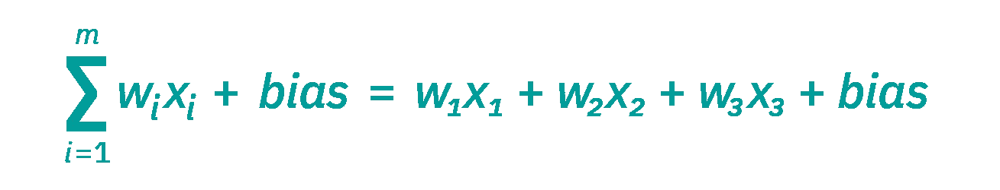

# 使用 TensorFlow 构建您的第一个神经网络！

> 原文：<https://levelup.gitconnected.com/make-your-first-neural-network-with-tensorflow-f4571dc0f58e>

## 不需要经验！


照片由 [Alina Grubnyak](https://unsplash.com/@alinnnaaaa?utm_source=medium&utm_medium=referral) 在[unplash](https://unsplash.com?utm_source=medium&utm_medium=referral)上拍摄

# 包和设置

我们只需要 TensorFlow 和 NumPy。

```
**# In terminal or command line:**pip install tensorflow
pip install numpy**# Or, if you are in a Colab notebook (to install) :**! pip install numpy! pip install tensorflow**# In project:**import numpy as np 
import tensorflow as tf
from tensorflow import keras
```

我们使用的是 TensorFlow 的最新版本，TensorFlow 2.0。

# 什么是神经网络？

神经网络使用数据来随着时间的推移改善自己。他们就像几代人一样，随着时间的推移会逐渐变好。每个节点都有其输入数据、权重、偏差和输出，其公式如下所示:



来源:[https://www.ibm.com/cloud/learn/neural-networks](https://www.ibm.com/cloud/learn/neural-networks)

我将非常简要地介绍这些概念，但是如果您想了解更多信息。我强烈推荐这些资源:

*   [5 分钟神经网络|通过:simple learn](https://www.youtube.com/watch?v=bfmFfD2RIcg)
*   [神经网络类型| By:databrick](https://databricks.com/glossary/neural-network)
*   [但什么是神经网络呢？|作者:3Blue1Brown](https://www.youtube.com/watch?v=aircAruvnKk)

# 生成数据

让我们定义我们的数据集。

我们可以用一个线性方程`y = mx + b`来建立一个方程，为我们的阵列提供一个模式。

假设`y = 9x + 2`，现在我们可以用这些值代替另一个值。

例如，

`x = 1, y = 11`、 `x = 2, y = 20`、`x = 3, y = 29.0`。

我们将把它存储在一个 NumPy 数组中。

```
xs = np.array([1.0, 2.0, 3.0, 4.0, 5.0, 6.0], dtype=float)ys = np.array([11.0, 20.0, 29.0, 38.0, 47.0, 56.0], dtype=float)
```

# 定义我们的模型

有趣的部分！

在这种情况下，我们将使用顺序模型。这将一个线性堆叠的层组成一个张量流模型。但是，这仅适用于具有一个输入张量和一个输出张量的情况，这就是我们现在所拥有的。

```
model = tf.keras.Sequential(
[keras.layers.Dense(units=1, input_shape=[1])]
)
```

`input_shape=[1]`我们的数据只有一个输入，一个值。

`units=1`这是我们唯一的一层，所以我们只需要 1 个神经元/细胞。

我们现在需要编译我们的模型，我们可以使用随机梯度下降或`SGD`作为我们的优化器。这样，我们可以分析和更新我们的模型，并以更快的速度改进它。

我真的很喜欢 Sujan Dutta 解释它的方式:

*“假设你做了一个应用程序，想通过收集 100 个客户的反馈来改进它。你可以用两种方法来做这件事。在第一种方式中，你可以将应用程序交给第一个客户，然后将他的反馈交给第二个客户，然后是第三个，以此类推。从他们那里收集反馈后，你可以改进你的应用程序。但是第二种方式，你可以在得到第一个客户的反馈后，马上对 app 进行改进。然后你把它给第二个，在给第三个之前你又提高了一次。请注意，通过这种方式，您可以以更快的速度改进您的应用程序，并且可以更早地达到最佳状态。”*

我们可以通过误差平均值的平方来计算损失。

```
model.compile(optimizer='sgd', loss='mean_squared_error')
```

## 让我们训练我们的模型！

我们通过用数据拟合模型来训练模型。

```
model.fit(xs, ys, epochs=100)
```

您可以增加/减少时期以获得不同的结果。

运行它会用这些数据填满您的终端

```
Epoch 1/100 1/1 [==============================] - 0s **x** ms/step - loss: **x**
```

这种损失表明模型的预测在单次迭代中有多大缺陷。

在我的训练中，我在第一个纪元的损失大约是 1480，但是到第 100 个纪元时，我的损失下降到了惊人的 0.030！

# 做预测

我们可以通过调用`model.predict()`简单地调用我们的模型来预测一些事情。

我试着预测 10 个。

```
print(model.predict([10.0]))
```

我们可以通过将它代入我们前面提到的等式`y = 9x + 2`来找到实际的答案。

我们会发现准确的输出应该是 92。

模特会怎么想？

原来，真的很近！

模型预测 91.8272，刚好差 92。

# 完成的代码:

# 结论

谢谢！

我希望你喜欢读这篇文章，并且它教会了你更多关于张量流和神经网络的知识。如果您有任何问题、建议、一般反馈或您的代码不工作，请在评论中提出！

继续编码！