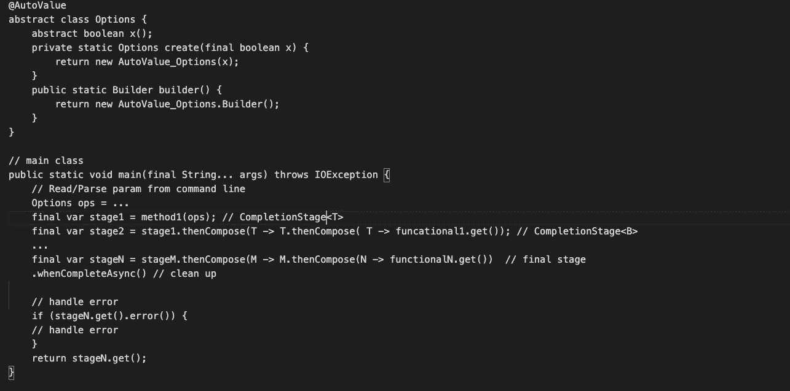

# 让您的 Java 代码完全异步

> 原文：<https://levelup.gitconnected.com/make-your-java-code-fully-async-369efa3b0f23>

## 为什么我们的代码需要异步运行，如何实现？

2021 年 1 月的斯德哥尔摩，作者

作为一名十多年的开发人员，大部分时间都在使用 Java，我花了相当长的时间来适应 Spotify 的代码约定，如下所示。

简单的代码结构。

这一小段代码代表了公司里的 Java 代码转换，用`CompletionStage`和`AutoValue`构建异步代码。

在下面的文章中，我将描述我理解它们的方式，给出使用它们的例子，最后解释为什么。

关键要点:

*   知道为什么我们应该放弃并发编码而拥抱异步编程。
*   用 AutoValue 实践不可变模式。
*   通过与 Stream 的比较来学习 CompletionStage APIs。
*   掌握 Java 中不同的函数接口类型。
*   理解使用 CompletionStage 进行异步编程的优缺点。

# 并发还是异步？

Java 一直被认为是一种安全的高级语言，它提供了各种 API 来支持锁定、并发甚至异步编程。作为对异步特性的探索，`Future`最初是在 JDK1.5 中引入的。但更像是一种伪异步，当 JavaScript、Node.js 等其他语言已经通过使用回调支持完全异步时，它并没有让开发人员免于等待。

这种尴尬的局面直到`CompletableFuture`和`CompletionStage`在 JDK 1.8(被认为是全球最受欢迎的 JDK 版本)发布才结束。

在我们详细讨论异步编程之前，有必要讨论一下并发性。众所周知，人们只有在编码中处理共享数据时才会用到并发。但是正确使用它并不容易，无论是在辨别正确的时间还是掌握并发 API 方面。

Java 中有很多解决方案，不限于`synchronized`关键字、并发集合、[原子](https://www.ibm.com/developerworks/java/library/j-jtp11234/)，以及隐藏复杂逻辑的各种锁，比如 [CAS](https://en.wikipedia.org/wiki/Compare-and-swap) 、[内存屏障](https://en.wikipedia.org/wiki/Memory_barrier#:~:text=A%20memory%20barrier%2C%20also%20known,and%20after%20the%20barrier%20instruction.)和 [CPU 缓存](https://en.wikipedia.org/wiki/CPU_cache)。然而，普通开发人员仍然需要花费数年时间来理解这些库，发现不同用例之间的差异，并在出现性能问题时进行调试。相信我，你不可能完全避免错误和性能问题。

我认为没有人喜欢编写充满锁或`synchronized`的代码，这不仅对从事这项工作的人来说是一项艰难的工作，对任何继任者来说也是一种折磨。因此，聪明的开发人员想出了克服障碍的方法:无锁编程，也称为[非阻塞](https://en.wikipedia.org/wiki/Non-blocking_algorithm)，有些人可能知道或者至少听说过。我就不深究了，用一句话总结一下。它使用原语或其他底层技术来克服障碍，并在顶层实现无锁。

老实说，我远不是并发编程主题的专家，但是我知道如何避免落入陷阱。**不要使用并发！**那么，如何？

实际上，如果开发人员遵循一些原则，他们的代码很有可能是并发自由的。下面是三个简单的规则:

*   **不共享数据**
*   **使用不可变的数据结构**
*   **写幂等码**

记住这一点，不修改数据，那么就不需要锁。然而，人们无法抗拒快捷方式的诱惑，因为通过编写`var a = 2; a = method(a)`来更新变量是如此容易。因此，我们寄希望于[不变的构建模式](https://en.wikipedia.org/wiki/Builder_pattern)来阻止开发者。

> 构造后状态不能改变的对象称为不可变对象。

来自 Google 的 [AutoValue](https://github.com/google/auto) lib 是实践[不变模式](https://lkumarjain.blogspot.com/2016/02/immutable-design-pattern.html)的绝佳选择。

AutoValue 使用一个 builder 来构造一个对象实例，每个字段只有一个 getter，没有 setter。典型的自动赋值示例如下:

自动赋值人员对象

为了加速编码，eclipse 和 IntelliJ 都有支持的插件。

如果你想了解更多关于 AutoValue 的信息，请参考这篇[文章](https://github.com/google/auto/blob/master/value/userguide/index.md)。我不能做得比它更好。

尽管不可变模式确实有它的好处，但它还不足以取代并发性。弥补缺陷的一个方法是让你的代码幂等。在当今的架构中随处可见，幂等元是微服务中最重要的角色之一。不同的模块通过 REST APIs 或者 RPC 方法调用其他的，无论尝试多少次都不影响最终结果。

# 异步编程

开发人员希望他们的代码尽可能快地运行，这是人们开始使用并发性的原因之一，将任务分成子任务，并最大程度地探索多核 CPU 的能力。

当我们采用不可变模式时，数据可以被复制，因此需要更多的内存和 CPU 资源，程序会变慢。是我们转向异步编程的时候了。

> 异步编程是并行编程的一种方式，其中一个工作单元独立于主应用程序线程运行，并通知调用线程其完成、失败或进度。—来自[异步编程。网络](https://visualstudiomagazine.com/articles/2011/03/24/wccsp_asynchronous-programming.aspx#:~:text=Asynchronous%20programming%20is%20a%20means,its%20benefits%20and%20problem%20points.)

异步编程最常见的例子是我们在 JS REST API 调用中使用回调。

单击添加事件句柄

在 Java 中，`CompletionStage`是实现全异步编程模式的核心，`CompletableFuture`是其实现。让我们看一个简单的例子。

简单完成阶段代码

在 Spotify，我们从一开始就使用`CompletionStage`构建代码，贯穿每个方法，并最终返回具体的对象。

如果你缺乏使用`CompletionStage`或函数式编程的经验，事情会比看起来更难，如果你误用了 API，事情会变得更糟。为了熟悉它，我花了几个月的时间研究和重构了几十个反复审查的 PRs。

本质是管道。因此，找出从头到尾使用所有 API 和函数接口用`CompletionStage<?>`构建管道表单的方法是非常重要的。

首先，我们需要掌握 API。`CompletionStage`有 30 多种方法，掌握所有这些方法是一个很大的挑战。但是如果你习惯使用 Java `Stream`，通过与`Stream` API 比较就很容易理解`CompletionStage`。下面是一个图表，列出了一些常用的 API 进行比较。

流 API 与完成阶段 API

我将 API 分为四大类。

*   建设
*   中间的
*   接触
*   结束的

**构建操作**是关于如何创建`Stream`或`CompletionStage.` `Stream`通常是从一个数组或集合 API 中生成的，而`CompletionStage`依赖于它的实现者`CompletableFuture`来完成这项工作。

**中间操作**常指输入突变。所有的方法都由一个`Stream`或`CompletionStage`包装，接受一个`Function`对输入进行一些处理并返回一些不同的东西。

**触点操作**在`CompletionStage`中很常用，但在`Stream`中不常用。`CompletionStage`有方法接受四种不同的函数式编程接口，并确保几乎所有的行为都得到支持。稍后我会展开它。

**终止操作**，与以上三类相比，不太相似。我们习惯于通过将一个`Stream`变成一个收藏或遗产`foreach`来结束它。至于`CompletionStage`，它没有`Stream`那么多的终止方法，它的大部分方法都返回一个`CompletionStage`，希望流水线永远不要结束。

除了这四个组，`CompletionStage`还有两种额外类型的 API。

*   那些**自然支持异步**的。一个 API 方法通常有三个转换，支持异步和带有执行器的异步。

三种相同功能的 API

*   **支持错误处理**的。在`CompletionStage`和`CompletableFuture`中都有支持异常、失败和超时的 API，这对控制流程非常有用。

在 CompletableFuture 中处理 API 时出错

虽然`Stream`和`CompletionStage`有一些共同之处，但它们在范围上有很大不同。`Stream`非常有限，仅用于采集操作。然而，`CompletionStage`包含了任何操作，给了开发者更多的自由——我们几乎可以在任何环境下构建、组合、联系、变异。想象一下，你输入 A 和 B，下一步得到 C，异步运行另一个任务，最终，你得到 d。

我自己烤饼干！

这些操作可以是你能想到的最复杂的，所以试着自己练习一下。

## 功能 P **编程**

使用`CompletionStage`的最佳实践是构建一个贯穿整个程序的管道，并最终返回一个特定的结果或错误。

为了实现这一点，我们需要深入研究函数式编程。您可能已经注意到，我在上表的联系操作部分突出了四个功能接口，它们是构建管道的真正核心和灵魂。

> **函数式编程**是一种编程范式——一种构建计算机程序结构和元素的风格——将计算视为数学函数的评估，避免改变状态和可变数据— [维基百科](https://en.wikipedia.org/wiki/Functional_programming)

从不同角度和语言阐述函数式编程的文章比比皆是，您可能想知道为什么突然每个人都在谈论它。答案是我们想要简单性回归。

看看你的代码。

*   它有包含数百行的功能吗？
*   它有包含复杂逻辑的大 for 循环吗？
*   你被逼疯了去调试或者重构吗？

如果答案是肯定的，你可以考虑应用函数式编程。

回到正题，我想在这里简单解释一下功能接口。在 JDK8 中引入，它们有`@Functioninterface`注释，通常每个只有一个抽象方法。它们在 Java 中最重要的作用是提供多上下文环境中的转换。根据数学概念，它们分为两种类型，**一元**和**二元**函数。

*   一元函数包括`Function<T, R>, Consumer<T>, Supplier<T>, Predicate<T>, UnaryOperator<T>.`
*   二进制函数包括`BiFunction<T, U, R>, BiConsumer<T, U>, BiPredicate<T, U>, BiOperator<T>.`

我一直在思考如何更好地解释函数接口。当然，我可以像在许多其他文章中一样通过例子来说明，但是我确信包含一些关键因素的表格和不同界面之间的比较更实用。

一元和二元函数接口

`Consumer`和`Supplier`接口很容易通过名字得到，不管是一元的还是二元的。`Consumer`接口运行一个没有返回类型的动作**，因此它们将所有的东西传递给`Void`。`Supplier`接口被认为是生成器，在那里`Stream<T>`或`CompletionStage<T>`开始。**

`Function<T,U> and Function<T,U,R>`接口广泛用于不同方法之间的组合和传输，使管道保持活动。

如果你仍然对我的表感到困惑，在这里阅读一些代码示例[可能会有所帮助。再次回到表中，你会对函数接口有进一步的理解。](https://examples.javacodegeeks.com/java-functional-interface-example/)

`CompletionStage`API 大量使用`Consumer`、`Function`、`BiFunction`。因此，关键是如何根据代码的行为将多个阶段组合成一个阶段。我参与的一个项目就是一个很好的例子，它需要读取包含多个资源文件(比如服务、部署和 HPA)的 Kubernetes 文件夹，使用 [fabric8 KubernetesClient 库](https://github.com/fabric8io/kubernetes-client)将它们应用到客户端，返回结果或错误。为了简化，我把它分成四个阶段:

*   读取目录；
*   向客户端进行身份验证；
*   应用资源的 Yamls
*   最后，回归。

同时，所有代码通过`CompletionStage`异步运行。

这是四个阶段之间的一个简单的`CompletionStage`转换图。

划分任务阶段

限于文章范围，我这里只粘贴一些关键代码。

*   `ApplyResource`作为主要阶层和入口。

*   为了在阶段之间传递不同的结果，我使用了一个`Pipeline<T>`类。这里`T`是魔法发生的地方！

*   `readFiles`方法。流水线从这里开始并返回一个`CompletionStage<Pipeline<Stream<Path>>>.`

*   `authenticate`方法。这个方法的结果与前面的`readFiles`方法完全无关，所以我们需要将两个结果都转换成一个新的`FileAndAuth`对象，并将其(`Pipeline<FileAndAuth>`)带入下一个阶段。

*   下一步是用 Kubernetes 客户机应用带有身份验证信息的所有配置，并最终返回一个`Pipeline<Result>`。

*   最后，我们可以处理错误或返回结果。

以上的概念和 API 对于一个新手来说可能有点不知所措，我再分享一个小技巧，就是记住 API 的 param 类型——Runnable 类型，忽略计算结果。

`**Consumer**` **是纯消费计算结果；** `**BiConsumer**` **融合了另一种** `**CompletionStage**` **的纯粹消费；** `**Function**` **转换计算结果；** `**BiFunction**` **结合另一个** `**CompletionStage**` **的计算结果进行换算。**

# 异步编程的优势

如上所述，使用`AutoValue`和`CompletionStage`来构建一个完全异步的程序是 Spotify 的工作方式。关于为什么这样选择，我从我的角度列举了四个原因。

*   **安全**

不可变数据模型将开发人员从对并发处理、死锁、糟糕的性能和其他复杂情况的担忧中解放出来。

*   **更容易变异**

不可变的数据模型和所有的功能接口使得改变数据更加容易。任何东西都是复制的，不是更新的。不再有内存障碍或锁，而是简洁易读的代码。关于函数式编程的更多优势，在这里阅读更多[。](https://alvinalexander.com/scala/fp-book/benefits-of-functional-programming/)

*   **性能**

至于程序性能，`CompletionStage`使程序能够利用多核 CPU，摆脱管理线程的负担。与多线程相比，异步显得更加轻量级。此外，工作效率也得到了提高，因为`CompletionStage`比并发代码对开发人员更友好。

*   **可扩展性**

让你的服务保持无状态，让它幂等。为什么？因为您的代码比其他代码更易于扩展。主要的云提供商都支持通过 Kubernetes 进行自动伸缩，这很适合这种情况。您的程序变得更加云友好！

# 需要改进的地方

没有什么是完美的，这种代码模式也是如此。我在练习中遇到一些麻烦。

*   很难写

“丑陋的”代码和优雅的代码都可以运行并达到结果。但是后者更具挑战性，除非你有多年的实践经验并对 API 有深刻的理解。

*   难以编写测试

开发人员花三分之二的时间编写测试，在这种情况下你甚至需要更多的时间，因为异步代码总是很难测试。

无论如何，在我与 AutoValue 和`CompletionStage`的旅程中有苦有甜。听起来我有自己的选择。🤷‍♀️

# 可供选择的事物

其实已经有很多开放框架采用了这种异步编程模式，比如 [Play](https://www.playframework.com/) (一种无状态的 web 框架)[quar kus](https://quarkus.io/)(Kubernetes Java 客户端)[莴苣](https://lettuce.io/)(非块 Redis 客户端)等。

因此，如果你真的很难开始自己构建东西，那么选择一个合适的库来帮助你开始并从中吸收必要的编码技能。最终，用自己的方式编写完全异步的代码。

# 待续

读完这篇文章后，也许你看到了异步编程的好处，迫不及待地想实践它。我希望我的`CompletionStage`学习方法可以帮助你。

我计划详细说明`CompletionStage`的内部实现，并在将来提供更多的想法。

如果您有任何建议或问题，请留言。

感谢阅读！