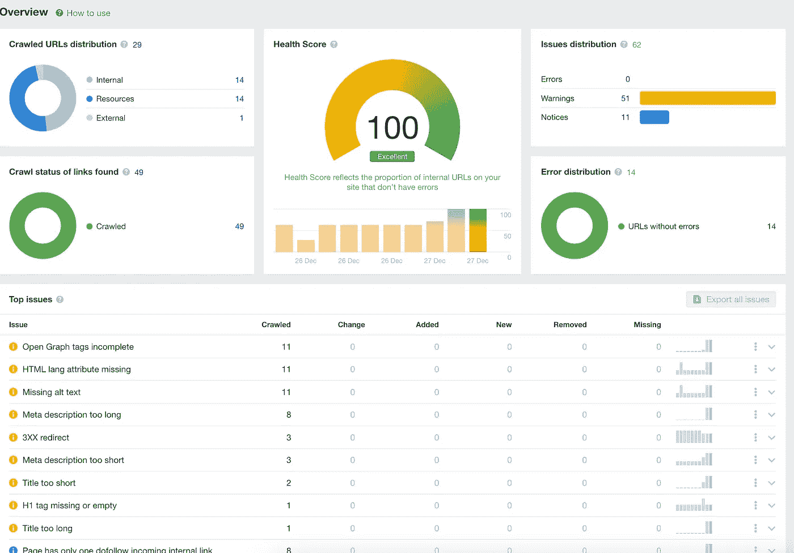
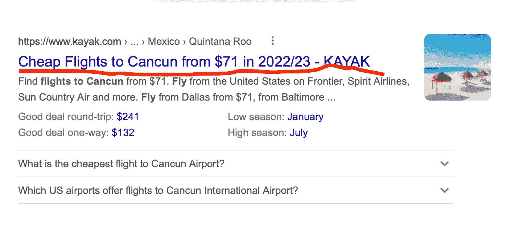

# 使用动态路线使您的 Next.js 应用程序 SEO 友好

> 原文：<https://levelup.gitconnected.com/make-your-next-js-app-seo-friendly-with-dynamic-routes-71e0fd1adb92>


js 是一个流行的框架，用于构建服务器呈现的 React 应用程序。Next.js 的一个关键特性是它能够根据运行时获取的数据动态呈现页面。这意味着页面的数据不依赖于要加载的组件。加载页面的额外时间会影响 SEO，因为它会呈现空内容。

首先，我们需要让我们的应用程序知道这些动态路线，以便我们的 SEO 数据可以被 web 浏览器和搜索引擎机器人看到。

我们将使用函数`getStaticPaths`来生成动态 URL。

```
export const getStaticPaths = async () => {
  const url = 'https://api-url/posts'
  const res = await fetch(url); // raw response
  const posts = await res.json(); // turns it into readable data

  // maps through all the posts and return the string of our endpoint using the route param (post.slug)
  return {
    paths:posts.map((post) => `/blog/${post.slug}`) || [],
    fallback:false
  };
}
```

当你用像[尖叫的青蛙](https://www.screamingfrog.co.uk/seo-spider/)或 [Ahrefs](https://ahrefs.com/) 这样的工具进行搜索引擎优化扫描时，你将能够在运行你的构建时看到这些链接。您还可以使用您的`robots.txt`文件来确定哪些链接被 SERPs 看到。

这是我目前的搜索引擎优化分数。



我有一些警告，但总的来说，我的链接是可读和可索引的，包括我的服务器端呈现的页面。

# 呈现动态页面内容

要在 Next.js 中呈现动态页面，您需要使用一个名为`getStaticProps`的服务器端函数。这将允许您获取数据，然后将其作为道具传递给 React 组件。

下面是一个如何使用`getStaticProps`从 API 获取博客文章并将其传递给页面组件的示例:

```
// Single Post (pages/blog/[id].js)
import { getStaticProps } from 'next';

const Post = ({ post }) => {
  const router = useRouter();

  // Technical SEO Tags
  const HTMLHead = ({
    title,
    description,
    robots,
    type,
    locale,
    pageURL,
    site_name,
    canonicalLink
  }) => {
    return (
      <Head>
        <title>{title}</title>
        <meta name='description' content={description} />
        <meta name='viewport' content='width=device-width, initial-scale=1' />
        <meta name='robots' content={robots} />
        <meta property='og:title' content={title} />
        <meta property='og:locale' content={locale ? locale : 'en-US'} />
        <meta property='og:type' content={type} />
        <meta property='og:description' content={description}/>
        <meta property='og:url' content={pageURL} />
        <meta property='og:site_name' content={site_name} />
        <meta name='twitter:description' content={description} />
        <meta name='twitter:title' content={title} />
        <link rel='canonical' href={canonicalLink} />
      </Head>
    );
  }  

  // Error handling
  if (!router.isFallback && !post[0]?.slug) {
    return <ErrorPage statusCode={404} />
  }

  return (
    <>
      <HTMLHead 
        title={post[0].title.rendered} 
        description={post[0].excerpt?.rendered.replace(/<[^>]+>/g, '')}
        pageURL={`https://www.domain.co/blog/${post[0].slug}`} 
        canonicalLink={`https://www.domain.co/blog/${post[0].slug}`}
         ...
      />
      <Container className='blog-post-container' maxWidth='md'>
        <Box mt={15}>
          <article>
            <Typography variant='h1'>{post[0].title.rendered}</Typography>
            <div
              dangerouslySetInnerHTML={{
                __html: post[0] && post[0].content.rendered
              }}
            />
          </article>
        </Box>
      </Container>
    </>
  )
}

export const getStaticProps = async ({ params }) => {
  const { id } = params; // what will be used to fetch the content (single post)
  const url = `${your_api_url}posts?slug=${id}`; 
  const post_raw = await fetch(url)
  const post = await post_raw.json()

  return {
    props: {
      params,
      post,
      id,
    },
  };
}

export default Post;
```

确保参数 id 或 slug 与`url`中使用的 id 名称相匹配。该 id 将用于获取您的帖子的路线中。

例如，如果你正在使用`[slug].js`，确保你的 URL 看起来像这样。

```
const { slug } = params;

... 
return {
    props: {
      params,
      post,
      slug,
    },
  };
```

# SEO 头

HTML 中的`<head>`元素是元数据(关于文档的信息，比如标题、到样式表的链接、脚本和其他资源)的容器。

`<head>`元素很重要，因为它提供了与页面内容不直接相关的文档信息，但对于浏览器和搜索引擎正确解释和显示页面仍然是必要的。

可以包含在`<head>`元素中的一些常见元素有:

*   `<title>`:该元素指定文档的标题，显示在浏览器的标题栏或标签页中，搜索引擎将其作为搜索结果中页面的标题。
*   `<meta>`:该元素用于提供关于文档的元数据，比如描述、关键字、字符集和其他信息。
*   `<link>`:这个元素用来链接外部资源，比如样式表和字体。
*   `<script>`:这个元素用于在文档中包含脚本，比如 JavaScript。

通过在`<head>`元素中包含必要的元数据，可以确保浏览器和搜索引擎正确解释和显示您的 Nextjs 应用程序。因此，将它包含在 Nextjs 应用程序的页面中是一个重要的元素。

这里是一个自定义的`<HTMLHead/>`组件，我创建来处理我的技术搜索引擎优化。

```
const HTMLHead = ({
    title,
    description,
    robots,
    type,
    locale,
    pageURL,
    site_name,
    canonicalLink
  }) => {
    return (
      <Head>
        <title>{title}</title>
        <meta name='description' content={description} />
        <meta name='viewport' content='width=device-width, initial-scale=1' />
        <meta name='robots' content={robots} />
        <meta property='og:title' content={title} />
        <meta property='og:locale' content={locale ? locale : 'en-US'} />
        <meta property='og:type' content={type} />
        <meta property='og:description' content={description}/>
        <meta property='og:url' content={pageURL} />
        <meta property='og:site_name' content={site_name} />
        <meta name='twitter:description' content={description} />
        <meta name='twitter:title' content={title} />
        <link rel='canonical' href={canonicalLink} />
      </Head>
    );
  }
```

## 标题

这就是你的标题。这将是用户在访问你的网站之前首先看到的



## 描述

标题下面是描述，其中包含对您的站点的简要描述。

## 视口

我使用 viewport 标签来确保内容以正确的比例适合移动和桌面屏幕。

## OG(开放图形)标签

OG 标签，也称为开放图形标签，是用于指定网页信息的 HTML 元标签。


## 规范的 URL

当有多个内容相似或相同的页面时，规范 URL 用于指定网页的首选版本。它们有助于防止重复内容问题，并确保搜索引擎能够正确抓取和索引您的网站。

当网页具有指向相同或相似内容的多个 URL 时，搜索引擎可能会将这些 URL 视为重复内容，并且可能不知道在搜索结果中包括哪个 URL。这可能导致网页在搜索结果中被惩罚或排名不靠前。

通过为网页指定规范的 URL，您可以告诉搜索引擎哪个 URL 是页面的首选版本，应该包含在搜索结果中。这有助于确保在搜索结果中显示正确的页面，并可以提高页面的搜索排名。

## 关键词(可选)

关键词标签，也称为元关键词，曾经是指定与网页相关的关键词或短语的常用方式。然而，它们不再被搜索引擎用作排名因素，并且对 SEO 几乎没有影响。

然而，搜索引擎很快发现，web 开发者在他们的元关键字标签中包含不相关的或垃圾的关键字，试图操纵他们的搜索排名。因此，搜索引擎停止使用元关键字标签作为排名因素，现在在确定网页的相关性时不考虑它。

事实上，Google 的 John Mueller 已经声明“元关键字标签的使用是我们根本不会考虑的事情。”

所以，关键词标签对于 2023 年或者其他任何一年的 SEO 都不重要。相反，更重要的是专注于创建高质量的相关内容，并使用其他 SEO 技术，如优化标题和描述标签，并为图像使用标题标签和 alt 标签。

# 最后的想法

在 Next.js 应用程序中使用 SEO 有几个好处:

1.  提高可见性:通过为搜索引擎优化您的 Nextjs 应用程序，您可以提高它在搜索结果中的可见性，这可以带来更多的流量和销售。
2.  更好的用户体验:SEO 可以让用户更容易地找到和浏览网站，从而有助于改善应用程序的用户体验。这可以带来更高的参与度和转化率。
3.  更高的可信度:一个优化良好的网站可以与用户建立信誉和信任，从而增加销售额和收入。
4.  竞争优势:通过为 SEO 优化你的 Nextjs 应用程序，你可以比其他没有优化的网站获得竞争优势。
5.  长期结果:与付费广告不同，付费广告可以在你停止付费后立即停止，搜索引擎优化的好处可以在长期内继续得到回报。

[访问我的博客了解更多信息](https://www.digyt.co/blog)

感谢阅读！

# 分级编码

感谢您成为我们社区的一员！在你离开之前:

*   👏为故事鼓掌，跟着作者走👉
*   📰更多内容请查看[升级编码刊物](https://levelup.gitconnected.com/?utm_source=pub&utm_medium=post)
*   🔔关注我们:[推特](https://twitter.com/gitconnected) | [LinkedIn](https://www.linkedin.com/company/gitconnected) | [时事通讯](https://newsletter.levelup.dev)

🚀👉 [**加入升级人才集体，找到一份神奇的工作**](https://jobs.levelup.dev/talent/welcome?referral=true)