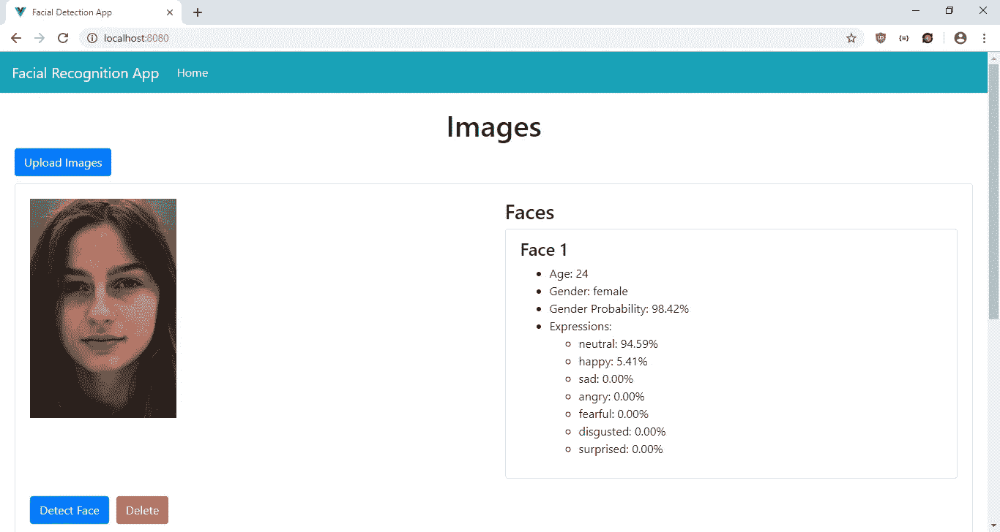
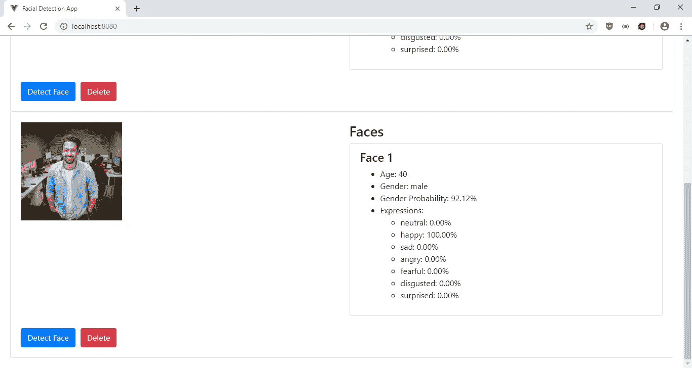

# 制作一个 JavaScript 面部识别应用程序，像电影中的那样工作

> 原文：<https://levelup.gitconnected.com/make-your-own-facial-recognition-app-that-works-like-the-ones-in-the-movies-ca0dffd56237>


照片由 [Unsplash](https://unsplash.com/s/photos/face?utm_source=unsplash&utm_medium=referral&utm_content=creditCopyText) 上的 [Harishan Kobalasingam](https://unsplash.com/@harishankphotography?utm_source=unsplash&utm_medium=referral&utm_content=creditCopyText) 拍摄

当我们观看发生在未来的电影时，我们经常看到角色看着他们的电脑屏幕，试图扫描像罪犯或他们想追捕的任何人的脸。眼下，面部识别技术已经非常成熟，这已经成为现实。我们可以开发能够非常准确地识别人脸的应用程序。这不再仅仅是科幻小说的领域。

要做一个面部识别 app，我们可以使用 face-api.js 这样的库，位于[https://github.com/justadudewhohacks/face-api.js/](https://github.com/justadudewhohacks/face-api.js/)。它可以直接在浏览器和 Node.js 中工作。你可以通过用图像训练 Tensorflow 来生成训练数据，并将这些数据加载到应用程序中，然后它可以通过调用它的函数来检测人脸。生成数据超出了本文的范围，但是您可以下载预置数据，并将其加载到您的应用程序中进行面部识别。上面的链接有一个`weights`文件夹，你可以在你的应用程序中使用。

在本文中，我们将制作一个简单的面部识别应用程序，用户可以使用它来检测面部的情感、性别和年龄。我们将使用 Vue.js 和 face-api.js 库来构建应用程序。首先，我们通过运行`npx @vue/cli create facial-recognition-app`来运行 Vue CLI。在向导中，我们选择“手动选择功能”，然后选择 Babel、CSS 预处理器、Vuex 和 Vue 路由器。

现在我们需要安装我们的库。除了 face-api.js，我们还需要 Axios 向我们的后端和 BootstrapVue 发出样式请求。要安装它们，我们运行:

```
npm i axios bootstrap-vue face-api.js
```

现在我们继续创建应用程序。在`src`目录下创建一个`mixins`文件夹，然后创建一个名为`requestsMixin.js`的文件。在那里，添加:

```
const APIURL = "[http://localhost:3000](http://localhost:3000)";
const axios = require("axios");export const requestsMixin = {
  methods: {
    getImages() {
      return axios.get(`${APIURL}/images`);
    }, addImage(data) {
      return axios.post(`${APIURL}/images`, data);
    }, editImage(data) {
      return axios.put(`${APIURL}/images/${data.id}`, data);
    }, deleteImage(id) {
      return axios.delete(`${APIURL}/images/${id}`);
    }
  }
};
```

在这里，我们有一些函数向我们的后端发出保存图像的请求，我们将稍后设置这些请求。

接下来在`Home.vue`中，将现有代码替换为:

```
<template>
  <div class="page">
    <h1 class="text-center">Images</h1>
    <div class="clearfix">
      <b-button-toolbar class="button-toolbar float-left">
        <input type="file" style="display: none" ref="file" [@change](http://twitter.com/change)="onChangeFileUpload($event)" />
        <b-button variant="primary" [@click](http://twitter.com/click)="$refs.file.click()">Upload Images</b-button>
      </b-button-toolbar> 
    </div> <div v-if="loaded">
      <b-card v-for="(img, index) in images" :key="img.id">
        <div class="row">
          <div class="col-md-6">
            
          </div>
          <div class="col-md-6">
            <h3>Faces</h3>
            <b-list-group>
              <b-list-group-item v-for="(d, i) of img.detections" :key="i">
                <h4>Face {{i + 1}}</h4>
                <ul class="detection">
                  <li>Age: {{d.age.toFixed(0)}}</li>
                  <li>Gender: {{d.gender}}</li>
                  <li>Gender Probability: {{(d.genderProbability*100).toFixed(2)}}%</li>
                  <li>
                    Expressions:
                    <ul>
                      <li
                        v-for="key of Object.keys(d.expressions)"
                        :key="key"
                      >{{key}}: {{(d.expressions[key]*100).toFixed(2)}}%</li>
                    </ul>
                  </li>
                </ul>
              </b-list-group-item>
            </b-list-group>
          </div>
        </div>
        <br /> <b-button variant="primary" [@click](http://twitter.com/click)="detectFace(index)">Detect Face</b-button> <b-button variant="danger" [@click](http://twitter.com/click)="deleteOneImage(img.id)">Delete</b-button>
      </b-card>
    </div>
    <div v-else>
      <p>Loading image data...</p>
    </div>
  </div>
</template><script>
import { requestsMixin } from "@/mixins/requestsMixin";
import * as faceapi from "face-api.js";
const axios = require("axios");
const WEIGHTS_URL = "[http://localhost:8081/weights](http://localhost:8081/weights)";export default {
  name: "home",
  mixins: [requestsMixin],
  computed: {
    images() {
      return this.$store.state.images;
    }
  },
  async beforeMount() {
    await faceapi.loadTinyFaceDetectorModel(WEIGHTS_URL);
    await faceapi.loadFaceLandmarkTinyModel(WEIGHTS_URL);
    await faceapi.loadFaceLandmarkModel(WEIGHTS_URL);
    await faceapi.loadFaceRecognitionModel(WEIGHTS_URL);
    await faceapi.loadFaceExpressionModel(WEIGHTS_URL);
    await faceapi.loadAgeGenderModel(WEIGHTS_URL);
    await faceapi.loadFaceDetectionModel(WEIGHTS_URL);
    await this.getAllImages();
    this.loaded = true;
  },
  data() {
    return {
      form: {},
      loaded: false
    };
  },
  methods: {
    async deleteOneImage(id) {
      await this.deleteImage(id);
      this.getAllImages();
    }, async getAllImages() {
      const { data } = await this.getImages();
      this.$store.commit("setImages", data);
      if (this.$refs.file) {
        this.$refs.file.value = "";
      }
    }, onChangeFileUpload($event) {
      const file = $event.target.files[0];
      const reader = new FileReader();
      reader.onload = async () => {
        this.$refs.image.src = reader.result;
        this.form.image = reader.result;
        await this.addImage(this.form);
        this.getAllImages();
        this.form.image = "";
      };
      reader.readAsDataURL(file);
    }, async detectFace(index) {
      const input = this.$refs[`photo-${index}`][0]; const options = new faceapi.TinyFaceDetectorOptions({
        inputSize: 128,
        scoreThreshold: 0.3
      });
      const detections = await faceapi
        .detectAllFaces(input, options)
        .withFaceLandmarks()
        .withFaceExpressions()
        .withAgeAndGender()
        .withFaceDescriptors();
      this.images[index].detections = detections;
      await this.editImage(this.images[index]);
      this.getAllImages();
    }
  }
};
</script><style>
.photo {
  max-width: 200px;
  margin-bottom: 10px;
}
</style>
```

这就是图像识别的神奇之处。在`beforeMount`钩子中，我们加载 face-api.js 做面部识别所需的所有训练数据。`WEIGHTS_URL`只是由 HTTP 服务器服务的[https://github.com/justadudewhohacks/face-api.js/](https://github.com/justadudewhohacks/face-api.js/)存储库的`weights`文件夹。通过这个链接，我们可以将整个存储库下载到一个 Zip 文件中，并从中提取出`weights`文件夹。然后运行`npm i -g http-server`下载`http-server`。转到`weights`文件夹并运行`http-server --cors`，这样我们就可以提供文件，浏览器在下载文件时不会出现 CORS 错误。请注意，加载文件可能需要几秒钟时间。

在模板中，我们有一个“上传图像”按钮来加载图像。该按钮将打开打开文件对话框，然后将调用`onChangeFileUpload`将其转换为 base64 字符串，然后保存到服务器。请注意，这样做只是为了保持教程应用程序的简单。出于生产目的，可能应该用后端应用程序将它保存到文件中。

一旦图像被加载，它们就会显示在卡片上。每张卡都有一个“检测面部”按钮。点击后，调用`detectFace`函数，运行 face-api.js 面部检测函数`detectAllFaces`。请注意，在进行面部识别以加快速度之前，我们使用了`TinyFaceDetectorOptions`来缩小图像。我们从`with`开始链接函数，以便获得一些人类可读的见解。一旦完成，卡片将重新载入结果。

接下来在`App.vue`中，将现有代码替换为:

```
<template>
  <div id="app">
    <b-navbar toggleable="lg" type="dark" variant="info">
      <b-navbar-brand to="/">Facial Recognition App</b-navbar-brand><b-navbar-toggle target="nav-collapse"></b-navbar-toggle><b-collapse id="nav-collapse" is-nav>
        <b-navbar-nav>
          <b-nav-item to="/" :active="path  == '/'">Home</b-nav-item>
        </b-navbar-nav>
      </b-collapse>
    </b-navbar>
    <router-view />
  </div>
</template><script>
export default {
  data() {
    return {
      path: this.$route && this.$route.path
    };
  },
  watch: {
    $route(route) {
      this.path = route.path;
    }
  }
};
</script><style lang="scss">
.page {
  padding: 20px;
  margin: 0 auto;
}button,
.btn.btn-primary {
  margin-right: 10px !important;
}.button-toolbar {
  margin-bottom: 10px;
}
</style>
```

这将在我们页面的顶部添加一个引导导航条，并添加一个`router-view`来显示我们定义的路线。

接下来在`main.js`中，将代码替换为:

```
import Vue from 'vue'
import App from './App.vue'
import router from './router'
import store from './store'
import BootstrapVue from "bootstrap-vue";
import "bootstrap/dist/css/bootstrap.css";
import "bootstrap-vue/dist/bootstrap-vue.css";
Vue.use(BootstrapVue);Vue.config.productionTip = falsenew Vue({
  router,
  store,
  render: h => h(App)
}).$mount('#app')
```

这将我们安装的库添加到我们的应用程序中，因此我们可以在我们的组件中使用它们。

在`router.js`中，我们将现有代码替换为:

```
import Vue from "vue";
import Router from "vue-router";
import Home from "./views/Home.vue";Vue.use(Router);export default new Router({
  mode: "history",
  base: process.env.BASE_URL,
  routes: [
    {
      path: "/",
      name: "home",
      component: Home
    }
  ]
});
```

这包括我们的主页和搜索页面。

然后在`store.js`中，我们将现有代码替换为:

```
import Vue from "vue";
import Vuex from "vuex";Vue.use(Vuex);export default new Vuex.Store({
  state: {
    images: []
  },
  mutations: {
    setImages(state, payload) {
      state.images = payload;
    }
  },
  actions: {}
});
```

这将我们的`images`状态添加到存储中，因此我们可以在`HomePage`的`computed`块中观察它。我们有`setImages`函数来更新`passwords`状态，我们通过调用`this.$store.commit(“setImages”, data);`在组件中使用它，就像我们在`HomePage`中做的那样。

最后，在`index.html`中，用以下代码替换现有代码:

```
<!DOCTYPE html>
<html lang="en">
  <head>
    <meta charset="utf-8" />
    <meta http-equiv="X-UA-Compatible" content="IE=edge" />
    <meta name="viewport" content="width=device-width,initial-scale=1.0" />
    <link rel="icon" href="<%= BASE_URL %>favicon.ico" />
    <title>Facial Detection App</title>
  </head>
  <body>
    <noscript>
      <strong
        >We're sorry but vue-face-api-tutorial-app doesn't work properly without
        JavaScript enabled. Please enable it to continue.</strong
      >
    </noscript>
    <div id="app"></div>
    <!-- built files will be auto injected -->
  </body>
</html>
```

这就改变了标题。


照片由 [Marius Ciocirlan](https://unsplash.com/@madebymarius?utm_source=unsplash&utm_medium=referral&utm_content=creditCopyText) 在 [Unsplash](https://unsplash.com/s/photos/man?utm_source=unsplash&utm_medium=referral&utm_content=creditCopyText) 上拍摄

在所有的努力之后，我们可以通过运行`npm run serve`来启动我们的 app。

为了启动后端，我们首先通过运行`npm i json-server`来安装`json-server`包。然后，转到我们的项目文件夹并运行:

```
json-server --watch db.json
```

在`db.json`中，将文本改为:

```
{
  "images": [
  ]
}
```

所以我们有了在可用的`requests.js`中定义的`images`端点。

经过所有的艰苦工作，我们得到了以下结果:



正如你所看到的，face-api.js 在检测男性和女性面部的性别和面部表情方面都相当准确。年龄看起来也很接近你的预期。这是令人兴奋的，因为由于 face-api.js 的开发人员，制作这个应用程序并没有做很多工作