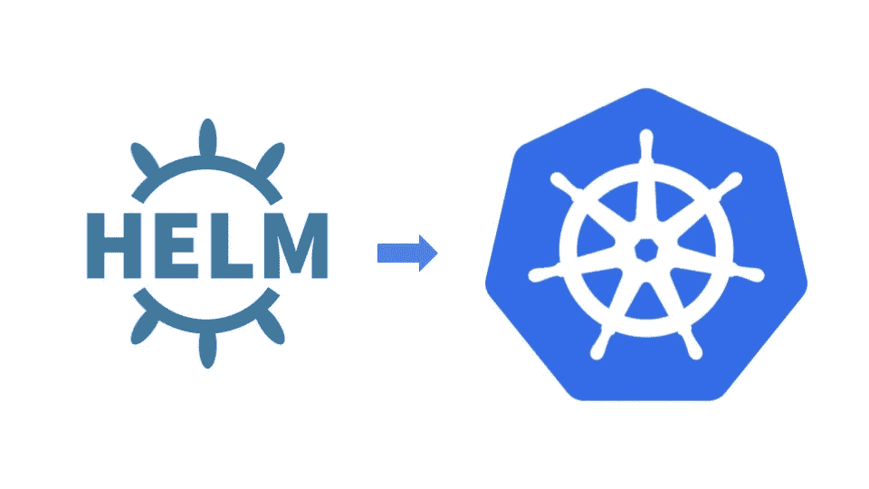

# 制作你自己的舵图

> 原文：<https://levelup.gitconnected.com/make-your-own-helm-chart-590622a50c14>

## 第三部分:使用 Helm 包管理器进行部署



如果你是这个系列的新手，可以看看我之前的帖子，关于[创建 kubernetes 集群](https://medium.com/@almas.hilman/simple-kubernetes-deployment-using-kops-273fc7990006)和[使用 yaml 配置文件在 Kubernetes 集群中部署 web 应用](https://medium.com/@almas.hilman/deploying-simple-golang-webapp-to-kubernetes-25dc1736dcc4)。在这一部分，我将向您展示如何使用舵图部署 web 应用程序。

Helm 是 Kubernetes 的一个包管理器。使用 helm，您可以使用预定义的配置文件模板轻松安装应用程序。在一般情况下，您可能希望在集群中安装一些应用程序，如 nginx、redis、mysql 或 prometheus。手动操作会耗费您的时间，并且可能会导致一些错误的配置，从而导致以后的一些问题。您可以使用预定义的图表，并使用 helm 轻松安装它。或者您希望根据您的标准创建一个用于部署应用程序的模板，那么您可以创建自己的 helm chart 并使用它来部署您的应用程序。这将避免您多次复制粘贴来创建许多相似的 yaml 文件。

# 手在上面

让我们从安装 helm CLI 开始。您可以在您的本地机器或任何一个连接到集群的服务器上执行下面的命令。

```
$ curl -fsSL -o get_helm.sh [https://raw.githubusercontent.com\](https://raw.githubusercontent.com\)
  /helm/helm/master/scripts/get-helm-3
$ chmod 700 get_helm.sh
$ ./get_helm.sh
```

安装后，您可以使用此命令创建您的第一个图表，

```
$ helm create simpleapp 
```

默认情况下，它会为部署 nginx 服务器创建一个图表。安装应用程序就像运行这些命令一样简单，

```
$ helm install simpleapp ./simpleapp
```

瞧，你已经在 kubernetes 集群中安装并运行了一个 nginx 服务器。看看这个，

```
$ helm ls
$ kubectl get all
```

好了，您已经看到了从预定义的图表安装应用程序是多么容易。安装我们自己的应用程序怎么样？这需要你对现有的模板做一些修改。但是一旦完成，您就可以多次使用它来部署满足需求的许多不同的应用程序。

开始之前，让我们清理以前的安装，

```
$ helm uninstall simpleapp 
```

下一部分是关于图表中可用的 yaml 文件模板，以及我们可以用它做什么。这可能有点令人困惑。为了不迷路，请记住我们修改的 yaml 文件是一个模板，稍后您将渲染它以创建一个类似于我们在[上一篇文章](https://medium.com/@almas.hilman/deploying-simple-golang-webapp-to-kubernetes-25dc1736dcc4)中创建的 yaml 文件(您可能想要并排比较它们)。

第一个是`Chart.yaml`文件。这个文件用于存储许多与应用程序本身相关的信息，比如名称、描述、维护者、版本、类型或图标。下面是一个关于我如何建立一个`Chart.yaml`文件的非常基本的例子。

```
apiVersion: v2
name: simpleapp
description: A very simple helloworld applicationtype: application*# This is the chart version. This version number should be 
# incremented each time you make changes
# to the chart and its templates, including the app version.* version: 1.0.0*# This is the version number of the application being deployed. 
# This version number should be
# incremented each time you make changes to the application.* appVersion: 1.0.0
```

接下来是`value.yaml`文件。如果您稍后签出，YAML 模板文件中会有许多部分使用引用该文件中所述值的变量。稍后，当我们渲染 YAML 模板时，它将生成一个 YAML 配置文件。我建议把所有可配置的东西都放在这个文件中。通常情况下，如果更新应用程序，您可能会更改所有内容。例如，在下面的例子中，我为后端和前端以及容器端口放置了图像存储库，因为我想稍后使用该图表来部署不同的应用程序图像，并可能在不同的端口发布它。

```
*# Default values for simpleapp.
# This is a YAML-formatted file.
# Declare variables to be passed into your templates.*fullnameOverride: ""
nameOverride: ""
serviceAccount:
  *# Specifies whether a service account should be created* create: true
  *# Annotations to add to the service account* annotations: {}
  *# The name of the service account to use.
  # If not set and create is true, 
  # a name is generated using the fullname template* name:frontend:
  enabled: true
  replicaCount: 1
  image:
    repository: lmnzr/simplefrontend
    pullPolicy: Always
    ports:
      containerPort: 80
  env:
    backend: ""
  service:
    type: NodePort
    port: 80
  ingress:
    enabled: false
    annotations:
      kubernetes.io/ingress.class: nginx
    hosts:
      - host: chart-example.local
        paths:
          - /
    tls: []
    *#  - secretName: chart-example-tls
    #    hosts:
    #      - chart-example.local* resources: {}backend:
  enabled: true
  replicaCount: 1
  image:
    repository: lmnzr/simplebackend
    pullPolicy: Always
  resources: {}
```

接下来我们有`templates/`文件夹。该文件夹中的每个文件都将被渲染以创建 kubernetes YAML 配置文件，但前面带有下划线(_)的文件除外。在这个文件夹里我们有`templates/_helpers.tpl`文件。我喜欢把这个文件解释为存储所有可重用部分的地方。通常是应用程序名、部署名、服务名等。有趣的是，定义的部分可以使用来自`value.yaml`和`Chart.yaml`的值生成。在模板文件中我们也可以使用模板功能。Helm 有关于它的很好的文档，阅读它[这里](https://helm.sh/docs/chart_template_guide/functions_and_pipelines/)了解更多。例如，我用从发布中获取的值来定义`simplebackend.fullname`。名称和图表。名称以“后端”结尾。稍后，您将看到我将它包含在后端部署模板中。

```
{{/* vim: set filetype=mustache: */}}
{{/* Expand the name of the chart. */}}{{/* 
Create a default fully qualified app name.
We truncate at 63 chars because some Kubernetes name fields are limited to this (by the DNS naming spec).
If release name contains chart name it will be used as a full name.
*/}}{{- define "simpleapp.name" -}}
{{- default .Chart.Name | trunc 63 | trimSuffix "-" -}}
{{- end -}}{{- define "simpleapp.fullname" -}}
{{- if .Values.fullnameOverride -}}
{{- .Values.fullnameOverride | trunc 63 | trimSuffix "-" -}}
{{- else -}}
{{- $name := default .Chart.Name .Values.nameOverride -}}
{{- if contains $name .Release.Name -}}
{{- .Release.Name | trunc 63 | trimSuffix "-" -}}
{{- else -}}
{{- printf "%s-%s" .Release.Name $name | trunc 63 |        trimSuffix "-" -}}
{{- end -}}
{{- end -}}
{{- end -}}{{- define "simplebackend.fullname" -}}
{{- printf "%s-%s-backend" .Release.Name .Chart.Name | trunc 63 | trimSuffix "-" -}}
{{- end -}}{{- define "simplefrontend.fullname" -}}
{{- printf "%s-%s-frontend" .Release.Name .Chart.Name | trunc 63 | trimSuffix "-" -}}
{{- end -}}{{- define "simplebackend-deployment.fullname" -}}
{{- printf "%s-%s-backend-dpl" .Release.Name .Chart.Name|       trunc 63 | trimSuffix "-" -}}
{{- end -}}{{- define "simplebackend-service.url" -}}
{{- if .Values.frontend.env.backend -}}
{{- .Values.frontend.env.backend | trunc 63 | trimSuffix "-" -}}
{{- else -}}
{{- printf "http://%s-%s-backend-svc:8080" .Release.Name .Chart.Name | trunc 63 | trimSuffix "-" -}}
{{- end -}}
{{- end -}}{{- define "simplefrontend-deployment.fullname" -}}
{{- printf "%s-%s-frontend-dpl" .Release.Name .Chart.Name | trunc 63 | trimSuffix "-" -}}
{{- end -}}{{- define "simplebackend-service.fullname" -}}
{{- printf "%s-%s-backend-svc" .Release.Name .Chart.Name | trunc 63 | trimSuffix "-" -}}
{{- end -}}{{- define "simplefrontend-service.fullname" -}}
{{- printf "%s-%s-frontend-svc" .Release.Name .Chart.Name | trunc 63 | trimSuffix "-" -}}
{{- end -}}{{/* Create chart name and version as used by the chart label. */}}{{- define "simpleapp.chart" -}}
{{- printf "%s-%s" .Chart.Name .Chart.Version | replace "+" "_" | trunc 63 | trimSuffix "-" -}}
{{- end -}}{{/* Common labels */}}{{- define "simpleapp.labels" -}}
helm.sh/chart: {{ include "simpleapp.chart" . }}
{{ include "simpleapp.selectorLabels" . }}
{{- if .Chart.AppVersion }}
app.kubernetes.io/version: {{ .Chart.AppVersion | quote }}
{{- end }}
app.kubernetes.io/managed-by: {{ .Release.Service }}
{{- end -}}{{/* Selector labels */}}{{- define "simpleapp.selectorLabels" -}}
app.kubernetes.io/name: {{ include "simpleapp.name" . }}
app.kubernetes.io/instance: {{ .Release.Name }}
{{- end -}}{{/* Create the name of the service account to use */}}{{- define "simpleapp.serviceAccountName" -}}
{{- if .Values.serviceAccount.create -}}
    {{ default (include "simpleapp.fullname" .)    
      .Values.serviceAccount.name }}
{{- else -}}
{{ default "default" .Values.serviceAccount.name }}
{{- end -}}
{{- end -}}
```

现在我们可以在`templates/ deployment.yaml`中创建部署模板了。该模板将用于生成`backend-deployment.yaml`和`frontend-deployment.yaml`，类似于我们在[第 2 部分](https://medium.com/@almas.hilman/deploying-simple-golang-webapp-to-kubernetes-25dc1736dcc4)中创建的模板。

```
{{- if .Values.backend.enabled -}}
apiVersion: apps/v1
kind: Deployment
metadata:
  name: {{ include "simplebackend-deployment.fullname" . }}
  labels:
    app.kubernetes.io/stack: 
      {{ include "simplebackend.fullname" . }}
    {{- include "simpleapp.labels" . | nindent 4 }}spec:
  replicas: {{ .Values.backend.replicaCount }}
  selector:
    matchLabels:
      app: {{ include "simplebackend.fullname" . }}
  template:
    metadata:
      labels:
        app: {{ include "simplebackend.fullname" . }}
    spec:
      serviceAccountName: 
        {{ include "simpleapp.serviceAccountName" . }}
      containers:
        - name: {{ include "simplebackend.fullname" . }}
          image: 
            "{{ .Values.backend.image.repository }}:
            {{ .Values.backend.image.tag | default "latest" }}"
          imagePullPolicy: {{ .Values.backend.image.pullPolicy }}
          ports:
            - name: http
              containerPort: 8080
              protocol: TCP
          livenessProbe:
            httpGet:
              path: /
              port: 8080
          readinessProbe:
            httpGet:
              path: /
              port: 8080
          resources:
            {{- toYaml .Values.backend.resources | nindent 12 }}
{{- end }}---{{- if .Values.frontend.enabled -}}
apiVersion: apps/v1
kind: Deployment
metadata:
  name: {{ include "simplefrontend-deployment.fullname" . }}
  labels:
    app.kubernetes.io/stack: 
      {{ include "simplefrontend.fullname" . }}
    {{- include "simpleapp.labels" . | nindent 4 }}
spec:
  replicas: {{ .Values.frontend.replicaCount }}
  selector:
    matchLabels:
      app: {{ include "simplefrontend.fullname" . }}
  template:
    metadata:
      labels:
        app: {{ include "simplefrontend.fullname" . }}
    spec:
      serviceAccountName: 
        {{ include "simpleapp.serviceAccountName" . }}
      containers:
        - name: {{ include "simplefrontend.fullname" . }}
          image: 
            "{{ .Values.frontend.image.repository }}:
            {{ .Values.frontend.image.tag | default "latest" }}"
          imagePullPolicy: {{ .Values.frontend.image.pullPolicy }}
          env:
            - name: BACKEND_URL
              value:  {{ include "simplebackend-service.url" .}}
          ports:
            - name: http
              containerPort: 
                {{ .Values.frontend.image.ports.containerPort }}
              protocol: TCP
          livenessProbe:
            httpGet:
              path: /
              port: {{ .Values.frontend.image.ports.containerPort }}
          readinessProbe:
            httpGet:
              path: /
              port: {{ .Values.frontend.image.ports.containerPort }}
          resources:
            {{- toYaml .Values.frontend.resources | nindent 12 }}
{{- end }}
```

接下来在`templates/service.yaml`中为服务创建模板。该模板将用于生成`backend-service.yaml`和`frontend-service.yaml`，也类似于我们在[第 2 部分](https://medium.com/@almas.hilman/deploying-simple-golang-webapp-to-kubernetes-25dc1736dcc4)中创建的模板。

```
{{- if .Values.backend.enabled -}}
apiVersion: v1
kind: Service
metadata:
  name: {{ include "simplebackend-service.fullname" . }}
  labels:
    app.kubernetes.io/stack: 
      {{ include "simplebackend.fullname" . }}
    {{- include "simpleapp.labels" . | nindent 4 }}
spec:
  type: ClusterIP
  ports:
    - port: 8080
      targetPort: http
      protocol: TCP 
      name: http
  selector:
    app: {{ include "simplebackend.fullname" . }}
{{- end }}---{{- if .Values.frontend.enabled -}}
apiVersion: v1
kind: Service
metadata:
  name: {{ include "simplefrontend-service.fullname" . }}
  labels:
    app.kubernetes.io/stack: 
      {{ include "simplefrontend.fullname" . }}
    {{- include "simpleapp.labels" . | nindent 4 }}
spec:
  type: {{ .Values.frontend.service.type }}
  ports:
    - port: {{ .Values.frontend.service.port }}
      targetPort: http
      protocol: TCP
      name: http
  selector:
    app: {{ include "simplefrontend.fullname" . }}
{{- end }}
```

现在我们已经准备好了一切，还有最后一件事要创建`NOTES.txt`。这有助于为安装我们应用程序的任何人生成有用的说明。通常，您可能希望给出关于如何访问应用程序或检查什么以验证应用程序安装正确的说明。

```
{{- if .Values.frontend.enabled }}
  Get the Frontend application URL by running these commands:
{{- if .Values.frontend.ingress.enabled }}
{{- range $host := .Values.frontend.ingress.hosts }}
  {{- range .paths }}
  http{{ if $.Values.frontend.ingress.tls }}s{{ end }}://
  {{ $host.host }}{{ . }}
  {{- end }}
{{- end }}
{{- else if contains "NodePort" .Values.frontend.service.type }}
  export NODE_PORT=$(kubectl get 
  --namespace {{ .Release.Namespace }} -o jsonpath="  
  {.spec.ports[0].nodePort}" services 
  {{ include "simplefrontend-service.fullname" . }}) export NODE_IP=$(kubectl get nodes --namespace 
  {{ .Release.Namespace }} -o 
  jsonpath="{.items[0].status.addresses[0].address}") echo [http://$NODE_IP:$NODE_PORT](/$NODE_IP:$NODE_PORT)
{{- else if contains "LoadBalancer" .Values.frontend.service.type }}
  NOTE: It may take a few minutes for the LoadBalancer IP to be  
  available.
  You can watch the status of by running 
  'kubectl get --namespace {{ .Release.Namespace }} svc -w 
  {{ include "simplefrontend-service.fullname" . }}' export SERVICE_IP=$(kubectl get svc --namespace 
  {{ .Release.Namespace }} 
  {{ include "simplefrontend-service.fullname" . }} 
  --template "{{"{{ range (index .status.loadBalancer.ingress 0) }}
  {{.}}{{ end }}"}}")

  echo http://$SERVICE_IP:{{ .Values.frontend.service.port }}
{{- else if contains "ClusterIP" .Values.frontend.service.type }}
  export POD_NAME=$(kubectl get pods --namespace 
  {{ .Release.Namespace }} -l 
  app={{ include "simplefrontend.fullname" . }} 
  -o jsonpath="{.items[0].metadata.name}") echo "Visit http://127.0.0.1:80 to use your application" kubectl --namespace {{ .Release.Namespace }} 
  port-forward $POD_NAME 80:80
{{- end }}
{{- end }}{{- if .Values.backend.enabled }}
  Get the application Backend URL by running these commands: export POD_NAME=$(kubectl get pods --namespace 
  {{ .Release.Namespace }} 
  -l app={{ include "simplebackend.fullname" . }} 
  -o jsonpath="{.items[0].metadata.name}")

  echo "Visit http://127.0.0.1:8080 to use your application"

  kubectl --namespace {{ .Release.Namespace }} 
  port-forward $POD_NAME 80:8080
{{- end }}
```

完成了。我们一切都准备好了。

要检查是否一切正常，请运行以下命令。如果有问题，通常你在模板文件中做一些打字错误。我发现对我有用的一个技巧是，试着一次构建一个模板的一部分，并且每次都验证它。这样更容易发现错误。

```
$ helm lint ./simpleapp
$ helm install --dry-run --debug simpleapp ./simpleapp
```

如果一切运行正常，您应该会看到渲染的 YAML 配置文件。您可以通过运行这个命令来安装您的应用程序，

```
$ helm install simpleapp ./simpleapp
```

如果您有有效的 YAML 配置文件，该配置应该可以正确运行。然后，您应该立即看到您在`NOTES.txt`中创建的笔记。它为您提供了如何访问 web 应用程序的说明。试试看，你应该会看到这个，


如果您想要更改应用程序，例如更改映像或服务类型，或者更改复制计数。继续修改`values.yaml`文件。然后使用此命令应用它。

```
$ helm upgrade simpleapp ./simpleapp
```

你可以在这里找到与文章[相关的所有代码。](https://github.com/lmnzr/simpleapp)

在整个系列中，我已经向您展示了如何开始使用 kuber netes。关于 kubernetes 集群部署、应用程序部署和 helm chart，还有很多东西需要学习。我给你展示的只是一个开始。我鼓励您深入研究，以便能够将其用于生产。

非常感谢您的关注👋。