# 制作自己的 Python 包！

> 原文：<https://levelup.gitconnected.com/make-your-own-python-package-cc67e339d323>

## 哪些用户可以使用`pip`安装！


照片由 [Curology](https://unsplash.com/@curology?utm_source=medium&utm_medium=referral) 在 [Unsplash](https://unsplash.com?utm_source=medium&utm_medium=referral) 上拍摄

Pypi 上的包非常通用，并且很容易实现到您的代码中，这就是为什么人们经常想要将他们的项目上传到平台上。

今天，我将教您如何在那里准备和发布您的包，而没有混淆文档的麻烦。

您将学到的内容:

*   如何从零开始制作 Python 包？

您需要什么:

*   安装了 Python 的计算机。

# 设置

让我们创建一个文件夹，用一个`__init__.py`让 Python 知道它是一个包。

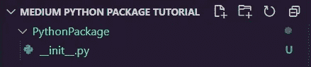

**图 1:** Python 包目录设置

在其中，您可以为您的包定义函数。

一个例子是:

花尽可能多的时间让它变得尽可能完美。

接下来，我们必须在我们的包文件夹之外创建一个`setup.py`文件，这样`Pypi`就知道从哪里获得我们的包的元数据。

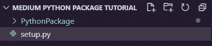

图 2: setup.py

复制并粘贴下面的代码，编辑信息，使其与您的项目相匹配。

例如，对于 hello world 套餐，我的`setup.py`是:

# 描述、变更日志等等

在包外创建以下以灰色突出显示的文件。

⚠记得根据下面的文件给它们命名。

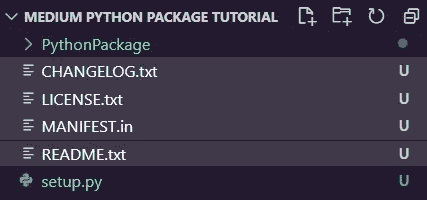

**图 3:** 添加变更日志、许可证、清单和自述文件

## `CHANGELOG.txt`

我们将添加标题并加下划线，这样人们看到我们的包就会知道这是什么。

🛑确保下划线比标题长。

```
Change Log==================================
```

在下面，我们可以将它标记为第一个版本，并在上面留下注释。

```
0.0.1 (April 17, 2021)===================================- First Version
```

完成`CHANGELOG.txt`:

## LICENSE.txt

去[https://opensource.org/licenses/alphabetical](https://opensource.org/licenses/alphabetical)选择你想要的项目许可证。

我选择麻省理工学院的执照，但是你可以选择你想要的。

页面应该是这样的…

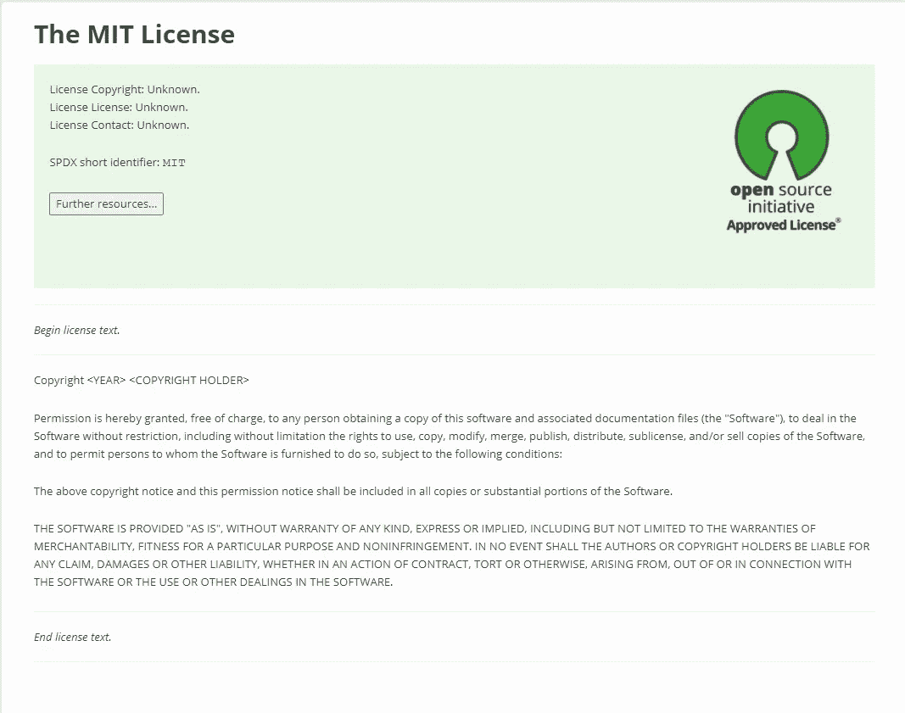

**图 4:** 麻省理工学院执照页面| [来源](https://opensource.org/licenses/MIT)

复制许可证文本。

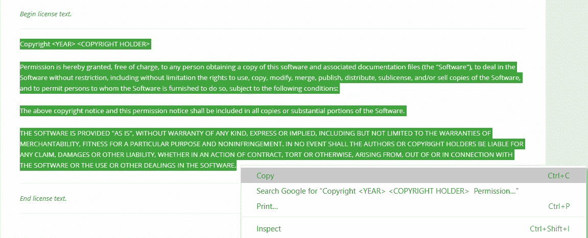

**图 5:** 从麻省理工学院许可证页面复制许可证文本| [来源](https://opensource.org/licenses/MIT)

将它粘贴到`txt`文件中，并将`<year>`和`<copyright holder>`编辑成年份和你的名字。

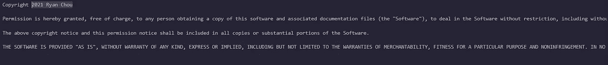

## README.txt

请提供描述。

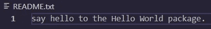

**图 6:** 为您的包提供一个描述。

## 清单. in

包括这一行，以便程序知道它可以读取`.txt`和`.py`文件。

```
global-include *.txt *.py
```

# 包装包装(懂吗？)

打开您的终端，将`cd`放入包含所有文件的文件夹，但不要放入包含`__init__.py`的文件夹。

键入`ls`应该会显示如下内容:

```
Mode                 LastWriteTime         Length Name
----                 -------------         ------ ----
d-----         4/17/2021   X PM                PythonPackage
-a----         4/17/2021   X PM            126 CHANGELOG.txt
-a----         4/17/2021   X PM           1058 LICENSE.txt
-a----         4/17/2021   X PM             25 MANIFEST.in
-a----         4/17/2021   X PM            118 README.txt
-a----         4/17/2021   X PM           1201 setup.py
```

在命令行中，用`pip`安装`setuptools twine`:

```
pip install setuptools twine
```

现在键入:

```
python setup.py sdist
```

应该有两个新文件夹。


**图 7:** 新建文件夹

在 https://pypi.org/account/register/[的 Pypi 上创建一个账户](https://pypi.org/account/register/)。

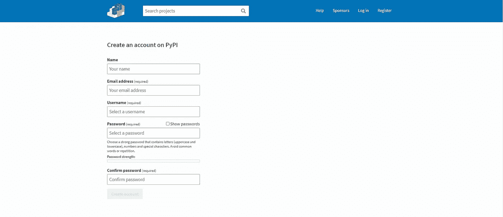

**图 8:** Pypi 账户创建|【https://pypi.org/account/register/ 

复制并粘贴到终端。

🛑是的，在`dist`之前应该有一个空格

```
twine upload --repository-url [https://upload.pypi.org/legacy/](https://upload.pypi.org/legacy/) dist/*
```

输入您的 Pypi 帐户的用户名和密码。

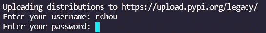

**图 9:** 输入用户名和密码

如果出现此错误:

```
HTTPError: 403 Forbidden from [https://upload.pypi.org/legacy/](https://upload.pypi.org/legacy/)
The user 'X' isn't allowed to upload to project 'helloworld'. See [https://pypi.org/help/#project-name](https://pypi.org/help/#project-name) for more information.
```

这意味着以该名称命名的项目已经存在。

如果一切顺利，您将得到以下输出:

```
View at:
[https://pypi.org/project/Helloworld20211234/0.0.1/](https://pypi.org/project/Helloworld20211234/0.0.1/)
```

转到链接会显示以下内容:

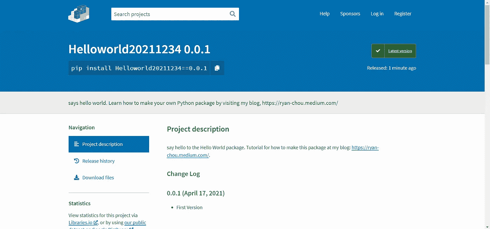

**图 10:** [包页。](https://pypi.org/project/Helloworld20211234/0.0.1/)

# 测试

我们可以通过安装来确保这一点。

```
pip install YOURPACKAGE==0.0.1
```

它应该正确执行。

## 🛑记得我们导入了带有父文件夹`__init__.py`的包，如果你看过上面的图片，就是`PythonPackage`。

导入它

```
import PythonPackage as hw
```

并调用一个函数。

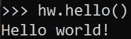

**图 11:** 调用功能

有用！

# 结论

谢谢！

我希望你喜欢读这篇文章，并且你有一个漂亮的包裹！如果你有任何问题、建议或一般反馈，请在评论中提出！

继续编码！