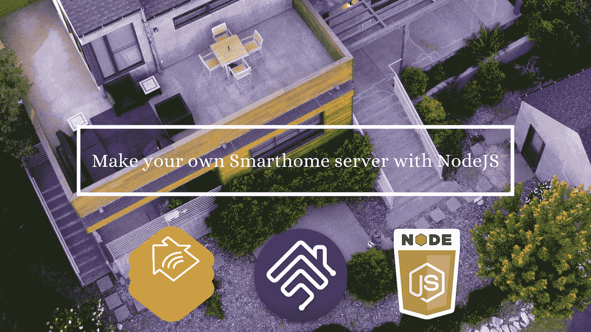
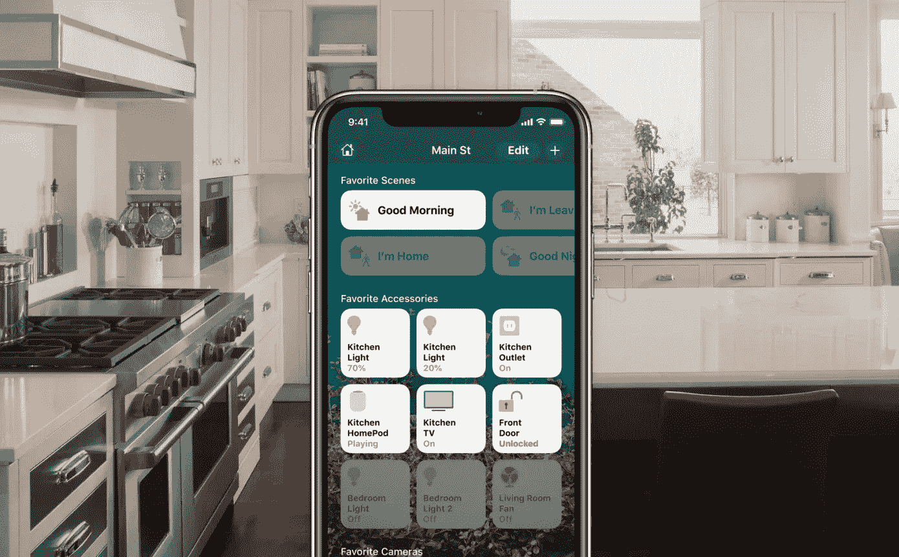
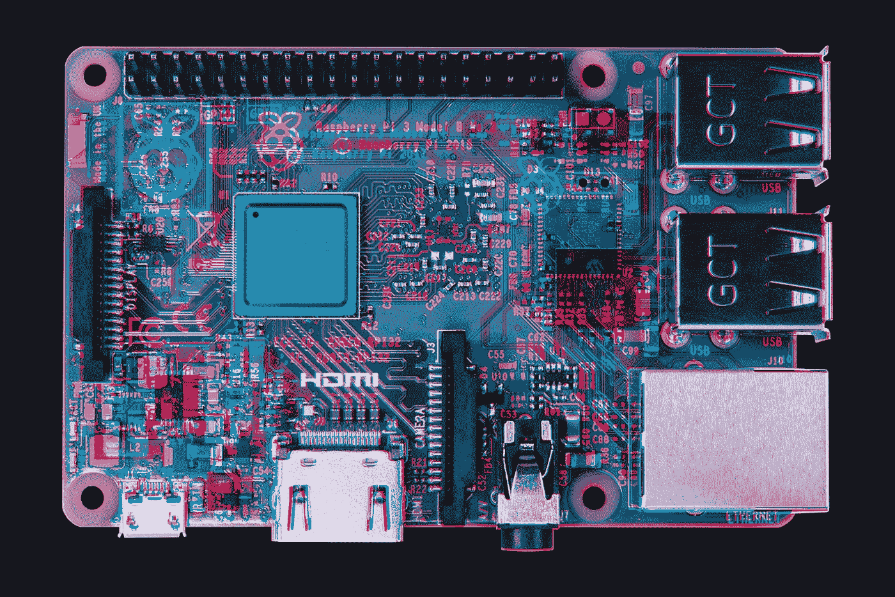

# 用 NodeJS 制作你自己的智能家居服务器

> 原文：<https://levelup.gitconnected.com/make-your-own-smarthome-server-with-nodejs-86e7aa0f63f4>

智能家居产品领域的竞争比以往任何时候都更加激烈，许多公司都在竞争成为你为家里购买的下一个酷产品。但是作为一个消费者，在决定一个产品是否与你的系统或者你想买的东西兼容时，挑选一个产品会有很多麻烦。对于电视等许多产品来说，如果不支持 HomeKit，你可以买到更便宜的电视，因为这通常意味着它要旧几年。但是，如果您仍然可以添加 HomeKit 支持，以便您可以从您的手机控制这些设备，这不是很酷吗？

进入 [Homebridge](https://github.com/homebridge/homebridge) ，这是一个轻量级 NodeJS 服务器，可以在模拟 iOS HomeKit API 的家庭网络上运行。随着开源插件库的不断增长，Homebridge 正迅速成为任何希望为智能家居添加更多功能的人的可靠选择。

# **我的经历**

来源: [TechCrunch](https://techcrunch.com/2019/12/19/anybody-can-now-make-homekit-accessories/)

Homekit 允许我扩展我的智能家居功能，并添加自动化功能，否则这是不可能的。从我拿到一台不知何故不支持 Homekit 的 2019 [三星 Q70 智能电视](https://www.amazon.com/Samsung-QN75Q70RAFXZA-Flat-QLED-Smart/dp/B07N4MVTXB/ref=asc_df_B07N4MVTXB/?tag=hyprod-20&linkCode=df0&hvadid=241883071164&hvpos=&hvnetw=g&hvrand=8233342149939902883&hvpone=&hvptwo=&hvqmt=&hvdev=c&hvdvcmdl=&hvlocint=&hvlocphy=9030890&hvtargid=pla-654607754631&psc=1)开始。我在电视上买了一个杀手锏，但那年晚些时候发布的新型号都支持 Homekit，当然价格要高得多。我有一个 [Raspberry Pi B+](https://www.amazon.com/CanaKit-Raspberry-Power-Supply-Listed/dp/B07BC6WH7V) 闲置着，所以我决定对它进行修补，看看我能否让 Homebridge 在其上运行。不到 30 分钟后，我就可以毫无问题地启动并运行一切了。我想是因为它太容易了，所以不会很稳定，但它确实很稳定。它实际上就像第一方 Homekit 支持一样。从那以后，我在我的 homebridge 服务器上添加了一个 [Levoit 空气净化器](https://www.amazon.com/LEVOIT-LV-PUR131-Purifier-Allergies-Eliminator/dp/B06W54K29J)，效果也很好。

# **安装**

来源:[桑迪·麦克唐纳](https://blog.pimoroni.com/a-deep-dive-into-the-raspberry-pi-3-b-hardware/)

已经有很多已经安装 Homebridge 的故障，而且[官方文档非常可靠](https://github.com/homebridge/homebridge/wiki)。我想我会记录我是如何做的，因为我认为我的实现更干净一点。

第一步是弄清楚您将在什么系统上运行它，并下载正确的映像。我没有安装 Homebridge UI，我有点希望我安装了，因为它使管理变得更容易。我强烈推荐使用树莓派，因为它很容易上手。按照基本步骤下载完所有内容后，我做了以下工作来在 Linux 上运行[home bridge as a service](https://words.bombast.net/homebridge-service-debian/):

*   *sudo nano/etc/systemd/system/home bridge . service*和[把这个](https://words.bombast.net/homebridge-service-debian/)粘贴在那里。
*   *sudo systemctl 守护进程-重新加载*
*   *sudo systemctl 启用 homebridge*
*   *sudo system CTL start home bridge*

这些命令创建了一个系统服务和系统管理器，它已经广泛成为 Linux 发行版的新标准。这样做的好处是，只要 pi 启动，服务就会立即运行，因此无需担心停电或任何导致 Homebridge 崩溃的故障。这只是重新启动。

在您运行服务之后，重启您的 pi，您就可以开始安装任何您想要的插件了。

如果你遇到任何问题，Github、Discord、Reddit 和 T21 都有很好的社区可以帮助你。如果你对我如何得到我的套装有疑问，请在这里发微博给我。

所以，走出去，让你的家变得更智能吧！