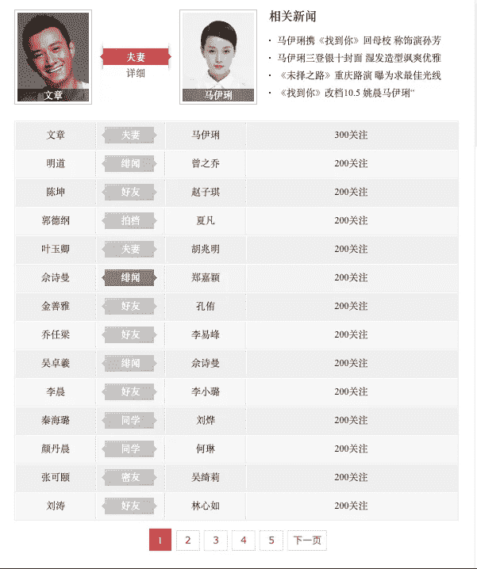
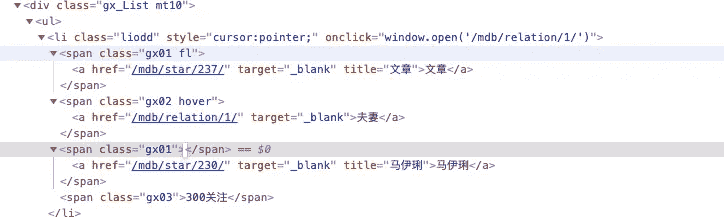
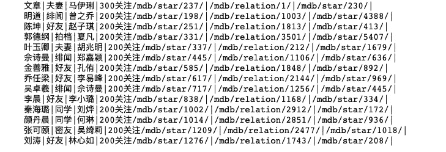
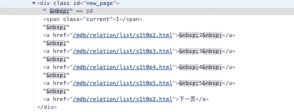
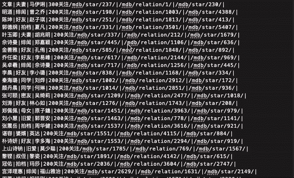

# 让您的 Python Web Scraper 更智能

> 原文：<https://levelup.gitconnected.com/make-your-python-web-scraper-smarter-6233f2d10c3f>


我最近开始学习使用 Python 进行 web 抓取。到目前为止，我认为很有趣的一件事是如何通过增加更多的功能来使你的网络抓取器变得“更聪明”。例如，我想让它能够翻页，并在完成当前页面上所有需要的数据后继续工作。

# **样板工程**

我想知道每一个中国名人之间的关系。为了获得这些信息，我需要从[http://www.1905.com/mdb/relation/list/s0t1p1.html](http://www.1905.com/mdb/relation/list/s0t1p1.html)提取数据，这是一个包含所有中国名人关系的网站。



名人关系

注意 URL 末尾的“s0t1p1 ”:它表示类别号、关系类型(婚姻、家庭成员、夫妇等)和页码。因此，s0t1p1 指示类别 1、关系类型 1(婚姻)和页面 1。

这里我用 Python 中的 [**美汤**](https://www.crummy.com/software/BeautifulSoup/bs4/doc/) 读取我的 HTML 文件并从中提取数据。我的这篇 [*文章*](https://medium.com/@yunhanh/quick-web-scraping-with-python-beautiful-soup-4dde18468f1f) 解释了什么是美丽的汤，以及我们如何使用它来轻松地从 web 上抓取数据。

导入必要的模块和包之后，让我们开始吧。

# **创建漂亮的汤对象**

使用`urllib`读取 HTML 后，我们需要创建一个漂亮的 Soup 对象。将 html 传递给 BeautifulSoup()函数，Beautiful Soup 包将解析 html(它获取 html 文本并将其解析为 Python 对象。)

```
html = urlopen(url)
soup = BeautifulSoup(html, “html.parser”)
```

或者，你可以换一种方式来做，这种方法可以避免直接做`html = urlopen(url)`时的错误

```
url_i = "YOUR_URL"referer = url_iuser_agent = “YOUR_USER_AGENT”headers = {‘User-Agent’: user_agent, ‘Referer’: referer, ‘Connection’: ‘keep-alive’}try: req = urllib.request.Request(url = url_i, headers = headers) response = urlopen(req) html = response.read()# throw exceptionsexcept error.HTTPError as e: print(e.reason)soup = BeautifulSoup(html, “html.parser”)
```

# **提取数据**

在获得漂亮的 Soup 对象后，我们可以用它来提取我们想要的数据。在这个示例项目中，我们使用了我在之前的[帖子](https://medium.com/@yunhanh/quick-web-scraping-with-python-beautiful-soup-4dde18468f1f)中提到的相同方法，即基于标签和类抓取数据。除了名人的名字和他们的关系，我还想要他们对应的 ID，也就是`href`。



A single relation between celebrity “文章” and “马伊琍”

通过构建一个嵌套循环，你的 web scraper 会自动抓取所有需要的数据。

```
def relations(soup):
  k = soup.find_all(‘div’, class_=’gx_List mt10')
  for x in k:
    allP = x.find_all(‘ul’)
    for person in allP:
      result = “”
      for el in person.find_all(‘li’):
        iD = “”
        for a in el.find_all(‘a’, href = True):
          p = el.get_text(“|”, strip = True)
          iD += a[‘href’]
          iD += “|”
        res = p + iD 
        res += “\n” 
        result += res
      return result
```

上面的函数将在第一页上生成数据，如下所示:



# **翻页**

现在来说说翻页。很多时候，数据分布在一个特定网站的各个地方，尤其是当它有多个页面包含您想要一次提取的相同类型的数据时。因此，在开发你的网页抓取工具时，翻页器是必要的。

为了让它运行多次，我们需要构建另一个函数来跟踪当前页面、页码以及 scraper 是否到达页面列表的末尾。在这个示例网站中，我们无法找出存在的页面总数，所以我们不能使用一个特定的数字来设置我们的循环的限制。

## 1.一个柜台

让我们首先将计数器 I 初始化为零。它跟踪当前页面，并在每次迭代中递增 1。

```
# NOT A COMPLETE CODE FOR THE WHILE LOOP i = 0While SOME CONDITION :

  i +=1 url_i = “http://www.1905.com/mdb/relation/list/" + “s0t1p” + str(i) + “.html” referer = url_i user_agent = “YOUR USER AGENT” headers = {‘User-Agent’: user_agent, ‘Referer’: referer, ‘Connection’: ‘keep-alive’} try: req = urllib.request.Request(url = url_i, headers = headers) response = urlopen(req) html = response.read()# throw exceptions
  except error.HTTPError as e:
    print(e.reason) soup = BeautifulSoup(html, “html.parser”)
```

## 2.页面

下一步是找出网站上指示页面的元素。右击你的网站，选择“检查”并进入“元素”。



(The text “下一页“ means “next page” in Chinese.)

现在仔细观察 html 文本的这一部分。为了找到页面的信息，我们需要提取整个 div 标签

```
page = soup.find_all (id = “new_page”)
```

要检查 scraper 是否到达了页面列表的末尾，我们需要检查 html 文本的这一行在该页面上时是否存在:

```
<a href=”/mdb/relation/list/s0t1p2.html”>下一页</a></div>
```

因此，我们可以构建这样一个循环:

```
for p in page:
  allp = p.find_all(‘a’, href = True)
  for x in allp:
    if x.get_text() == “下一页”:
      print(“More pages ahead, keep going!”)
      if x[‘href’] == “/mdb/relation/list/s1t0p” + str(i+1)+ “.html”:
        break
      else: # MORE CODE HERE

f.write(relations(soup))
print(relations(soup))
```

## 3.结束 While 循环

现在让我们考虑如何结束 while 循环，并确保 web scraper 已经抓取了每一页。我们还没有设置 while 条件，所以我们可以使用计数器来进行限制。

```
while **i >= 0**:(content of the while loop)…else:**i = -1** 
```

这里，I 不再大于等于 0，这会使 while 循环中断。

## 4.把所有东西放在一起

让我们将所有内容放在一个函数中，让 Python 将结果写入一个名为“celebrity.txt”的文本文件

翻页功能的完整代码:

```
def pageturning():
  f = open(“celebrity.txt”, “w+”)
  i = 0

  while i>=0 :
    i += 1
    url_i = “[http://www.1905.com/mdb/relation/list/](http://www.1905.com/mdb/relation/list/)" + “s1t0p” + str(i) + “.html”
    referer = url_i
    user_agent = ‘YOUR_USER_AGENT’
    headers = {‘User-Agent’: user_agent, ‘Referer’: referer, ‘Connection’: ‘keep-alive’}

    try:
      req = urllib.request.Request(url = url_i, headers = headers)
      response = urlopen(req)
      html = response.read()
    except error.HTTPError as e:
      break

    soup = BeautifulSoup(html, “lxml”)

    page = soup.find_all(id = “new_page”) for p in page:
      allp = p.find_all(‘a’, href = True)

      for x in allp:
        if x.get_text() == “下一页”:
          print(“More pages ahead, keep going!”)
          # inner loop ends if x[‘href’] == “/mdb/relation/list/s1t0p” + str(i+1)+ “.html”:
        break else:
        i = -1
    f.write(relations(soup))
    print(relations(soup)) 
 print(“You have reached the end”)

 return
```

下面是结果的样子:我们的 web scraper 的修改版本在到达页面末尾时会自动翻页，总共生成 1387 行结果。



结果文本文件“celebrity.txt”

# **总结**

希望这篇文章能帮助你建立一些开发更好的 Python web scraper 的想法。实现翻页功能肯定还有很多其他方法。如果您确定想要抓取的总页数，您可以简单地将这个限制作为您的循环条件。但是，当不同的网站有不同的页码时，这种实现方式适用于更一般的情况。只要你知道如何跟踪页码，并且能够在你的网页抓取器收集数据时设置限制，你就都是好的。