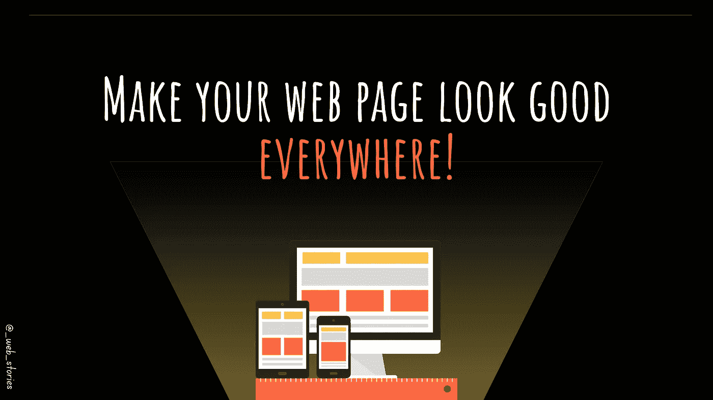
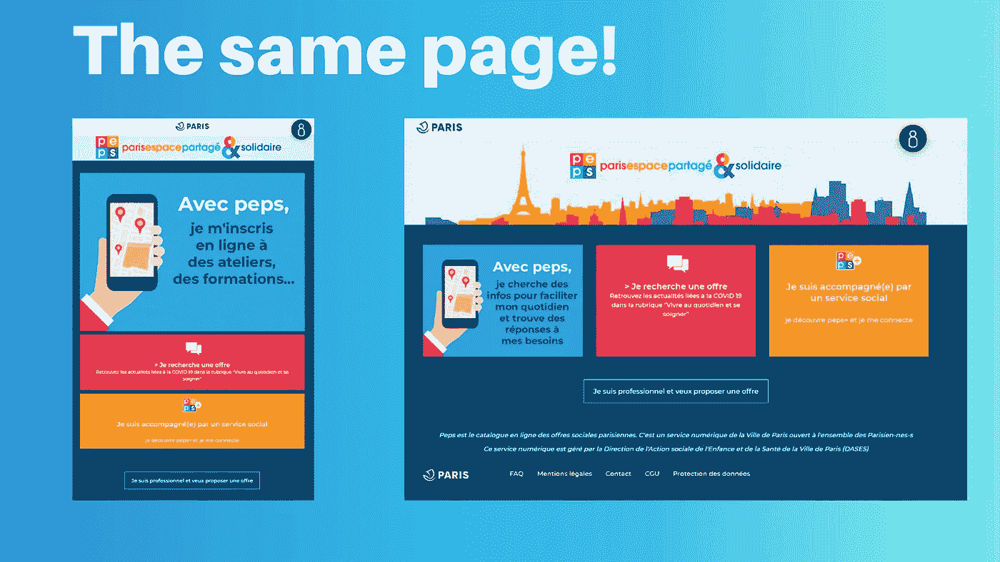
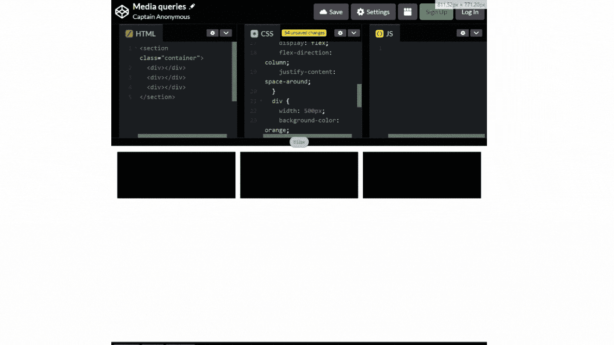

# 让你的网页处处好看！

> 原文：<https://levelup.gitconnected.com/make-your-web-page-look-good-everywhere-4cdba21914e5>

## 是什么让网络如此强大！



作者:FAM

你好👋

这是 CSS 章节和 [2022 网络快车项目](https://javascript.plainenglish.io/my-web-articles-roadmap-for-2022-20387cab9b07)中需要学习的最重要的步骤之一。

> 一个有反应的网页！

## 你在问为什么？

万维网被设计成无论你有什么样的硬件，无论你的计算机运行什么样的操作系统。只有一件事，互联网！ ***互联网就是它所需要的一切。***

好吧，你可能会说:“你好，我们在这里谈论的是响应式设计，而不是万维网！”

万维网使全世界都能访问网页。这已经很好了。但是一个网站没有响应页面会被浏览吗？

如果你**喜欢**这件衣服，你**买得起**它，但精品店没有你的 ***尺码*** (顺便说一句，我也发生过几次，😩)

网络的力量确实在于它对世界的可访问性。但是，人们使用台式电脑、笔记本电脑、平板电脑、可折叠手机、汽车等等！如果这些你都要做一个网站版，没人会做的！太多的钱，太多的维护，太多的麻烦。

人们希望看到网页看起来一样，好，可用(互动)，不管他们的设备。

当然，响应式设计是在许多不同技术的尝试之后出现的，唯一可行的解决方案是响应式设计，证据是我们仍然在使用它。如今，这是每个网页的必备功能，因为各种设备层出不穷。

CSS 中响应式设计的关键词是 ***媒体查询！*** 这就是我们今天的^^故事

# 什么是媒体询问？

简而言之，媒体查询是一个 CSS 工具，在给定的条件下(设备类型、屏幕分辨率等)，它将应用/调整样式，使其相同或不同，但仍然看起来很好，很有效！(顺便说一下，您可以为移动版本和桌面版本分别使用一个样式表。)

几年前，我为巴黎用户开发了 PEPS 应用程序。我们的客户要求两个设计版本，一个是具有特定设计的移动版本，另一个是桌面版本。

对于用户来说，这是一个不同的应用程序或页面，但从技术上来说，我们不会改变页面。我们应用另一种风格！

该应用程序已上线，外观如下:



【https://peps.paris.fr/】

# 这很好，但是怎么做呢？

CSS 规则(实际上是 CSS3 附带的)是`***@media***`规则。它只是在特定条件为真时包含一些 CSS 代码。

# 句法

`***@media***` *键入*和(特征)

## 例子

*   条件:当屏幕宽度小于或等于 600 像素。
*   新的样式:以列的形式显示块，并改变块的宽度和颜色。

## 就 CSS 而言

`**@media** only **screen** and (**max-width: 600px**) {`

`/* The new style when the condition is true */`

`}`

## 结果



有没有注意到屏幕宽度变化时 ***CodePen*** 也是如何反应的？它关闭了所有的标签页，隐藏了标题的一些按钮。

## 代码(CSS)

## 代码(HTML)

如你所见，我们调整或改变了风格。当条件有效时，媒体查询的 CSS 被优先考虑并立即应用。全码:[此处](https://github.com/famzila/2022-WEB-PROGRAM/blob/main/Chapter3/media-queries.html)。

## 另一个例子

*   横向模式

`**@media** all **screen** and (**orientation: landscape**) **{** /* style for landscape */ **}**`

*   人像模式

`**@media** all **screen** and (**ortientation: portrait**) **{** /* style for portrait */ **}**`

# 如果我们对所有页面都这样做，会有多麻烦，对吗？

幸运的是，现在的网络比以往任何时候都先进。一些框架完成了这项工作。你所需要做的就是了解它的类，并在你需要的时候选择正确的类。

其中一个框架就是著名的 ***Bootstrap*** ！

 [## 半铸钢ˌ钢性铸铁(Cast Semi-Steel)

### 了解 Bootstrap 基础架构的关键部分，包括我们实现更好、更快、更强的 web 的方法…

getbootstrap.com](https://getbootstrap.com/docs/3.3/css/) 

使用 Bootstrap，您很少需要将自定义媒体查询添加到您的风格中。

# 很高兴知道

*   每个人都有自己的组织方式。对我来说，如果样式代码不可忽略，我更喜欢使用单独的文件。首先，开发人员会理解，例如，那个文件是用于风景的，而另一个是用于肖像的。第二，一定会让主风格文件可读性更强，让 app 风格易于维护。下面是如何做到这一点:

```
**<link** rel=”stylesheet” href=”**landscape.css**” **media=”all and (orientation: landscape)”>**
**<link** rel=”stylesheet” href=”**portrait.css**” **media=”all and (orientation: portrait)”>**
```

今天就到这里，看阿雅🙋

如果您有任何问题或反馈，请点击评论或通过 LinkedIn 联系我— **我洗耳恭听！**

[**想请我喝杯咖啡吗？☕️**](https://www.buymeacoffee.com/fatimaamzil)

> 让我们为 2022 年打造一个更好的‘我们’！

## 了解有关 2022 年网络快车计划的更多信息:

I- [网络常识](https://medium.com/geekculture/2022-web-program-chapter-n-1-is-done-499fb0707220?source=your_stories_page----------------------------------------)

[II-网页框架:HTML](https://famzil.medium.com/your-html-essentials-69d9b2349355?source=your_stories_page----------------------------------------)

## 网页风格:CSS(当前章节)

*   [选择器(从基本到复杂)](https://javascript.plainenglish.io/selectors-from-basic-to-complex-4f4f48316731?source=your_stories_page----------------------------------------)
*   [箱型](https://medium.com/geekculture/box-model-b67b40bb8930?source=your_stories_page----------------------------------------)
*   [排版](/the-web-typography-eb92cdd9b534?source=your_stories_page----------------------------------------)
*   [定位](https://medium.com/geekculture/advanced-positioning-systems-in-css-90cf5689cb61?source=your_stories_page----------------------------------------)
*   [布局:柔性&网格](https://medium.com/geekculture/advanced-positioning-systems-in-css-90cf5689cb61?source=your_stories_page----------------------------------------)
*   [阴影、颜色和渐变](https://famzil.medium.com/css-beauty-de40e965c452?source=your_stories_page----------------------------------------)
*   [转场&变换和动画](https://famzil.medium.com/css-in-action-yes-css-can-move-without-js-b9906310f1c2)

> **响应式设计(媒体询问)**

[](https://medium.com/geekculture/2022-web-program-is-launched-f38a3280af1a) [## 2022 网络计划启动！

### 改变来自心态和习惯

medium.com](https://medium.com/geekculture/2022-web-program-is-launched-f38a3280af1a) 

与想成为 web 开发人员的人分享该程序！这将有助于保持进步，并在旅途中互相帮助。

> 如果你喜欢我的文章， [**订阅**](https://famzil.medium.com/subscribe) 获取我的最新。如果你自己喜欢体验媒介，可以考虑通过[**注册会员**](https://famzil.medium.com/membership) 来支持我和其他成千上万的作家。它只需要每月 5 美元，它支持我们，作家，你也有机会用你的作品赚钱。当然，你可以随时取消会员资格。通过注册[这个链接](https://famzil.medium.com/membership)，你将直接用你的一部分费用来支持我，不会花你更多的钱。如果你这样做了，万分感谢！

让我们**联系上** [**中**](https://medium.com/@famzil/)**[**Linkedin**](https://www.linkedin.com/in/fatima-amzil-9031ba95/)**[**脸书**](https://www.facebook.com/The-Front-End-World)**[**insta gram**](https://www.instagram.com/the_frontend_world/)**[**YouTube**](https://www.youtube.com/channel/UCaxr-f9r6P1u7Y7SKFHi12g)**或**********

****[](https://famzil.medium.com/membership) [## 通过我的推荐链接——FAM 加入 Medium

### 作为一个媒体会员，你的会员费的一部分会给你阅读的作家，你可以完全接触到每一个故事…

famzil.medium.com](https://famzil.medium.com/membership)****