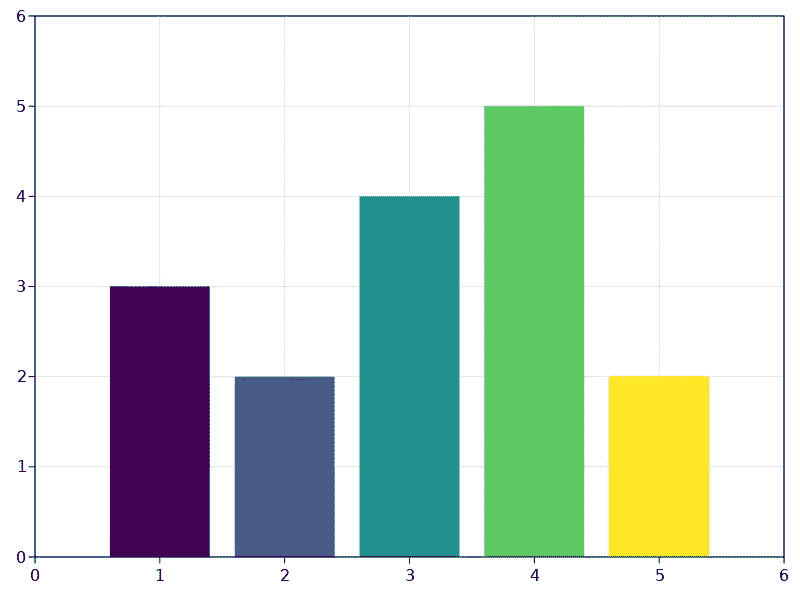

# 《朱丽亚》中的酒吧情节

> 原文：<https://levelup.gitconnected.com/makie-barplots-in-julia-2821dbe35366>

## 使用 Makie 绘图包制作堆叠和躲避栏


Makie 给了你很大的绘制条形图的灵活性，但是你如何使用这个功能并不总是显而易见的。

*Makie 参考文件:* [柱状图](https://makie.juliaplots.org/v0.15.1/examples/plotting_functions/barplot/)

为了解释 Makie 如何处理条形图，我们将从一个非常简单的图开始，然后逐渐添加更多的复杂性。如果你想跟着做，我建议你要么使用一个编辑器，比如可以显示图形的 VS Code，要么像我一样使用 [ElectronDisplay](https://github.com/queryverse/ElectronDisplay.jl) 包。简单的用`using ElectronDisplay`加载包应该就够了。

绘图函数的许多参数都接受数组或区域。棘手的是理解所有这些数组是如何相互关联的。为了帮助解释，我们将从一个简单的情节开始:

```
xs = 1:5
ys = [3, 2, 4, 5, 2]
cs = 1:5
barplot(
   xs,          # Where to place each bar
   ys,          # Height of each bar
   color=cs,    # Color of each bar
)
```

每一条都在 x 轴上的位置`xs[i]`处标有高度`ys[i]`和颜色`cs[i]`。因为`xs[2] == 2`，第二个条(蓝色)将绘制在位置二。之所以是蓝色，是因为`cs[2] == 2`和当前配色方案中的第二种颜色是蓝色。



需要指出的一点是，你可以多次重复相同的 x 轴位置。接下来会发生什么？多个条被绘制在彼此之上。下面是一个执行此操作的代码示例:

```
fig = barplot(
      [1, 2, 3, 2, 1], 
      ys,
      color=cs,
)
```

在这种情况下，我们将紫色和黄色条放在相同的位置。紫色条的位置在 x 轴的 1 处，因为`xs[5] == 1`。因此，因为`xs[1]`和`xs[5]`具有相同的值，黄色和紫色条被放置在相同的位置。

绿色条被绘制在蓝色条的顶部。这是因为`xs[2]`和`xs[4]`都是 2。条形的位置改变了，但是它们的颜色保持不变，因为我们没有改变包含每个条形颜色的`cs`数组。


# 将棒堆叠在彼此之上

在一个接一个的上面画条通常更令人困惑，而不是更有帮助。然而，我们可以将它们堆叠在一起，这意味着它们不会相互混淆。

```
stk = [1, 1, 1, 2, 2]
fig = barplot(
      [1, 2, 3, 2, 1], 
      ys,
      color=cs,
      stack=stk,
)
```

这里的`stk`数组指定了堆叠顺序。它是这样工作的:`stk[i]`表示在位置`xs[i]`应该放置什么样的命令栏`i`。例如`1`杆和`5`杆在同一位置(`xs[1] == xs[5]`)。哪一条应该画在底部，哪一条应该画在顶部？

因为第五个(黄色)条将被绘制在顶部，第一个(紫色)条将被绘制在底部。我们对绿色和蓝色条进行类似的操作。


这些数字只是相对的，所以它们可能是任何东西。所以这会有完全相同的结果:

```
stack = [10, 5, 1, 20, 40]
```

请注意，我们在第三个(海绿色)条上设置了 1。我们在这里放什么数字并不重要，因为它不与任何其他条形图堆叠在一起。

在 Makie 中采用面向对象的条形视图可能有助于概念化。想象一个酒吧的定义是:

```
struct Bar
   xpos::Int         # where on the x-axis
   height::Number    # height along y-axis
   order::Int        # Stacking order
end
```

绘制条形时，绘图系统使用这些值来决定将其放置在何处以及多高。如果条形与另一个条形共享位置，我们指示绘图系统堆叠条形，那么`order`帮助定义在相同 x 轴位置绘制的条形的相对堆叠顺序。

# 同一位置的簇条(减淡)

我们可以围绕相同的位置对它们进行分组或聚类，而不是绘制相互堆叠的条形图。这叫*躲闪*。把`stack`换成`dodge`就行了。

```
stk = [1, 1, 1, 2, 2]
fig = barplot(
      [1, 2, 3, 2, 1], 
      ys,
      color=cs,
      dodge=stk,
)
```

在这个实验中，我注意到不同于叠加，数字的大小很重要。如果你使用更大的数字，你会得到更细的线条。在下面的图中，你可以看到紫色条和黄色条是如何并排放置的。

没有分组的海绿条，分开的距离更大。


# 配置条形图的外观

虽然这在官方文档中有所涉及，但获得一些关于如何修改条形图外观的提示还是很有用的。

## 选择条形的颜色

这里的`ColorSchemes`包非常有用。在他们的[目录](https://juliagraphics.github.io/ColorSchemes.jl/stable/catalogue/)中找到你喜欢的配色方案。

假设您找到了`Spectral_5`配色方案并喜欢使用该方案。然后，您以下列方式获取该方案中的颜色:

```
cs = ColorSchemes.Spectral_5.colors
```

`cs`将是一个颜色数组。每种颜色都是一个类型为`RGB{Float64}`的对象。它具有属性`r`、`g`和`b`来表示 0 到 1 范围内的红色、绿色和蓝色值。

您将这个颜色数组`cs`传递给`barplot`函数:

```
figure = barplot(xs, ys, color=cs)
```

## 配置轴的外观

x 轴、y 轴、下方带有数字的刻度线都是 Makie 中绘图的`Axis`对象的一部分。你可以想象你的条被画在一个由`Axis`对象定义的区域内。

在我们使用的例子中，Makie 已经自动为你创建了一个`Axis`对象。调用`barplot`时，可以通过命名参数配置这个轴对象。然而，我发现单独创建这个对象并调用`barplot!`更干净。与`barplot`方法不同的是，`barplot!`方法将图形绘制到您作为第一个参数提供的某个可视对象中。这通常是一个`Axis`对象，但也可能是一个代表整个页面的`Figure`对象。

有什么区别？Makie 可以制作一个内部有多个情节的图形。每个图都由一个`Axis`对象表示。

这是使用`Axis`对象调整绘图的 x 轴和 y 轴的范围。

```
# Create figure to hold multiple plots with resolution 1024x768
fig = Figure(resolution = (1024, 764))

# At location (1,1) create an axis to contain a plot
axis = Axis(fig[1, 1], limits=(0, 6, 0, 8))
```

数组访问在图形对象上有点滑稽。Makie 认为这个图形是一个由多个图组成的大网格。您将每个轴对象放在这个网格中的某一行和列上。这里我们把它放在第 1 行第 1 列。由于我们不再创建任何轴对象，当我们绘制它时，该轴对象将填充整个图形:

```
barplot!(axis, xs, ys, color=cs)
display(fig)
```

如果你认为这种方法对于一个简单的情节来说是乏味的，你可以用这种捷径表达完全相同的意思:

```
fig = barplot(xs, ys, color=cs,
          axis = (limits=(0, 6, 0, 8),)
      )
```

`axis`的参数是一组命名参数，通常会传递给`Axis`构造函数。我们可以添加更多的参数。这里我们指定不希望 x 轴上有任何刻度线:

```
fig = barplot(
          xs,
          ys,
          color=cs,

          # Define the Axis object
          axis = (limits=(0, 6, 0, 8), 
                  xticks=0:0),
       )
```

如果我们显式地构造了一个`Axis`对象，我们应该这样写:

```
axis = Axis(fig[1, 1], limits=(0, 6, 0, 8), xticks=0:0)
barplot!(axis, xs, ys, color=cs)
display(fig)
```

# 完整示例

我们可以把现有的知识放在一起，组成一个更复杂、也许更真实的柱状图示例。在这种情况下，我想灵活地绘制 1900 年不同国家的铁产量图。

这意味着我们需要对我之前展示的简单情节进行一些改变:

1.  每个条形都应该有一个文本标签，表明一个国家，而不仅仅是一个数字。我们使用`xticks`到`Axis`的参数来控制这一点。
2.  使用`Axis`对象的`ylabel`参数指定沿 y 轴的单位。

这个功能`ironproduction`，可以让我选择一些我想要绘制铁矿产量的国家。

```
# Numbers given in million metric tons
const ironprod = Dict(
                "USA"=> 28.0, 
                "Germany"=>12.7, 
                "France"=>5.5, 
                "UK"=>14.2, 
                "Sweden"=>2.6, 
                "Soviet"=>6.0, 
                "Luxembourg"=>6.1)

function ironproduction(countries)
    fig = Figure(resolution = (1024, 600), font = noto_sans)

    xs = 1:length(countries)
    ys = [ironprod[country] for country in countries]

    axis = Axis(fig[1,1],
                 xticks = (xs, countries),
                 ylabel = "million metric tons",
                 title = "Iron ore production (1900)")

    ylims!(axis, (0, 30))

    barplot!(axis, xs, ys, 
        color=xs,          # Colors picked from the color table for each bar
        bar_labels=:y,     # Put value labels on top of each bar
        width = 0.7        # Width of each of the bars in relation to xs values
    )

    return fig
end
```

我们可以调用这个函数来绘制一个图:

```
fig = ironproduction(["Germany", "UK", "USA"])
display(fig)
```

您可以注意到这里的一些差异。我们使用`ylims!`函数在`axis`对象创建后修改它的限制，而不是用`limits`参数指定它。让我们更仔细地看看这部分是如何工作的:

```
xticks = (xs, countries)
```

它说对于 x 轴位置`xs[i]`，我们应该使用`countries[i]`中的文本标签。在这种情况下，如果有 4 个国家，`xs`将只是一个范围`1:4`。


# 关于策划的相关故事

之前的故事讨论了 Julia 中的绘图术语和其他绘图框架。我过去使用 Plots.jl，但我认为 Julia plotting 的未来是 Makie。

*   [绘图和图形术语](https://erik-engheim.medium.com/plotting-and-graph-terminology-f2b26cb72b77) —什么是数列、数据源和轴？
*   [使用表格中的数据进行机器学习](https://erik-engheim.medium.com/working-with-data-in-tables-for-machine-learning-6d7e1bb5bcd7) —数据帧的创建、下载和基本使用。
*   [放弃 Excel，使用 Julia 数据框](https://erik-engheim.medium.com/working-with-tables-in-excel-vs-julia-da674417dc86) —使用 Julia 重新创建电子表格中使用的常见操作。加载数据，检查数据并分组。
*   [用 Julia 和牛虻对披萨数据进行切片和切块](https://erik-engheim.medium.com/slicing-and-dicing-pizza-data-with-julia-1c6f8b17e278) —通过摆弄披萨数据并绘制它来介绍 Julia 数据帧。
*   [Plots.jl 参考卡](https://github.com/sswatson/cheatsheets/blob/master/plotsjl-cheatsheet.pdf) —常用 Plots 包中的功能概述。
*   使用 Julia 分析世界数据，这是一个更现实、更先进的例子，可以观察 GDP、失业、政府支出以及如何提取和绘制相关数据。