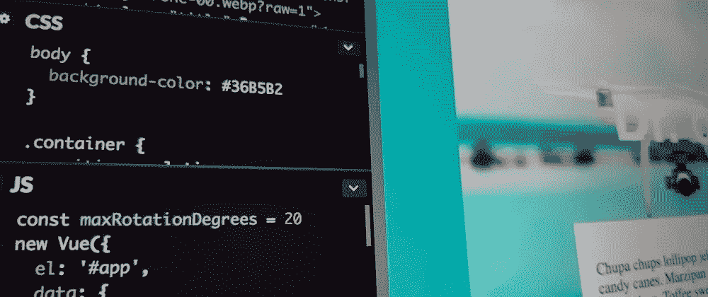
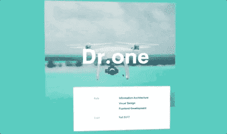
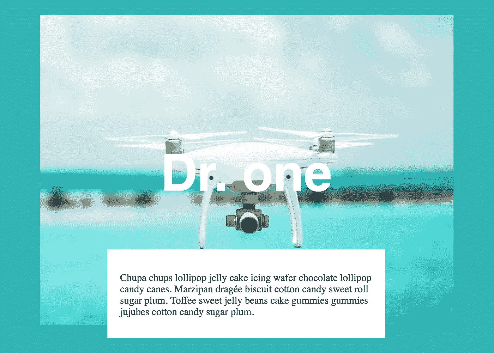
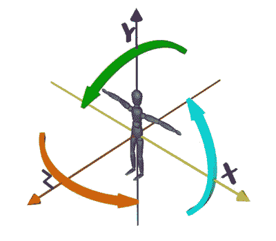
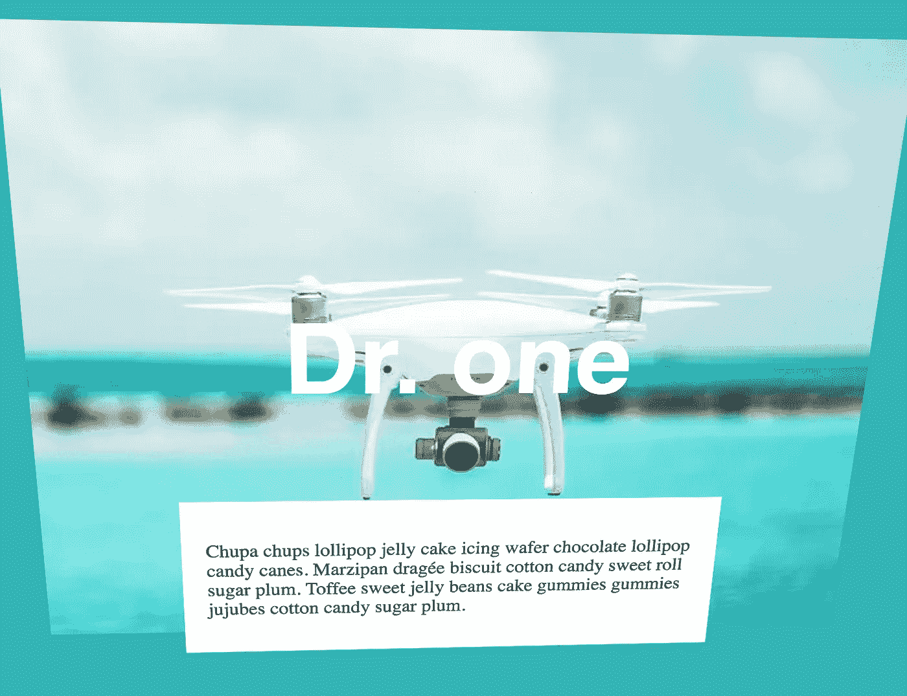

# 制作 3D 动画小部件

> 原文：<https://levelup.gitconnected.com/making-a-3d-facing-widget-8ab51a9eb573>



欢迎来到“每周小部件”系列，在这里我拍摄了令人敬畏的 UI/UX 组件的 gif 或视频，并用代码将它们赋予生命。

> *查看本周文章* *中的所有* [*小部件，并关注 Gitconnected，确保您不会错过任何即将到来的小部件教程*](https://levelup.gitconnected.com/wotw/home)

这一次，我们将创建一个 3D 小部件，当我们在屏幕上移动光标时，它会“看”着光标。

灵感来自于史蒂文·汉利创造的运球，看起来是这样的:



## 准备

对于今天的小部件，我们将使用 [Vue.js](https://vuejs.org/) ，对于“环视”动画，我们将使用 [TweenMax](https://greensock.com/tweenmax) 。

如果你想继续，你可以派生这个已经有依赖关系的 [codepen 模板](https://codepen.io/ederdiaz/pen/bMLbNp)。

## 初始标记

对于这个组件，标记应该非常简单。我们需要我们的应用程序，一个容器，里面有一个图像，标题和一些随机文本的卡片。

```
<div id="app">
  <div class="container center">
    
    <h1 class="title">Dr. one</h1>
    <div class="card">
      <p>
        Chupa chups lollipop jelly cake icing wafer chocolate 
        lollipop candy canes. Marzipan dragée biscuit cotton candy 
        sweet roll sugar plum. Toffee sweet jelly beans cake 
        gummies gummies jujubes cotton candy sugar plum.
      </p>
    </div>
  </div>
</div>
```

您可能已经注意到，我们已经添加了一些类，以便在下一步中设计每个节点的样式。

## 式样

首先，为了匹配参考背景，我们将简单地放入以下规则:

```
body {
  background-color: #36B5B2
}
```

下一步，我们将中心的容器，也增加了一些上限，所以它有一些移动空间在顶部。

```
.container {
  position: relative;
  margin-top: 40px;
}

.center {
  display: flex;
  align-items: center;
  justify-content: center;
}
```

`position: relative`属性将允许我们操作带有`absolute`定位的内部元素，而不会让它们超出原始容器(除非我们希望它们这样做)。

标题将水平居中，略低于垂直中心(`top: 150px`)，我们将尽量匹配字体大小和家庭。

```
.title {
  position: absolute;
  top: 150px;
  text-align: center;
  color: white;
  font-size: 80px;
  font-family: Helvetica, Arial, Sans-Serif;
}
```

然后卡片将类似地定位在水平中心，但这次它将在图像下方一点(`bottom: -20px`)，并具有固定的`height`和`width`:

```
.card {
  position: absolute;
  background-color: white;
  bottom: -20px;
  padding: 20px;
  width: 400px;
  height: 100px;
}
```

之后，我们应该有这样的东西:



## 行为

在我们开始编写 Vue 应用程序之前，让我们分析一下实现所需动画需要什么，让我们再看一下参考资料:


在这种情况下，我们的输入将是鼠标位置，根据它我们应该改变容器的旋转。这种旋转应该被控制，因为我们不希望对象旋转 360 度，它实际上只旋转了足够多的角度来获得它面对鼠标的感觉，我说每个方向大约 20 度。

现在，我们可以用这些知识来设置我们的 Vue 应用程序，让我们声明一个带有自由度的常数和几个数据属性来跟踪对象旋转:

```
const maxRotationDegrees = 20
new Vue({
  el: '#app',
  data: {
    rotX: 0,
    rotY: 0
  }
})
```

下一步是添加一个方法来跟踪鼠标位置，我们希望知道它在应用程序中的位置，而不仅仅是小部件，所以我们需要在主 HTML 节点中添加一个`mousemove`处理程序，如下所示:

```
<div id="app" @mousemove="mouseMoved">
  <!-- the rest of the markup -->
```

需要创建`mouseMoved`方法，在该方法中，我们将使用事件的`pageX`和`pageY`属性获取鼠标位置。之后，我们将标准化输入，乘以自由度，最后将它们存储到我们的`rotX`和`rotY`属性中:

```
// vue app ...
  methods: {
    mouseMoved (e) {
       // This gives us a number between -1 and 1
       const mousePercX = (e.pageX / document.body.clientWidth) * 2 - 1
       const mousePercY = (e.pageY / document.body.clientHeight) * 2 - 1

       this.rotX = mousePercX * maxRotationDegrees
       this.rotY = mousePercY * -maxRotationDegrees
    }
  }
```

为了开始在我们的小部件中看到一些移动，我们需要改变它的样式，所以我们将创建一个名为`rotation`的计算属性，它将生成应用于小部件的 CSS 转换:

```
// vue app ...
  computed: {
    rotation () {
      return {
        transform: `perspective(1000px) rotateY(${this.rotX}deg) rotateX(${this.rotY}deg)`
      }
    }
  },
```

你可能已经注意到，我们有带有`rotX`属性的`rotateY`属性，以及带有`rotateX`属性的类似属性，这不是一个错误。

发生的情况是，当在 3D 空间中旋转对象时，`Y`轴中的旋转使对象水平地改变其朝向，而`X`轴中的旋转使其垂直地改变朝向。

您可以在下图中更清楚地看到，橙色箭头对应于`rotateY`属性，绿色箭头是`rotateX`属性:



解释完之后，我们现在可以在内联样式属性中将这些转换添加到我们的小部件中，如下所示:

```
<!-- app -->
   <div class="container center" :style="rotation">
```

如果我们测试，我们应该看到小部件移动…但有些不对劲，对象完全是平的:



即使我们在计算的`rotation`中添加了一个透视属性，我们仍然需要改变内部零件的`z`位置。看起来应该是图像在后面，标题在中间，卡片在前面，所以让我们稍微改变一下他们的 CSS:

```
.image {
  transform: translateZ(-100px);
}

.title {
  /* other props */
  transform: translateZ(20px);
}

.card {
  /* other props */
  transform: translateZ(100px);
}
```

Mmmh 看起来还是平的…

在阅读了一些[文档](https://www.w3schools.com/cssref/css3_pr_transform-style.asp)之后，我发现一个节点的子节点总是扁平的，除非你明确地说不是这样，所以我们需要在我们的容器中添加以下属性:

```
.container {
  /* other props */
  transform-style: preserve-3d;
}
```

这将允许节点的子节点在 3D 空间中正确呈现。

我们可以说我们完成了，但我觉得动画有点僵硬。我们可以通过用这样的补间替换`mouseMoved`方法的最后一部分来平滑它:

```
// mouseMoved...
      // remove these
      // this.rotX = mousePercX * maxRotationDegrees
      // this.rotY = mousePercY * -maxRotationDegrees

      // add this
      TweenLite.to(this, 0.5, {
        rotX: mousePercX * maxRotationDegrees,
        rotY: mousePercY * -maxRotationDegrees
      })
```

而现在最后的结果！

这就是本周的**小部件。下周见，关注 [gitconnected](https://levelup.gitconnected.com) 获取每周小工具！**

如果你渴望更多，你可以查看其他 WotW:
— [卡片悬停动画](/cards-hover-animation-wotw-7d1304f16ec6)
— [滚动卡片列表](/making-a-scrolling-card-list-wotw-bcd5e31fbcc5)
— [动画导航](/making-an-animated-nav-component-wotw-e94b6bca04c4)

另外，如果你想看下周的某个小部件，可以在评论区发表。

*最初发表于* [*埃德迪亚兹*](http://ederdiaz.com/blog/2018/07/04/making-a-3d-facing-widget/) *。*

[](https://levelup.gitconnected.com/)