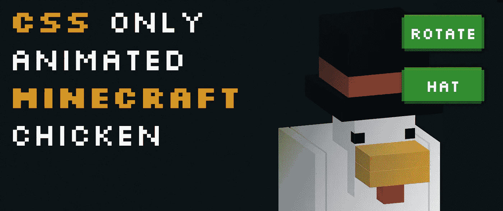

# 制作一只 CSS《我的世界》鸡

> 原文：<https://levelup.gitconnected.com/making-a-css-only-minecraft-chicken-5f5c5214e2b5>



有很多关于如何在 CSS 中制作立方体的文章。然而，令人惊讶的是，关于如何在 CSS 中制作《我的世界》鸡的文章很少。因此，我想我会花几个小时做一只 CSS《我的世界》鸡，这个指南将带你了解我是如何做到的。

**这里是演示**，以及通过 CodePen 获得的完整代码:

这只鸡最酷的一点是，你可以给他一顶大礼帽，他就可以旋转。另外，如果你点击它，它可能会咯咯叫。

# 制作一只 CSS《我的世界》鸡

当我写文章时，有时有人会给我发消息说这是 **JavaScript** ，而不是 JavaScript——这让我怀疑它是否真的应该是 MineCraft。无论如何，每只《我的世界》鸡都是从一个 CSS 立方体开始的。制作 CSS 立方体相对简单。首先，我们从这个 HTML 开始:

```
<div id="chicken">
    <div class="c2">
        <div class="cube head">
            <div class="front"></div>
            <div class="bottom"></div>
            <div class="left"></div>
            <div class="right"></div>
        </div>
    </div>
</div>
```

…它本质上只是一个内部有四个边格的立方体。它只有四个边而不是六个边的原因是因为我喜欢用 CSS 元素来处理另外两个边。这里它还有一个名为`.c2`的父对象，因为如果你不这样做，CSS 就会开始做一些古怪的事情(比如以奇怪的方式堆叠块)。

完成这些之后，我们就可以开始制作立方体 CSS 了。CSS 样式的所有方面都相对相似，唯一的区别是我们如何转换它们:

```
#chicken {
  transform: rotateX(-15deg) rotateY(20deg);
  transform-style: preserve-3d;
  position: relative;
  left: 16rem;
  top: 16rem;
  transform-origin: 6rem 6rem;
  transform-style: preserve-3d;
  transition: all 0.1s ease-out;
  cursor: pointer;
}
#chicken .c2 {
  position: absolute;
  top: 6rem;
}
.cube.head {
  width: 6rem;
  height: 8rem;
}
.cube > div, .cube:after, .cube:before {
  content: '';
  position: absolute;
  height: 100%;
  width: 100%;
  transform-style: preserve-3d;
  background: white;
}
.cube:before {
  transform: rotateX(-90deg);
  transform-origin: 0 0;
}
.cube:after {
  transform: translateZ(-6rem);
  transform-origin: 0 50%;
}
.cube .left {
  transform: rotateY(90deg);
  transform-origin: 0 0;
  background: #eee;
}
.cube .right {    
  transform-origin: 100% 0;
  background: #eee;
  transform: rotateY(-90deg);
}
.cube .bottom {
  transform: rotateX(90deg);
  transform-origin: 100% 100%;
}
```

我选择使用`transform-origin`来简化立方体方法。有些人喜欢使用大量的`translate`变换，但我发现`transform-origin`是最简单的，需要重复的次数最少。我唯一需要用`translate`的地方是后片，就是上面的`.cube:after`。

这是因为我们需要围绕立方体的中心点旋转后片，虽然你可以做 3d `transform-origin`，但将后片平移到位也同样容易。这确实带来了一个关于 CSS 立方体的更恼人的事情，那就是如果我们改变立方体的大小，我们将需要改变背板的平移。因为我们的第一个`head`立方体已经被正确配置，这是可以的——但是对于其他部分，我们需要添加一些自定义的 CSS 行。

你还会注意到我们到处都在使用`transform-style: preserve-3d;`。这确保了物体**保持为** 3d。如果你去掉这个，立方体就不会形成，相反它会停留在一个平面上。

# 将我们的立方体移动到位

当你想出一个立方体后，剩下的就容易了。我们所有的立方体都是`position: absolute`，所以你需要做的就是复制和粘贴 HTML，更新你认为合适的颜色，并把它们转换成位置。在 CSS 中这是一个相当手工的过程，但是公平地说，在任何语言中都是如此。

为了让鸡更有趣一点，我给了他一个翅膀动画。为此，我制作了两个关键帧，它们简单地围绕一个点平移。然后，我将它应用于立方体的一个父类，在本例中是`.c12`和`.c13`。我添加了新的职业，分别叫做`flutter`和`anti-flutter`——因为两翼旋转不同。这里的动画永远运行。

现在唯一要做的就是更新`transform-origin`，因为我们需要围绕一个点旋转翅膀。

```
.flutter {
  animation: flutter 2s infinite;
  transform-origin: 0 0;
}
.flutter-anti {
  animation: flutter-anti 2s infinite;
  transform-origin: 1rem 0;
}
@keyframes flutter {
    0% {
        transform: rotateZ(0deg);
    }
    15% {
        transform: rotateZ(-35deg);
    }
    30% {
        transform: rotateZ(-15deg);
    }
    45% {
        transform: rotateZ(-70deg);
    }
    60% {
        transform: rotateZ(0deg);
    }
}
@keyframes aggressively-flutter {
    0% {
        transform: rotateZ(0deg);
    }
    15% {
        transform: rotateZ(-90deg);
    }
    30% {
        transform: rotateZ(-45deg);
    }
    45% {
        transform: rotateZ(-90deg);
    }
    60% {
        transform: rotateZ(-45deg);
    }
    75% {
        transform: rotateZ(-90deg);
    }
    90% {
        transform: rotateZ(-45deg);
    }
    100% {
        transform: rotateZ(0deg);
    }
}
```

# 添加帽子和旋转按钮

CSS 和 HTML 很奇怪。在其他语言中，可能会有特定的 UI 元素来允许我们在点击时触发 CSS 类。在 HTML 中，我们必须使用一个复选框，它连接到一个标签，当点击时会触发一个动画。帽子是预先创建的，使用与之前相同的立方体方法。然后，我们在 chicken HTML 上方制作一个标签和复选框:

```
<input type="checkbox" id="rotate" name="rotate" />
<input type="checkbox" id="hat" name="hat" />
<div id="controls">
  <div><label id="rotate-label" for="rotate">Rotate</label></div>
  <div><label id="hat-label" for="hat">Hat</label></div>
</div>
<div id="chicken">
    <!-- chicken goes here -->
    <!-- ... -->
```

现在，如果复选框被选中，我们可以使用**同级选择器**来触发动画。事情是这样的:

*   `label`充当我们的按钮。当用户点击它时，它是一个特定的`input`。对于`#hat-label`，是`for`带`name` **帽**的`input`。
*   所以当用户点击`label`时，它会选中复选框。这意味着我们可以使用`:checked` CSS 选择器来添加一些新的 CSS。

由于`.c14`、`.c15`和`.c16`是帽块，我们可以默认设置为`display: none`，然后显示是否勾选了`#hat`复选框:

```
.c14, .c15, .c16 { display: none; }#hat:checked ~ #chicken .c14, #hat:checked ~ #chicken .c15, #hat:checked ~ #chicken .c16 {
  display: block;
}
```

最后要做的是旋转，也是遵循同样的原理。相反，我们将在用户选中`#rotate`复选框时触发一个`animation`。这里我们还必须使用两个动画——一个用于未选中的，一个用于选中的。这样做的原因是，如果我们试图在取消选中复选框的情况下重新运行动画，CSS 可能会有点奇怪:

```
#rotate:checked ~ #chicken {
  animation: rotate 2s 1 forwards;
}
#rotate ~ #chicken {
  animation: anti-rotate 2s 1 forwards;
}@keyframes rotate {
    0% { 
        transform: rotateX(-15deg) rotateY(20deg);
    }
    100% {
        transform: rotateX(-15deg) rotateY(380deg);
    }
}
@keyframes anti-rotate {
    0% { 
        transform: rotateX(-15deg) rotateY(380deg);
    }
    100% {
        transform: rotateX(-15deg) rotateY(20deg);
    }
}
```

这样我们就有了一只非常酷的 MineCraft 鸡肉。

# 结论

使用 CSS 制作《我的世界》鸡从未如此简单。这个演示的完整代码可以在这里找到，所以如果你想的话，你可以玩玩它。我希望你已经喜欢这个用 CSS 构建 3d 对象的快速介绍，并且希望你也能构建你自己的东西。

# 分级编码

感谢您成为我们社区的一员！在你离开之前:

*   👏为故事鼓掌，跟着作者走👉
*   📰更多内容请查看[升级编码刊物](https://levelup.gitconnected.com/?utm_source=pub&utm_medium=post)
*   🔔关注我们:[推特](https://twitter.com/gitconnected) | [LinkedIn](https://www.linkedin.com/company/gitconnected) | [时事通讯](https://newsletter.levelup.dev)

🚀👉 [**加入升级人才集体，找到一份神奇的工作**](https://jobs.levelup.dev/talent/welcome?referral=true)