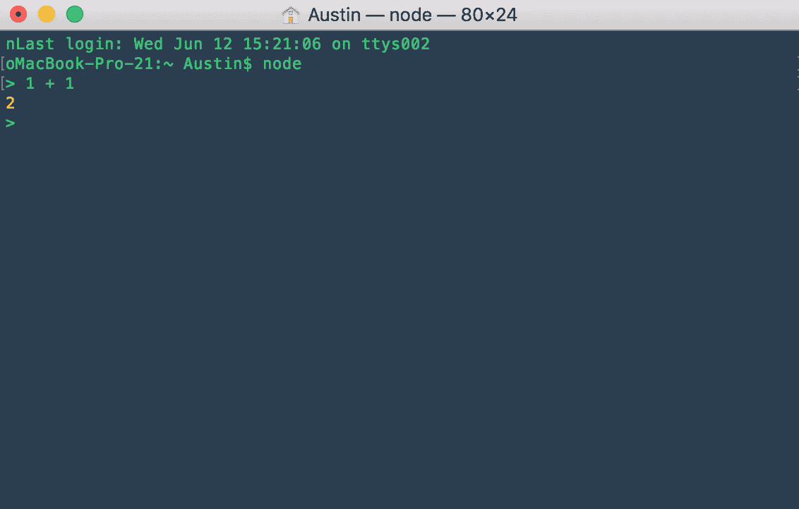

# 如何用 Discord.js 和 Node 构建自定义的 Discord Bot

> 原文：<https://levelup.gitconnected.com/making-a-custom-discord-bot-in-discord-js-1e17f2090919>

制作一个不和谐机器人从来没有这么容易过，尤其是如果你有一些编程经验的话。在本文中，我将带你使用 Discord.js 创建你自己的不和谐机器人。

**在我们开始之前，我想提一下，如果你技术不太熟练，你可以看看**[**Discord Bot Studio**](https://discordbotstudio.org)**，这是我创建的一个应用程序，允许你不用编码就可以定制机器人(现在免费！).现在让我们开始编码。**

在本文中，我们将:

1.  安装 Node.js 和 discord.js。
2.  从 Discord 获取我们机器人的证书。
3.  编写带有消息响应的命令。
4.  编写带有图像响应的命令。

我们首先需要的是 Node，我们将用它来安装 discord.js NPM 模块。你可以在这里下载节点[。您可以通过在命令提示符或终端中键入 **node** 进行测试，以确保安装了 node。然后，您应该能够在那里开始编写 Javascript 语句。](https://nodejs.org/en/download/)



这里有一个终端中的 node 的例子，计算语句 1 + 1，得到 2 作为输出。您可以在这里尝试运行任何其他 Javascript 语句。

现在我们已经有了节点，我们可以继续安装 discord.js 了。

在终端中运行以下命令:

```
npm install discord.js
```

现在我们已经安装好了，打开一个文本编辑器并创建一个名为`index.js`的新文件。然后在创建 index.js 的文件夹中运行以下命令:

```
npm init
```

这将创建一个`package.json`文件，供您的项目稍后使用。

我们现在将从不和谐中获得我们的机器人令牌。可以在这里找到:[https://discordapp.com/developers/applications/](https://discordapp.com/developers/applications/)


点击您的应用程序，或者创建一个新的应用程序(如果您还没有)。然后，您可以导航到“bot”选项卡来检索您的令牌。


现在我们可以将令牌粘贴到`index.js` 中的以下代码中(用我们上面复制的令牌替换`‘token’`):

```
const Discord = require('discord.js'); 
const client = new Discord.Client();  
client.on('ready', () => {   
    console.log(`Logged in as ${client.user.tag}!`); 
});client.on('message', msg => {  
    if(message.author.bot) return;
    if (msg.content === 'ping') {     
        msg.reply('Pong!');   
    } 
});client.login('token');
```

让我们看看上面的代码，它直接来自 discord.js 站点。

*   第一行需要 discord.js 模块，以便我们可以在项目中使用它。
*   第二行是实例化一个名为`client`的`new Discord.Client()`对象，这个对象会被频繁使用。
*   然后有两个事件处理程序，一个用于客户端准备好的时候，另一个用于客户端从服务器收到消息的时候。我们在消息处理程序中检查写消息的人是否是机器人，如果是，我们忽略它。

您可以看到，当收到文本为“ping”的消息时，我们调用`msg.reply(‘Pong!’)`。这意味着我们的机器人将写回‘Pong！’当它接收到命令“ping”时。

让我们来测试一下。在包含 index.js 和 package.json 文件的文件夹中打开命令提示符或终端，并在 CLI 中运行以下命令:

```
node index.js
```

这告诉我们的应用程序开始，如果一切设置正确，您将收到一条消息，说明机器人已经登录。


现在让我们邀请机器人加入服务器。返回到 Discord 开发人员网站，并导航到 OAuth2 选项卡:


在这里，您将选中 bot 复选框，然后向下滚动以设置您希望 bot 拥有的权限。


然后，您可以单击复制按钮获取您的邀请链接。只需在浏览器中粘贴邀请链接，就会提示您将机器人添加到服务器。

现在我们可以跳到 Discord，看到我们的机器人被添加到选定的服务器。


现在我们可以在聊天中写下我们的命令“ping ”,并查看我们的机器人的响应。


机器人回应了我们的命令，并标记了我们。

恭喜你。你有一个可以工作的机器人！那太好了，但是增加一些更有用的功能呢？

加个图片回应怎么样？让我们从上面扩展我们的代码:

```
client.on('message', msg => {  
    if(message.author.bot) return; if (msg.content === 'ping') {     
        msg.reply('Pong!');   
    }   if (msg.content === 'koala') {
        msg.reply('This is a koala!', {files:       ['[https://upload.wikimedia.org/wikipedia/commons/thumb/4/49/Koala_climbing_tree.jpg/480px-Koala_climbing_tree.jpg](https://upload.wikimedia.org/wikipedia/commons/thumb/4/49/Koala_climbing_tree.jpg/480px-Koala_climbing_tree.jpg)']}); }
});
```

我增加了一个新的条件来检查命令“考拉”。如果我们得到这个命令，我们将回复文本‘这是一只考拉！’以及一个图像 URL。

让我们再次启动我们的机器人并进行测试。


成功！我们使用相同的命令从机器人那里得到了文本和图像响应。

你可以想象如何扩展这些原则来制作一个更复杂的机器人，有更多的功能。

在下一篇文章中，我将讨论使用 discord.js 进行更高级的 botting，包括以下主题:

*   将命令存储在文件中，以便以编程方式读取。
*   处理服务器事件，比如用户加入通道，并对其进行操作。
*   命令前缀。
*   表情符号

如果你喜欢这篇文章，请随时查看[不和谐机器人工作室](https://discordbotstudio.org)，这是我做的一个应用程序，允许你不用编码就能创建机器人！你可以在那个链接注册成为测试用户(完全免费)。

[](https://gitconnected.com/learn/node-js) [## 学习 Node.js -最佳 Node.js 教程(2019) | gitconnected

### 排名前 44 的 Node.js 教程-免费学习 Node.js。课程由开发人员提交和投票，使您能够…

gitconnected.com](https://gitconnected.com/learn/node-js)