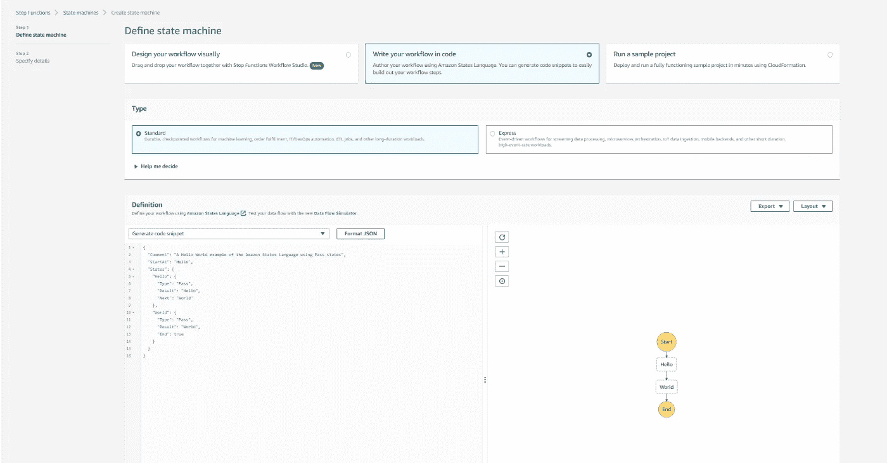

# 用 AWS API Gateway、Step 函数和 Python 制作一个梦幻英超变更推荐器

> 原文：<https://levelup.gitconnected.com/making-a-fantasy-premier-league-change-recommender-with-aws-api-gateway-step-functions-and-python-38a9648efdf>

去年，我用不同的算法在梦幻英超中运行了 100 个完整的 bot 团队，结果不一。我没有取得特别高的成绩，但我确实学到了很多。

随着新赛季的开始，梦幻超级联赛已经关闭了其 API 的认证请求，所以我今年不能做同样的事情。我以前的帖子现在没有那么有用了，因为你不能再自动更新你的团队了，但是我会把它们留下来。

我试图通过使用 Selenium 绕过身份验证限制，但验证码仍然保持不败。我不能再像在我的[上一篇文章](https://conor-aspell.medium.com/fpl-bot-part-3-adding-betting-data-to-the-algorithm-with-aws-step-functions-e553978dbe18)中那样每周更新 100 个团队，所以今年我将只使用一个。

这有利于 FPL 的整体健康，普通玩家会有更好的体验，因为他们不需要与成千上万的机器人竞争。

## 2022/23 赛季计划

今年，我将转向混合方法，而不是完全的 bot 方法。我将使用 Python 来推荐一个改变。并自己输入更改。

这是一个很好的机会来谈论我最喜欢的 AWS 服务之一， [AWS API Gateway](https://aws.amazon.com/api-gateway/) ，以及 API 设计。

AWS API Gateway 是一项允许我们快速、廉价地创建 RESTful APIs 的服务。

我们将制作一个 API，向 FPL 团队推荐变更。只需发送一个包含你的团队 ID 的请求，API 就会给出一个建议的修改和建议的队列。

## API 的布局

这是我对 API 设计的第一个想法。向 FPL API 询问用户团队，然后向 FPL 询问每个玩家的数据，然后回复一个团队变更。

这是一个标准的 ETL 设计模式。我们**从 API 中提取**数据，使用这些数据对每个玩家进行加权，**将**数据转换成推荐，然后**将**数据作为 JSON 响应加载。

然而，这种方法非常慢而且昂贵，它在 Lambda 内部做了太多的工作，每次调用它时都要执行这些工作。

一般来说，你会希望将尽可能多的工作转移到 Lambda 之外的每周工作中。在这种情况下，我相信我们可以将从 FPL API 获取所有球员数据并计算所有体重(进出体重)的工作转移到每周一次的工作中，并将结果存储在 S3 桶中。

我们仍然需要使用 FPL API 来获得请求的经理球员，但一旦我们有了他们，我们只需选择具有最高“重量”的球员，并选择具有最高“重量”的有效球员。

因为我们可以控制存储的内容，所以我们可以通过删除所有不必要的列来减少数据的大小。这是 REST APIs 的一个大缺陷，也是 GraphQL 越来越受欢迎的原因，使用 REST，您需要请求每一列，而使用 GraphQL，您可以指定您想要的列。减少每个请求中的列数是一个好习惯。

我们还可以增加投注数据收集，正如我在 p [上一篇文章](https://conor-aspell.medium.com/fpl-bot-part-3-adding-betting-data-to-the-algorithm-with-aws-step-functions-e553978dbe18)中所展示的，以做出更好的比赛难度评级。我们可以使用如下图所示的阶跃函数协调从多个来源收集数据。

改进的架构

## 制作阶跃函数的 Lambdas

我们将从图的上半部分开始，使用阶跃函数。

我在[的上一篇文章](https://conor-aspell.medium.com/fpl-bot-part-3-adding-betting-data-to-the-algorithm-with-aws-step-functions-e553978dbe18)中介绍了阶跃函数。阶跃函数是几个 lambdas 一起的编排。

我将重用我为那篇文章制作的 Odds Getter Lambda 以及一个新的 Lambda，它将从 FPL API 获取数据并将数据存储在 S3。

这是将你的 Lambdas 分解成阶跃函数的一大优势。您可以在其他 step 函数中轻松重用组件。

我将保持与我之前的[帖子](https://conor-aspell.medium.com/fpl-bot-part-3-adding-betting-data-to-the-algorithm-with-aws-step-functions-e553978dbe18)相似的玩家进出选择逻辑。我将使用权重来挑选应该被替换的球员，并推荐一名球员被替换。

我之前使用了加权随机性，因为我希望在一个大的团队中有多样性，这次我只想推荐最好的改变，因为我只和一个团队打交道。

这些重量将通过以下方式确定:

*   即将到来的比赛难度
*   球员的状态。
*   玩家的可用性。

我可以使用更多的数据，如球员所有权、FPLs 创造力、影响力、威胁指数或 FPLs 团队实力评级，但我不喜欢这些指标，因为根据我的经验，这将导致一个“模板”团队，我宁愿有一个更独特的团队。

我们可以从 FPL API 获得球员状态和可用性的数据，我们也可以获得他们的“比赛难度评级”，但我不喜欢它，更喜欢使用博彩赔率来评估比赛的难度。

**夹具难度——赔率获取器**

我们将使用 Odds API 向 William Hill 请求赔率，并将其保存在 S3 存储桶中。

代码非常简单，我们只需要从 odds api 请求数据，通过它循环构建一个包含球队和赔率的数据框架，然后将它放入一个 S3 桶中。

由于我们得到了当前提供的每一个游戏，包括不在这个游戏周发生的游戏，我们请求游戏周日期，并跳过在这个截止日期和下一个截止日期之间不发生的任何游戏。

我们使用今天的日期将它保存在我们的 S3 桶中。

这导致这个 csv 被存储起来供我们以后访问。

切尔西和曼城是本周的最大热门。

**获取 FPL 数据并计算权重-存储 FPL 数据**

从 FPL API 获取数据非常容易，我在以前的帖子中已经做过几次了。我们将:

*   获取数据
*   清理它
*   获取赔率数据
*   计算我们的重量
*   把它邮寄到 S3

FPL 有一个完全开放的 API，不需要密钥。唯一的问题是它包含了许多不必要的列。这样做的代码相当长，你可以在这里查看全部[。](https://gist.github.com/ConorAspell/1da59c7531b92d80b1087f8b51ac9d17)

决定哪个球员出局和替补上场是非常不同的，需要两个不同的权重。这是最主观的部分，我决定只增加一个球员的状态和难度等级，减去他们参加比赛的机会。

对于超重，我从 100 开始，用类似的方法减去分数。我决定降低守门员被替换下场的可能性。

所有这些导致 csv 看起来像这样，所以 API 只需要在运行时挑选出最好的播放器:

**制作步进功能**

一旦我们有了 2 个 Lambdas，进入[步骤功能](https://eu-west-1.console.aws.amazon.com/states/home?region=eu-west-1#/statemachines)控制台，点击“创建状态机”。

选择“用代码编写您的工作流程”

在左侧，您应该会看到一个允许您定义工作流的控制台，在右侧是您的状态机的可视化。

左手边的语言是用 [**亚马逊州语言**](https://docs.aws.amazon.com/step-functions/latest/dg/concepts-amazon-states-language.html) 编写的，非常简单。它允许你用你的 lambdas 创建任何状态机逻辑。

在这里，您在“function:”后面输入您的 AWS 帐号$ AccountNumber 和您的函数名。它应该会自动完成。

然后我们应该会在右侧看到类似这样的表示:

## 将规则附加到阶跃函数

导航到[亚马逊事件桥](https://eu-west-1.console.aws.amazon.com/events/home?region=eu-west-1#/rules)并转到“规则”。

选择“创建规则”并填写表格。

对于带有“每日”的名称，选择日程安排并说 1 天。

选择“步进功能步进机”和您的状态机。

最后点击“创建”。

推荐者背后的信息现在将定期更新。

## 创建 API 网关

现在我们已经完成了每周的工作，我们可以继续讨论 API 网关的 Lambda 了。

我们需要在这里做一些工作，但如果我们没有每周的工作，就不会做那么多。

我们需要创建一个响应对象来发送回请求者。

我们取出用户在请求中传递的团队 id，并使用它来获取他们的团队和他们的银行余额。我们还可以获得之前存储的数据。

我们简单地挑选出权重最高的玩家，过滤掉所有无效的玩家，返回权重最高的玩家。我们也推荐体重最高的首发队以及队长。

一旦你制造出兰姆达。我们可以很容易地把它变成一个 API。

单击 AWS 控制台上的“添加触发器”。

像这样填写添加触发器表单:

这将使每个人都可以访问你的 API，对于商业 API，你应该添加必要的密钥和安全性。

您应该在配置>触发器下看到这一点:

单击上面截图中的 API 网关资源名称(team-change-recommender-API)。

在 API Gateway 菜单中，单击 Actions>Create Method，然后从下拉列表中选择“Get”。

像下面一样填写表格。

最后，抓住你的端点，加上？team_id=和您的 FPL 团队 id，您可以从您的“积分”页面获得。比如我的是 3495082。我的观点是:

[https://23ak 5 JK AVL . execute-API . eu-west-1 . Amazon AWS . com/default/team-change-recommender？team_id=3495082](https://23ak5jkavl.execute-api.eu-west-1.amazonaws.com/default/team-change-recommender?team_id=3495082)

我得到一个回应，告诉我替换掉博特曼，因为他一直在纽卡斯尔队中进进出出，替换掉狼队的乔尼，因为他们的防守很强。

你可以把你的 ID 加入到上面的 URL 中，得到你自己推荐的改变和队长。

## 我这一季表现如何

上个赛季，我真的很难用完整的机器人方法做好，今年用我自己根据数据选择的混合方法，我做得更好，目前在全球排名 616 位(在超过 1000 万名玩家中！).

这部分是因为我选择了一个好的首发阵容，但我能够从糟糕的比赛中轮换，并做出一些聪明的替换，最大限度地提高我的分数，例如在一场比赛中用我的守门员波普换下桑切斯，这是我通常不会做的事情。我是全球头号爱尔兰富勒姆球迷。

是的，我是富勒姆球迷

如果你喜欢这个，请鼓掌，并随时关注我的媒体和 [LinkedIn](https://www.linkedin.com/in/conor-aspell/) 。