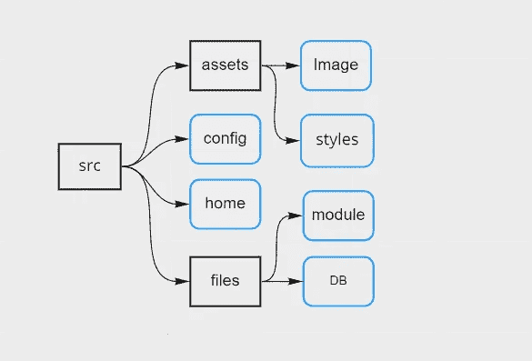

# 用 Typescript 制作文件路径映射器

> 原文：<https://levelup.gitconnected.com/making-a-file-path-mapper-with-typescript-7b10ad4ff0c8>

本教程是关于一个简单的算法，用于跟踪一个文件夹内和文件夹下的每个文件的路径。



文件路径映射思想

在本教程中，我将使用 TypeScript，但是您可以抽象出步骤和主要思想，并用您喜欢的语言重新创建这个算法

让我们开始创建一个`src`文件夹和一个`index.ts`文件。

在`index.ts`文件中，我们将为我们的算法创建 API，这意味着它将接收用户选项，并将它们传递给其他模块，并在解析完成后返回值。

从一个函数开始，这是我们的切入点。

```
interface FilePathMapperOptions {
  startDirectory: string
}

export function filePathMapper({ startDirectory }: FilePathMapperOptions) {

}
```

它接收一个`startDirectory`参数，这个参数正是我们的翻找入口点。映射将只获取起始目录中的文件。

现在创建另一个文件，`files-searcher.ts` ，这个文件将有实际进入文件夹和创建我们的地图的功能。

在 files-searcher.ts 中:

```
import { promises as fs } from 'fs'
import path from 'path'let paths: Array<string> = []
```

我们需要`fs`和`path`核心模块，并定义一个名为 paths 的变量来存储我们收集的路径。

声明一个名为`searchFiles`的函数。它接收一个名为`folderName`的参数，在第一次运行时，它将只是一个文件夹名，随着它的深入，它将是当前文件夹名+以前的文件夹名。

```
import { promises as fs } from 'fs'
import path from 'path'

let paths: Array<string> = []

export async function searchFiles(folderName: string) {}
```

使用方法`fs.readdir`，我们可以获得一个文件夹中所有文件和文件夹的名称，让我们遍历它们并获得文件/文件夹的统计信息。

```
import { promises as fs } from 'fs'
import path from 'path'let paths: Array<string> = []export async function searchFiles(folderName: string) {
  const folderChildren = await fs.readdir(folderName)

  for(const child of folderChildren) {
    const childPath = `${folderName}/${child}`
    const childStats = await fs.lstat(childPath)
  }
}
```

我们使用方法`fs.lstat`来获取关于文件/文件夹的信息，然后创建一个`childPath`常量来跟踪路径。

有了 childStats，我们可以使用像`isFile`和`isDirectory`这样的方法。对于每一种情况，我们都会有不同的情况:

*   **文件**:如果它是一个文件，我们获取该文件的完整路径并将其添加到路径中。
*   **目录**:如果是目录，我们使用`childPath`作为参数递归调用`searchFiles`。

循环结束后，我们可以返回`paths`值。

```
import { promises as fs } from 'fs'
import path from 'path'

let paths: Array<string> = []

export async function searchFiles(folderName: string) {
  const folderChildren = await fs.readdir(folderName)

  for(const child of folderChildren) {
    const childPath = `${folderName}/${child}`
    const childStats = await fs.lstat(childPath)

    if(childStats.isDirectory()) {
      await searchFiles(childPath)
    }

    if(childStats.isFile()) {
      const fullPathToFile = path.resolve(childPath)

      paths = [...paths, fullPathToFile]
    }

  }

  return paths
}
```

完成后，我们在`index.ts`上调用这个函数:

```
import { searchFiles } from './files-searcher'

interface FilePathMapperOptions {
  startDirectory: string
}

export function filePathMapper({ startDirectory }: FilePathMapperOptions) {
  searchFiles(startDirectory).then(console.log)
}

filePathMapper({
  startDirectory: 'src'
})
```

如果您运行这段代码，您将看到给定文件夹的内容。

这是基础，从中你可以写出更复杂的算法。

# 按扩展名查找并获取文件内容

我们可以更进一步，接收我们想要的文件扩展名列表。

但是在我们继续之前，现在我们的外部 API，也就是`filePathMapper`函数，只接受选项并直接传递给 *searchFiles* 函数。filePathMapper 函数对于在调用 *searchFiles* 函数之前进行一些检查或解析非常有用，但是如果您愿意，您可以直接调用 *searchFiles* 。

首先，添加扩展选项，并记住保持它的可选性。

**索引. ts**

```
import { searchFiles } from './files-searcher'interface FilePathMapperOptions {
  startDirectory: string
  extensions?: string[]
}export function filePathMapper({ startDirectory, extensions }: FilePathMapperOptions) {
  searchFiles(startDirectory, extensions).then(console.log)
}filePathMapper({
  startDirectory: 'src',
  extensions: ['html']
})
```

**files-searcher.ts**

```
import { promises as fs } from 'fs'
import path from 'path'let paths: Array<string> = []export async function searchFiles(folderName: string, extensions?: string[]) {
  const folderChildren = await fs.readdir(folderName)

  for(const child of folderChildren) {
    const childPath = `${folderName}/${child}`
    const childStats = await fs.lstat(childPath) if(childStats.isDirectory()) {
      await searchFiles(childPath, extensions)
    } if(childStats.isFile()) {
      const extension = child.split('.').pop() || ''
      const skipFile = extensions?.length
        ? !extensions.includes(extension)
        : false if(skipFile) continue const fullPathToFile = path.resolve(childPath) paths = [...paths, fullPathToFile]
    } } return paths
}
```

使用`child.split('.').pop()`我们可以得到所有点之后的最后一个单词，这可能是文件扩展名，这就是为什么我们把`|| ''`放在表达式后面，如果没有文件扩展名，它将是一个空字符串。

如果你有更好的方法来获得文件的扩展名，请留下评论，我将不胜感激。

使用这个扩展名，我们可以定义一个布尔值`skipFile`，它表示我们是否要从列表中跳过这个文件。

就这样，如果你愿意，你甚至可以使用`fs.readFile`来收集文件的内容，在这种情况下，你将不得不存储一个带有路径和文件内容的对象:

```
const fullPathToFile = path.resolve(childPath)
const fileContent = await fs.readFile(fullPathToFile)paths = [
  ...paths,
  {
    path: fullPathToFile,
    data: fileContent
  }
]
```

从现在开始，你可以添加任何你想要的新特性。

最后，让我们添加一个 try/catch 块来捕捉任何可能的错误，并设置它返回一个带有 ok 属性的对象，以显示该过程是否成功。

# 结论

这是一个简单的算法，我想为它创建一个 NPM 模块，但它太简单了，我想我会通过创建一个如何做的教程来提供更多帮助。我希望你喜欢它，任何问题留下评论。