# 从零开始制作一个抖动的 Todo 应用程序第 1 部分

> 原文：<https://levelup.gitconnected.com/making-a-flutter-todo-app-from-scratch-part-1-bd66608b1818>

链接 [***第二部***](https://medium.com/@hydroweaver/making-a-flutter-todo-app-from-scratch-part-2-47dadd3a0b96) 。

在多年告诉自己有一天我会开始制作移动应用程序后，我最近开始使用 flutter！嗯，我终于做了一个，虽然只是一个 todo 应用😅，这里有一个快速窥视。

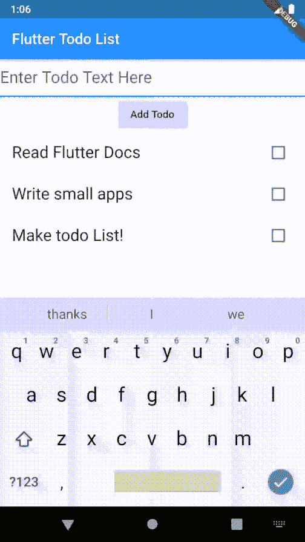

最初的动机来自卡勒·哈尔登的 YouTube 频道，从那里我去了 flutter 网站尝试。我以前尝试过 android 开发，但是从来没有能够真正突破教程的界限，做出一些可行的东西。出于某种原因，我发现在 flutter 中构建速度更快。

正如你将看到的，它不仅仅是一个 ***单个*** 文件，而是 flutter 为你工作和产生你的输出而生成的一堆文件(这里是一个 app)。您不必担心所有的冗长，只需在主文件中编写您的代码，然后从那里开始。让我们在这篇文章中介绍一些基本步骤。

# **颤振背景**

1.  [Dart 编程语言](https://dart.dev) —他们说如果你懂 Java 或者任何面向对象的语言会更容易，但是我不懂 Java，我只会写***public static void main***😆。然而，我确实知道变量和类以及一种语言提供的所有常见的东西，所以 [**dart 语言之旅**](https://dart.dev/guides/language/language-tour) 和[**flutter codelabs**](https://flutter.dev/docs/codelabs)将帮助你挑选你需要的东西，其余的如果不需要可以丢弃，懒洋洋地学习**。**
2.  **Android Studio / Visual Studio 代码——这是您编写 dart 代码来制作这些酷应用程序的地方！**
3.  **就是这样！让我们开始吧…让我们试着在这篇文章中制作出最初的框架，不管它看起来有多好/多坏，让我们开始运作吧。**

# ****待办事宜应用的架构****

1.  **如果你看过任何 flutter 视频或教程，你不会错过听到**“在 flutter 中，一切都是小部件”，**这是非常正确的，但它对一个刚刚从头开始的程序员没有帮助。对于初学者来说，这听起来好像你可以排列一堆小部件，应用程序将自己工作。总有样板代码形成应用程序的结构、循环、条件、类、状态等。我经历了思考**“如果一切都是部件，为什么我不理解这个”！！。****
2.  **但是你可能会问，什么是小部件？看看下面的 GIF，它们实际上是不同种类的编程容器(代码盒),完成一些特殊的任务。最棒的是，正如第一点所说，你可以将它们嵌套在一起，以增加新的东西，我们的 Todo 应用程序(见下图)本质上是嵌套的小部件，不要担心小部件的名称，我们稍后会介绍，你现在看到的是小部件中的小部件中的小部件 ***、小部件中的小部件*** ！没有人告诉你，在任何教程中，都是那些你不想/不需要知道的冠冕堂皇的东西。**

**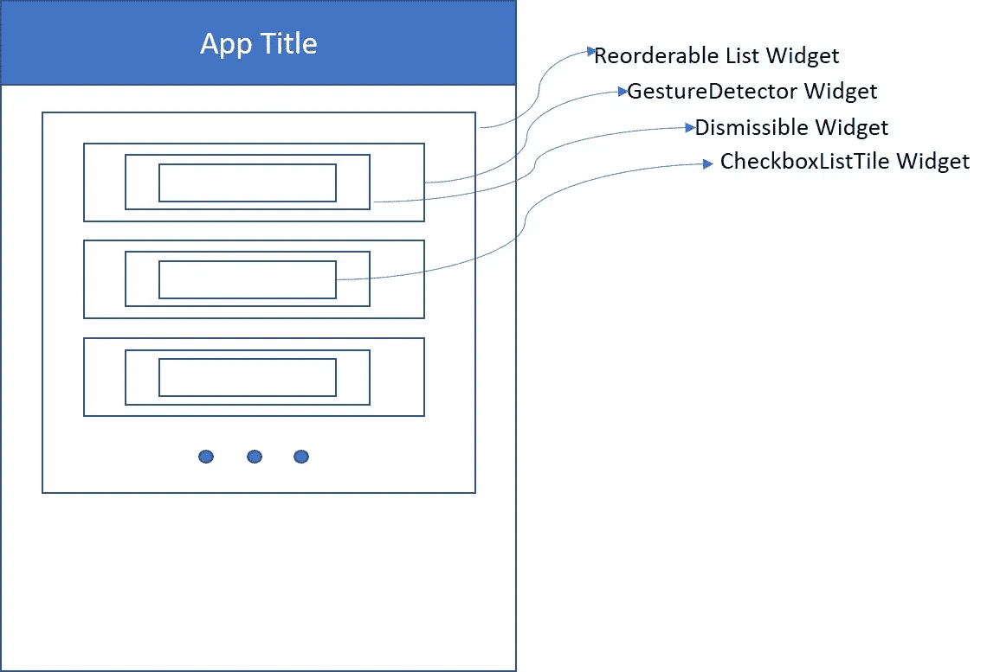**

**小部件中的小部件小部件中的小部件！**

# ****Todo 用户故事****

**作为一个相对简单的 Todo app，我们正在努力实现以下功能，这是我们的**用户故事**，这受到了很多来自 [**手表&代码**](https://watchandcode.com/) **的影响。**注意，我们制作这个应用程序没有先后顺序，有很多更好更有效的方法，但这是我的理解。**

*   **我应该可以添加一个待办事项**
*   **我应该能够删除待办事项**
*   **我应该能够编辑待办事项**
*   **我应该能够将待办事项标记为完成**
*   **我应该能够优先考虑我的待办事项(向上或向下移动)**

# ****IDE 设置(在使用 Visual Studio 代码的 Windows 上)****

1.  **根据 Google 的 [**flutter 页面**](https://flutter.dev/docs/get-started/install/windows) 下载并设置 flutter。**
2.  **请确保您运行颤振医生的网页建议，这将有助于您解决任何问题的安装。**
3.  **不需要安装 Android Studio，用 [**Visual Studio 代码**](https://code.visualstudio.com/download) 工作就可以了。然而，如果你需要你，你必须遵循 Android 安装指南，也在同一页上。**
4.  **为 VS 代码安装 flutter 和 dart 扩展，只需在下面的截图中获取 Dart 和 Flutter 即可。**
5.  **如果你只是想运行 app 自己看看，这里的代码是[](https://github.com/hydroweaver/flutter_simple_todo)**。用 GIT 拉出来，在 VS 代码或者 Android Studio 里运行就行了。****

****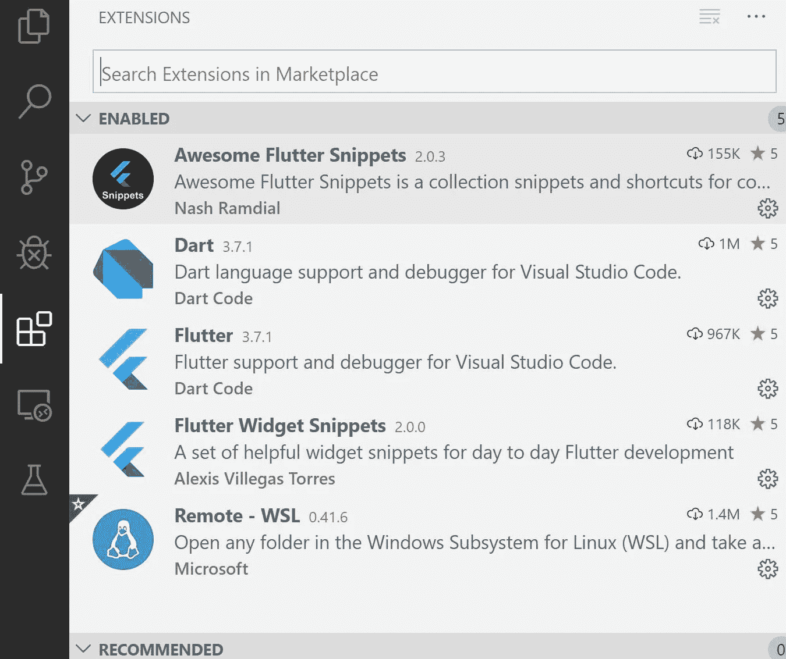****

****仅安装省道和颤振，如上所示****

# ****让我们编码****

****一旦你有了 IDE 设置，我们就可以创建一个新的项目。****

****在 VS 代码中按下 **Ctrl + Shift + P** ，你会看到一个下拉菜单出现。****

****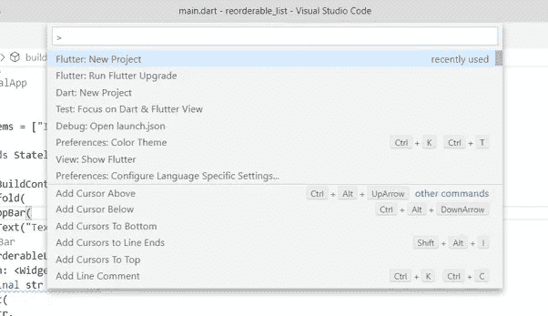****

****选择新的颤振项目，并给它一个容易理解的名字。****

****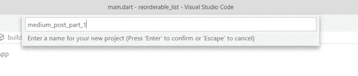****

****让 VS 代码发挥它的魔力，设置好一切。****

****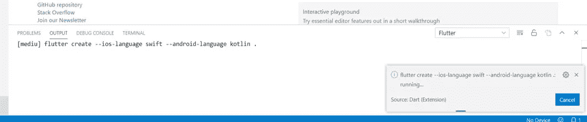****

****VS 代码会为你创建几个文件和文件夹，任其横行。****

****哦，还有，在调试和运行期间，你要安装一个模拟器，它就像你系统上的一个虚拟手机应用程序，你可以在上面运行你所有的应用程序，让你的笔记本电脑散热板发疯！****

****现在，当您完成所有设置后，继续删除 test 文件夹，同时删除 main.dart 文件中的所有代码，我们将在这里编写自己的代码。****

****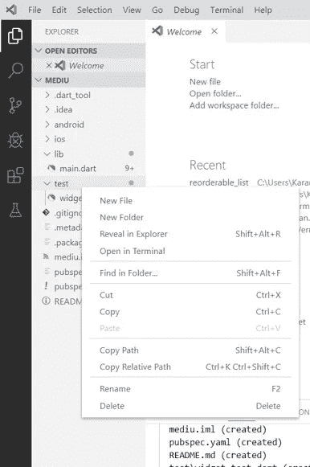****

****删除测试文件夹****

****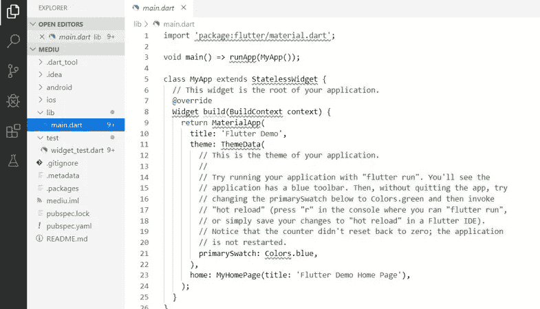****

****删除 main.dart 文件中的所有代码，我们将编写自己的代码****

# ******将有用的代码放入 main.dart 文件******

****Dart 使用 main 函数作为入口点，一旦进入其中，就需要使用 **runApp()** 函数，该函数本身调用 **MaterialApp()** 类构造函数。****

```
**void main(){
    runApp(MaterialApp(
          title: "Todo App with Re-orderable Lists & Swipe Cards", 
          home: App(),
     ));}**
```

****这意味着什么？意思是，如果我们在和编译器对话: ***“当主程序启动时，请运行我的材质设计小部件，它的名字是 App()，标题是“Todo App with……”***。****

****让我们来定义这个小部件…它基本上是一个类/一个容器/一个程序框/随便你怎么称呼它，但它是所有代码的转储区。****

```
**class App extends StatelessWidget{
}**
```

****所以在这一点上，有两件事你应该明白:****

1.  ****您尝试制作的 **App()** 是一个无状态小部件****
2.  ****此时不要担心什么是 StatelessWidget。****

****因此，它看起来像一个空类，此时什么也不做，甚至不显示任何内容，因为它不会运行。****

****所以我们添加了一些代码:****

```
**class App extends StatelessWidget{

    Widget build(BuildContext context){
    }}**
```

****我们使用了 **@ override** 关键字来告诉程序使用我们类的小部件，而不是超类的(StatelessWidget)小部件。但我只知道这些。所以继续前进…****

****下一行谈到小部件构建，它实际上是在用户界面中制作或创建应用程序。所有的小部件都需要一个 build 方法，顾名思义，这个方法负责在屏幕上修改应用程序的 UI。小工具与一种叫做元素的东西唯一地联系在一起，并且具有一对一的关系，你可以从 flutter 的 YouTube [**频道**](https://www.youtube.com/channel/UCwXdFgeE9KYzlDdR7TG9cMw) 了解更多关于这一点的信息。****

****BuildContext 类保存了小部件的 ***、*** 精神，所以你会在后面的例子中看到，但我们只是把它放在那里，让它流动。****

# ******我们在这里编码什么？******

****我们正试图做一个半生不熟的列表，可以重新排序。这份清单是我们最终要做的事情。如果你注意到开始的 GIF，我们可以使用可重新排序列表上下移动它们。****

****继续……让我们在应用程序的顶部添加一个栏，这是通过使用……猜……小部件来完成的！这个小部件叫做脚手架。****

```
**class App extends StatelessWidget{ Widget build(BuildContext context){ return Scaffold( appBar: AppBar( title: Text("First Empty Half Baked App"), ), ); }}**
```

****因此，我们要求我们的小部件构建方法将一个脚手架小部件膨胀到屏幕中(想象它是一个充满整个房间的气球)。你很快就会看到，它是一个主要的小部件，里面包含了所有其他的小部件。****

1.  ****Scaffold 接受几个参数，其中之一是 **appBar** ，它实际上是许多应用程序顶部的标题栏。****
2.  ****你认为我们应该给 appBar 分配什么？再猜一次…****
3.  ****一个小部件！这位女士想要一个小配件！所以我们给它一个…它的名字是，猜不到奖…AppBar()！哈！****
4.  ****AppBar()本身需要一些参数，其中之一就是 title。****
5.  ****标题是显示在应用程序顶部彩色栏中的文本。****
6.  ****然后…为了做到这一点，我们分配它，瞧！另一个部件！OMG！瓦特？****
7.  ****这个小部件是一个 Text()小部件，不要担心，没有更多的嵌套，我们只是将文本放在引号中。****
8.  ****看看***我们是如何轻松到达这里的…*******

*****使用 **F5** 运行应用程序，您将看到以下弹出窗口，如果您还没有创建仿真器，现在创建一个来编译和运行。*****

*****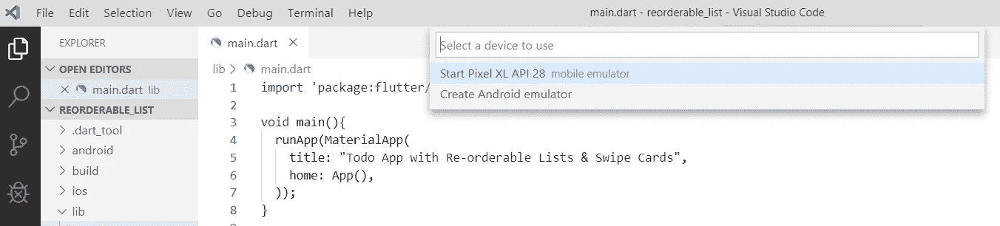*****

*****选择 Pixel XL 运行应用程序*****

*****IDE 需要一段时间来构建 app 和显示模拟器，所以你可以休息一下，休息一下再回来；-).你应该看看这个:*****

*****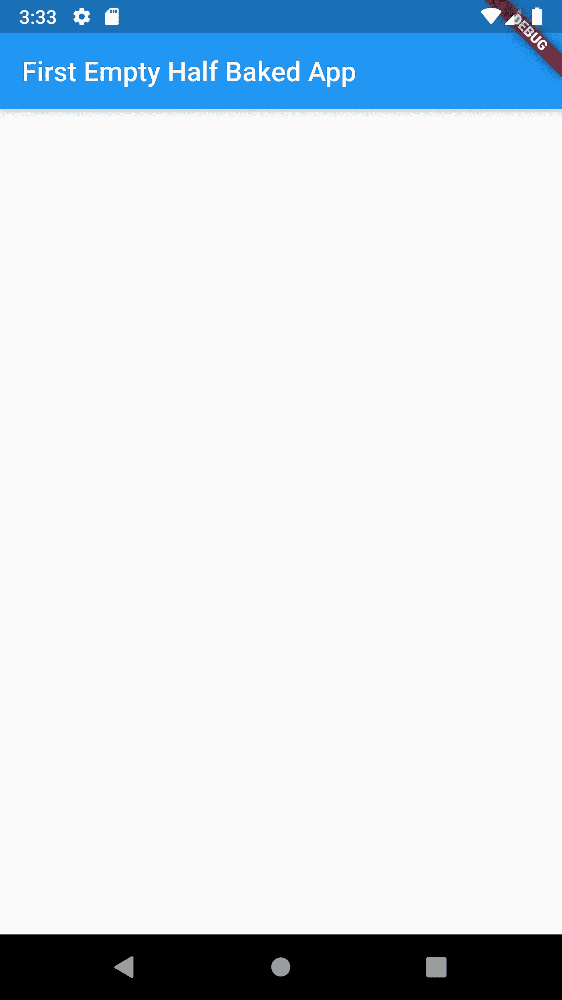*****

*******让我们给这张脸添加一个身体…*******

*****所以下一个部分，正如你在图片中看到的，是脚手架的主体，我们已经添加了 appbar。主体又像一个操作可编程对象的游戏区，让我们在那里添加一个列表，毕竟我们的 todo 应用程序将由文本 todo 组成。*****

```
***class App extends StatelessWidget{ Widget build(BuildContext context){ return Scaffold( appBar: AppBar( title: Text("First Empty Half Baked App"),),
            body: ReorderableListView( ), ); }}***
```

*****为了让这个主体有所显示，我们将初始化一个字符串列表。在主程序之后。*****

```
***List<String> items = ["Item 1", "Item 2", "Item 3"];***
```

*****因此，这些字符串将由可重新排序的列表显示，我们现在将讨论这个列表。*****

*****如果你**将你的指针悬停在 **ReorderableListView()，**你会看到它需要运行什么，它需要的东西之一是一个子列表和一个 OnReorder 函数。所以先灌孩子:*******

```
*body: ReorderableListView( children: <Widget>[ for(final value in items) Text( value, key: Key(value), ) ],),*
```

*****孩子*****

***你看，我们创建了一个 **For-In** 循环，它遍历我们之前定义的字符串列表。它从列表中取出**字符串**并将其嵌入到一个**文本小部件**中，我们在 appBar 中使用它来制作我们的标题。***

***行**children:<Widget>[]**意味着我们需要将 Widget 类型的 children 添加到可重新排序的列表视图中。***

***如您所见，Text()小部件接受一个必需的参数，即文本，在这里我们将循环中的**值**作为字符串传递给它。***

***您注意到的第二件事是 Key，它就像一个惟一的标识符，这不是 Text 所需要的，而是 ReorderableListView 所需要的。它要求所有的孩子都有一把钥匙。***

*****on order*****

***这是我们稍后将在帖子中检查的内容，所以我们只是将它作为一个虚拟函数。这样做可以防止我们出错，并帮助我们运行我们的应用程序，因为我们不能让它丢失。***

```
*onReorder: (OldIndex, NewIndex){},*
```

# *****TADA！*****

***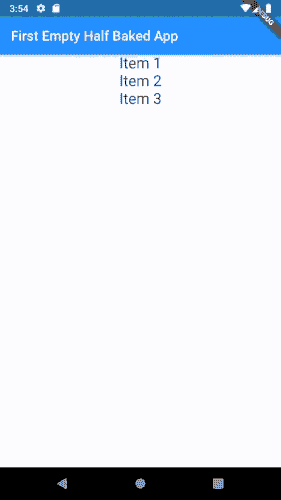***

***该文本看起来很小，让我们通过在文本小部件中添加几行来放大它。文本小部件，可以用 **CTRL + space** 来看，样式参数。***

***我们给它分配一个 textstyle 类，如下所示:***

```
*style: TextStyle( fontSize: 22.0),*
```

***这是结果…***

***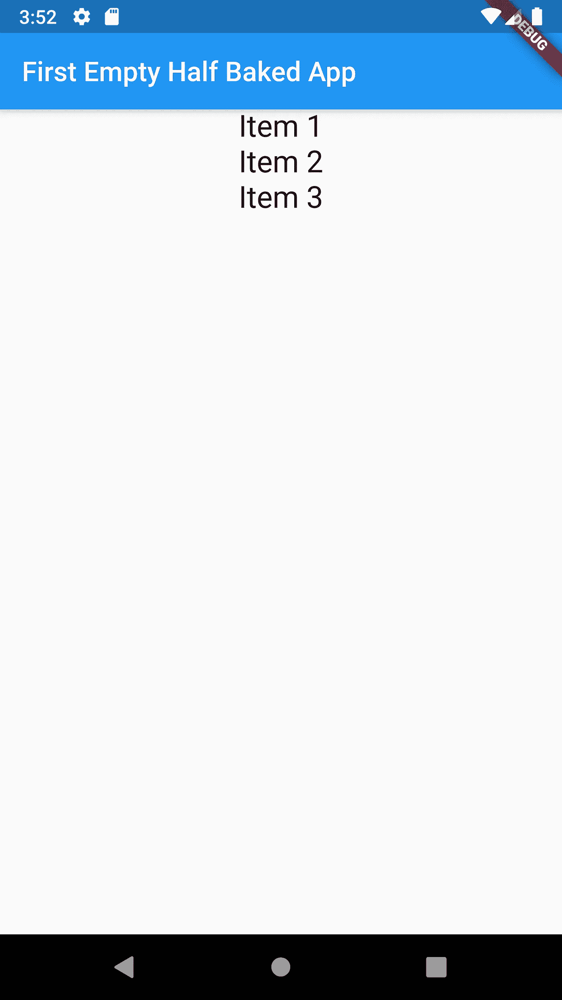***

***试着按住文本部分上下移动。***

# *****哑可再订购列表*****

***所以试着按住任何一个项目来上下移动它们，注意它们在做什么。不是很多，他们会搬家，但不要坚持新的位置，我想你可能知道为什么不会这样！***

***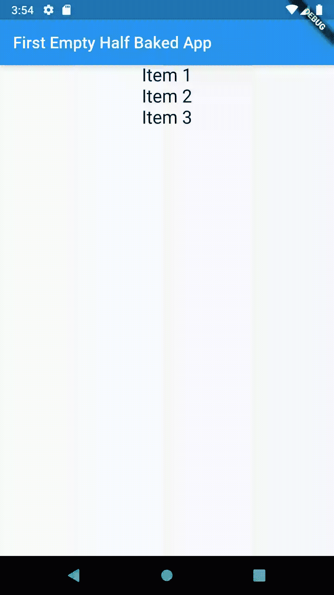***

***我们将在下一篇文章中讨论状态以及如何让它们坚持一个新的位置。在那之前好好享受吧。***

***链接到 [***第二部分***](https://medium.com/@hydroweaver/making-a-flutter-todo-app-from-scratch-part-2-47dadd3a0b96) 。***

***通过谷歌查看 [**当日小部件**](https://www.youtube.com/watch?v=3fB1mxOsqJE) 帖子了解更多。***