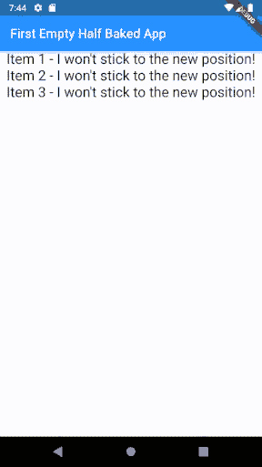
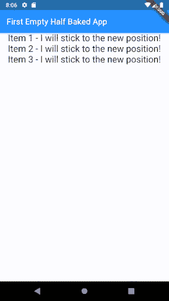

# 从零开始制作一个抖动的 Todo 应用程序第 2 部分

> 原文：<https://levelup.gitconnected.com/making-a-flutter-todo-app-from-scratch-part-2-47dadd3a0b96>

## 理解颤振状态

# 州

从我们上次制作的 [**哑 app**](https://medium.com/@hydroweaver/making-a-flutter-todo-app-from-scratch-part-1-bd66608b1818?) 向前看，让我们了解一下旋舞中的状态。当你的应用程序在用户界面上做了一些需要改变的事情时，状态就会改变。这里的国家文件是。让我们看看下面一些触发状态变化的例子:

1.  将待办事项切换为完成/未完成，可以更改应用程序的状态。
2.  从文本栏添加新的待办事项
3.  删除待办事项
4.  编辑待办事项
5.  ...任何需要改变视觉外观的变化。

让我们把这个放到应用程序中，我们的目标是 ***实际上让可订购列表项保持在它们的新位置。*** 可以想象，一个简单的变化，从一个位置到另一个位置，真的是状态变化。

为了在我们的应用程序中嵌入状态，我们需要稍微修改一下代码。

*   第一件事是将我们的应用程序更改为 **StatefulWidget** 类，这意味着它将是一个状态可以改变的小部件，而不像 **StatelessWidget** 那样本质上是静态的。
*   创建另一个类，它包含第 1 点中定义的 **StatefulWidget** 类的实现。

现在看起来确实很混乱，但很快就会有意义。这是我们的新班级。

应用程序已从 StatlessWidget 更改为 StatefulWidget

这是一个新的类，它现在保存了我们上次添加的实现，请注意，代码中只有**一处**更改，但应用程序以相同的方式工作，即**哑方式！**😉

未实施重新订购，仍然无效

注意到上面要点的第一行了吗？

新类 AppState 保存了 APP 类的**状态**

这个新类包含了我们上一次处理的类的状态 ***【实现】*** 的内部结构，但是其他什么都没有改变。我引用了“实现”这个词，因为如你所见，没有其他区别。真正的区别来自于实现中的**on order**函数。让我们添加一些代码。

# **on 命令**

可重新排序列表的想法是能够在这里和那里移动子部件，也就是说，在我们的应用程序行话中，在这里和那里移动待办事项。所以运动背后的想法很简单:

1.  当用户长按 todo 时，应用程序应该**从其现有索引中移除**todo，并将其保存在临时位置(或内存)中。
2.  当用户按住并在新的索引中插入悬停的待办事项时，应用程序应该**在新的位置(或内存)插入**待办事项。
3.  当切换发生时，UI 应该更新，用户应该能够看到变化。

# **setState()**

这就是本文中一个新成员出现的地方， **setState()** 函数。这个函数告诉框架重新绘制屏幕来显示新的状态。

这个函数只出现在 state 实现中，或者我们定义的新类中，通常和其他函数一样，除了它会触发一个重建以及你放入的任何定义。

在我们的例子中，**on order**函数应该调用 setState()函数来移动 todos。请记住，**on order**是**可重新排序列表的必需参数。**下面是新的**on order**调用:

现在，将所有这些放在一起，我们得到以下结果:

这里是我们的 ***非哑 re 可订购列表:***

开始了。

下面是最新 [**回购**](https://github.com/hydroweaver/flutter_simple_todo) 的代码。

查看下一个帖子 [**这里**](https://medium.com/@hydroweaver/making-a-flutter-todo-app-from-scratch-part-3-9bb7f1cf00af) 。