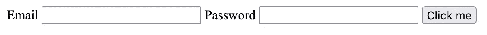

# 制作字体超赞子集

> 原文：<https://levelup.gitconnected.com/making-a-font-awesome-subset-a7175a6d3e8c>


[Font Awesome](https://fontawesome.com/) 的确很棒——但是无法回避的事实是，如果你只想要几个图标，那么它就不是一个轻量级的软件包。

四处寻找解决这个问题的方法，我发现 [Logan Graham](https://github.com/omacranger/) 写了一个很好的 JavaScript 包来解决这个问题，名为 [fontawesome-subset](https://github.com/omacranger/fontawesome-subset) 。

这将完成提取你想要的图标并重新打包成字体文件的工作，但是你仍然需要 CSS 文件来使用它们。

它只适用于 Font Awesome 5 . x——如果你想使用 6，那么看起来你需要使用 [Font Awesome Pro 工具包](https://fontawesome.com/plans)，或者[在 Github](https://github.com/omacranger/fontawesome-subset/issues/16) 上提出这个问题，并尝试解决它。:-)

在几次尝试将它部署到网站上，却忘记复制或运行*一些东西*之后，我决定是时候投资建立一个任务运行器了。

# 哪个跑步者？

我肯定还有更多，但我见过的有[大口](https://gulpjs.com)和[咕噜](https://gruntjs.com)。我需要一些方法来决定选择哪一个，而 GitHub repos 实际上让这变得相当简单。

# 吞咽

Gulp 自 2021 年年中以来一直没有更新，CI 测试失败，并且它[不支持 Node > = 14](https://github.com/gulpjs/gulp/issues/2654) 。

# 咕哝

Grunt 最近一次更新是在 3 天前(撰写本文时)，并且已经通过了 CI 测试。

所以，就咕哝吧。

# 演示网页

请注意，这篇文章不会带你实际使用 FA——这不是这里的重点。所以，如果下面的课程对你来说没有意义，去看看 FA 文档吧。

这是页面:

```
<html>
    <head></head>
    <body>
        <form>
            <label for="email">
                <i class="fas fa-envelope"></i>
                Email
            </label>
            <input type="email" id="email"/>
            <label for="password">
                <i class="fas fa-lock"></i>
                Password
            </label>
            <input type="password" id="password"/>
            <button type="submit">Click me</button>
        </form>
    </body>
</html>
```

现在我们看不到任何图标——我们还没有完成子集设置，也没有包含任何 CSS 文件。



我们将使用`livereloadx`包来提供内容，因为我们不必编写任何代码来使用它。我们将把这个命令添加到`package.json`中的脚本部分，以便于运行。

```
"scripts": { "serve": "node ./node_modules/.bin/livereloadx -s ." }
```

# 如何划分文件子集

毕竟，如果我们不能解决这个问题，剩下的就没有意义了。幸运的是，自述文件中的用法部分让这个问题变得相当容易解决。

导入`fontawesomeSubset`功能:

```
const { fontawesomeSubset } = require("fontawesome-subset");
```

然后我们用两个参数调用它。第一个是我们想要的图标的名称或名称数组(没有前缀`fa-`)。第二个是它应该在哪里编写将要生成的字体文件。

```
fontawesomeSubset([ 'envelope', 'lock', ], 'static/webfonts');
```

事实上，如果我们运行它，我们可以看到它的工作，或者至少产生一些输出。输出文件只是源文件大小的一小部分，这是令人鼓舞的。

```
$ node fa_subset.js
$ fd . -t f static/
static/webfonts/fa-solid-900.eot
static/webfonts/fa-solid-900.svg
static/webfonts/fa-solid-900.ttf
static/webfonts/fa-solid-900.woff
static/webfonts/fa-solid-900.woff2
$ du -hs static/webfonts/
20K	static/webfonts/
```

# 获取咕哝设置

首先让 Grunt 成功运行，即使它什么也不做。

Grunt config 可以存在于不同的地方，但是我选择把它放在`Gruntfile.js`来保持它的独立性。最简单的配置如下:

```
module.exports = function (grunt) {
  grunt.initConfig({
    pkg: grunt.file.readJSON("package.json") }) // We'll load any plugins here. // 'default' is run if you run Grunt without arguments.
    grunt.registerTask('default', []);
}
```

注意“默认”任务被注册，即使它不做任何事情。作为一个好的占位符，这也意味着如果你不带参数运行`grunt`，它不会产生错误。我们稍后将回到这一点。

就这样，它活了——尽管不可否认它没有说太多。

```
$ grunt

Done.
```

# 复制文件

为了使用网络字体，我们将使用字体 Awesome 包中的 CSS 文件。他们应该会自动加载我们提取的网络字体文件。提醒一下——这只适用于字体 Awesome 5.x，不适用于 6.x。

有一个`grunt-contrib-copy`包教 Grunt 如何复制文件。安装后的第一件事就是在 Grunt 设置功能中加载。

```
grunt.loadNpmTasks('grunt-contrib-copy');
```

从[的普通文档](https://gruntjs.com/configuring-tasks#building-the-files-object-dynamically)中我们可以看到我们需要:

*   `expand`选项，启用其他选项
*   `flatten`选项，将目标结果展平到一个级别。
*   `src`，列出源文件
*   `dest`，告诉 Grunt 把复制的文件放在哪里。

由此我们得到了一个像这样的配置对象。

```
grunt.initConfig({
  pkg: grunt.file.readJSON("package.json"),
  copy: {
    main: {
      files: [
        {
          expand: true,
          flatten: true,
          src: [
            'node_modules/@fortawesome/fontawesome-free/css/fontawesome.min.css',
            'node_modules/@fortawesome/fontawesome-free/css/solid.min.css'
          ],
          dest: 'static/css/'
        },
      ]
    }
  }
});
```

我们可以运行它，它说它复制了两个文件。让我们检查一下是否是正确的两个文件，它们在我们期望的地方。

```
$ grunt copy
Running "copy:main" (copy) task
Copied 2 files

Done.
$ fd . -t f static
static/css/fontawesome.min.css
static/css/solid.min.css
```

是的，看起来不错。

# 运行子集任务

现在让 Grunt 实际做子集设置。为此，我们将使用 [registerTask()](https://gruntjs.com/creating-tasks#basic-tasks) 函数，它提供了一个通用的“运行此函数”任务。它有以下原型:

```
grunt.registerTask(name, description, function)
```

所以，让我们试着插入我们之前写的函数。

```
grunt.registerTask('fasubset', 'Subset the FA icons.', function() {
  fontawesomeSubset([
      'envelope',
      'lock'
    ],
    'static/webfonts');
});
```

而且……它起作用了。那几乎太容易了！

```
$ rm -rf static
$ grunt fasubset
Running "fasubset" task

Done.
$ fd . -t f static
static/webfonts/fa-solid-900.eot
static/webfonts/fa-solid-900.svg
static/webfonts/fa-solid-900.ttf
static/webfonts/fa-solid-900.woff
static/webfonts/fa-solid-900.woff2
```

# 默认情况下运行任务

对于 Grunt config 的最后一点，让我们将默认任务改为运行 copy 和 subset，这样我们以后就可以不带任何参数地运行`grunt`。

```
grunt.registerTask('default', ['fasubset', 'copy']);
```

# 将 CSS 文件添加到网页

现在我们需要开始使用 CSS 文件，否则什么都不会发生。

```
<html>
  <head>
    <link rel="stylesheet" href="/static/css/fontawesome.min.css">
    <link rel="stylesheet" href="/static/css/solid.min.css">
  </head>
[...]
```

# 检查结果

最后，让我们再次检查网页——我们应该看到我们的图标已经出现了。


这就是全部了！我不得不承认，当我开始的时候，我预计会有更多的困难，但实际上 Grunt 设计得足够好，有意义，而且`fontawesome-subset`工作正常。我喜欢那样的包装。

你呢？你有什么有用的软件包想在评论中分享吗？

*原载于 2022 年 5 月 17 日 https://www.solarwinter.net**[*。*](https://www.solarwinter.net/making-a-subset-of-font-awesome/)*