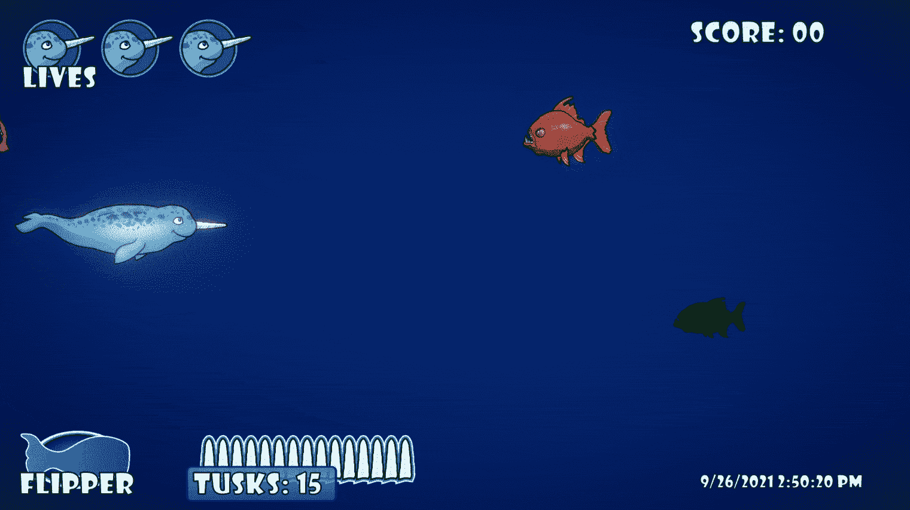
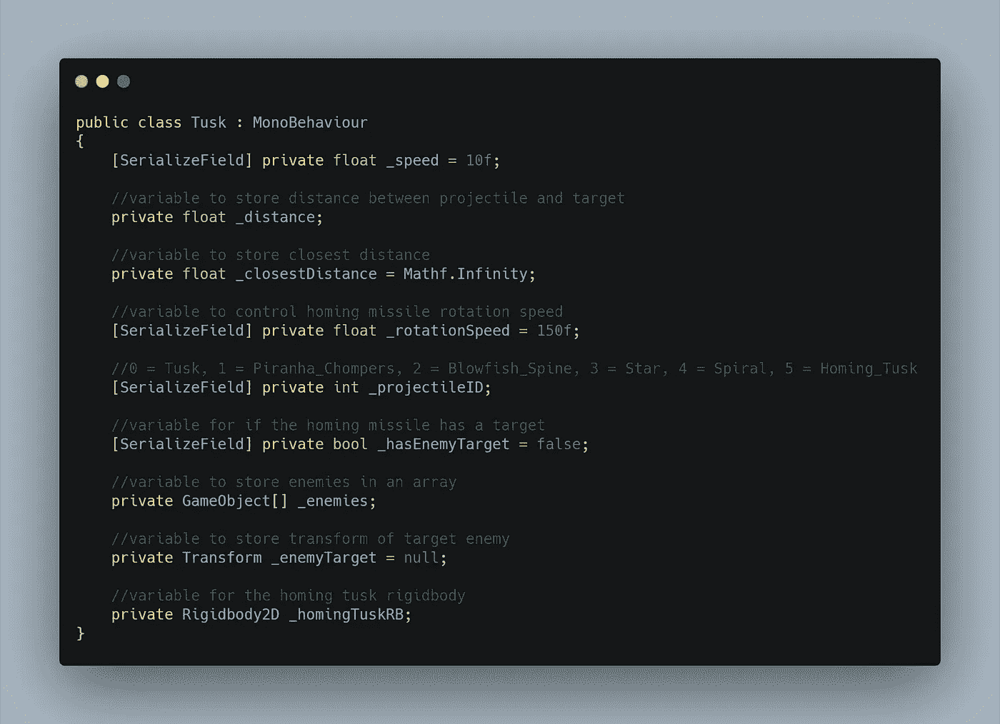
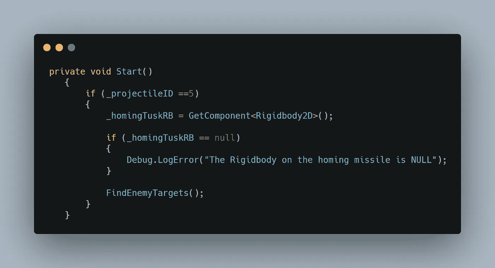
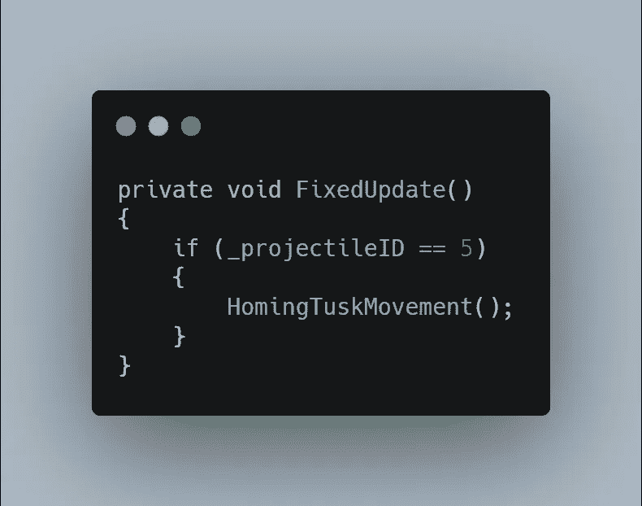
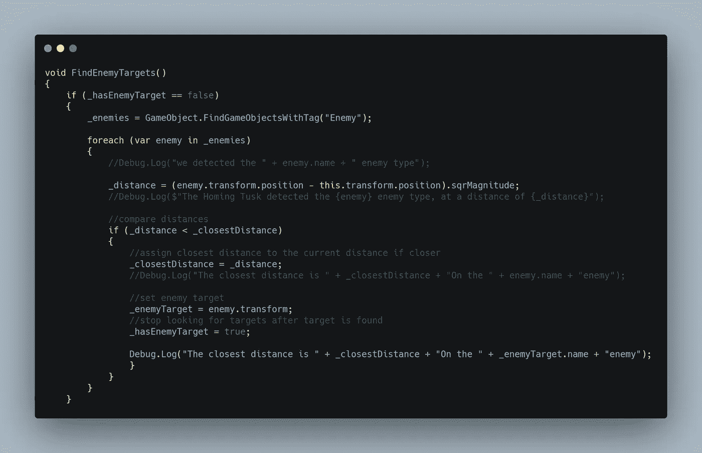
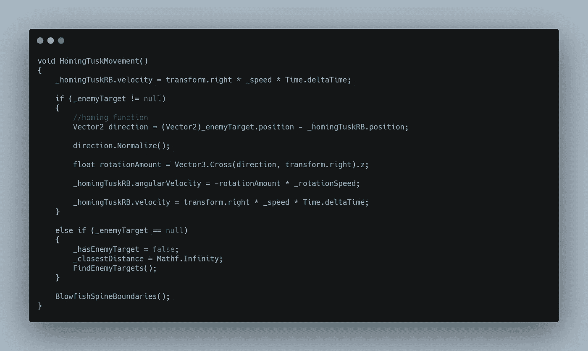
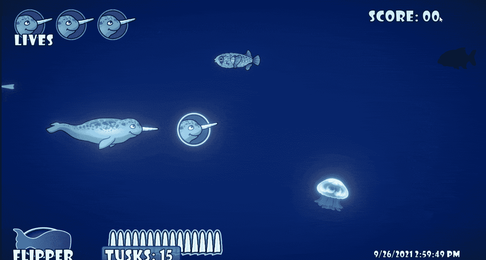

# 制造制导炮弹 2:瞄准行为

> 原文：<https://levelup.gitconnected.com/making-a-homing-projectile-2-targeting-behavior-9181e1899097>

在“寻的炮弹”系列文章的第二部分中，我深入研究了寻的行为。我这篇文章的**目标**是让*的归巢长牙*瞄准*最近的*敌人。我还想让它在*当前目标*被摧毁的情况下找到一个*新目标*，并在没有*目标*剩余的情况下恢复正常的*直线*前进*运动*。

这里在共享的**弹丸类** *【长牙】*中，我将需要一把**变量**。我有一个值为 **10** 的**速度** *变量*，我最终在**检查器**中将它重置为 **250** 。然后有一个**距离** *变量*用来保持寻的炮弹和目标之间的距离。有一个**最近距离** *变量*类似地存储目标之间测量的最近距离。这使得*被分配*给 **Mathf。无穷大**，将初始距离设置为井…无限！我有一个**转速** *变量*，以及一个**弹丸 ID** *变量*，这就是让我在所有弹丸类型之间共享这个脚本的原因。有一个**有敌方目标** *布尔*为**真**或**假**取决于是否有目标参与。**敌人**的**游戏对象** *阵列*会储存所有进入游戏场的敌人。然后**变换**变量*变量*会存储目标敌人的变换供追击。最后，我有一个**刚体 2D** *变量*用于抛射体，因为我将用它来移动它。

在*无效* **开始**中，我检查**弹丸 ID** 是否为 **5** *(归巢长牙)*。然后使用 **GetComponent** 通过从对象上抓取**rigid body 2d***变量*进行赋值。我**空检查**刚体以确保有一个，因为这个脚本需要一个来工作。最后，我把这种**发现敌人目标的** *方法叫做*。

沿着脚本向南移动，我使用一个**固定更新** *方法*来移动抛射体，被移动的是使用 Unity 的**物理**引擎。我再次检查**弹丸 ID** 为 **5** ，然后调用**寻的獠牙运动** *方法*。

这里是在*虚空*开始中调用的**发现敌人目标** *方法*。为了更深入地研究代码，**有敌人目标** *布尔*需要为**假**。如果我已经有了一个目标，我不想再找更多的了。**敌人阵** *变量*寻找**敌人**的**标签**的**游戏对象**，我所有的敌人都有。这将在他们进入游戏时将他们聚集到一个数组中。聚集场景中的敌人后，运行一个**foreach**循环来迭代**敌人数组**中的每个*个体*敌人**敌人**。然后测量**敌人** *变换*位置和**抛射体** *变换*位置之间的距离，以分配**距离** *变量*的*值*。这种计算针对敌人阵列中的每个敌人运行**，因此被称为 *foreach 循环！*下面的 **if 语句**询问，如果**距离** *变量*比**最近距离** *变量*少**，则可以输入。**最近距离**仍然设置为**无限远**，所以阵中第一个敌人会自动设置为最近。这是通过将**最近距离**的*值*指定为**距离**变量*来实现的。随着 **foreach** 循环的运行，如果发现另一个敌人比其他敌人距离更近，它将*重新分配*最近距离**变量**和*变量*为最近的目标之一。找到距离最近的游戏对象后，将**敌人目标** *变量*分配给**敌人.变换**，即特定的*局部* **敌人** *游戏对象*运行通过*循环*。既然射弹有了目标，那么**就有了敌人目标** *bool* 设置为 **true** 来阻止它寻找更多目标。我向最后的*控制台*发送一条 **debug.log** 消息，告诉我**目标敌人**的**名称**以及到它的**距离**。*****

现在投射物有了一个敌人*转换*为目标，我可以进入归航行为了。这里是**寻牙动作** *方法*，在**修复更新**中被调用。 **homingTuskRB** *变量*用于将对象的**刚体 2D** 向***方向**移动，该方向基于*变换*的开始方向。我的抛射体开始向右移动，所以这将在抛射体开始改变方向和旋转后，甚至在没有目标时，保持抛射体在视觉上移动*【向前】*。这个运动然后被*乘以**速度** *变量*和**增量时间**。我先检查一下**敌方目标**是否为 **null** ，因为我不想在追死物体的时候抛出错误。如果目标是活的，射弹使用**敌人目标** *位置*减去它自己的*位置*来找到目标的*矢量 2* **方向**。我的游戏对象*位置*是**向量 3** 位置，所以我*在计算之前将*我的值作为**向量 2** 。然后，声明的方向变量被*归一化*。**正常化**将保持相同的*方向*但保持长度值为 **1** 。一个*局部* **旋转量** *变量*介绍。这使用了两个矢量的**叉积**，产生了与两个输入矢量*垂直的第三个矢量**。正在使用的两个向量是最近分配的**方向** *变量*，以及*抛射体的*自身的**变换**，再次引用从变换而来的*右*方向。Z 轴**也需要确认，以使*矢量 3* 满意。**刚体**将其**角速度**设置为负***旋转量**乘以**转速** *变量*。一个常规的**矢量 3.cross** 正旋转*远离*目标，因此应用负**值**使其*向*目标旋转。最后，再次增加**向右**移动**的速度。********

**如果**敌人目标**为**空**，则触发 **else if** 自变量。**有** **敌目标** *变量*被设置为**假**，使其能够寻找另一个目标，最近距离**被重置为**无限远**，再次调用**寻找敌目标** *方法*。****

****河豚脊椎边界** *方法*如果抛射体从任何方向离开屏幕，都会将其摧毁。**

****

**这是一个测试环境剪辑，我用*三个* **引导牙**对准*两个*敌人。三者都瞄准最近的敌人，直到它被摧毁。他们立即瞄准下一个可用的敌人，最后一发炮弹在没有敌人留下后直接向前移动。值得一提的是，我在*检查器*中给了导弹上的**刚体 2D** 一个**角阻**值 **2** 。这就是让它在追逐和转弯之后理顺的东西。**

****

**这是常规游戏中玩家被胁迫的最后一个片段。这是所有的归巢行为，所以下次我会在产卵管理器中平衡我的敌人和力量。感谢阅读！**

****