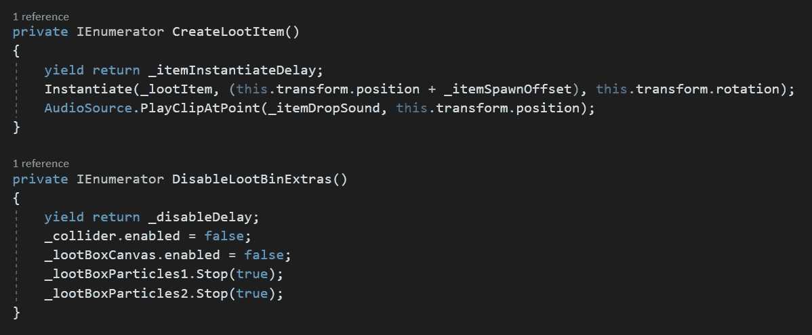

# 制作一个模块化的百宝箱系统

> 原文：<https://levelup.gitconnected.com/making-a-modular-treasure-chest-system-2b0a29a73ec>

在我的上一篇文章中，我介绍了如何为你的游戏制作一个电影版的宝箱。这篇文章讲述了如何让游戏设计者更加模块化和可定制化。我们开始吧！

以下是我将在本文中使用的所有对象。有一个*时间线*组件的*导演*对象，一个*战利品盒*游戏对象，一个*虚拟摄像机*用于在收集时查看战利品盒，两个*粒子系统*在一个父对象下，一个*音频源*，以及一个*画布*设置为*世界空间*具有一个*文本网格 Pro* 对象。

*战利品项目文本*对象分配有*广告牌脚本*组件。

战利品箱导演对象有一个战利品箱*脚本*分配。在这里，设计者可以将一个期望的*互动对象预置*分配到*战利品项目*分配框中。你可以拖拽一个*物品掉落声音*(我可能应该称之为物品收集声音)，也可以输入你想要在箱子上显示的物品的*名称*。有一个*位置*偏移量，可以用来调整战利品的掉落位置。然后是用于物品掉落的*文本对象*以及一个*位置偏移*来调整出现在战利品箱上的位置。有两个*等待时间*，一个用于*物品掉落*的延迟，另一个用于*关闭*物品收集后*粒子*和文本的延迟。

*广告牌*剧本很短但是很甜。它使用一个*变换*赋值给*看*一个目标。这个目标将是*主摄像机*，它位于*无效启动*中。*后期更新*被调用是为了避免奇怪的相机移动，它使用*transform。查看*面向目标变换的前进方向，确保 2D 文本始终面向摄像机。

*Loot Bin 脚本*有一个*序列化字段*的集合，这是让游戏设计者*在*检查器*中分配*对象的集合。这正是模块化的用武之地。整个战利品箱导演对象变成一个*预置*。现在它可以被拖放到游戏场景中的任何地方并投入使用。放置在场景中的*拾取箱控制器*的每个*实例*，可以有不同的掉落物品、声音、文本描述、延迟时间和位置偏移。

空*开始*充满了被*分配*的对象。

在*导演*对象上有一个*碰撞器*，它使用*控制器*，在碰撞时对玩家做出非常灵敏的反应。如果玩家按下“O”*(打开)*，同时在战利品箱旁边，将启动*时间线*动画。如果战利品已经掉落，当玩家按下 *E 键*(装备)时，调用*禁用战利品箱*额外物品的方法。

*创建战利品物品方法*首先设置延迟时间。这给了动画播放的时间。然后，被掠夺物品在箱子的*位置*被*实例化*，加上指定的*偏移量*。项目*音频播放*，我实际上应该移动到下一个方法，改为收集时播放。Disable 方法关闭碰撞器，所以它不再浪费空间。画布和粒子系统都被禁用。

作为参考，这里是*时间轴*编辑器中的一切。

当该说的都说了，该做的都做了，物品被收集起来并添加到库存中！

