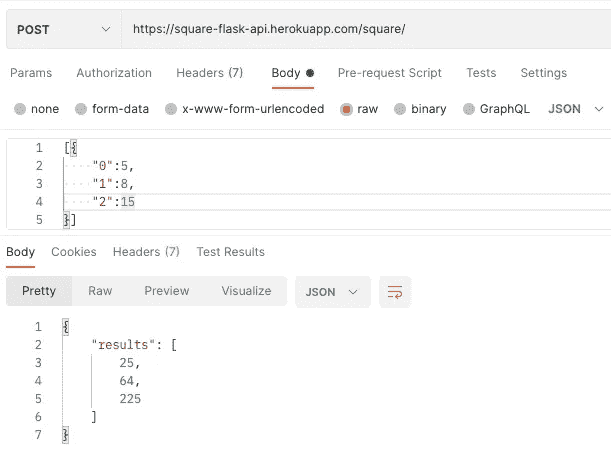

# 用 Python 和 Flask 制作 RESTful API

> 原文：<https://levelup.gitconnected.com/making-a-restful-api-with-python-and-flask-13483c2556b>

## Python 中轻松的 REST API

## 带有 Flask 的 REST API 的简单教程示例


照片由[布伦丹·丘奇](https://unsplash.com/@bdchu614?utm_source=medium&utm_medium=referral)在 [Unsplash](https://unsplash.com?utm_source=medium&utm_medium=referral) 上拍摄

在最近的一次为期两天的黑客马拉松中，我与一名软件开发人员( [Roman Turner](https://medium.com/u/c720cc084b7d?source=post_page-----13483c2556b--------------------------------) )合作开发了一款[推荐应用](https://collegereco.com)。我是数据科学家，所以我的超能力是 Python，数据科学和 Flask。他的超能力是 JavaScript 和 React(以及其他)。我们决定他负责前端 web 应用程序，我用 Python 在后端运行推荐模型。

为了让这两者相互交流，我构建了一个 Flask API，它允许我的合作伙伴发送 JSON 请求，并从我的模型接收 JSON 格式的响应。

我已经开发了我的 Flask 应用程序，但是大部分是独立的项目，我从来没有开发过 API。在制作一个的过程中学到了很多，想和大家分享一些过程和陷阱。

本**教程**的目的是向您展示一种使用 Python 和 Flask 获得有效 RESTful API 的方法(RESTful API，只是意味着数据通过 HTTP 请求处理)。本教程假设您具有 Python 和 JSON 的中级经验，并且至少对 Flask 微框架有一些熟悉，能够制作 web 应用程序。本教程中编写的简单 API 已经成功部署并托管在 https://square-flask-api.herokuapp.com/[的 Heroku.com 上，如果你想直接调用它的话。](https://square-flask-api.herokuapp.com/)

# 基本应用程序设置

我将从分享允许我创建第一个 API 的代码和技术开始。下面的 API 应用程序试图接受一组数字并返回它们的平方。

如果你以前用过 Flask，上面的代码应该看起来很熟悉。

代码的解释:

*   第 4 行:创建 Flask 应用程序(在 routes 之前)。
*   第 7 行:在 app 的`/square/`端点做单条路线。它仅适用于 POST 方法。POST 用于向服务器发送数据以创建/更新资源。在我们的例子中，一个前端或外部源正在向我们的 API/Flask 应用程序发送数据。
*   第 8 行:与`/square/`路由相关的函数称为 square，我们将在这里处理传入的请求。
*   第 10 行:从请求中获取 JSON。如果我们发送数字 5、7 和 15，我们可以用 JSON 格式:`[{“number1": 5, “number2":7, “number2”:15}]`或类似的格式。
*   第 10-11 行:获取 JSON 中的数据作为 python 字典，并从中提取值。在我的例子中，我正在获取数字列表(python 字典中的值)。
*   第 13–14 行:创建一个字典，我们将在其中构建我们的响应。我们将把数字放在字典键`‘results’`下的列表中
*   第 16–18 行:使用循环遍历从 JSON 输入中提取的数字列表。我们对数字求平方，并将它们附加到响应中。
*   第 20 行:使用 Flask 库中的`jsonify()`将我们的输出转换成 JSON 友好的格式。(这也可以用 json 库来完成)
*   第 23–24 行:启动我的应用程序。

## 测试 API 响应

成功了吗？如果您在本地运行应用程序，Flask 将启动一个本地服务器。下面代码应该可以在本地主机上运行。

代码的解释:

*   第 3 行:这是我们想要发布到 API 端点的 JSON 格式的数据。在这种情况下，我们发送数字 5、8 和 15。我做的密钥是“0”，“1”，“2”，但他们可以是这个应用程序的目的任何东西。
*   第 9–10 行:这是我的端点的 url。第 9 行是我在 Heroku 上托管的应用程序，如果你想尝试一下，第 10 行是你的本地主机。检查以确保您的本地地址与代码匹配。
*   第 12 行:这一行将 JSON 数据发送到指定的 URL 并保存响应。
*   第 13 行:API 响应可以使用 text 属性读取。
*   注意:请注意，当调用 API 时，url 上的尾部斜杠需要在那里。否则，不会重定向到另一台服务器。

我选择在 Heroku 上运行我的 API。我额外添加了 Heroku 需要的`requirements.txt`和`Procfile`，部署在那里。如果你想拥有你自己的 API(免费)，请参考我之前的教程。

[](/deploy-a-predictive-model-with-flask-33c1976293cc) [## 使用 Flask 部署预测模型

### 用 Python 为您的 ML 模型制作一个 Flask 应用程序，并将其部署到 Heroku

levelup.gitconnected.com](/deploy-a-predictive-model-with-flask-33c1976293cc) 

所以现在我让代码在本地工作，我们让它远程托管。然后，我们使用 Postman.com 来尝试和测试针对 JavaScript 获取的 API 它不工作。我用普通的 JSON 又试了一次…没用。😧

# 跨产地资源共享(CORS)

这就是它不起作用的原因…

[Mozilla](https://developer.mozilla.org/en-US/docs/Web/HTTP/CORS) 解释得比我好:

> **跨来源资源共享** ( [CORS](https://developer.mozilla.org/en-US/docs/Glossary/CORS) )是一种基于 [HTTP](https://developer.mozilla.org/en-US/docs/Glossary/HTTP) 报头的机制，它允许服务器指示除了它自己之外的任何其他[来源](https://developer.mozilla.org/en-US/docs/Glossary/Origin) s(域、方案或端口)，浏览器应该允许从这些来源加载资源。CORS 还依赖于一种机制，通过这种机制，浏览器向托管跨源资源的服务器发出“预检”请求，以检查服务器是否允许实际的请求。在该预检中，浏览器发送指示 HTTP 方法的标题和将在实际请求中使用的标题。

你可以不用 CORS 来制作一个 Flask 应用程序。你开发的许多应用程序都在同一个服务器上运行，它们不需要 CORS。但是，如果一个 API 或应用程序需要外部请求才能 POST 访问您的服务器，我们需要添加 CORS。默认行为是阻止请求，这样我们的服务器上就不会运行恶意脚本。但是，使用 CORS，我们可以通过。

要在 Flask 上使用 CORS，我们首先要安装 flask_cors 库。

```
pip install flask_cors
```

[flask_cors 文档](https://flask-cors.readthedocs.io/en/latest/)相当不错。我仍然花了大量的时间来完成下面的工作代码。我将解释我们对原来的 API 做了什么改变，以使它能与 CORS 一起工作。

***代码变化*** 说明:

*   第 6 行:直接取自 flask_cors doc。这将 CORS 添加到我们的应用程序中。
*   第 9 行:在我们的路由中添加一个名为 OPTIONS 的方法。这就是我们处理授权访问传入 API 请求所需的预检选项请求的方式。基本上，应用程序必须在批准外部请求之前给予许可。
*   第 10 行:将这个*cross _ origins*decorator 添加到我的路线中，将 CORS 添加到这条路线的最大许可级别上。如果您需要额外的安全性或者想要限制访问，那么使用`cross_origins()`还有额外的参数来实现。
*   第 12–13 行:添加一个条件来捕捉选项方法“预检”。预检只是在执行提取之前进行权限检查。对该函数的调用将构建我的飞行前响应。
*   第 29–34 行:此功能创建我的**预检**响应。我使用 Flask 的 make_response()函数来构建一个头响应，它允许这个路由上的所有访问。

> 在[这个堆栈上向来自丹麦的](https://stackoverflow.com/questions/25594893/how-to-enable-cors-in-flask) [Neils B.](https://stackoverflow.com/users/1690765/niels-b) 大声呼喊，得到回应。🇩🇰

## 用 CORS 测试 API 响应

好了，现在我们已经将 CORS 添加到我们的 API 中，我们可以再次运行我们的代码来看看我们得到了什么。当我运行我的 API 测试代码(从上面开始)时，我得到以下响应:

```
{
 “results”: [
              25, 
              64, 
              225
            ]
}
```

这就是我所期待的(5，8，15 的平方)。另一个测试 API 的有用工具是非常流行的 Postman.com。我和邮递员的努力是这样的:



来自我的 API 的邮件回复

现在我们有了一个 API，它可以接收请求并向我们的前端发送响应。

# 我们的项目

我不想不展示我们制作的应用程序就离开。这是未完成的，但功能(嘿，这只是两个人在为期两天的黑客马拉松！)

我们选择做一个院校推荐系统。当我还是一名高中老师的时候，我注意到我的学生花了无数的时间浏览网站寻找申请学校。我的学生平均申请了大约 15 所大学！！

我们的应用程序会根据你当前的“范围、目标、安全”学校选择，返回一些你可能喜欢的大学，为你指明正确的方向。它使用了来自[美国政府大学记分卡的 200 多个编码特征(从 2000 多个中选出)。](https://collegescorecard.ed.gov/)

模型的构建可能是另一篇文章，但是您应该尝试一下！(这是一项正在进行的工作，但非常酷。看看对你有没有用。)

[https://collegereco.com](https://collegereco.com)

# 包裹

我非常兴奋终于可以工作了。经过长时间艰苦的搜索，我找到了一个可以展示创建这样一个 API 的步骤的资源，最终我不得不自己编写它。

如果你觉得它有用，我很乐意收到你的来信，或者看看你用它做了什么。如果您看到错误或遗漏，或者只是想说声嗨，请留下评论。

祝你好运！☘️