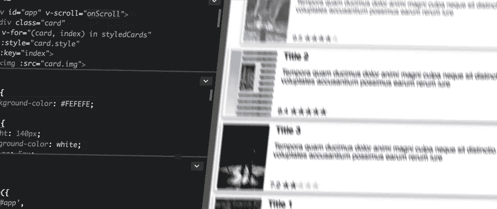
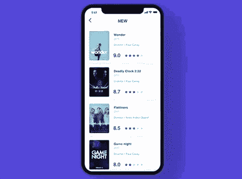
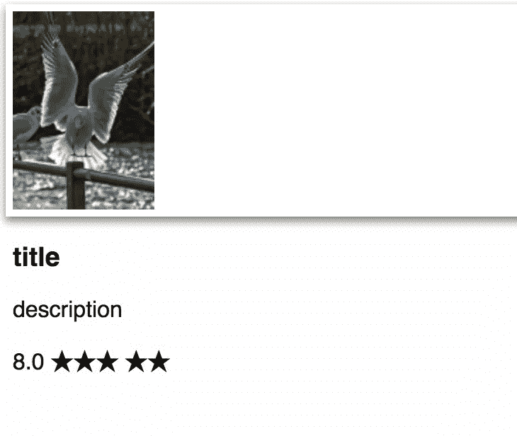

# 制作滚动卡片清单——WotW

> 原文：<https://levelup.gitconnected.com/making-a-scrolling-card-list-wotw-bcd5e31fbcc5>



欢迎来到“每周小部件”系列，在这里我拍摄了令人敬畏的 UI/UX 组件的 gif 或视频，并用代码将它们赋予生命。

> 查看本周所有的 [Widget 文章](https://levelup.gitconnected.com/wotw/home)并关注 Gitconnected，确保你不会错过任何 Widget 教程。

今天我们将学习一系列卡片，当你向下滚动时，这些卡片会显示出来。这个小工具的灵感来自于 [Hiwow](https://dribbble.com/Hiwowstudio) 创作的这个[运球](https://uimovement.com/ui/5572/movie-animation/)的第一部分，看起来是这样的:



## 准备

对于今天的小工具，我们将只使用 [Vue.js](https://vuejs.org/) ，没有动画库，这意味着我们将大量使用 Vue 的功能。

如果你想继续，你可以派生这个已经有依赖关系的 [codepen 模板](https://codepen.io/ederdiaz/pen/bMLbNp)。

## 初始标记

为了让我们的应用程序工作，我们应该有一个 id 为`app`的主 div，Vue.js 将安装在那里。完成这些后，我们可以开始创建卡片了，在本例中，我将只创建一张卡片，因为稍后我们将通过编程创建其余的卡片。
每张卡片都将有一个占位符图像，它将紧挨着一个`div`，我将把它称为*卡片内容*。该*卡片内容*显示标题、描述和评级数据。

```
<div id="app">
  <div class="card">
          
    <div class="card__content">
      <h3>title</h3>
      <p>description</p>
      <div class="card__rating">
        <span>8.0 </span>
        <span class="card__stars--active">★★★</span>
        <span class="card__stars--inactive">★★</span>
      </div>
    </div>
  </div>
</div>
```

对于类的命名，你可能已经注意到我使用了 [BEM](http://getbem.com/introduction/) ，这将有助于下一步设计卡片的样式。

## 式样

现在我们有一个带有丑陋测试的图像，让我们改变它。首先，我们将有一个浅灰色的背景直接设置在“主体”中。

```
body {
  background-color: #FEFEFE;
}
```

然后，我们将为卡片声明一个预定义的高度，匹配图像高度`140px`。我们还添加了一些细节，通过设置填充，改变字体和添加阴影来创建一个浮动卡的效果。

```
.card {
  height: 140px;
  background-color: white;
  padding: 5px;
  margin-bottom: 10px;
  font-family: Helvetica;
  box-shadow: 0px 3px 8px 0px rgba(0,0,0,0.5);
}
```



我们就要到了，该是设计内部元素的时候了。

卡片图像和卡片内容都应该有一个`display: inline-block`并排。图像的宽度是`100px`,并且有一个小的边距将其与文本分开，所以卡片内容将占用卡片宽度的剩余部分。

卡片内容的内部文本需要与顶部对齐，否则它看起来不会像我们想要的那样。就标题而言，`h3`元素的默认边距太大，所以我们将把它设置为`0`。
卡片分级容器需要与底部对齐，我们将使用`position: absolute`来实现这一点。最后但同样重要的是，星星`span`元素将根据一颗星星是否“活跃”而具有不同的颜色。

```
.card__img {
  display: inline-block;
  margin-right: 10px;
}

.card__content {
  display: inline-block;
  position: relative;
  vertical-align: top;
  width: calc(100% - 120px);
  height: 140px;
}

.card__content h3 {
  margin: 0;
}

.card__rating {
  position: absolute;
  bottom: 0;
}

.card__stars--active {
  color: #41377C;
}
.card__stars--inactive {
  color: #CCCCCC;
}
```

它应该开始看起来更像运球:


如果你有一双敏锐的眼睛，你可能会注意到活跃恒星和不活跃恒星之间的空间差异。这是由两个跨度元素之间的空间造成的，可以像这样移除:

```
...
      <div class="card__rating">
        <span>8.0 </span>
        <span class="card--stars-active">★★★</span><!-- I'm removing the space
     --><span class="card--stars-inactive">★★</span>
      </div>
...
```

## 行为

现在，在我们的 Vue 实例中，我们将开始声明我们需要在组件上使用的数据。我们需要很多卡片，但我没有每张都做，而是做了三张，复制了很多次:

```
const cardsData = [
  {
    img:'https://placeimg.com/100/140/animals',
    title: 'Title 1',
    description: 'Tempora quam ducimus dolor animi magni culpa neque sit distinctio ipsa quos voluptates accusantium possimus earum rerum iure',
    rating: 9.5,
    stars: 4
  },
  {
    img:'https://placeimg.com/100/140/arch',
    title: 'Title 2',
    description: 'Tempora quam ducimus dolor animi magni culpa neque sit distinctio ipsa quos voluptates accusantium possimus earum rerum iure',
    rating: 8.4,
    stars: 5
  },
  {
    img:'https://placeimg.com/100/140/people',
    title: 'Title 3',
    description: 'Tempora quam ducimus dolor animi magni culpa neque sit distinctio ipsa quos voluptates accusantium possimus earum rerum iure',
    rating: 7.234,
    stars: 2
  },
  // copy and paste those three items as many times as you want
]
```

然后，在我们的 Vue 实例中，我们可以将该数组设置到数据属性中，这样我们就可以开始跟踪它。

```
new Vue({
  el: '#app',
  data: {
    cards: cardsData
  }
})
```

让我们用 HTML 模板绑定数据。通过一个`v-for`指令，我们将遍历 cards 数据数组并呈现每个属性。

```
<div id="app">
  <div class="card" 
    v-for="(card, index) in cards"
    :key="index">

          
    <div class="card__content">
      <h3>{{card.title}}</h3>
      <p>{{card.description}}</p>
      <div class="card__rating">
        <span>{{card.rating}} </span>
        <span class="card__stars--active">{{card.stars}}</span>
        <span class="card__stars--inactive">{{5 - card.stars}}</span>
      </div>
    </div>

  </div>
</div>
```

很好，我们有很多卡片，不幸的是收视率和明星看起来不像我们预期的那样。


正如你所注意到的，星星就像数字一样被渲染，最后一个评级被打印出来，带有不止一个十进制数字。幸运的是，Vue.js 有一个叫做 [filters](https://vuejs.org/v2/guide/filters.html) 的东西，可以帮助我们按照我们想要的方式解析任何数据。

让我们回到 Vue 实例并声明两个过滤器，一个将约束数字，另一个将把任何数字转换成星号:

```
// ... data
  filters: {
    oneDecimal: function (value) {
      return value.toFixed(1)
    },
    toStars: function (value) {
      let result = ''
      while(result.length < value) {
        result+='★' 
      }
      return result
    }
  },
  // ...
```

这些过滤器准备就绪后，我们可以返回模板，将它们添加到我们需要过滤的数据中:

```
<!-- ... card markup -->
  <span>{{card.rating | oneDecimal}} </span>
  <span class="card__stars--active">{{card.stars | toStars }}</span><!--
  --><span class="card__stars--inactive">{{5 - card.stars | toStars}}</span>
```

就是这么简单`{{ value | filter }}`，数据会在渲染前被转换。

## 卷动

到目前为止，我们还没有在卡片列表中添加任何行为，我们只是关注它的外观和渲染。动画时间到了！

首先，当应用程序滚动时，我们需要以某种方式开始跟踪，为此我们将使用另一个 Vue 特性，称为**自定义指令**。

这个滚动指令是从 [Vue.js 文档](https://vuejs.org/v2/cookbook/creating-custom-scroll-directives.html)中提取的，当我们将它添加到我们的 js 中时，它将允许我们使用`v-scroll`指令:

```
Vue.directive('scroll', {
  inserted: function (el, binding) {
    let f = function (evt) {
      if (binding.value(evt, el)) {
        window.removeEventListener('scroll', f)
      }
    }
    window.addEventListener('scroll', f)
  }
})
```

然后在我们的 HTML 上，我们的应用程序 div 中的一个快速更改将允许我们使用它:

```
<div id="app" v-scroll="onScroll">
  <!-- ... rest of the markup -->
```

现在我们应该能够创建`onScroll`方法来开始跟踪滚动位置:

```
data: {
    cards: cardsData,
    scrollPosition: 0
  },
  methods: {
    onScroll () {
      this.scrollPosition = window.scrollY
    }
  },
```

注意，我们添加了`scrollPosition`来跟踪`window.scrollY`属性。这将有助于 Vue 在发生变化时重新计算。

## 动画卡片

在最初的运球中，当卡片开始到达屏幕顶部时，它们有这个*消失*的效果。为了实现这一点，我们需要在每次`scrollPosition`更新时计算每张卡片的风格。

接下来的两个方法执行所有的数学运算来生成样式。一开始可能会有点混乱，但我会尽力解释它们。

首先我们设置一个`cardHeight`常量，它具有一张卡片的值，包括它的填充和边距。然后考虑到卡的索引，我们将卡的位置设置为`positionY`，第一个是`0`，第二个是`160`，然后是第三个`320`，以此类推。

之后，我们需要知道卡片离顶部有多近，我们这样做，并将值赋给`deltaY`。我们需要在卡片到达屏幕顶部时开始制作动画，所以我们应该只关心 deltaY 何时小于`0`。我将它夹在`-160`和`0`之间，因为当 deltaY 小于`-160`时，它已经离开屏幕。

最后，我们创建一个`dissapearingValue`、`yValue`和`zValue`，它们依赖于 *dY* 的值。顾名思义，`dissapearingValue`会使卡片褪色，所以我们将其绑定到 css opacity 属性。其他两个值将有助于转换属性，使卡片看起来像是在其他卡片后面。

```
// ... methods
    calculateCardStyle (card, index) {
      const cardHeight = 160 // height + padding + margin

      const positionY = index * cardHeight
      const deltaY = positionY - this.scrollPosition

      // constrain deltaY between -160 and 0
      const dY = this.clamp(deltaY, -cardHeight, 0)

      const dissapearingValue = (dY / cardHeight) + 1
      const zValue = dY / cardHeight * 50
      const yValue = dY / cardHeight * -20

      card.style = {
        opacity: dissapearingValue,
        transform: `perspective(200px) translate3d(0,${yValue}px, ${zValue}px)`
      }
      return card
    },
    clamp (value, min, max) {
      return Math.min(Math.max(min, value), max)
    }
```

现在只需要通过该方法传递每张卡片，并将结果公开为一个名为 *styledCards* 的计算属性:

```
computed: {
    styledCards () {
      return this.cards.map(this.calculateCardStyle)
    }
  },
```

这已经差不多准备好了，让我们将新创建的样式绑定到卡片 HTML 代码中:

```
<div class="card" 
    v-for="(card, index) in styledCards"
    :style="card.style"
    :key="index">
```

现在是最终结果(记得向下滚动):

这就是本周的**小部件。**

如果你渴望更多，你可以检查其他 WotW:
— [动画导航](http://ederdiaz.com/blog/2018/05/15/making-an-animated-nav-component-wotw/)
— [流体布局](http://ederdiaz.com/blog/2018/05/09/how-i-made-a-fluid-layout-component-wotw/)
— [向导](http://ederdiaz.com/blog/2018/04/25/how-to-make-an-animated-wizard-component-wotw/)

另外，如果你想看下周的某个小部件，可以在评论区发表。

下周见，关注 [gitconnected](https://levelup.gitconnected.com) 获取每周小工具！

*最初发表于*[*Eder díaz*](http://ederdiaz.com/blog/2018/05/23/making-a-scrolling-card-list-wotw/)*。*