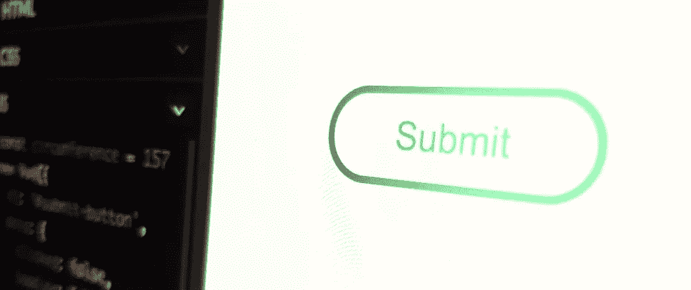
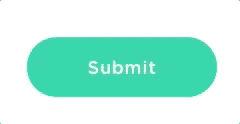

# 用加载器制作提交按钮— WotW

> 原文：<https://levelup.gitconnected.com/making-a-submit-button-with-loader-wotw-85d7aaddd148>



欢迎来到本周系列**小部件的第二部分。**

> 查看本周所有的 [Widget 文章](https://levelup.gitconnected.com/wotw/home)，关注 gitconnected，确保你不会错过任何 Widget 教程。

这次我将向您展示制作一个**提交按钮**的过程，该按钮会转换成一个**加载器**，然后确认您的提交。

这个小工具的灵感来自于 [this](https://uimovement.com/ui/2380/submit-button/) ，其表现类似于下面的礼物:



## 准备

对于今天的小工具，我们将使用 [vue.js](https://vuejs.org/) 和 [tweenlite](https://greensock.com/tweenlite) 制作动画。两个库都有一个 cdn 链接，可以导入到任何项目中。

## HTML 结构

这个小部件的标记非常简单。我们只需要一个容器来装载我们的 Vue 实例，在这个容器中，将有一个按钮和几个 SVG 圆圈用于加载动画:

```
<div id="submit-button" class="submit-container">
  <div class="submit-btn">
    <span>Submit</span>    
  </div>

  <!--  grey circle  -->
  <svg class="loader-svg">
    <path stroke="#CCCCCC" fill="none" stroke-width="4" d="M25,2.5A22.5,22.5 0 1 1 2.5,25A22.5,22.5 0 0 1 25,2.5"></path>
  </svg>

  <!--  green circle  -->
  <svg class="loader-svg">
    <path stroke="#20BF7E" fill="none" stroke-width="4" d="M25,2.5A22.5,22.5 0 1 1 2.5,25A22.5,22.5 0 0 1 25,2.5"></path>
  </svg>
</div>
```

现在让我们开始将按钮的样式与这些 CSS 规则相匹配:

```
.submit-container {
  position: relative;
  margin: 80px;
}

.submit-btn {
  width: 100px;
  color: #20BF7E;
  font-size: 20px;
  font-family: Arial;
  text-align: center;
  text-decoration: none;
  padding: 10px 20px 10px 20px;
  border: solid #20BF7E 4px;
  text-decoration: none;
  cursor: pointer;
  border-radius: 25px;
  transition: background-color .3s, color .3s;
}

.submit-btn:hover {
  background-color: #20BF7E;
  color: white;
}
```

我们现在有一个按钮，它有一个*悬停*动画，可以在绿色背景和白色字体之间交换颜色。还要注意 25px 的边框半径属性——当我们需要按钮变成一个圆形时，这非常重要。

## 互动逻辑

在我们初始化 Vue 实例之前，我想检查一下按钮的状态。我们可以忽略悬停，因为我们的 CSS 已经解决了这个问题，留给我们三种状态:点击，加载和已加载。要处理这些问题，我们可以从以下内容开始:

```
new Vue({
  el: '#submit-button',
  data: {
    clicked: false,    
    loading: false,
    loaded: false
  }
})
```

你可能会问“为什么是三个布尔值，而不是一个包含三个值的字符串或数字？”，原因是因为它们不是互斥的，换句话说，按钮可以同时被“点击”和“加载”。

## 点击互动

在准备单击动画时，我们首先需要为按钮创建一个 CSS 规则。当点击它时，它会变成一个圆，准确地说是一个 50px 乘 50px 的圆(还记得 25px 的边框半径吗？).问题是它已经声明了一个填充，我们还需要补偿按钮的边框，所以我们需要一点数学知识:

```
.submit-btn {
  ... other rules
  /* more CSS transitions for the props we need to animate */
  transition: width .3s, margin .3s, background-color .3s, color .3s;
}
.submit-btn.round {
  margin-left: 50px;
  border-color: #CCCCCC;
  background: white;

  /*  circle should be 50px width & height */
  /* borderLeft + paddingLeft + paddingRight + borderRight  */
  /* 4 + 20 + 20 + 4 = 48 + 2 = 50 */
  width: 2px; 
  /* borderTop + paddingTop + paddingBottom + borderBottom  */
  /* 4 + 10 + 10 + 4 = 28 + 22 = 50 */
  height: 22px;
}
```

现在我们可以开始将按钮绑定到 Vue，我们首先将 click 绑定到一个方法，将 round 类绑定到一个计算属性，并且当我们单击按钮时，提交文本需要消失:

```
...
<div 
  @click="clickedSubmit" 
  :class="buttonClass"
  class="submit-btn">
    <span v-show="!clicked">Submit</span>  
...
```
Then in our js:
``` js
...
methods: {
  clickedSubmit () {
    this.clicked = true
  }
},
computed: {
  buttonClass () {
    if (this.clicked) {
      return 'round'
    }
    return ''
  }
}
```

很简单，对吧？现在到了棘手的部分。

## 装载

就在我们的按钮变成一个圆之后，我们需要把我们的 SVG 圆放在上面——为什么？—因为 HTML 边框不能像我们需要的那样动画化，但是 SVG 可以！

现在让我们将圆圈的位置与 CSS 匹配起来:

```
.loader-svg {
  pointer-events: none;
  position: absolute;
  top: 0px;
  left: 50px;
  width: 50px; 
  height: 50px; 
  transform-origin: 25px 25px 25px;
}
```

然后，两个 SVG 圆都将有这个 vue 绑定，使它们在按钮开始加载时出现:

```
<!--  grey circle  -->
  <svg v-if="loading" class="loader-svg">
    ...
  </svg>

  <!--  green circle  -->
  <svg v-if="loading" class="loader-svg">
    ...
  </svg>
```

我们需要知道按钮动画何时结束，这样我们就可以开始加载动画，根据 [MDN web docs](https://developer.mozilla.org/en-US/docs/Web/Events/transitionend) 我们可以使用`transitionend`事件。要在 Vue 中为该事件添加一个监听器，我们需要有一个对 submit 按钮的引用，所以我们需要将这一行添加到我们的按钮 HTML:

```
<div class="submit-btn" 
  ref="submit-btn"
  ...
>
```

现在我们可以像这样在我们的`clickedSubmit`方法中引用它:

```
...
clickedSubmit () {
this.clicked = true
this.$refs['submit-btn']
.addEventListener("transitionend", this.animateLoader, false);
}
...
```

这将在动画结束时触发`animateLoader`方法，所以让我们创建方法:

```
animateLoader () {
  this.loading = true
  this.$refs['submit-btn']
    .removeEventListener("transitionend", this.animateLoader, false);
  // TODO animate circles
}
```

这将把`loading`标志设置为真，并删除之前添加的监听器。

## 制作绿色圆圈的动画

在下一部分，我们将使用`stroke-dasharray`和`stroke-dashoffset`属性来制作一个 [SVG 动画特效](https://css-tricks.com/svg-line-animation-works/)。

为了使这个技巧起作用，`stroke-dasharray`必须有一个圆的周长值，为了计算它，我们可以回到我们的几何课笔记本，看到公式是*圆周率乘以圆的直径*。
我们的是 50px 宽度，所以会是`3.1416 * 50 = ~157`。我们还将把`stroke-dashoffset`绑定到一个新的 Vue 数据变量:

```
...
<!--  green circle  -->
<svg v-if="loading" class="loader-svg">
  <path stroke="#20BF7E" fill="none" stroke-width="4" d="M25,2.5A22.5,22.5 0 1 1 2.5,25A22.5,22.5 0 0 1 25,2.5" 
  stroke-dasharray="157" :stroke-dashoffset="loaderOffset">
  </path>
</svg>
...
```

现在，在我们的 Vue 实例中，我们将在数据对象中声明 loaderOffset 属性，并用相同的值`157`初始化它:

```
data: {
  clicked: false,
  loading: false,
  loaded: false,
  loaderOffset: 157
}
```

这样做之后，我们可以开始用 TweenLite 来制作加载器的动画。

我们使用`TweenLite.to()`方法在*两秒*内将`loaderOffset`属性从其初始值插值到*零*。

当它完成动画制作后，`onComplete`钩子将执行`completeLoading`方法，在这里我们设置`loading`和`loaded`属性:

```
...
animateLoader () {
  this.loading = true
  this.$refs['submit-btn']
    .removeEventListener("transitionend", this.animateLoader, false);

  // animate the loaderOffset property,
  // on production this should be replaced 
  // with the real loading progress
  TweenLite.to(this, 2, {
    loaderOffset: 0, // animate from 157 to 0
    ease: Power4.easeInOut,
    onComplete: this.completeLoading // execute this method when animation ends
  })
},
completeLoading () {
  this.loading = false
  this.loaded = true
}
...
```

## 负载状态

对于最后一部分，我们只需要创建另一个 CSS 规则，它将在我们的按钮被加载时使用:

```
.submit-btn.loaded {
  color: white;
  background-color: #20BF7E;
}
```

然后`buttonClass` computed 属性也应该处理这种情况:

```
...
buttonClass () {
  if (this.loaded) {
    return 'loaded'
  }

  if (this.clicked) {
    return 'round'
  }

  return ''
}
...
```

我们已经为这些属性声明了 CSS 转换，所以我们不需要做任何其他事情。

而现在最后的结果！

这就是本周第二个**小部件**的内容。

如果你没有检查过上一个，[这里是](http://ederdiaz.com/blog/2018/04/04/smiley-toggle-wotw/)。

另外，如果你想看下周的某个小部件，可以在评论区发表。

下周见，关注 [gitconnected](https://levelup.gitconnected.com) 获取每周小工具！

*最初发表于*[*Eder Diaz*](http://ederdiaz.com/blog/2018/04/11/making-a-submit-button-with-loader-wotw/)*。*