# 为你的 Unity 游戏制作弹药系统

> 原文：<https://levelup.gitconnected.com/making-an-ammo-system-for-your-unity-game-9a6d30789df6>

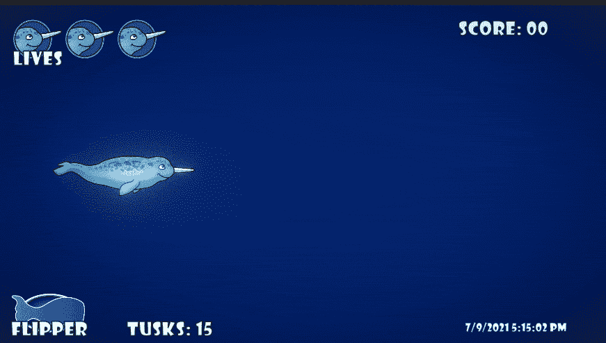

开始使用 Unity 游戏的弹药系统非常简单。现在，玩家可以发射无限量的炮弹。我今天的**目标**是**限制**玩家到 **15 轮**的弹药，同时有一个 **UI 元素**反映玩家当前的**弹药量**。

第一步是创建弹药**限制**。在我的**玩家类** *(脚本)*的顶部，我创建了**变量**来存储**值**，这些值表示玩家可以拥有的**最大值***(maxtuskmamy)*和**最小值***(mintuskmamy)*弹药量，以及**当前值***(currenttuskmamy)*我**将**字段**序列化为**最大值**和**当前值**，因为我希望能够在游戏运行时**调整**或者至少**在**检查器**中查看**它们。**

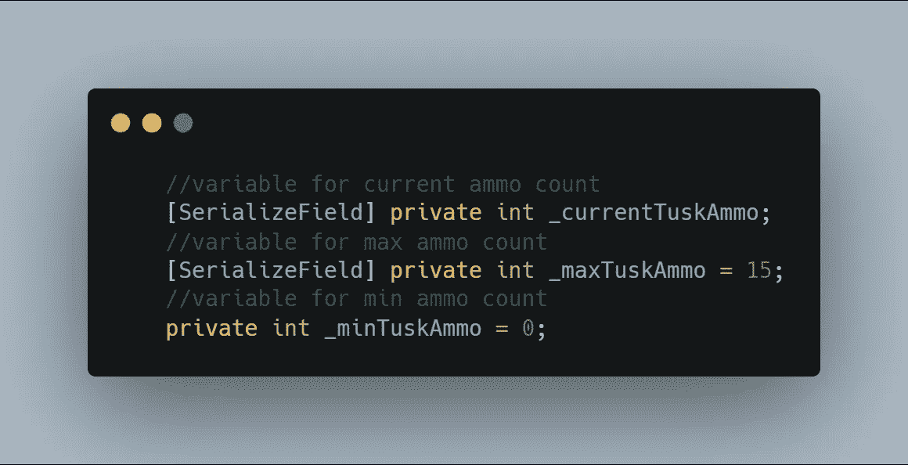

现在我有一些变量要处理，我需要**分配**我的**当前**弹药值为**无效开始**中的**最大**值，这样玩家在游戏开始时就满载了。

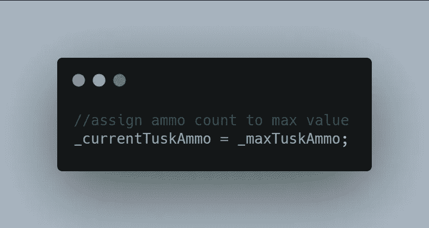

下一步是向下导航到 **FireWeapon** 方法。我目前只需要满足一个条件就可以发射我的**三连发**，所以我增加一个现在需要满足的**第二个条件**。现在，三重射击技能需要激活**和***(&&)***当前**弹药数需要比**最小**弹药数 *(0)* 大**。这样，如果玩家没有弹药了，什么都不会发射。**

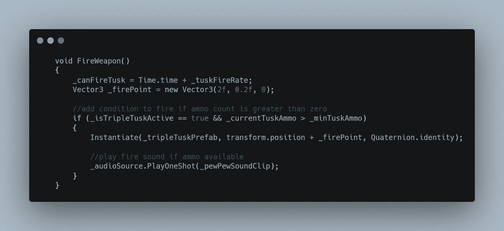

我论证的**如果**部分是处理三连击，**如果**三连击是**主动**。我之前有一个 **else** 语句来处理我的**默认獠牙**炮弹，现在我把它改成了一个 **else if** 语句，声明如果当前弹药数比**最小**弹药数**大**，常规獠牙就会发射**，就像三重獠牙一样。**

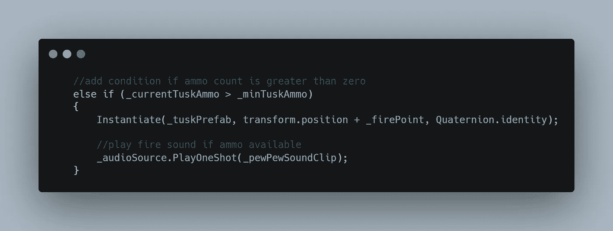

我用一个 **else** 语句来处理如果玩家在弹药耗尽时试图开火会发生什么。现在，我发送一个**调试。记录**消息到控制台，告诉开发者玩家没有弹药了。然后我有一些**伪代码**来跟进关于**播放**一个**声音剪辑**当玩家没有弹药并且继续射击的时候。

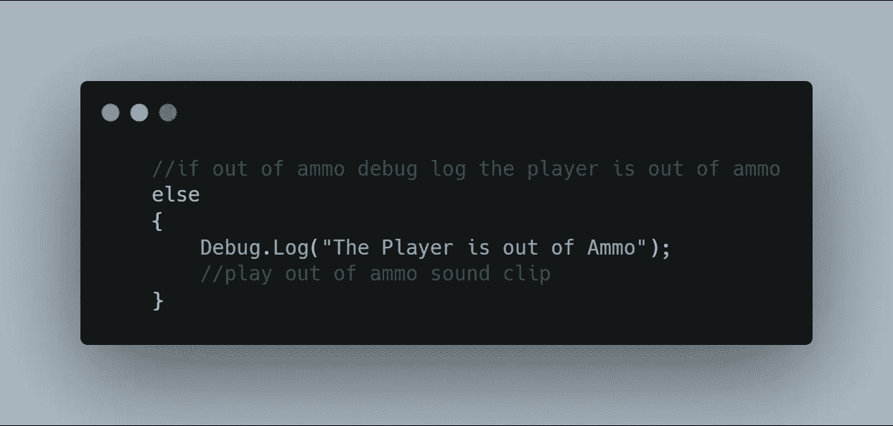

在那些 **if else** 语句之后，但仍然在我的 **FireWeapon** 方法内，我用一行简短的代码从**当前**弹药计数中减去 1 。

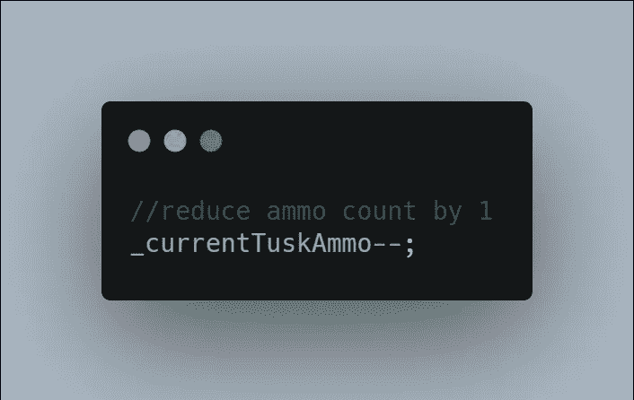

我不想让弹药计数进入负的 T38 中，所以在上面处理减法的代码中，我做了一个 T40 局部变量 T41 来保存我的 T44 当前 T45 弹药计数的**箝位值 T43。 **Mathf。夹具**用于保持我的**current amo**变量锁定在声明的**最小值**和**最大值**之间。**

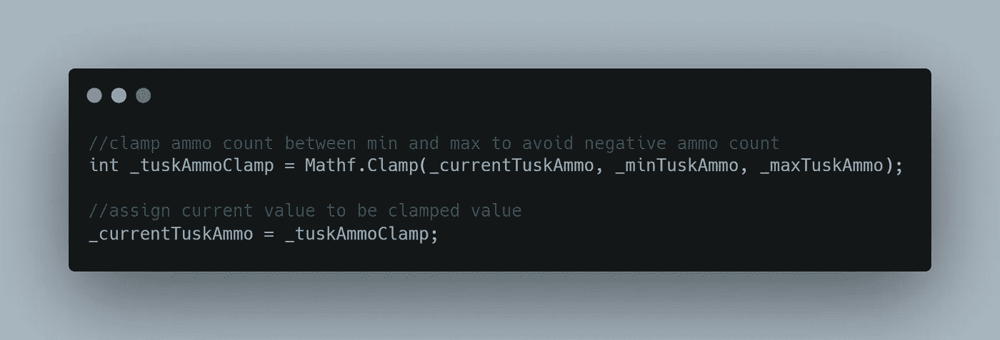

我**测试**我的游戏，看看是否一切都**正常**由**监视**由**检查员**。正如你在这里看到的，当我**开火**时**当前**弹药数下降到**零**，并且当我继续开火时不会变成负数。

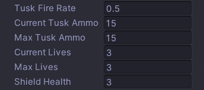

现在我的**目标**是添加一些 **UI 视觉效果**给玩家展示他们在玩游戏时的**当前**弹药数量。在我的**层级**中，我选择我的**画布**并添加一个**新 UI Text Mesh Pro** 游戏对象。我把它命名为**象牙弹药文本**。

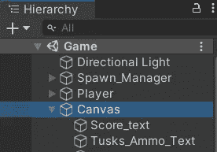

然后**将**固定在左下方，然后**将**定位在我想要的位置。

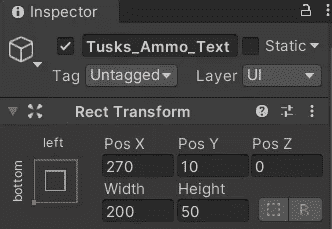

我在**文本输入**对话框中设置**默认**文本为*"象牙:00"* ，然后**通过拖拽将**我想要的**字体** *(Showcard Gothic)* 分配到**字体资产**槽中。我还调整字体大小来匹配我的其他文本。

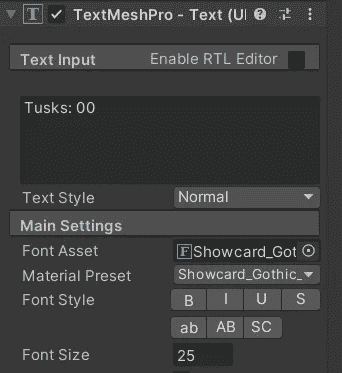

我现在准备打开 Visual Studio，在我的 **UI Manager 类** *【脚本】*的顶部添加一个**TMP _ Pro***(Text Mesh Pro)***变量**。

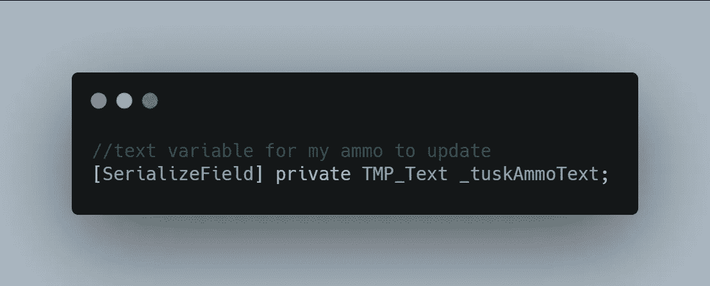

在 Visual Studio 中**保存**之后，我可以返回 Unity，并**将**弹药文本**分配给我的 **UI 管理器脚本**，方法是将其从**层级**拖放到**检查器**中。**

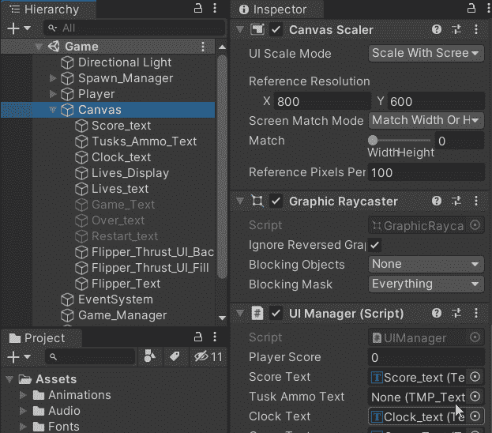

完成任务后，我回到 Visual Studio 开始工作。我在我的 **UI 管理器类**中创建了一个**公共方法**，玩家可以调用它来更新弹药文本。该方法需要传递一个 **int** 值来调用它。一旦方法被调用，我就引用**弹药文本**，并使用一些**字符串插值**来告诉它我想要*象牙:*被打出，然后插入**当前**象牙计数变量。

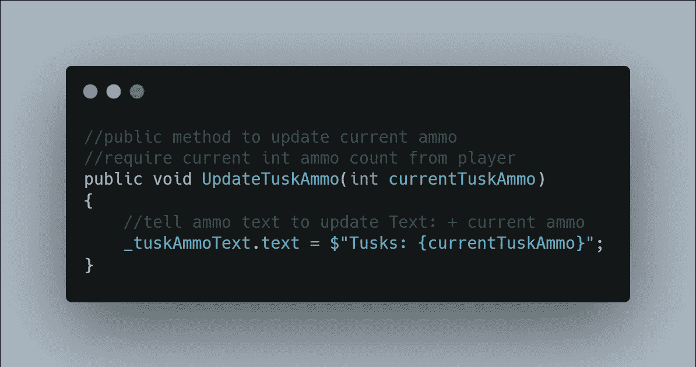

回到我的**播放器类**，我导航到我的 **FireWeapon** 方法的底部，并添加最后的代码。我联系 **UI 管理器**，调用**更新弹药**方法并传递**当前弹药**值。我还将这一行代码放在**无效开始**中，就在我**将**弹药数**分配给**最大**的位置之下，因此 **UI** 反映了游戏开始时的**最大**弹药数。**

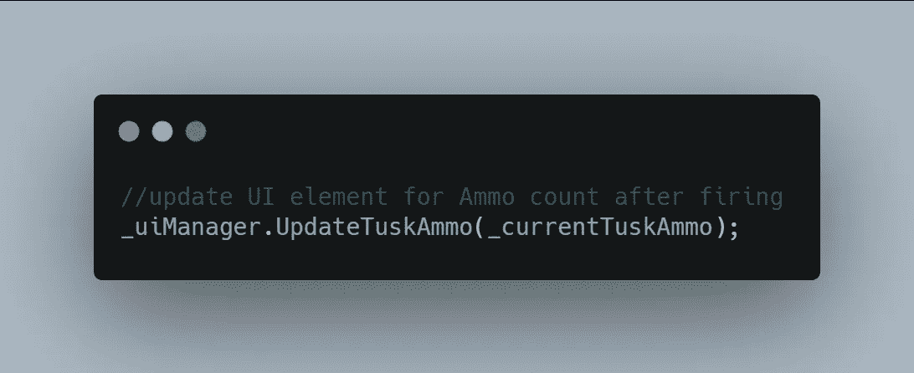

这是目前为止一切看起来的样子！

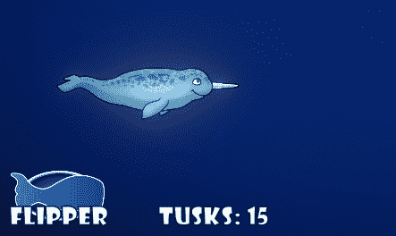

在我的下一篇文章中，我将展示如何增强与玩家弹药数量相关的 UI 视觉效果。感谢阅读！