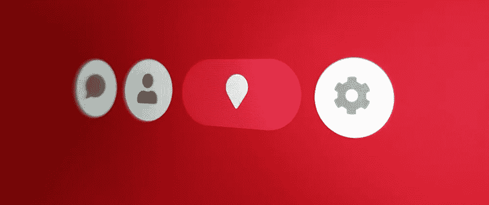
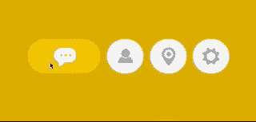
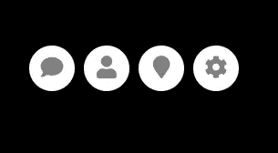

# 制作动画导航组件— WotW

> 原文：<https://levelup.gitconnected.com/making-an-animated-nav-component-wotw-e94b6bca04c4>



欢迎来到“每周小部件”系列，在这里我拍摄了令人敬畏的 UI/UX 组件的 gif 或视频，并用代码将它们赋予生命。

> 查看本周所有的 [Widget 文章](https://levelup.gitconnected.com/wotw/home)，关注 gitconnected，确保你不会错过任何 Widget 教程。

今天轮到一个有四个彩色图标按钮的导航组件了。灵感来自[这个提交](https://uimovement.com/ui/5563/navigation-interaction/)，看起来是这样的:



## 准备

对于今天的小部件，我们将使用 [Vue.js](https://vuejs.org/) 进行交互，使用 [TweenMax](https://greensock.com/tweenmax) 进行动画。如果你想跟进，你也可以派生这个已经有依赖关系的 [codepen 模板](https://codepen.io/ederdiaz/pen/bMLbNp)。

我们还将使用 [FontAwesome 图标](https://fontawesome.com/icons?d=gallery)，因此请确保您添加了此链接来导入它们:

```
<link rel="stylesheet" href="https://use.fontawesome.com/releases/v5.0.13/css/all.css" integrity="sha384-DNOHZ68U8hZfKXOrtjWvjxusGo9WQnrNx2sqG0tfsghAvtVlRW3tvkXWZh58N9jp" crossorigin="anonymous">
```

## 初始标记

我们将从 HTML 开始。对于这个组件，我们只需要一个容器和按钮。正如我上面提到的，我们将在按钮上使用 FontAwesome 图标，它们与最初提交的图标不完全相同，但已经足够好了。

```
<div id="app">
  <div class="btn-container">
    <div class="btn">
      <i class="fas fa-comment"></i>
    </div>
    <div class="btn">
      <i class="fas fa-user"></i>
    </div>
    <div class="btn">
      <i class="fas fa-map-marker"></i>
    </div>
    <div class="btn">
      <i class="fas fa-cog"></i>
    </div>
  </div>
</div>
```

现在我们应该有了四个图标，是时候让它看起来更像最终产品了。

## 式样

在容器中，我们需要一个背景颜色，我现在使用黑色，但是稍后我们会通过编程改变它。此外，我将使用“flex”和“justify-content”来水平居中元素，然后只是一些填充来垂直对齐它们。

```
.btn-container {
  display: flex;
  background-color: black;

  /* center vertically */
  padding-top: 150px;
  padding-bottom: 150px;
  /* center horizontally */
  justify-content: center;
}
```

对于按钮来说，还需要做一些工作，我们将使用“内嵌块”来渲染它们。

我们需要定义按钮及其内容的大小，以及一些默认的颜色，然后使用边框半径使它们成为圆形，还需要一些规则来正确对齐图标:

```
.btn {
  display: inline-block;
  cursor: pointer;
  width: 50px;
  height: 50px;
  margin: 5px;
  font-size: 25px;
  color: gray;

  /*  Circles  */
  border-radius: 25px;
  background-color: white;

  /* center icons */
  text-align: center;
  line-height: 50px;

  /* remove touch blue highlight on mobile */
  -webkit-tap-highlight-color: rgba(0, 0, 0, 0);
}
```

现在我们应该有这样的东西:



## 行为

现在，在我们的 Vue 实例中，我们将开始声明我们需要在组件上使用的数据。使用颜色选择器，我为按钮和背景选择了不同的颜色，并将它们放入一个结构中，以便我们将来可以引用它们:

```
new Vue({
  el: '#app',
  data: {
    buttons: [
      {icon: 'comment', bgColor: '#DE9B00', color: '#EDB205'},
      {icon: 'user', bgColor: '#3EAF6F', color: '#4BD389'},
      {icon: 'map-marker', bgColor: '#BE0031', color: '#E61753'},
      {icon: 'cog', bgColor: '#8E00AC', color: '#B32DD2'}
    ],
    selectedBgColor: '#DE9B00',
    selectedId: 0
  },
})
```

此外，我已经声明了一个变量，该变量将具有当前的背景颜色和所选按钮的 id。

由于按钮数组中也有图标数据，我们可以更改 HTML 代码，用`v-for`呈现按钮，变得更加动态:

```
<div id="app">
  <div class="btn-container" :style="{'backgroundColor': selectedBgColor}">
    <div v-for="(button, index) in buttons" 
         :key="index" 
         @click="selectButton(index)"
         :ref="`button_${index}`"
         class="btn">
      <i :class="['fas', `fa-${button.icon}`]"></i>
    </div>
  </div>
</div>
```

这段代码也已经将背景色绑定到了`btn-container` div 样式。


请注意，我们添加了一个`@click`处理程序，它将触发一个名为`selectButton`的函数，`ref`属性也将帮助我们在需要激活按钮时引用它们。

## 单击按钮

我们需要首先在 Vue 实例中声明“selectButton”方法:

```
// ... data,
  methods: {
    selectButton (id) {
      this.selectedId = id
    }
  }
```

在这之后，`selectedId`将在每次点击时改变到`0-3`之间的值，但这似乎对我们的组件没有任何影响。我们需要开始制作动画了！

让我们开始制作最简单的部分，背景色。为此，我们需要创建一个计算属性来获取选中的按钮数据，这将帮助我们获得相应的背景颜色。
稍后当我们改变`selectedId`时，我们将能够将颜色补间到当前选择的颜色。

```
// ... data
 methods: {
    selectButton (id) {
      this.selectedId = id
      this.animateBgColor()
    },
    animateBgColor () {
      TweenMax.to(this, 0.2, {
        selectedBgColor: this.selectedButton.bgColor
      })
    }
  },
  computed: {
    selectedButton () {
      return this.buttons[this.selectedId]
    }
  }
```

我们应该有一个工作过渡的背景色时，点击任何按钮。

## 制作按钮动画

按钮的动画将会更复杂一些。首先，我们需要保存对先前激活的按钮和下一个要激活的按钮的引用。

为此，我们可以在设置新按钮之前使用`$refs`和所选按钮的索引，如下所示:

```
// ... data
  methods: {
    selectButton (id) {
      const previousButton = this.$refs[`button_${this.selectedId}`]
      const nextButton = this.$refs[`button_${id}`]
      // ... rest of code
```

现在我们有了这些引用，我们应该能够运行两个方法，一个停用上一个按钮，另一个激活新按钮:

```
// ... methods
    selectButton (id) {
      const previousButton = this.$refs[`button_${this.selectedId}`]
      const nextButton = this.$refs[`button_${id}`]

      this.selectedId = id
      this.animateBgColor()

      this.animateOut(previousButton)
      this.animateIn(nextButton)
    },
    animateIn (btn) {      
      // TODO activate button
    },
    animateOut (btn) {
      // TODO deactivate button
    }
```

在编写这部分代码之前，我们需要停下来想想按钮应该如何动画。如果我们分析 gif，按钮动画可以分成两个变化，一个是按钮和图标的颜色，另一个是按钮的宽度。

颜色转换看起来非常简单，按钮的背景在不活动时变成白色，在活动时变成`color`属性。对于图标，它只是在`gray`和`white`之间变化。

有趣的是按钮宽度动画，它看起来有点“弹性”，因为它在结束时有点来回。

玩 [GSAP 放松可视化](https://greensock.com/ease-visualizer)我带来了与原始动画的放松非常匹配的道具。现在我们可以完成对`animateIn`和`animateOut`方法的编码了:

```
// ... methods
   animateIn (btn) {      
      // animate icon & bg color
      TweenMax.to(btn, 0.3, {
        backgroundColor: this.selectedButton.color,
        color: 'white'
      })

      // animate button width
      TweenMax.to(btn, 0.7, {
        width: 100,
        ease: Elastic.easeOut.config(1, 0.5)
      })
    },
    animateOut (btn) {
      // animate icon color
      TweenMax.to(btn, 0.3, {
        backgroundColor: 'white',
        color: 'gray'
      })

      // animate button width
      TweenMax.to(btn, 0.7, {
        width: 50,
        ease: Elastic.easeOut.config(1, 0.5)
      })
    }
  },
```

我们快完成了，还有一个小细节。当应用程序启动时，组件看起来没有被选中的按钮。幸运的是，这可以通过调用`mounted`钩子中的`selectButton`方法来快速解决:

```
mounted () {
    // initialize widget
    this.selectButton(0)
  }
```

而现在最后的结果！

这就是本周的**小部件。**

如果你渴望更多，你可以检查其他 WotW:
— [流体布局](http://ederdiaz.com/blog/2018/05/09/how-i-made-a-fluid-layout-component-wotw/)
— [向导](http://ederdiaz.com/blog/2018/04/25/how-to-make-an-animated-wizard-component-wotw/)
— [动画卡片滑块](http://ederdiaz.com/blog/2018/04/18/animated-card-slider-with-vue-gsap/)

另外，如果你想看下周的某个小部件，可以在评论区发表。

下周见，关注 [gitconnected](https://levelup.gitconnected.com) 获取每周小工具！

*最初发表于* [*埃德尔迪亚兹*](http://ederdiaz.com/blog/2018/05/15/making-an-animated-nav-component-wotw/) *。
请* [*给我买杯咖啡，支持我写这些帖子！*](https://ko-fi.com/ederdiaz)