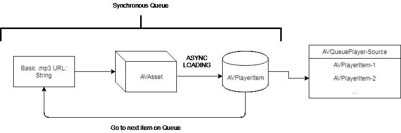
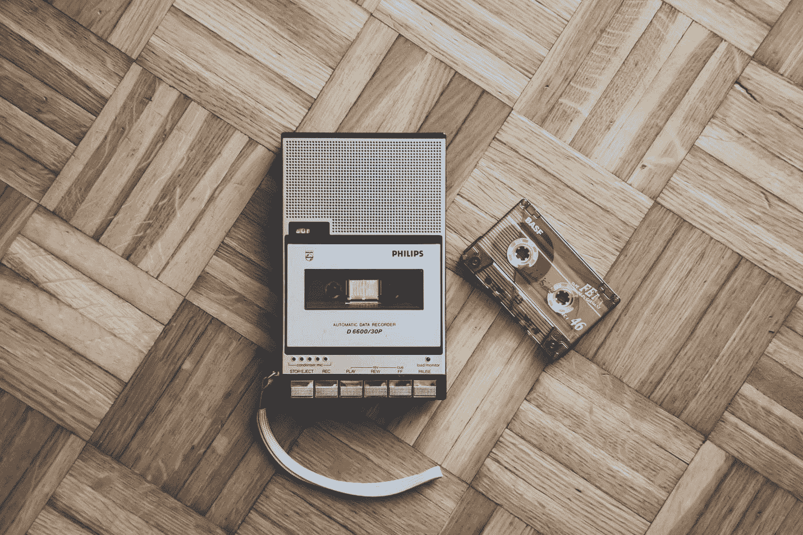

# 轻松制作 iOS 音频播放器

> 原文：<https://levelup.gitconnected.com/making-an-ios-audio-player-the-easy-way-142fd1d71cf1>


[科里·布拉兹](https://unsplash.com/@blazphoto?utm_source=medium&utm_medium=referral)在 [Unsplash](https://unsplash.com?utm_source=medium&utm_medium=referral) 上的“木制表面上耳机的黑白照片”

因为把互联网上的零碎信息拼凑起来一点也不好玩！

## 任务:创建一个没有外部库的音频播放器(差不多)

我搜遍了已知的谷歌空间，寻找所有可用的关于制作一个具有 Swift 和基本功能的音频播放器的信息。简单吧？好吧，事实证明…没那么多。

StackOverflow 的大部分(所以从现在开始)处理过程的一部分，通常在 Obj-C、Swift-2、Swift-3 和一小部分 Swift-4 之间分配。文章也受到快速版本控制的影响，或者缺乏快速版本控制，并且完全用 Obj-C 编写。插件和库也是过时的，用 Obj-C 编写的，或者没有维护。


[Natalia Y](https://unsplash.com/@foxfox?utm_source=medium&utm_medium=referral) 在 [Unsplash](https://unsplash.com?utm_source=medium&utm_medium=referral) 上拍摄的照片

## 第一个子任务:制作一个音频队列并播放一首曲目。

所以我们开始了，用 AVFramework 制作一个简单的音频队列

简单吧？

是的，直到你想通过网络加载多个文件，或者想知道每时每刻到底发生了什么，你需要获得观察者的帮助，观察属性和接收事件，以便显示诸如“缓冲”、“加载”、“结束”等消息。


“天文台望远镜看着蓝色的夜空，背景是群山”,作者:亚历克斯·弗兰泽林

## 主线任务:构建一个音频播放器类

为了做好这件事，我们首先需要几样东西。正如我们所见，为了向`AVQueuePlayer`添加项目，我们必须将它们转换成`AVPlayerItem`，为此，我们必须首先将它们转换成`AVAsset`。然而这里有一个陷阱，`AVAsset`在它被定义的时候就开始加载，这意味着我们不想马上添加它，因为它还没有准备好播放，我们需要先加载它，然后再添加到`AVQueuePlayer`。

这里还有第二个陷阱，如果我们走上面描述的道路，我们将异步功能添加到我们的队列中，并且最肯定的是，事情不会按照我们希望的顺序添加。

我们该怎么办？同步排队救援！当它们完成加载时，轨道被一个接一个地添加。

所以上面代码的流程如下:



> 循环每个. mp3 url ->使其成为队列中的资产->加载资产时(异步)->将其转换为 AVPlayerItem ->队列继续处理下一个. mp3 url

那么我们什么时候知道所有的项目都准备好了呢？简单(虽然不是，但确实是)

在上面的代码中，我们缺少了`AVItemPool`引用。这是:

这里，我们使用信号库[https://github.com/artman/Signals](https://github.com/artman/Signals)在`AVItemPool`上的项目数量等于. mp3 源数组中的项目数量时触发一个事件。

*(是的，为了这个教程，我们假设所有的项目都会加载。)*

我们在这里捕捉事件:

我们在这最后一部分所做的是捕捉数组被`AVPlayerItem`对象填充的事件。现在，这些对象已经正确加载，并且具有我们想要的正确顺序。

但是观察者呢？怎么才能听 AVQueuePlayer 事件。

## Boss 战:添加 AVQueuePlayer 观察员

我们对两种类型的观察者感兴趣，一种是附属于`AVQueuePlayer`属性的观察者，另一种是附属于`AVPlayerItem`属性的观察者。

在顶层，我们声明它们的实例

然后在`Signal`事件监听器中，我们将它们附加到属性上

上面我们听了以下属性:

*   `AVQueuePlayer`当前项目变更
*   当前项目状态更改
*   当前项目缓冲区为空
*   当前项目缓冲区几乎已满
*   当前项目缓冲区已满
*   `AVQueuePlayer`播放状态([https://developer . apple . com/documentation/av foundation/av player/1643485-time control status](https://developer.apple.com/documentation/avfoundation/avplayer/1643485-timecontrolstatus))
*   `AVQueuePlayer`状态变化的播放原因([https://developer . apple . com/documentation/av foundation/av player/1643486-reasonforwaitingplay](https://developer.apple.com/documentation/avfoundation/avplayer/1643486-reasonforwaitingtoplay))

要实际开始回放队列，我们需要调用

```
self.playerQueue.play()
```

要使用该类，只需初始化构造函数并调用`initialize`方法

```
var audio = AudioPlayer()
audio.initialize(config: ["loop":**true**])
```

您可以在下面找到完整的源代码和一些附加内容

*   向前移动-跟踪-前进，
*   向后移动-跟踪-移动，
*   下载-跟踪，
*   下载当前播放曲目，
*   动态添加轨道到队列
*   将配置传递给`initialize`方法

> 注意:AVQueuePlayer 和这个类可以播放流音频文件，以及单个音频文件。

## 任务奖励:源头！


乔纳森·布林霍斯特在 Unsplash[上的照片](https://unsplash.com?utm_source=medium&utm_medium=referral)



在 Unsplash 上由 [Simone Acquaroli](https://unsplash.com/@simoacqua?utm_source=medium&utm_medium=referral) 创作的《一台旧的飞利浦卡带播放器和放在意大利木地板上的磁带》

我希望你会发现这很有用，如果你有任何问题或更正，请给我留言。

尽情享受吧！

# 分级编码

感谢您成为我们社区的一员！ [**订阅我们的 YouTube 频道**](https://www.youtube.com/channel/UC3v9kBR_ab4UHXXdknz8Fbg?sub_confirmation=1) 或者加入 [**Skilled.dev 编码面试课程**](https://skilled.dev/) 。

[](https://skilled.dev) [## 编写面试问题

### 掌握编码面试的过程

技术开发](https://skilled.dev)