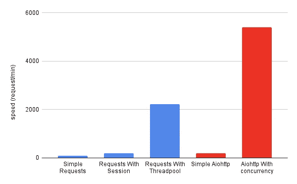

# 用 Python 制作并发 Web API 请求，我推荐 AioHTTP

> 原文：<https://levelup.gitconnected.com/making-concurrent-web-api-requests-in-python-i-recommend-aiohttp-43f2d46ef4da>

## 两个 python web 请求包 request 和 Aiohttp 之间的比较



请求速度比较

## 目录

*   [简单的请求](#a072)
*   [会话请求](#ffae)
*   [线程池请求](#6d03)
*   [简单 Aiohttp](#5365)
*   [AioHTTP 并发](#a209)

# 要求

 [## 快速入门-请求文档

### 渴望开始吗？本页很好地介绍了如何开始处理请求…

docs.python-requests.org](https://docs.python-requests.org/en/latest/user/quickstart/#make-a-request) 

[**Requests**](https://docs.python-requests.org/en/latest/) 是一个流行的用于进行 web 请求的 HTTP 库。让 HTTP 请求更简单、更人性化是这个包的目标。

那么让我们从一个简单的例子开始。

## 简单的请求

简单请求示例

```
{'origin': 'xx.xx.xx.xx'}
{'origin': 'xx.xx.xx.xx'}
{'origin': 'xx.xx.xx.xx'}
          ...
{'origin': 'xx.xx.xx.xx'}
{'origin': 'xx.xx.xx.xx'}--- It took 60.77657389640808 seconds ---
```

使用这个库做一个请求是非常简单的，你所需要的就是给出一个目标 URL，然后它返回一个网页响应。

```
response = request.get(url)
```

在这个例子中，我们向同一个 web URL 发出 100 个 web 请求，总运行时间大约是一分钟。

所以速度是 100 个请求/分钟，太慢了。让我们做一些改进。

## 会话请求

当向同一个主机发出几个请求时，经常使用`session`。因为它重用了底层的 TCP 连接，这可以显著提高性能。

会话请求示例

```
{'origin': 'xx.xx.xx.xx'}
{'origin': 'xx.xx.xx.xx'}
{'origin': 'xx.xx.xx.xx'}
          ...
{'origin': 'xx.xx.xx.xx'}
{'origin': 'xx.xx.xx.xx'}--- It took 31.942954063415527 seconds ---
```

正如我们所见，通过使用`session`，我们节省了一半的时间。

然而，实现更高性能的最常见方法是使用多线程或多个进程。

## 使用线程池的请求

```
{'origin': 'xx.xx.xx.xx'}
{'origin': 'xx.xx.xx.xx'}
{'origin': 'xx.xx.xx.xx'}
          ...
{'origin': 'xx.xx.xx.xx'}
{'origin': 'xx.xx.xx.xx'}--- It took 2.7641241550445557 seconds ---
```

正如我们所见，速度比前一个快了 10 倍以上。因此，使用线程池来并发执行 web 请求调用是值得的。

还有提升的空间吗？答案是肯定的

# Aiohttp

 [## 欢迎使用 AIOHTTP - aiohttp 文档

### 和 Python 的异步 HTTP 客户端/服务器。您可能希望安装可选的…

docs.aiohttp.org](https://docs.aiohttp.org/en/stable/index.html) 

`requests`库是完全同步的。调用`requests.get`阻塞程序，直到服务器完全回复。创建多线程有所帮助，但是线程仍然会遇到阻塞。

幸运的是，从 3.5 版本开始，Python 使用 Asyncio 提供了异步性作为其核心。一个 [**iohttp**](https://docs.aiohttp.org/en/stable/) 是基于 Asyncio 的异步 http 客户端/服务器。

## `简单 Aiohttp`

```
{'origin': 'xx.xx.xx.xx'}
{'origin': 'xx.xx.xx.xx'}
{'origin': 'xx.xx.xx.xx'}
          ...
{'origin': 'xx.xx.xx.xx'}
{'origin': 'xx.xx.xx.xx'}— — It took 30.914737701416016 seconds — -
```

`简单的代码就是一个`Aiohttp`的例子。速度没那么快，因为我们还没有实现并发。`

`现在，让我们使用并发！`

## `并发 Aiohttp`

```
{'origin': 'xx.xx.xx.xx'}
{'origin': 'xx.xx.xx.xx'}
{'origin': 'xx.xx.xx.xx'}
          ...
{'origin': 'xx.xx.xx.xx'}
{'origin': 'xx.xx.xx.xx'}— — It took 1.1164250373840332 seconds — -
```

`我们通过使用 AioHTTP 并发可以看到，速度可以达到每分钟 5400 个请求。这是令人敬畏的结果。`

`有时，如果我们需要降低速度，尝试下面的代码。`

# `性能比较`

``

`请求速度比较`

`速度对比如上图所示。不出意外，并发的 AioHTTP 是赢家！`

`所以下次当你想像网络爬虫一样做 IO 密集型任务的时候，AioHTTP 是你更好的朋友！`