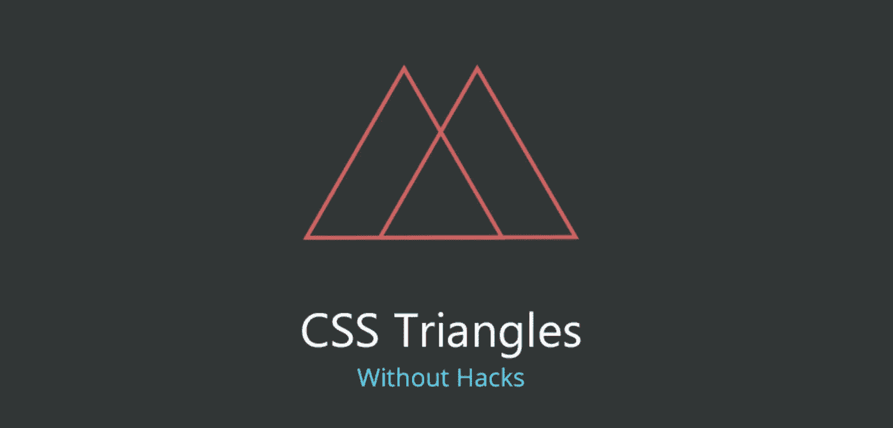
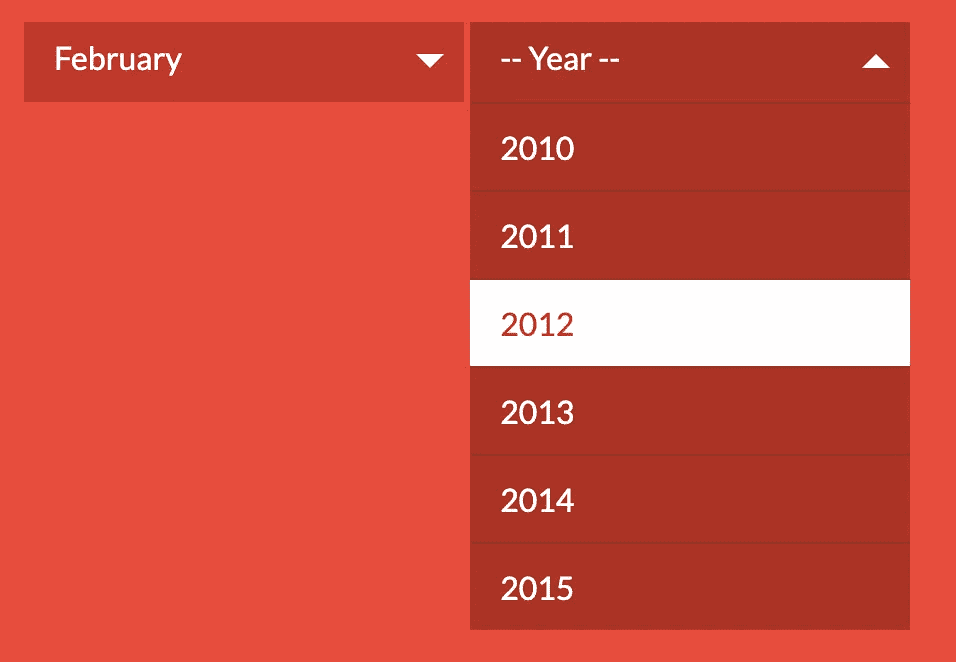
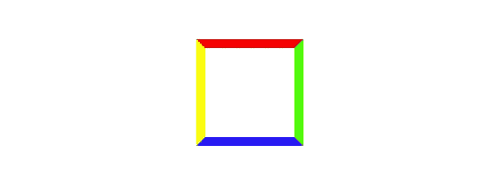
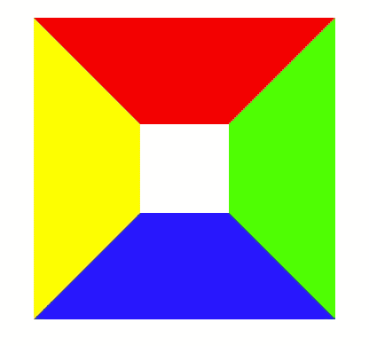
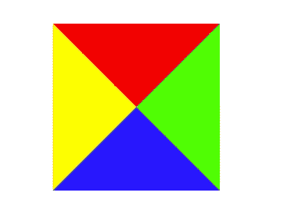
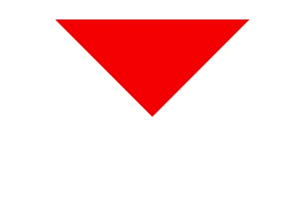
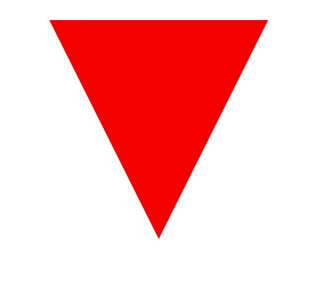

# 制作 CSS 三角形

> 原文：<https://levelup.gitconnected.com/making-css-triangles-c0201dacc26>

了解如何用 CSS 创建三角形

来源:[https://tutorial zine . com/2017/03/CSS-triangles-without-hacks](https://tutorialzine.com/2017/03/css-triangles-without-hacks)

浏览网站的时候经常会看到下拉菜单，上面会有一个小三角。

选择下拉列表中的小三角形

当你看到这个三角形时，你通常认为它是一个图像或图标。这些三角形也可以用 CSS 实现吗？答案是**是**，制作 CSS 三角形的方法主要是利用`border` CSS 属性。

# 如何用 CSS 创建一个三角形

首先，让我们看看我们最熟悉的 CSS 代码。我们做一个盒子，尺寸宽度 50px，高度 50px，所有边框颜色各不相同 5px。

它看起来是这样的:

边框的 CSS 代码

现在我们将边框尺寸增加到 60px。

这是它现在的样子:

带边框的盒子 60px

大多数人没有意识到的是，边界是以连接的角度绘制的，正如你在上面清楚看到的那样。这就是我们可以用 CSS 创建三角形的主要原因。让我们在剩下的步骤中制作三角形。

你能想象如果宽度和高度都设置为 0，但边框为 60px 会发生什么吗？

效果如下:

一个框的宽度和高度被设置为 0

如果你想得到一个三角形，你必须隐藏其他的三角形。因此，让我们首先了解颜色属性的值— RGBA 颜色。

**RGBA (R，G，B，A)**

*   **R:** 红色通道。正整数|百分比
*   **G:** 绿色通道。正整数|百分比
*   **B:** 蓝色通道。正整数|百分比
*   **答:**阿尔法通道。该值的范围从 0 到 1。

注意，有一个 **Alpha** 通道，它指定颜色的不透明度。并且可以用于指定完全透明的颜色。

另外，值`transparent`是全透明黑色的简写，是一个值 **RGBA (0，0，0，0)** 。

有了`transparent`属性的值，我们可以用它来隐藏不必要的边界，我们可以实现我们想要的三角形。代码如下:

这是它的样子。

其他边框设置为透明的框

最后，要调整三角形的大小，让我们修改顶部边框的宽度。

调整边框宽度以调整三角形的大小

## 代码的完整副本

如果你想一次看到所有的效果

## 参考

*   [https://stack overflow . com/questions/7073484/how-do-CSS-triangles-work](https://stackoverflow.com/questions/7073484/how-do-css-triangles-work)
*   [https://css-tricks.com/the-shapes-of-css/](https://css-tricks.com/the-shapes-of-css/)