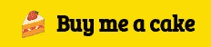

# 使用 Alpine.js 和 Tailwindcss 制作自定义选择字段

> 原文：<https://levelup.gitconnected.com/making-custom-form-fields-with-alpinejs-and-tailwind-select-field-d633cd2b82bc>


照片由[HalGatewood.com](https://unsplash.com/@halacious?utm_source=unsplash&utm_medium=referral&utm_content=creditCopyText)在 [Unsplash](https://unsplash.com/s/photos/website?utm_source=unsplash&utm_medium=referral&utm_content=creditCopyText) 上拍摄

我很喜欢写我的上一个故事，在那里我分享了关于在[颜色方案切换](https://medium.com/swlh/simple-color-theme-implementation-with-css-and-alpine-js-ab8bb09f843f)中使用 Alpine.js。现在，我将分享另一个 Alpine.js + Tailwind 系列，但这一次——创建一个自定义选择字段。

一旦你完成了这篇文章，你会看到类似这样的东西。


## HTML

让我们从形成视图部分开始。不要忘记首先在你的主 html 文件中包含 tailwind css。

```
<link href="https://unpkg.com/tailwindcss@^2/dist/tailwind.min.css" rel="stylesheet">
```

此外，我们需要一些额外的 CSS 来定位输入字段。

```
<style>
.top-100 {top: 100%}
.bottom-100 {bottom: 100%}
.max-h-select {
    max-height: 300px;
}
</style>
```

我最初从 https://tailwindcomponents.com 的[复制了一部分，只是为了帮助我开始。](https://tailwindcomponents.com/)

```
<div class="flex flex-col items-center">
    <div class="w-full md:w-1/2 flex flex-col items-center h-64">
        <div class="w-full px-4">
            <div class="flex flex-col items-center relative">
                <div class="w-full">
                    <div class="my-2 p-1 bg-white flex border border-gray-200 rounded">
                        <input class="p-1 px-2 appearance-none outline-none w-full text-gray-800">
                        <div class="text-gray-300 w-8 py-1 pl-2 pr-1 border-l flex items-center border-gray-200">
                            <button class="cursor-pointer w-6 h-6 text-gray-600 outline-none focus:outline-none">
                                <svg  ae jy" href="http://www.w3.org/2000/svg" rel="noopener ugc nofollow" target="_blank">http://www.w3.org/2000/svg" width="100%" height="100%" fill="none" viewBox="0 0 24 24" stroke="currentColor" stroke-width="2" stroke-linecap="round" stroke-linejoin="round">
                                    <polyline points="18 15 12 20 6 15"></polyline>
                                </svg>

                            </button>
                        </div>
                    </div>
                </div>
                <div class="absolute shadow bg-white top-100 z-40 w-full lef-0 rounded max-h-select overflow-y-auto svelte-5uyqqj">
                    <div class="flex flex-col w-full">
                      <div class="flex w-full items-center p-2 pl-2 border-transparent border-l-2 relative hover:border-teal-100">
                        <div class="w-6 flex flex-col items-center">
                          <div class="flex relative w-5 h-5 bg-orange-500 justify-center items-center m-1 mr-2 w-4 h-4 mt-1 rounded-full "> </div>
                        </div>
                        <div class="w-full items-center flex">
                          <div class="mx-2 -mt-1">
                            <div class="text-xs truncate w-full normal-case font-normal -mt-1 text-gray-500"></div>
                          </div>
                        </div>
                      </div>
                    </div>
                </div>
            </div>
        </div>
    </div>
</div> 
```

上面的代码将为您提供这种视图。


## Alpine.js 洒

目前，我们只有一个非常裸露的视图。让我们用 AlpineJs 的魔法点亮它。但是首先，确保包含 AlpineJs 文件。

```
<script src="https://cdn.jsdelivr.net/gh/alpinejs/alpine@v2.8.2/dist/alpine.min.js" defer></script>
```

**初始化**

现在，在一个单独的 js 文件中，让我们添加这段代码。

```
function selectConfigs() {
  return {
    filter: '',
    show: false,
    options: null,
    open() { 
      this.show = true; 
      this.filter = '';
    },
    close() { 
      this.show = false;
    },
    toggle() { 
      if (this.show) {
        this.close();
      }
      else {
        this.open()
      }
    },
    isOpen() { return this.show === true },
  }
}
```

`selectConfigs()`函数非常简单明了。我们只是返回一个初始属性——`filter`、`show`、`options`和一些函数——`open()`、`close()`、`toggle()`、`isOpen()`。在下面的代码片段中，看看我们如何在 AlpineJs 指令中使用它们。

```
<div class="flex flex-col items-center">
    <div class="w-full md:w-1/2 flex flex-col items-center h-64">
        <div class="w-full px-4">
            <div x-data="selectConfigs()" class="flex flex-col items-center relative">
                <div class="w-full">
                    <div [@click](http://twitter.com/click).away="close()" class="my-2 p-1 bg-white flex border border-gray-200 rounded">
                        <input 
                               x-model="filter"
                               x-transition:leave="transition ease-in duration-100"
                               x-transition:leave-start="opacity-100"
                               x-transition:leave-end="opacity-0"
                               x-cloak
                               [@mousedown](http://twitter.com/mousedown)="open()"
                               class="p-1 px-1 appearance-none outline-none w-full text-gray-800">
                        <div class="text-gray-300 w-8 py-1 pl-2 pr-1 border-l flex items-center border-gray-200">
                            <button [@click](http://twitter.com/click)="toggle()" class="cursor-pointer w-6 h-6 text-gray-600 outline-none focus:outline-none">
                                <svg  ae jy" href="http://www.w3.org/2000/svg" rel="noopener ugc nofollow" target="_blank">http://www.w3.org/2000/svg" width="100%" height="100%" fill="none" viewBox="0 0 24 24" stroke="currentColor" stroke-width="2" stroke-linecap="round" stroke-linejoin="round">
                                    <polyline x-show="!isOpen()" points="18 15 12 20 6 15"></polyline>
                                    <polyline x-show="isOpen()" points="18 15 12 9 6 15"></polyline>
                                </svg>

                            </button>
                        </div>
                    </div>
                </div>
                <div x-show="isOpen()" class="absolute shadow bg-white top-100 z-40 w-full lef-0 rounded max-h-select overflow-y-auto svelte-5uyqqj">
                    <div class="flex flex-col w-full">
                      <div class="flex w-full items-center p-2 pl-2 border-transparent border-l-2 relative hover:border-teal-100">
                        <div class="w-6 flex flex-col items-center">
                          <div class="flex relative w-5 h-5 bg-orange-500 justify-center items-center m-1 mr-2 w-4 h-4 mt-1 rounded-full "> </div>
                        </div>
                        <div class="w-full items-center flex">
                          <div class="mx-2 -mt-1">
                            <div class="text-xs truncate w-full normal-case font-normal -mt-1 text-gray-500"></div>
                          </div>
                        </div>
                      </div>
                    </div>
                </div>
            </div>
        </div>
    </div>
</div>
```

注意，我们在`x-data`指令中调用`selectConfigs()`。这将为元素提供所有可用的属性和函数。您还可以看到我们使用了`filter`属性。这将成为用户搜索字符串的占位符。此外，我们还利用了我们在`selectConfigs()`中定义的函数。它们是使用不同的鼠标和键盘事件执行下拉打开和关闭效果的主要功能— `click`、`mousedown`、`click.away`。此时，它应该是这样的。—


**制作下拉列表**

让我们通过更新`selectConfigs()`——在下拉列表中抓取并显示样本数据

```
function selectConfigs() {
  return {
    filter: '',
    show: false,
    options: null,
    selected: null,
    focusedOptionIndex: null,
    open() { 
      this.show = true; 
      this.filter = '';
    },  
    close() { 
      this.show = false;
    },
    toggle() { 
      if (this.show) {
        this.close();
      }
      else {
        this.open()
      }
    },
    isOpen() { return this.show === true },
    fetchOptions() {
      fetch('[https://randomuser.me/api/?results=5'](https://randomuser.me/api/?results=5'))
        .then(response => response.json())
        .then(data => this.options = data);
    },
    filteredOptions() {
      return this.options
        ? this.options.results.filter(option => {
        return (option.name.first.toLowerCase().indexOf(this.filter) > -1) 
        || (option.name.last.toLowerCase().indexOf(this.filter) > -1)
        || (option.email.toLowerCase().indexOf(this.filter) > -1)
      })
      : {}
    },
    classOption(id, index) {
      const isSelected = this.selected ? (id == this.selected.login.uuid) : false;
      const isFocused = (index == this.focusedOptionIndex);
      return {
        'cursor-pointer w-full border-gray-100 border-b hover:bg-blue-50': true,
        'bg-blue-100': isSelected,
        'bg-blue-50': isFocused
      };
    },
  }
}
```

所以我们只是添加了两个新的属性:`selected`和`focusedOptionIndex`——用来存储当前选中的选项及其对应的索引，该索引位于鼠标指针聚焦的位置或上/下键当前选择的位置。您还会看到我们添加了一个函数`fetchOption()`来从[*random user . me*](http://randomuser.me)API 中检索一个样本数据。我们可以使用其他资源，但这要简单得多。然后，我们有另一个功能`filteredOptions()`，这将用于显示用户列表。该功能还将根据输入字段中输入的内容过滤列表。`classOption()`函数是一种基于选择或聚焦的内容来设置列表项上的元素类的方法。

在 HTML 端，增加了`x-translation`指令。它们允许我们在特定的动画阶段应用 CSS 类。此外，为了实际显示用户列表，我们将循环指令放在一个模板中。这使用来自`filteredOptions()`的计算数据并迭代它们。

```
<div class="flex flex-col items-center">
    <div class="w-full md:w-1/2 flex flex-col items-center h-64">
        <div class="w-full px-4">
            <div x-data="selectConfigs()" x-init="fetchOptions()" class="flex flex-col items-center relative">
                <div class="w-full">
                    <div [@click](http://twitter.com/click).away="close()" class="my-2 p-1 bg-white flex border border-gray-200 rounded">
                        <input 
                               x-model="filter"
                               x-transition:leave="transition ease-in duration-100"
                               x-transition:leave-start="opacity-100"
                               x-transition:leave-end="opacity-0"
                               [@mousedown](http://twitter.com/mousedown)="open()"
                               class="p-1 px-2 appearance-none outline-none w-full text-gray-800">
                        <div class="text-gray-300 w-8 py-1 pl-2 pr-1 border-l flex items-center border-gray-200">
                            <button [@click](http://twitter.com/click)="toggle()" class="cursor-pointer w-6 h-6 text-gray-600 outline-none focus:outline-none">
                                <svg  ae jy" href="http://www.w3.org/2000/svg" rel="noopener ugc nofollow" target="_blank">http://www.w3.org/2000/svg" width="100%" height="100%" fill="none" viewBox="0 0 24 24" stroke="currentColor" stroke-width="2" stroke-linecap="round" stroke-linejoin="round">
                                    <polyline x-show="!isOpen()" points="18 15 12 20 6 15"></polyline>
                                    <polyline x-show="isOpen()" points="18 15 12 9 6 15"></polyline>
                                </svg>

                            </button>
                        </div>
                    </div>
                </div>
                <div x-show="isOpen()" class="absolute shadow bg-white top-100 z-40 w-full lef-0 rounded max-h-select overflow-y-auto svelte-5uyqqj">
                    <div class="flex flex-col w-full">
                      <template x-for="(option, index) in filteredOptions()" :key="index">
                        <div :class="classOption(option.login.uuid, index)" :aria-selected="focusedOptionIndex === index">
                            <div class="flex w-full items-center p-2 pl-2 border-transparent border-l-2 relative hover:border-teal-100">
                                <div class="w-6 flex flex-col items-center">
                                    <div class="flex relative w-5 h-5 bg-orange-500 justify-center items-center m-1 mr-2 w-4 h-4 mt-1 rounded-full "> </div>
                                </div>
                                <div class="w-full items-center flex">
                                    <div class="mx-2 -mt-1"><span x-text="option.name.first + ' ' + option.name.last"></span>
                                        <div class="text-xs truncate w-full normal-case font-normal -mt-1 text-gray-500" x-text="option.email"></div>
                                    </div>
                                </div>
                            </div>
                        </div>
                      </template>
                    </div>
                </div>
            </div>
        </div>
    </div></div>
```

这应该是更新后的结果。


至此，我们几乎完成了自定义选择字段，缺少的部分非常明显——那就是选择选项或项目的功能。现在让我们更新我们的脚本来应用这个功能。这里我们有`onOptionClick()`、`selectOption()`、`focusPrevOption()`和`focusNextOption()`。点击列表中的选项时会调用`onOptionClick()`。当您试图用键盘上的向上/向下键移动选择时，使用`focusPrevOption()`和`focusNextOption()`。而`selectOption()`是我们设置所选项目的地方，它在前面提到的函数中被调用。

```
function selectConfigs() {
   return {
            filter: '',
            show: false,
            selected: null,
            focusedOptionIndex: null,
            options: null, 
            open() { 
              this.show = true; 
              this.filter = '';
            },            
            close() { 
              this.show = false;
              this.filter = this.selectedName();
              this.focusedOptionIndex = this.selected ? this.focusedOptionIndex : null;
            },
            toggle() { 
              if (this.show) {
                this.close();
              }
              else {
                this.open()
              }
            },
            isOpen() { return this.show === true },
            selectedName() { return this.selected ? this.selected.name.first + ' ' + this.selected.name.last : this.filter; },
            classOption(id, index) {
              const isSelected = this.selected ? (id == this.selected.login.uuid) : false;
              const isFocused = (index == this.focusedOptionIndex);
              return {
                'cursor-pointer w-full border-gray-100 border-b hover:bg-blue-50': true,
                'bg-blue-100': isSelected,
                'bg-blue-50': isFocused
              };
            },
            fetchOptions() {
              fetch('[https://randomuser.me/api/?results=5'](https://randomuser.me/api/?results=5'))
                .then(response => response.json())
                .then(data => this.options = data);
            },
            filteredOptions() {
              return this.options
                ? this.options.results.filter(option => {
                    return (option.name.first.toLowerCase().indexOf(this.filter) > -1) 
                      || (option.name.last.toLowerCase().indexOf(this.filter) > -1)
                      || (option.email.toLowerCase().indexOf(this.filter) > -1)
                })
               : {}
            },
            onOptionClick(index) {
              this.focusedOptionIndex = index;
              this.selectOption();
            },
            selectOption() {
              if (!this.isOpen()) {
                return;
              }
              this.focusedOptionIndex = this.focusedOptionIndex ?? 0;
              const selected = this.filteredOptions()[this.focusedOptionIndex]
              if (this.selected && this.selected.login.uuid == selected.login.uuid) {
                this.filter = '';
                this.selected = null;
              }
              else {
                this.selected = selected;
                this.filter = this.selectedName();
              }
              this.close();
            },
            focusPrevOption() {
              if (!this.isOpen()) {
                return;
              }
              const optionsNum = Object.keys(this.filteredOptions()).length - 1;
              if (this.focusedOptionIndex > 0 && this.focusedOptionIndex <= optionsNum) {
                this.focusedOptionIndex--;
              }
              else if (this.focusedOptionIndex == 0) {
                this.focusedOptionIndex = optionsNum;
              }
            },
            focusNextOption() {
              const optionsNum = Object.keys(this.filteredOptions()).length - 1;
              if (!this.isOpen()) {
                this.open();
              }
              if (this.focusedOptionIndex == null || this.focusedOptionIndex == optionsNum) {
                this.focusedOptionIndex = 0;
              }
              else if (this.focusedOptionIndex >= 0 && this.focusedOptionIndex < optionsNum) {
                this.focusedOptionIndex++;
              }
            }
        }
    }
```

正如你所看到的，我们已经用键盘事件和鼠标点击事件调用了这些函数。

```
<div class="flex flex-col items-center">
    <div class="w-full md:w-1/2 flex flex-col items-center h-64">
        <div class="w-full px-4">
            <div x-data="selectConfigs()" x-init="fetchOptions()" class="flex flex-col items-center relative">
                <div class="w-full">
                    <div [@click](http://twitter.com/click).away="close()" class="my-2 p-1 bg-white flex border border-gray-200 rounded">
                        <input 
                               x-model="filter"
                               x-transition:leave="transition ease-in duration-100"
                               x-transition:leave-start="opacity-100"
                               x-transition:leave-end="opacity-0"
                               [@mousedown](http://twitter.com/mousedown)="open()"
                               [@keydown](http://twitter.com/keydown).enter.stop.prevent="selectOption()"
                               [@keydown](http://twitter.com/keydown).arrow-up.prevent="focusPrevOption()"
                               [@keydown](http://twitter.com/keydown).arrow-down.prevent="focusNextOption()"
                               class="p-1 px-2 appearance-none outline-none w-full text-gray-800">
                        <div class="text-gray-300 w-8 py-1 pl-2 pr-1 border-l flex items-center border-gray-200">
                            <button [@click](http://twitter.com/click)="toggle()" class="cursor-pointer w-6 h-6 text-gray-600 outline-none focus:outline-none">
                                <svg  ae jy" href="http://www.w3.org/2000/svg" rel="noopener ugc nofollow" target="_blank">http://www.w3.org/2000/svg" width="100%" height="100%" fill="none" viewBox="0 0 24 24" stroke="currentColor" stroke-width="2" stroke-linecap="round" stroke-linejoin="round">
                                    <polyline x-show="!isOpen()" points="18 15 12 20 6 15"></polyline>
                                    <polyline x-show="isOpen()" points="18 15 12 9 6 15"></polyline>
                                </svg>

                            </button>
                        </div>
                    </div>
                </div>
                <div x-show="isOpen()" class="absolute shadow bg-white top-100 z-40 w-full lef-0 rounded max-h-select overflow-y-auto svelte-5uyqqj">
                    <div class="flex flex-col w-full">
                      <template x-for="(option, index) in filteredOptions()" :key="index">
                        <div [@click](http://twitter.com/click)="onOptionClick(index)" :class="classOption(option.login.uuid, index)" :aria-selected="focusedOptionIndex === index">
                            <div class="flex w-full items-center p-2 pl-2 border-transparent border-l-2 relative hover:border-teal-100">
                                <div class="w-6 flex flex-col items-center">
                                    <div class="flex relative w-5 h-5 bg-orange-500 justify-center items-center m-1 mr-2 w-4 h-4 mt-1 rounded-full "> </div>
                                </div>
                                <div class="w-full items-center flex">
                                    <div class="mx-2 -mt-1"><span x-text="option.name.first + ' ' + option.name.last"></span>
                                        <div class="text-xs truncate w-full normal-case font-normal -mt-1 text-gray-500" x-text="option.email"></div>
                                    </div>
                                </div>
                            </div>
                        </div>
                      </template>
                    </div>
                </div>
            </div>
        </div>
    </div>
</div>
```

终于，我们完成了！应该是这样的。


我希望你也喜欢这个。如果你想看到自定义选择字段的所有来源，并在现场试用，你可以访问[https://codepen.io/dixie0704/pen/jOVxGXL](https://codepen.io/dixie0704/pen/jOVxGXL)

*如果你喜欢这篇文章并想表达爱意，那就太棒了，如果你能……*

[](https://www.buymeacoffee.com/dxcgrl)