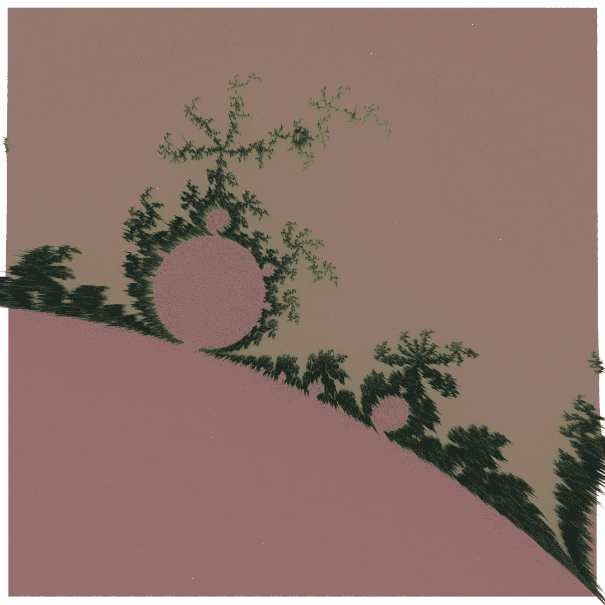
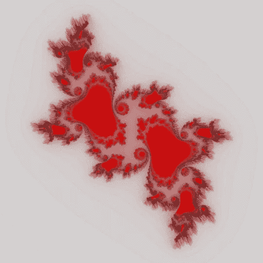

# 用搅拌机制作分形

> 原文：<https://levelup.gitconnected.com/making-fractals-with-blender-78fec6c3565b>

分形是伯努瓦·曼德尔布罗首先引入的一个术语，用来定义欧几里得空间的子集，其中 Hausdorff-Besicovitch 维数或分形维数超过拓扑维数。分形是无限自相似的，其中大多数是无处可微的。除了分形的技术定义，它们的一个关键标志是它的自相似性。Mandelbrot 集是最著名的分形集之一，由 Adrien Douady 定义，并以数学家伯努瓦·曼德尔布罗的名字命名。以下描述了用于定义和渲染分形集的 2D 表示的 python 脚本。

为了首先建立 Mandelbrot 集合，我们需要定义搜索将要发生的域。该二维域被分成片段以形成网格，然后，如果 Z 的绝对值大于 2，则来自网格的每个样本将是 Mandelbrot 集合的一部分，其中 Z=Z*Z+C。该操作将重复固定次数，如果不满足条件，则该特定点不属于 Mandelbrot 集合。然后，用于确定特定点是否属于 Mandelbrot 集合的迭代次数将用于定义该集合的颜色。

知道分形集和着色已定义，网格中的所有值都被重新调整到从 0 到 1 的范围内。这使得进一步的处理更容易进行。为了修改表面，使用简单的 2D 平面来定义 bmesh 对象，该平面具有与用于计算分形集的网格相同数量的细分。网格中的每个面代表一个点，为了生成分形集的可视化表示，每个面都通过其法向量进行拉伸。

到目前为止，可以添加一个简单的 2D 平面，并修改表面来制作分形集的可视化表示。为了给表示添加一些颜色，可以添加颜色图。色彩映射表表示将简单值插入到色彩值中的色彩范围。简单的色彩映射表可以定义为在 RGB 色彩空间中返回均匀分离的色彩范围的色彩映射表

定义色彩映射表的另一种方法是在 RGB 色彩空间中的两点之间进行线性插值，并返回这两个色点之间均匀间隔的颜色。

有了所有的元素，我们可以简单地渲染得到的几何图形，并获得如下。

所有以前的函数都以一个简单的 2D 数组作为数据来修改曲面，因此我们可以用它来绘制 2D 图，或者可视化一个不同的分形集。Julia 集是另一个分形集，可以用下面的公式计算。

分形集的渲染结果如下。

我知道您有一个如何修改网格以生成几何对象的可视化表示的示例。以及如何将不同的颜色映射应用到该表示中。这篇文章的完整代码可以在我的 Github 中找到，点击[这里](https://github.com/TavoGLC/DataAnalysisByExample/blob/master/Generative/fractalsblender.py)。下一集见。