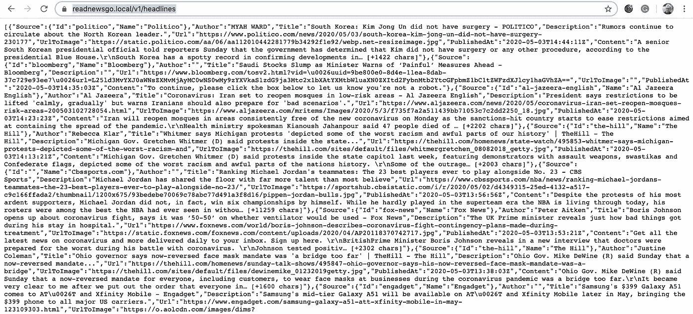

# 让 Golang 前进

> 原文：<https://levelup.gitconnected.com/making-golang-go-43c800b4b754>

## 学习新语言的冒险经历


亚历克斯·金在 [Unsplash](/s/photos/green-light?utm_source=unsplash&utm_medium=referral&utm_content=creditCopyText) 上的照片

上次有人问我最喜欢的编程语言是什么，我的回答是‘英语’。这只是部分玩笑，因为我遇到的大多数编程语言只是英语的方言，散布着一些基于数学的符号。学习新的编程语言并不难，难的是学习使用工具、最佳实践，以及在已经为该语言建立的框架和库中工作。在我的日常工作中，我不怎么写应用程序，而是把开源库和少量的业务逻辑粘在一起。所以我更多地处理库和框架的协同工作，而不是花太多时间处理语言语法。

围棋已经存在了一段时间(10 年对计算机来说是一段时间)，我一直对它很感兴趣。但是我从来没有深入研究过，因为它缺乏工具和依赖管理。像 Java 和 JavaScript 这样的语言有用于依赖性管理的 Maven 和 NPM，以及一套健壮的用于构建软件的成熟工具。最新版本的 Go 支持模块，但是首选的构建系统仍然是 Makefiles，这似乎有点过时了。如果 Go 的首选 IDE 不是 vi，我不会感到惊讶。

既然 Go 已经尝试用模块解决了它的依赖危机，我就要用最新版本的 Go 再来一次，寻找 Go 的思维定势。我将创建一个 RESTful web 服务，因为这是新的 hello world。我还将尝试模仿流行的模式和实践。但是首先，关于我和我所使用的语言，我将比较去。如果你不想读我的历史，只想直接进入编程，你可以跳过几段。

我在 80 年代中期开始用 C 语言编程，我很喜欢它，因为它简单明了。这本钻石般锋利的书*C 编程语言*让我养成了许多我至今仍保留的品质。C++出来的时候，我全身心投入。我花时间将世界划分为对象层次，并学习如何在 C/C++固有的不安全世界中安全地游戏。

当 Java 问世时，我有些怀疑，因为它用性能换取了安全性，而我已经花了十年时间学习如何安全地穿越 C/C++语言的火圈。它也促进了可移植性，但我当时的工作主要是为 Windows 编写 GUI 应用程序。最终，我开始关注 Java。现在我几乎完全用 Java 来写，我怀疑如果不付出相当大的努力，我是否能有效地用 C/C++来写。

JavaScript 出来的时候，我也是持怀疑态度的，主要是因为它是严格意义上的 GUI。但是我正在脱离面向对象的思维，所以它的功能方面很吸引人。然后当 Node.js 和 NPM 出来的时候，我就被吸引住了。最后，一种在前端和后端都同样得心应手的本地语言。不幸的是，后端工作仍然主要是 Java，这就是我在过去二十年中一直坚持的地方。

我说够了，我们来谈谈围棋。我的历史已经让你厌烦了，就不拿围棋的历史来烦你了。我将马上着手一个新项目。我将假设您有最新版本的 Go(在撰写本文时是 1.14)。我也将使用 Docker，因为现在一切都是集装箱化的。除此之外，我将使用一个基本的代码编辑器和命令行。在本文的最后一部分，我将在 Kubernetes 集群中运行我的应用程序。

我正在用 [GVM](https://github.com/moovweb/gvm) 安装和使用最新版本的 Go。GVM 工具允许我改变 Go 的版本(和依赖项)来匹配我想要构建的东西。因为我正在构建新的东西，所以我将使用最新的版本

```
gvm install go1.14.3
gvm use go1.14.3 --default
go version # check to make sure go 1.14.3 is the version
```

这就建立了必要的环境。请注意，如果您从未安装过 Go，1.4 之后的版本将需要安装 Go，因此您必须先安装 1.4，然后才能安装新版本，并且必须先安装 C 环境，然后才能安装 1.4。在 macOS 上使用 Xcode，你应该有一个 C 环境。

让我们建立一个项目。在我与音乐组合[海蓝宝石太空独角兽](https://www.youtube.com/playlist?list=OLAK5uy_kFjcTE_ft7hcCWfvOqqk2Yxd5kS3Z211c)(不要脸的插头)的第一张专辑后，我把我的歌叫作 go-go-go。首先，我将在 GitHub 上创建存储库。Go 模块使用 git(或 mercurial 或 bazaar)作为依赖库，还有什么比 GitHub 更好的 git 库呢？一旦你在 GitHub 上创建了新的资源库，你就可以克隆它。

```
git clone [git@github.com](mailto:git@github.com):rkamradt/go-go-go.git
cd go-go-go
```

接下来，我们将它初始化为 Go 模块:

```
go mod init github.com/rkamradt/go-go-go
```

那应该已经为你创建了一个`go.mod`，内容如下:

```
module github.com/rkamradt/go-go-gogo 1.14
```

很简单。现在我们冲进去开始编码？没有。我想考虑我将构建什么，我将需要什么模块。在之前的一篇帖子[如何使用 Kubernetes Cron Jobs 定期读取新闻](/how-to-use-kubernetes-cron-jobs-to-periodically-read-the-news-8b3b4513f8b7)中，我构建了一个读取新闻 API 的微服务，将其添加到一个 MongoDB 数据库中，以及另一个读取数据库的微服务。我仍然在我的 Kubernetes 集群中运行所有这些服务，所以我将在 Go 中创建另一个 read 服务，然后我可以将它与用 Java 编写的 read 服务进行比较。

我需要一个 MongoDB 驱动模块和一个 REST 接口模块。理论上，我可以为 REST 调用使用内置的 net 库，但这是对 Go 模块的探索，所以我将找到一个添加到内置库中的模块。哪里可以找到 Go 模块？幸运的是，这里有一个精选列表:【https://github.com/avelino/awesome-go[。从那里我找到了官方的 MongoDB 驱动程序 https://github.com/mongodb/mongo-go-driver](https://github.com/avelino/awesome-go)[和一个合适的 web 框架 https://github.com/gin-gonic/gin](https://github.com/mongodb/mongo-go-driver)[。让我们“去拿”那些模块:](https://github.com/gin-gonic/gin)

```
go get go.mongodb.org/mongo-driver/mongo
go get -u github.com/gin-gonic/gin
```

这将创建一个 go.sum 文件，其中包含所有依赖项和临时依赖项的校验和。

首先，我将从 gin-gonic GitHub 页面获取示例代码，进行一些简单的修改，并确保我可以运行它。这是我的第一次迭代:

```
package mainimport "github.com/gin-gonic/gin"func main() {
 r := gin.Default()
 r.GET("/test", func(c *gin.Context) {
  c.JSON(200, gin.H{
   "message": "test",
  })
 })
 r.Run() // listen and serve localhost:8080
}
```

现在我们可以运行它了:

```
Fuji:go-go-go randalkamradt$ go run main.go
[GIN-debug] [WARNING] Creating an Engine instance with the Logger and Recovery middleware already attached.[GIN-debug] [WARNING] Running in "debug" mode. Switch to "release" mode in production.
 - using env: export GIN_MODE=release
 - using code: gin.SetMode(gin.ReleaseMode)[GIN-debug] GET    /test                     --> main.main.func1 (3 handlers)
[GIN-debug] Environment variable PORT is undefined. Using port :8080 by default
[GIN-debug] Listening and serving HTTP on :8080
```

有点啰嗦，我得想办法把它关小。但是现在让我们来测试一下。打开另一个终端窗口并尝试:

```
Fuji:~ randalkamradt$ curl [http://localhost:8080/test](http://localhost:8080/test)
{"message":"test"}Fuji:~ randalkamradt$
```

到目前为止，一切顺利。我总是喜欢尽可能快地做一些小的改变和测试。Control-C 来停止服务器。

下一步是从数据库中读取它。由于我的目标数据库是 MongoDB，并且我不想在我的笔记本电脑上安装 MongoDB，所以我将使用 docker-compose 进行一个简单的测试。但这意味着我需要为我的新程序创建一个 docker 映像。现在，我将创建一个非常简单的 docker 文件，不过以后我可能会对它进行扩展。这是我想到的:

```
FROM golang:alpineENV GO111MODULE=on \
    CGO_ENABLED=0 \
    GOOS=linux \
    GOARCH=amd64WORKDIR /buildCOPY go.mod .
COPY go.sum .
RUN go mod downloadCOPY . .RUN go build -o main .WORKDIR /distRUN cp /build/main .CMD ["/dist/main"]
```

现在建立一个图像:

```
docker build . -t go-go-go
```

在我们添加数据库之前，让我们将它作为 docker 映像运行，以确保一切仍然正常工作:

```
Fuji:go-go-go randalkamradt$ docker run -p 8080:8080 go-go-go
[GIN-debug] [WARNING] Creating an Engine instance with the Logger and Recovery middleware already attached.[GIN-debug] [WARNING] Running in "debug" mode. Switch to "release" mode in production.
 - using env: export GIN_MODE=release
 - using code: gin.SetMode(gin.ReleaseMode)[GIN-debug] GET    /test                     --> main.main.func1 (3 handlers)
[GIN-debug] Environment variable PORT is undefined. Using port :8080 by default
[GIN-debug] Listening and serving HTTP on :8080
```

并使用相同的 curl 命令再次进行测试(记住在每次小迭代后进行测试)。Control-C 再次停止服务器。

现在我们有了一个可以在 docker-compose 中运行的图像，我们可以添加一些数据库方法并在数据库中运行它。同样，我将直接从 MongoDB 示例中复制。这是第二次迭代:

```
package mainimport (
  "os"
  "context"
  "log"
  "time"
  "github.com/gin-gonic/gin"
  "go.mongodb.org/mongo-driver/bson"
  "go.mongodb.org/mongo-driver/mongo"
  "go.mongodb.org/mongo-driver/mongo/options"
)func main() {
 mongoUser := os.Getenv("MONGO_USER")
 mongoPassword := os.Getenv("MONGO_PASS")client, err := mongo.NewClient(options.Client().ApplyURI("mongodb://" +
     mongoUser +
     ":" +
     mongoPassword +
     "[@mongodb](http://twitter.com/mongodb):27017"))
 ctx, _ := context.WithTimeout(
  context.Background(),
  10*time.Second)
 err = client.Connect(ctx)ctx, _ = context.WithTimeout(
  context.Background(),
  5*time.Second)
 collection := client.Database("news").Collection("inserts")
 res, err := collection.InsertOne(
  ctx,
  bson.M{"name": "pi", "value": 3.14159})
 if err != nil {
  log.Fatal(err)
  return
 }
 if(res != nil) {
  log.Printf("Inserted a single document: ", res.InsertedID)
 }r := gin.Default()
 r.GET("/test", func(c *gin.Context) {
  var result struct {
      Value float64
  }
  filter := bson.M{"name": "pi"}
  ctx, _ = context.WithTimeout(
   context.Background(),
   5*time.Second)
  err = collection.FindOne(ctx, filter).Decode(&result)
  if err != nil {
      log.Fatal(err)
  }
  c.JSON(200, gin.H{
   "pi": result.Value,
  })
 })
 r.Run() // listen and serve localhost:8080
}
```

它有点大，我在服务器启动之前添加了一个 insert，这样我们就可以在请求中读取一些内容。同样，代码几乎直接取自 MongoDB Go 驱动程序页面，因此它可能会使用一些重构来使它在我们的特定上下文中最有效地工作。

现在是 docker-compose 文件。我们有两件事情需要提到，MongoDB 数据库和应用程序。以下是我所知道的:

```
version: '3'
services:
  mongodb:
    image: mongo:3.6.18
    restart: always
    ports:
      - 27017:27017
    environment:
      MONGO_INITDB_ROOT_USERNAME: admin
      MONGO_INITDB_ROOT_PASSWORD: admin
  app:
    build: .
    ports:
      - 8080:8080
    environment:
      MONGO_USER: admin
      MONGO_PASS: admin
    depends_on:
      - "mongodb"
```

首先，我们需要启动数据库，因为启动需要几秒钟时间:

```
docker-compose up -d mongodb
```

接下来，我们需要构建:

```
docker-compose build app
```

最后，我们提出应用程序。这里我没有使用`-d`标志，这样我可以直接看到日志:

```
Fuji:go-go-go randalkamradt$ docker-compose up app
go-go-go_mongodb_1 is up-to-date
Recreating go-go-go_app_1 ... done
Attaching to go-go-go_app_1
app_1      | [GIN-debug] [WARNING] Creating an Engine instance with the Logger and Recovery middleware already attached.
app_1      | 
app_1      | [GIN-debug] [WARNING] Running in "debug" mode. Switch to "release" mode in production.
app_1      |  - using env: export GIN_MODE=release
app_1      |  - using code: gin.SetMode(gin.ReleaseMode)
app_1      | 
app_1      | [GIN-debug] GET    /test                     --> main.main.func1 (3 handlers)
app_1      | [GIN-debug] Environment variable PORT is undefined. Using port :8080 by default
app_1      | [GIN-debug] Listening and serving HTTP on :8080
app_1      | 2020/06/16 18:52:13 Inserted a single document: %!(EXTRA primitive.ObjectID=ObjectID("5ee914ddf6db654a5ce871da"))
```

现在，我们可以使用相同的 curl 命令再次进行测试，但这一次的输出会略有不同:

```
Fuji:~ randalkamradt$ curl [http://localhost:8080/test](http://localhost:8080/test)
{"pi":3.14159}Fuji:~ randalkamradt$
```

成功！Control-C 停止 docker-compose 进程，并运行`docker-compose down`删除停止的 docker 进程。

现在让我们看看这一切在 Kubernetes 世界中是如何运作的。但是首先，我们将转移到最后一次迭代(至少对于本文来说)。我将更改应用程序，使其与 Java 版本完全一致，这样当我在 Kubernetes 中部署它时，它就能很好地适应。下面的代码应该可以完成这个任务:

我应该指出，这不是最有效的程序，它流过整个数据集并过滤日期。我这样做有很多原因，其中之一是我不想写这篇关于 MongoDB 的多功能查询的文章。此外，我可能会像在文章[非阻塞 Java](/non-blocking-java-beyond-the-hype-dfdc405848d7) 中那样比较性能，我不想放弃不公平的优势。感谢我的同事 Jacob Cleaveland 审查代码，以确保它“可以运行”。

构建代码并推送:

```
docker build . -t go-go-go
docker tag go-go-go rlkamradt/go-go-go
docker push
```

这将把它推到 DockerHub 注册表。我应该提到，我们可以通过使用多级 docker 文件来大大减小图像的大小。这将删除 Go 构建时命令，只留下编译后的程序。但我会留到下一次。

现在我们可以在 Kubernetes 使用它。但是首先，让我们把现有的东西推回 GitHub:

```
git add .
git commit -m "initial commit"
git push
```

如果你想继续阅读下一部分，我建议你先阅读我的文章[如何使用 Kubernetes Cron Jobs 定期阅读新闻](/how-to-use-kubernetes-cron-jobs-to-periodically-read-the-news-8b3b4513f8b7)。那篇文章的最后一部分将向您展示如何设置 Kubernetes 中的所有组件来运行它。

我现在要切换 GitHub 存储库，我有一个单独的库用于需要的 Kubernetes 部署文件。然后，我将能够复制一个旧的部署文件，以允许它使用新的映像。你可以将我的 GitHub 库[https://github.com/rkamradt/news-deploy](https://github.com/rkamradt/news-deploy/tree/v1.2)克隆到一个你可以访问`kubectl`命令的主机上。`README.md`有关于如何启动一切的基本说明。我将现有的`readnewsblock.yaml`复制到 readnewsgo.yaml(我在比较[非阻塞 Java 中的阻塞与非阻塞 I/O 时创建了`readnewsblock.yaml`——超出了宣传的范围](/non-blocking-java-beyond-the-hype-dfdc405848d7))。编辑新的`readnewsgo.yaml`，我通篇用`readnewsgo`替换了`readnewsblock`，更改了镜像名称，并删除了健康检查(我没有在 Go 版本中添加健康检查端点)。这是我想到的:

```
apiVersion: apps/v1
kind: Deployment
metadata:
  name: readnewsgo-deployment
  labels:
    app: readnewsgo
spec:
  selector:
    matchLabels:
      app: readnewsgo
  template:
    metadata:
      labels:
        app: readnewsgo
    spec:
      containers:
      - name: readnewsgo
        image: docker.io/rlkamradt/go-go-go:latest
        ports:
        - containerPort: 8080
        env:
          - name: MONGO_USER
            valueFrom:
              secretKeyRef:
                name: mongo-secret
                key: username
          - name: MONGO_PASS
            valueFrom:
              secretKeyRef:
                name: mongo-secret
                key: password
          - name: MONGO_HOST
            value: mongodb-0.mongodb           
---
apiVersion: v1
kind: Service
metadata:
  name: readnewsgo-service
spec:
  type: ClusterIP
  selector:
    app: readnewsgo
  ports:
  - port: 8080
    targetPort: 8080
```

我还为`vhosts-ingress.yaml`中的`readnewsgo.local`添加了一个虚拟主机，如下所示:

```
apiVersion: networking.k8s.io/v1beta1
kind: Ingress
metadata:
  name: readnews-ingress
  annotations:
    cert-manager.io/issuer: ca-issuer 
spec:
  rules:
  - host: readnews.local
    http:
      paths:
      - backend:
          serviceName: readnews-service
          servicePort: 8080
        path: /
  - host: readnewsblock.local
    http:
      paths:
      - backend:
          serviceName: readnewsblock-service
          servicePort: 8080
        path: /
  - host: readnewsgo.local
    http:
      paths:
      - backend:
          serviceName: readnewsgo-service
          servicePort: 8080
        path: /
  tls:
  - hosts:
    - readnewsblock.local
    secretName: readnewsblock-cert
  - hosts:
    - readnewsgo.local
    secretName: readnewsgo-cert
  - hosts:
    - readnews.local
    secretName: readnews-cert
```

同样，关于这些文件做什么的信息，请参考我以前的文章。

然后我应用了新的和修改过的文件:

```
kubectl apply -n nr -f readnewsgo.yaml
kubectl apply -n nr -f vhost-ingress.yaml
```

现在我可以在我的笔记本电脑上的`/etc/hosts`中添加`readnewsgo.local`的别名，我可以浏览[https://readnewsgo.local/v1/headlines](https://readnewsgo.local/v1/headlines)。



所以我觉得围棋怎么样？我并不急于赶时髦。显然，我在这里创建的小程序很可能不会为任何语言提供很好的展示，我编写它的方式可能反映了我的经验不足。我当然想知道更多关于 Go 使用的并发模型的信息，因为这应该是它的强项之一。但除此之外，它似乎是一种非常普通的语言，并没有太多吸引我去提倡它的地方。

因此，我又浪费了几个小时编写了另一个毫无用处的程序。但当我的日常工作突然决定围棋是有史以来最好的东西，并想在其中写下一切时，我对围棋有了更多的了解，也有了更多的准备。感谢您加入我的旅程！

本文中使用的 GitHub 存储库:

[](https://github.com/rkamradt/go-go-go/tree/v1.0) [## rkamradt/go-go-go

### go 中一个简单的 RESTful webservice。在 GitHub 上创建一个帐户，为 rkamradt/go-go-go 开发做贡献。

github.com](https://github.com/rkamradt/go-go-go/tree/v1.0) [](https://github.com/rkamradt/news-deploy/tree/v1.2) [## rkamradt/新闻-部署

### 用于部署新闻阅读器/readnews 微服务的脚本- rkamradt/news-deploy

github.com](https://github.com/rkamradt/news-deploy/tree/v1.2) 

提到的其他文章:

[](/how-to-use-kubernetes-cron-jobs-to-periodically-read-the-news-8b3b4513f8b7) [## 如何使用 Kubernetes Cron Jobs 定期阅读新闻

### 阅读新闻的微服务。

levelup.gitconnected.com](/how-to-use-kubernetes-cron-jobs-to-periodically-read-the-news-8b3b4513f8b7) [](/non-blocking-java-beyond-the-hype-dfdc405848d7) [## 非阻塞 Java——超越宣传

### 集装箱化世界中阻塞与非阻塞的比较

levelup.gitconnected.com](/non-blocking-java-beyond-the-hype-dfdc405848d7)