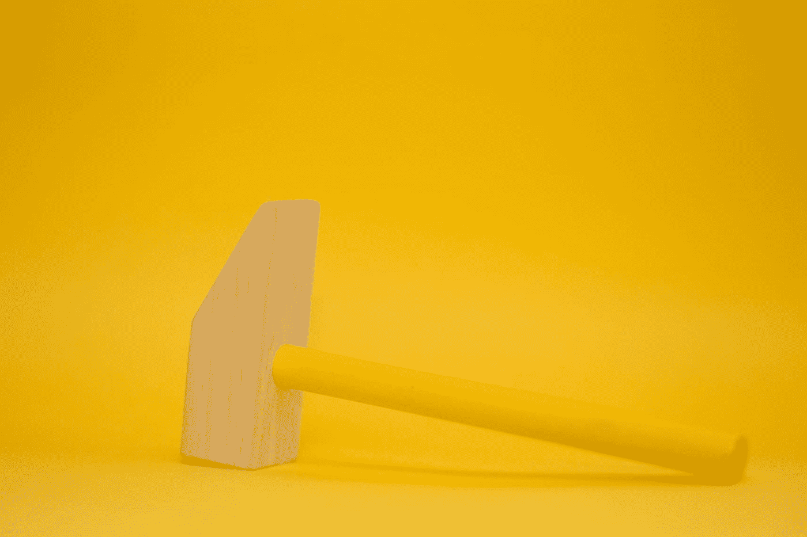

# 让 HammerJS 与 Angular 9 一起工作

> 原文：<https://levelup.gitconnected.com/making-hammerjs-work-with-angular-9-81d289159320>

马库斯·斯皮斯克在 [Unsplash](https://unsplash.com?utm_source=medium&utm_medium=referral) 上的照片

## 一篇关于让 **hammerjs** 手势在 Angular 9 应用中可用的小文章

如果你和我一样，仍然使用[‘hammer js’库](https://hammerjs.github.io/)在你的 Angular(或 Ionic / Angular)应用程序中拥有(tap)和(press)事件，并且你决定升级到 Angular 9，你很快就会发现**你的所有 tap、pan、press 等事件都不再工作**。令人惊讶的是，迁移指南也没有明确涵盖这一点…

但是不用担心——这很容易解决。

事件不再工作背后的原因是**导致 Angular 9 的 Ivy 需要使 hammerjs jazz 树可摇动**，现在对这种事件的支持需要一个小的改变，这是迁移到 Angular 9 / Ivy 的一部分:

> …以前，在 Ivy 应用程序中，默认包含了 Hammer 提供商。有了[这个提交](https://github.com/angular/angular/issues/32203)，想要 Hammer 支持的应用必须在它们的根模块中导入`HammerModule`。

所以首先要确保 HammerJS 被正确地安装在你的 Angular 或者 Ionic / Angular 项目中(你可以[在这里阅读这篇好文章](https://medium.com/madewithply/ionic-4-long-press-gestures-96cf1e44098b)了解如何用 Ionic 4+ / Angular 来做这件事的细节)。

然后，您只需要简单地包含这个 **HammerModule** 导入，并将其添加到您的应用程序的 ngModule 中:

随着模块的导入——瞧——你所有的手势都应该恢复正常，你可以享受 Angular 9 的所有手势支持的美妙。

干杯！