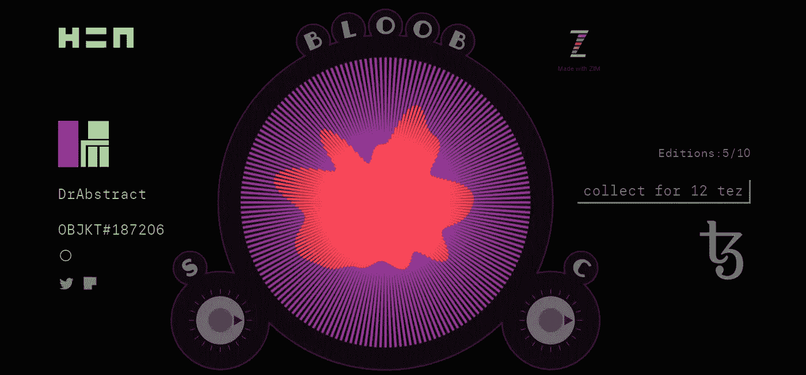
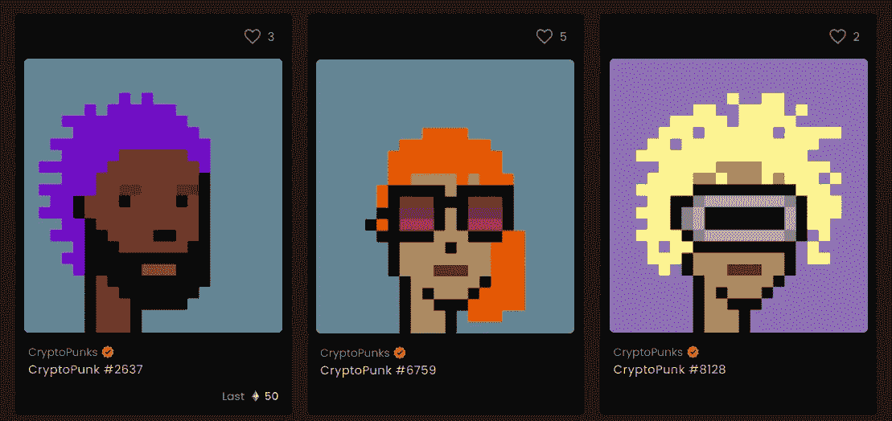
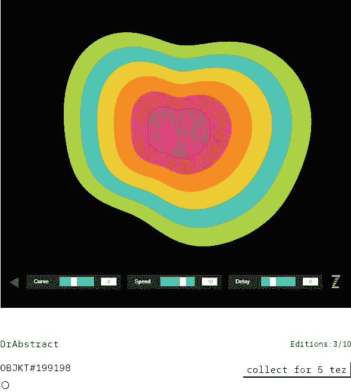
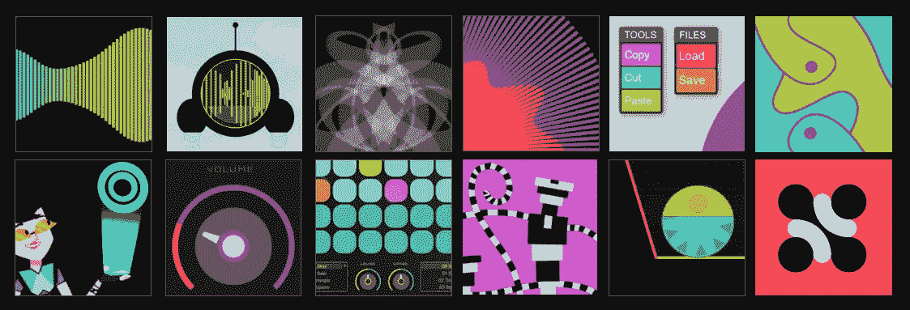
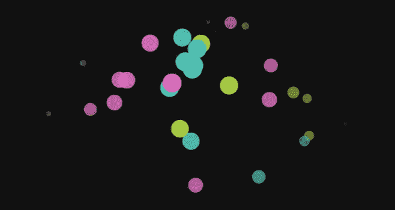
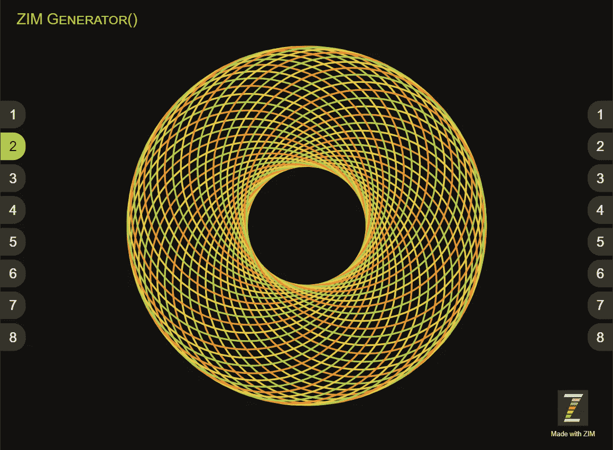
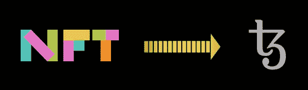

# 制作交互式 NFT

> 原文：<https://levelup.gitconnected.com/making-interactive-nfts-4a50a8f8feb3>

## 你的指南

从头到尾的教程！



互动 NFT 在 Teia(以前叫 hic et nunc)上叫 [Bloob](https://teia.art/objkt/187206)

# 背景—什么是 NFT？

NFT 代表不可替代令牌，这意味着像数字艺术这样的东西的所有权可以存储在区块链上，不能被更改。艺术品可以以加密货币的形式出售和转售，每笔交易的一定比例归创作者所有。所有这些都是自动化的。



[隐朋克 NFTs](https://news.bitcoin.com/cryptopunk-owner-hopes-to-sell-punk-for-91-million-pixelated-nft-punks-outshine-the-competition/)

对于数字创作者和收藏家来说，这是一个惊人的机会。[皮普尔艺术](https://www.theverge.com/2021/3/11/22325054/beeple-christies-nft-sale-cost-everydays-69-million)以 6900 万美元成交。加密朋克卖了几百万，可能是你做的(像素绘图很精致，时间很重要)。

# 交互式 NFTs


克隆— NFT 网络应用

The Web app[Teia](https://teia.art/)—前身为 [hic et nunc](https://hen.teztools.io/) 在 Tezos 区块链上存储合同，支持交互式 NFTs。在 hic et nunc 制造(铸造)一个 NFT 只需要 0.25 美元，所以没有你可能听说过的那些昂贵的以太坊汽油费。

我们的第一个互动 NFT 叫做 [BLOOB](https://teia.art/objkt/187206) ，如介绍图片所示。这是我们的第二个互动 NFT，叫做[高速公路耳语](https://teia.art/objkt/199198)。这两者背后都有故事，我们认为这些故事很重要，值得收藏。



[高速公路私语](https://teia.art/objkt/199198) —互动 NFT

# **指南分三部分**

1.  用 ZIM 介绍画布上的交互式编码
2.  加入 Teia 并获得一个钱包
3.  铸造一个互动 NFT

# 1.交互式编码



我们已经在画布上展开了 [◎创意编码指南](https://drabstract.medium.com/your-guide-to-coding-creativity-on-the-canvas-ada0996298f6)。在本指南中，我们将向您展示如何在不到五分钟的时间内，在在线编辑器的画布上编写代码。例如，转到 [ZIM LAB](https://zimjs.com/lab) 删除那里的代码并粘贴以下代码，然后 CTRL/⌘或者点击保存按钮。

```
frame.color = darker;
new Emitter().center();
```



一行代码中的粒子发射器！

我们可以发出任何我们想要的显示对象——比如一个黄色或橙色并旋转 45 度的矩形。为了让发射器跟随你的鼠标，我们可以使用一个运动控制器。

```
frame.color = darker;
const obj = new Rectangle(50,50,[yellow,orange]).rot(45);
const emitter = new Emitter(obj).center();
new MotionController(emitter, "mousemove");
```


用运动控制器跟随鼠标的发射器

> 这是 ZIM 提供的数百种便利设施、组件和控制装置中的几个例子。查看更多示例的快捷方式是观看 ZIM 演示视频，或许还有“五分钟代码”系列。

*   [ZIM 的故事！在画布上编写创意代码的互动介绍](https://www.youtube.com/watch?v=QQR4g8irfCM)
*   [ZIM 创造性的 JavaScript 画布编码框架](https://www.youtube.com/watch?v=EB66-QgUz98)
*   [JavaScript 画布的 ZIM 高亮卷轴](https://www.youtube.com/watch?v=Wl4IxVvqQbQ)
*   [与 ZIM 在五分钟内完成代码](https://www.youtube.com/watch?v=5Xj8IBd-7E8&list=PLCIzupgRt1pbdu4nqdoMw4TuVRXAqaLXJ)

## 来自加工还是 P5js？


H 有一个[邀请，邀请艺术创立者和互动艺术家](https://javascript.plainenglish.io/an-invite-for-generative-art-makers-and-interactive-artists-106f3ed186ab)超越处理，使用嵌入式界面和精心制作的交互性。这篇文章是必看的。我们还有 [ZIM 生成器()](https://zimjs.com/cat/generator.html)，它的工作方式非常类似于提供相对转换的处理。



[ZIM 生成器()](https://zimjs.com/cat/generator.html)的工作原理类似于加工和 P5js

# 2.TEIA 和钱包

he Teia Web app(以前的 hic et nunc)是效率的奇迹？它非常小，有点古怪。这很有趣！所有这些都非常令人兴奋，感觉就像互联网的黎明。简单的黑白美感更是锦上添花。

首先，你需要一个钱包。然后，您可以将 Teia 同步到您的钱包，这就是您“注册”和/或“登录”的方式。有不同类型的钱包，在[常见问题解答](https://github.com/hicetnunc2000/hicetnunc/wiki/Getting-Started-with-Tezos)中有与下面类似的步骤，他们建议使用 Kukai 钱包，这就是我们使用的钱包。步骤如下:

1.  [获得一个酷开钱包](https://wallet.kukai.app/)
2.  记录种子词并复制钱包 ID(长字符串)
3.  转到 [Teia](https://teia.art/) 并按顶部的同步
4.  用你的钱包确认

现在，你需要在你的钱包里放一些 TEZOS。获得足够铸造一些 NFT 的最简单的方法是联系 Slate 上的抽象博士，他会将一个 Tezo 转让给你(这大约是 3 美元，铸造它只需要大约 0.25 美元)。如果你想开始收集，这是我们推荐的，那么你可能想从 100 美元开始，这里是你如何做。

1.  阅读上面的段落，看看获得 Tezo 的简单方法！
2.  或者通过经纪公司为你的国家购买比特币
3.  例如，在加拿大，我们用[牛顿](https://www.newton.co/)
4.  这是金融机构，会要求身份验证等。
5.  在诸如[币安](https://www.binance.com/)之类的交易所用比特币交易 XTZ
6.  再次，会要求你进行身份验证等。
7.  把 Tezos 转到 Kukai 钱包。如果在币安…
8.  进入钱包>菲亚特和现货>找到 XTZ >撤回到 Kukai ID

这是一个麻烦的设置，但你只需要做一次，然后你就可以开始铸造和收集，不用再想它了。我们建议您记录链接、步骤、id 等。随你便。

# 3.明廷互动 NFTS

一旦你有了钱包和一些三明治，做一个 ZIM·NFT 就很容易了。以下是制作 ZIM NFT 的步骤。我们将把你正在制作的东西称为 Zapp——这可以是 ZIM 游戏、艺术、拼图、应用程序等。

> 如果你以前没有编码过或者没有用 ZIM 编码过，那么请看 [ZIM 学习](https://zimjs.com/learn.html)部分，记下 [ZIM 基础知识](https://www.youtube.com/watch?v=G4K0PwtwXRQ&list=PLCIzupgRt1pYPy1ufRjssbGuPKMviuFvB)视频系列和[用创造性编码学习 JavaScript】系列。同样如前所述，请参见](https://zimjs.com/learnjavascript.html) [◎你在 Medium 上的](https://drabstract.medium.com/your-guide-to-coding-creativity-on-the-canvas-ada0996298f6)画布上编写创意代码的指南。

## *制作 ZIM 互动 NFT*

1.  在电脑上创建一个文件夹来存储您的 Zapp
2.  把你的起始页叫做 index.html
3.  像往常一样对 Zapp 进行编码(在适合、填充或完全模式下),但是…
4.  没有外部链接或数据呼叫
5.  所以包括本地图像、ZIM 和支持库
6.  添加一个带有 property = " og:image " content = " your promo . jpg "的 meta 标记
7.  见 [ZIM NFT](https://zimjs.com/nft/zim) 源或者这里有一个 [ZIP](https://zimjs.com/nft/zim.zip) 的模板
8.  压缩文件夹并上传到> OBJKT (mint)下的 [Teia](https://teia.art/)
9.  决定发行多少版本和收取多少版税
10.  在你的钱包地址确认付款(大约 0.25 美元)

下面是一段 [ZIM 探索过程的视频](https://youtu.be/brIWbJ8QYO8):

以及一份设定 NFT 出售(掉期)的附录:

# 收藏 ZIM·NFT

博士摘要已经铸造了 100 个版本的[ZIM·NFT](https://teia.art/objkt/197840)这是 ZIM 在星际文件系统上用密码捕获的。它既是一个宏伟的收藏品，也是用这个框架制作 NFTs 的原型。


ZIM NFT 收藏

## 收集免费的 ZIM·NFT

1.  你需要一个钱包来收集 NFT
2.  如果需要，以下是步骤…
3.  获得一个[酷开钱包](https://wallet.kukai.app/)(免费且轻松)
4.  请在[空闲时间](https://zimjs.com/slack)的抽象博士给你发一些 [Tezos](https://en.wikipedia.org/wiki/Tezos)
5.  提供你的钱包地址(这是最简单的方法)
6.  去 Teia 上的 [ZIM NFT](https://teia.art/objkt/197840) OBJKT
7.  点击版本下方右侧的收集按钮
8.  在另一个窗口中打开您的钱包并确认交互
9.  在对象页面上等待通知消失
10.  进入帐户>管理资产>收藏查看您的 NFT！



## 卖掉你的 ZIM·NFT

1.  有一天，你可能想卖掉你的 ZIM·NFT
2.  转到您的 [Teia](https://teia.art/) 账户>管理资产>集合
3.  选择 ZIM NFT
4.  选择交换并设定价格
5.  联系买家或在社交媒体上发布销售信息等。
6.  我们希望有一天这些会有价值
7.  所以过几年再找机会吧
8.  不要抛弃和忽视你的 NFT

## 小工具制造商

G adget Minters 是一个制造和销售互动小工具 NFT 的集体。如果你制作小工具并想加入，请联系[松弛](https://zimjs.com/slack)或[不和谐](https://zimjs.com/discord)的抽象博士。作为一个集体的一部分，我们可以交换彼此的 NFT 来建立意识。


> 请继续关注更多信息和收藏品。现在，考虑一下 Bloob。这是 ZIM 铸造的第一枚 NFT，很可能会变得更有价值。

